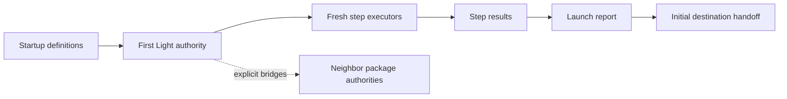

---
tags:
  - sfgss/learning
  - sfgss/foundation
  - sfgss/echo-launch
status: complete
updated: 2026-08-04
---

# PKG-LEARN-001 – First Light (`EchoLaunch`) Learning Review

**Review ID:** `PKG-LEARN-001`  
**Package authority:** [First Light – Startup and Launch](../Package%20Specifications/SFGSS-First-Light-EchoLaunch-Package-Specification.md)  
**Wave:** Foundation  
**Review status:** Complete  
**Reviewer:** Jesse “Echo” Adams / EchoDevGames  
**Started:** 2026-08-04  
**Completed:** 2026-08-04  
**Package authority version reviewed:** 1.2.0  
**Implementation authorization:** None

> This review teaches the architecture. It does not replace the package authority and does not authorize code.

## 1. Exact source set

| Source | Version/status | Why it is needed |
|---|---|---|
| First Light package authority | 1.2.0 Approved | Owns startup behavior and boundaries |
| SFGSS-000 | 0.21.0 Approved | Owns suite-wide authority and lifecycle rules |
| Full Suite Matrix | 1.0.0 Approved | Owns cross-package wiring summary |
| SFGSS-005 | 1.3.0 Approved | Owns the learning-review and future implementation workflow |
| Current Notes | 2026-08-04 | Supplies active handoff context only |

## 2. Plain-English purpose

First Light is the application startup coordinator. It gives the project one controlled beginning, validates the launch configuration, runs startup work in an intentional order, classifies failures, produces a structured launch report, and hands the application to its first destination.

## 3. Real-world analogy

First Light is the stage manager before a theater performance. It calls departments in the correct order and opens the curtain when the show is ready. The analogy stops because First Light does not perform every department's work or control the whole game after handoff.

## 4. Practical game application

**Scenario:** Echo Systems Lab

The Boot scene creates the valid EchoLaunch root. First Light validates its startup sequence, requests selected package initialization in order, displays basic startup status, records warnings or blockers, loads or delegates the initial Hub destination, finalizes the report, and hands control to the game.

## 5. Owns and does not own

| Owns | Does not own |
|---|---|
| Initial startup authority | Audio playback |
| Ordered startup-step execution | Save data and slots |
| Required/optional failure policy | Menus and normal UI navigation |
| Startup-only presentation state | Normal mid-game scene travel |
| Direct-scene development initialization policy | Input, pause, respawn, or gameplay rules |
| Final launch report and handoff | Universal service location |

**Boundary sentence:**

> First Light owns the order and outcome of startup; each neighboring package owns the work it performs.

## 6. Definition/configuration versus mutable runtime state

| Authored definition/configuration | Mutable runtime state |
|---|---|
| Startup sequence | Current step |
| Ordered step definitions | Completed-step count |
| Required/optional status | Elapsed timing |
| Timeout and failure policies | Warnings and failures |
| Initial destination | Cancellation and cleanup state |
| Splash/status configuration | Final launch report |

Definitions remain immutable so one Play Mode session cannot contaminate the next launch or modify shared assets.

## 7. Lifecycle and failure story

1. **Creation/registration:** The first valid root claims startup authority before side effects.
2. **Validation:** Configuration, sequence, steps, destination, and duplicate state are checked.
3. **Ready state:** One valid launch authority has a validated plan.
4. **Normal request:** Fresh executors run ordered steps and produce structured results.
5. **Failure/cancellation:** Required failures block handoff; optional failures may warn and continue; timeouts require cleanup reporting.
6. **Scene change/reset:** Normal Boot and direct-scene development are explicit modes; development helpers must not duplicate authorities.
7. **Shutdown/removal:** The default lifetime ends after successful handoff rather than becoming a permanent god manager.

## 8. Important public concepts

| Concept | Plain meaning | Why it matters |
|---|---|---|
| `EchoLaunchRoot` | The valid startup coordinator | Prevents duplicate launch authorities |
| `StartupSequenceDefinition` | The reusable launch plan | Keeps authored order and policy outside runtime state |
| `StartupStepDefinition` | Configuration for one launch action | Describes requirement, timeout, and failure policy |
| Startup step executor | Fresh single-use runtime worker | Prevents state leaking between launches |
| `LaunchContext` | Controlled information for a startup attempt | Avoids a universal service locator |
| `LaunchStepResult` | Structured result for one step | Makes success, warning, failure, skip, timeout, and cancellation explicit |
| `LaunchReport` | Summary of the complete launch | Supports debugging without requiring Observatory |

## 9. Optional bridges and commit authority

| Connected authority | Bridge purpose | Commit owner |
|---|---|---|
| Observatory | Publish launch state/report | First Light owns launch; Observatory owns aggregation |
| Accord | Load/apply global preferences | Accord |
| Chronicle | Initialize save catalog/continue candidates | Chronicle |
| Passage | Execute final launch transition | Passage executes; First Light owns handoff |
| Pulse | Establish startup game-state policy | Pulse |
| Resonance | Initialize audio/startup cue | Resonance |
| Will | Initialize input/startup context | Will |
| Looking Glass | Replace minimal startup presentation | First Light owns readiness; Looking Glass owns presentation |

## 10. Standalone Laboratory

**Laboratory purpose:** Prove ordered startup, duplicate protection, failure policies, direct-scene behavior, reset, and reporting with fake steps and no peer Echo packages.

**Core actions:**

1. Run immediate and delayed successful steps.
2. Run optional warning, required failure, timeout, cancellation, skip, and duplicate-root cases.
3. Compare normal Boot and direct-scene simulation, then inspect and reset the final report.

**What the Laboratory does not prove:** Real Accord, Jukebot, Chronicle, Passage, or other bridge integrations; release or platform compatibility.

## 11. Mental model diagram

## 12. Teach-back

### Jesse's explanation

> “Starts the show. It owns initialization and confirming everything is started in the correct order. It doesn't own control over any other packages. Getting everything loaded for startup for Echo Systems Lab is a good place to use this.”

Jesse also correctly identified runtime launch state, required versus optional failure behavior, direct-scene restrictions, duplicate-authority risks, and the default until-handoff lifetime.

The final six-part package summary was completed with assistant support after Jesse demonstrated the core mental model through the progressive review.

### Check questions

1. **Owned truth:** One controlled ordered application startup and final handoff.
2. **Refused ownership:** Neighbor behavior such as audio, saves, menus, input, pause, and gameplay.
3. **Before play versus runtime:** Definitions hold instructions; executors/state/report hold the current attempt.
4. **Failure:** Required failures stop handoff; optional failures may warn and continue.
5. **Laboratory:** Fake steps prove the startup coordinator independently.
6. **Easy ownership confusion:** First Light requests another package's startup work but does not own that package's behavior.

### Remaining questions or confusion

- Exact C# APIs and Unity Editor setup remain intentionally deferred until implementation teaching begins.
- No unresolved conceptual blocker was identified.

## 13. Completion decision

| Requirement | Result |
|---|---|
| Purpose understood | PASS |
| Authority boundary understood | PASS |
| Lifecycle understood | PASS |
| Practical use visualized | PASS |
| Laboratory understood | PASS |
| Teach-back completed | PASS, final synthesis assisted |
| Source conflict unresolved | NO |

**Decision:** Complete  
**Next review:** `PKG-LEARN-002` – The Observatory (`EchoDiagnostics`)  
**Notes promoted to:** This learning review, tracker, Current Notes, roadmap, graph, health check, and learning index.
