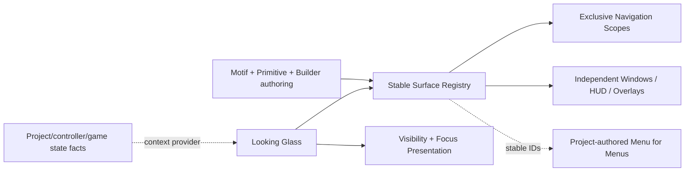

---
tags:
  - sfgss/learning
  - sfgss/wave/foundation
  - sfgss/ui
status: complete
updated: 2026-08-13
---

# PKG-LEARN-008 – The Looking Glass (`EchoUI`) Learning Review

**Review ID:** `PKG-LEARN-008`
**Package authority:** [[../Package Specifications/SFGSS-The-Looking-Glass-EchoUI-Package-Specification|The Looking Glass (`EchoUI`) Package Specification]]
**Wave:** Foundation
**Review status:** Complete
**Reviewer:** Jesse “Echo” Adams / EchoDevGames
**Started:** 2026-08-13
**Completed:** 2026-08-13
**Package authority version reviewed/reconciled:** 1.1.0
**Implementation authorization:** `EUI-M1-01` active after Learn → Declare → Authorize

> This review teaches the architecture and captures designer intent. It does not replace the package authority.

## 1. Exact source set

| Source | Version/status | Why it is needed |
|---|---|---|
| Looking Glass package authority | v1.1.0 Approved | Owns package behavior and boundaries after JIT reconciliation |
| SFGSS-000 | v0.26.0 Approved | Owns suite authority, package independence, project composition, and persistence/lifetime boundaries |
| SFGSS-005 | v1.6.0 Approved | Owns Learn → Declare → Authorize and Green Path execution |
| SFGSS-ADR-004 | Accepted / revised 2026-08-13 | Owns just-in-time package learning gate |
| SFGSS-ADR-006 | Accepted | Keeps Unity object lifetime/project composition outside UI authority |
| SFGSS-ADR-007 | Accepted | Owns Green Path self-validating execution |
| Project manifest | Unity 6000.3.8f1; uGUI 2.0.0; Input System 1.18.0 | Verifies the actual current Unity dependency baseline |
| Current Notes / Suite Health | 2026-08-13 intake | Supplies active handoff context only |

**External research boundary:** official Unity documentation was consulted only for the immediate focus/visibility mental model. `EventSystem.SetSelectedGameObject` changes the EventSystem-selected GameObject and sends deselect/select callbacks; CanvasGroup can affect child alpha/interactability/raycast blocking; Unity input modules translate pointer/navigation-style input into UI events. These mechanisms inform Looking Glass but do not grant it input/game-state authority.

## 2. Plain-English purpose

The Looking Glass gives a project reusable UI **plumbing and construction pieces** without designing the project's menus for it.

It tracks individually addressable UI surfaces, controls exclusive navigation where the designer asks for it, permits independent MMO/desktop-style windows where exclusivity is unwanted, coordinates Back/focus/visibility behavior, and later provides standardized Lego-like primitives, reusable visual Motifs, and Editor tools that remove repetitive hierarchy setup.

The project still decides what its Main Menu, Settings, Inventory, Alchemy, HUD, save screen, and every other actual interface means and looks like.

## 3. Real-world analogy

Looking Glass is a theater's stage rigging plus a labeled scenery workshop.

- Navigation scopes decide which backdrop in one track is currently on stage.
- Independent windows are smaller set pieces that may remain visible together.
- Stable surface IDs are the labels the crew uses instead of saying “the third object under Canvas.”
- Motifs are reusable paint/material recipes.
- The future Builder is the workshop jig that creates correctly named parts quickly.

The analogy stops because software surfaces can be queried, opened by stable ID, react to external pause/cinematic/loading conditions, and coordinate EventSystem focus.

## 4. Practical game applications

### Console/adventure menu

```text
Canvas_MasterCanvas
└─ Panel_MenuRoot
   ├─ Panel_MainMenu      [screen: main-menu, scope: frontend]
   └─ Panel_SettingsMenu  [screen: settings,  scope: frontend]
```

`main-menu -> settings -> Back -> main-menu` uses one exclusive navigation scope.

### MMO / EverQuest / WoW-style interface

Inventory, Character, Quest Log, Alchemy, Chat, Map, and HUD may all be separately placeable/toggleable. They are not forced into one screen stack. A project may even build a registry-driven **Menu for Menus** that lists available surface IDs and toggles them.

## 5. Owns and does not own

| Owns | Does not own |
|---|---|
| Package-local UI surface registry and addressing | Gameplay truth or player-controller truth |
| Navigation scopes/history and Back behavior | Whether the game is actually paused/cinematic/loading |
| Independent UI window open/close state | Input mappings/action maps |
| UI-specific visibility/focus application | Save/settings/audio/scene-domain authority |
| UI primitive/Motif/Builder contracts | Project-specific final layout/content/art |
| UI diagnostics and validation | Universal service location or project DDOL composition |

**Boundary sentence:**

> Looking Glass owns how registered UI presentation surfaces are coordinated; project/gameplay/controller authorities own the facts those surfaces react to and the domain actions they request.

## 6. Definition/configuration versus mutable runtime state

| Authored definition/configuration | Mutable runtime state |
|---|---|
| Stable surface ID | Which surfaces are open |
| Surface role (`Screen`, `Window`, `HUD`, `Overlay`) | Current screen per navigation scope |
| Optional navigation scope | Back/history entries |
| Default selection/focus policy | Current selected UI element/modality state |
| Visibility rules | Effective visibility after current context |
| Motif definitions and local override policy | Resolved/applied appearance state |
| Builder/prefab authoring conventions | None; Editor tooling creates project-owned objects |

Definitions and Motifs remain authored assets/configuration. They must not become mutable session stores merely because the runtime consumes them.

## 7. Lifecycle and failure story

1. **Creation/registration:** one package-local root claims authority before registry/navigation side effects.
2. **Validation:** stable IDs, role/scope requirements, duplicate IDs, and initial exclusive-scope conflicts are checked.
3. **Ready state:** the root has a deterministic registry and can answer operations by stable ID.
4. **Normal request:** screens navigate inside their scope; independent windows open/close without replacing unrelated surfaces.
5. **Back/failure:** history Back restores a valid prior screen; unknown IDs/invalid scopes fail structurally without mutating unrelated surfaces.
6. **External context:** pause/cinematic/loading/input-modality facts are supplied by a project adapter or Laboratory helper; Looking Glass reacts but does not create those facts.
7. **Shutdown/removal:** package-local authority and registrations clear without claiming project-wide service composition.

## 8. Important public concepts

| Concept | Plain meaning | Why it matters |
|---|---|---|
| Surface ID | Stable project-authored address such as `settings` or `inventory` | Other UI/project code can interact without hierarchy-path coupling |
| Surface role | Screen, Window, HUD, or Overlay behavior | One package supports both console menus and MMO-style interfaces |
| Navigation scope | Optional exclusivity/history group | Only screens in the same scope replace one another |
| Back history | Prior screens in a scope | Natural Back behavior without hardcoded parent trees |
| UI context | Externally supplied conditions such as Pause/Cinematic/Loading | Enables cascading visibility without UI becoming game-state authority |
| Motif | Reusable appearance recipe | Separates visual language from layout/content/navigation |
| Primitive | Standardized Lego-like UI building block | Variants can look different while sharing behavior |
| Surface registry | Queryable set of stable UI addresses/metadata | Enables tooling and future Menu-for-Menus interfaces |

## 9. Optional bridges and commit authority

| Connected authority | Bridge purpose | Commit owner |
|---|---|---|
| The Vessel / The Will | Supply controller/input modality or UI navigation intent | Controller/Input authority owns input; Looking Glass owns selection presentation |
| The Pulse / project gameplay state | Supply Pause/Cinematic/etc. context | Gameplay-state/project authority owns truth |
| The Chronicle | Present save metadata and submit save commands | Chronicle commits save operations |
| The Accord | Present/edit preference drafts and persist Motif/accessibility preference IDs | Accord commits preference state |
| Resonance | Request semantic UI sounds | Resonance owns audio playback |
| First Light | Replace startup fallback presentation later | First Light owns startup; Looking Glass owns UI presentation |

## 10. Standalone Laboratory

**Laboratory purpose:** prove Looking Glass can coordinate real uGUI surfaces without any peer Echo package.

**First authorized proof:**

1. `main-menu -> settings -> Back -> main-menu` inside one `frontend` navigation scope.
2. Open/close `default-window` while the active frontend screen remains unchanged.
3. Create a duplicate authority or duplicate surface ID and confirm it fails without partial navigation/registry mutation.

The Laboratory initially uses a tiny sample-owned helper when it needs to simulate context. It does not pretend that helper is the future Controller/Pulse integration.

**What the Laboratory does not prove yet:** Motifs, Builder, context visibility rules, input-aware default selection, modals, notifications, release readiness, Chronicle integration, or polished project UI.

## 11. Mental model diagram



## 12. Teach-back and designer declaration

### Jesse's explanation / declared intent

The review was completed conversationally through concrete design examples. Jesse established that:

- UI cannot be reduced to one top-level mutually exclusive state because Main Menu, gameplay HUD, Pause, loading/saving/system overlays, and cinematic conditions interact differently.
- Only one **menu screen inside a chosen navigation scope** should be active at once; independent MMO-style windows must be allowed to coexist.
- Back normally follows navigation history, but the designer needs explicit Navigate To / main-menu / Resume-style controls where appropriate.
- HUD visibility behind Pause is commonly desirable, but hide-on-Pause / hide-on-Cinematic behavior must be configurable per surface/policy rather than hardcoded globally.
- A screen should be allowed a default selection, but mouse-driven UI should not look arbitrarily highlighted merely because a controller-friendly first selection exists. Input-aware `Auto` selection is the desired future behavior.
- Stable surface IDs are desirable because Inventory, Alchemy, Pause selectors, and future generic window/menu launchers can interact by ID.
- The package must support individually placeable/toggleable EverQuest/WoW-style windows in addition to screen stacks.
- Context truth is supplied by a simple Laboratory helper now and eventually by project Controller/GameState adapters, not owned by Looking Glass.
- The front-facing package should have as much designer “ness” as practical: standardized Lego pieces, a Builder, reusable Motifs, capture/apply workflows, and local style overrides.
- The hierarchy convention should stay basic and descriptive: `Type_DescriptiveName`.

### Remaining questions or confusion

- Exact context-provider and input-modality interfaces are intentionally deferred until their implementation checkpoint.
- Movable/resizable/persisted MMO window layouts are a desired later capability but not required by EUI-M1-01.
- Motif schema, local-override representation, and Builder UX are deferred until real primitive authoring exposes the smallest useful contract.

## 13. Completion decision

| Requirement | Result |
|---|---|
| Purpose understood | PASS |
| Authority boundary understood | PASS |
| Lifecycle understood | PASS |
| Practical use visualized | PASS |
| Laboratory understood | PASS |
| Teach-back / designer declaration completed | PASS |
| Source conflict unresolved | NO |

**Decision:** Complete
**Next implementation gate:** `EUI-M1-01` is explicitly activated for implementation
**Notes promoted to:** Looking Glass specification v1.1.0; SFGSS-005 v1.6.0; SFGSS-ADR-004 revision; SFGSS-ADR-007; Current Notes; Suite Health; learning catalog/tracker
