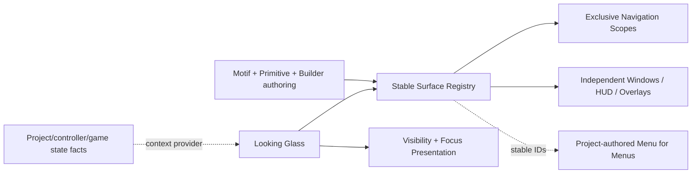

---
tags:
  - sfgss/learning
  - sfgss/wave/foundation
  - sfgss/ui
status: complete
updated: 2026-08-14
---

# PKG-LEARN-008 – The Looking Glass (`EchoUI`) Learning Review

**Review ID:** `PKG-LEARN-008`
**Package authority:** [[../Package Specifications/SFGSS-The-Looking-Glass-EchoUI-Package-Specification|The Looking Glass (`EchoUI`) Package Specification]]
**Wave:** Foundation
**Review status:** Complete
**Reviewer:** Jesse “Echo” Adams / EchoDevGames
**Started:** 2026-08-13
**Completed:** 2026-08-14
**Package authority version reviewed/reconciled:** 1.4.0
**Implementation authorization:** `EUI-M2-02` ACTIVE / AUTHORIZED after the bounded EUI-M2-02 JIT revisit; EUI-M1-01, EUI-M1-02, and EUI-M2-01 complete, latest closeout `d5b9a73`

> This review teaches the architecture and captures designer intent. It does not replace the package authority.

## 1. Exact source set

| Source | Version/status | Why it is needed |
|---|---|---|
| Looking Glass package authority | v1.4.0 Approved | Owns package behavior, completed M1/M2-01 foundation, and reconciled EUI-M2-02 blocking-modal contract |
| SFGSS-000 | v0.26.0 Approved | Owns suite authority, package independence, project composition, and persistence/lifetime boundaries |
| SFGSS-005 | v1.6.0 Approved | Owns Learn → Declare → Authorize and Green Path execution |
| SFGSS-ADR-004 | Accepted / revised 2026-08-13 | Owns just-in-time package learning gate |
| SFGSS-ADR-006 | Accepted | Keeps Unity object lifetime/project composition outside UI authority |
| SFGSS-ADR-007 | Accepted | Owns Green Path self-validating execution |
| Project manifest | Unity 6000.3.8f1; uGUI 2.0.0; Input System 1.18.0 | Verifies the actual current Unity dependency baseline |
| Current Notes / Suite Health | 2026-08-14 intake | Supplies active handoff context only |

**External research boundary:** official Unity documentation was consulted only for the immediate focus/visibility mental model. `EventSystem.SetSelectedGameObject` changes the EventSystem-selected GameObject and sends deselect/select callbacks; CanvasGroup can affect child alpha/interactability/raycast blocking; Unity input modules translate pointer/navigation-style input into UI events. These mechanisms inform Looking Glass but do not grant it input/game-state authority.

## 2. Plain-English purpose

The Looking Glass gives a project reusable UI **plumbing and construction pieces** without designing the project's menus for it.

It tracks individually addressable UI surfaces, controls exclusive navigation where the designer asks for it, permits independent MMO/desktop-style windows where exclusivity is unwanted, coordinates Back/focus/visibility behavior, and later provides standardized Lego-like primitives, reusable visual Motifs, and Editor tools that remove repetitive hierarchy setup.

The project still decides what its Main Menu, Settings, Inventory, Alchemy, HUD, save screen, and every other actual interface means and looks like.

## 3. Real-world analogy

Looking Glass is a theater's stage rigging plus a labeled scenery workshop.

- Navigation scopes decide which backdrop in one track is currently on stage.
- Independent windows are smaller set pieces that may remain visible together.
- Stable surface IDs are the labels the crew uses instead of saying “the third object under Canvas.”
- Motifs are reusable paint/material recipes.
- The future Builder is the workshop jig that creates correctly named parts quickly.

The analogy stops because software surfaces can be queried, opened by stable ID, react to external pause/cinematic/loading conditions, and coordinate EventSystem focus.

## 4. Practical game applications

### Console/adventure menu

```text
Canvas_MasterCanvas
└─ Panel_MenuRoot
   ├─ Panel_MainMenu      [screen: main-menu, scope: frontend]
   └─ Panel_SettingsMenu  [screen: settings,  scope: frontend]
```

`main-menu -> settings -> Back -> main-menu` uses one exclusive navigation scope.

### MMO / EverQuest / WoW-style interface

Inventory, Character, Quest Log, Alchemy, Chat, Map, and HUD may all be separately placeable/toggleable. They are not forced into one screen stack. A project may even build a registry-driven **Menu for Menus** that lists available surface IDs and toggles them.

## 5. Owns and does not own

| Owns | Does not own |
|---|---|
| Package-local UI surface registry and addressing | Gameplay truth or player-controller truth |
| Navigation scopes/history and Back behavior | Whether the game is actually paused/cinematic/loading |
| Independent UI window open/close state | Input mappings/action maps |
| UI-specific visibility/focus application | Save/settings/audio/scene-domain authority |
| UI primitive/Motif/Builder contracts | Project-specific final layout/content/art |
| UI diagnostics and validation | Universal service location or project DDOL composition |

**Boundary sentence:**

> Looking Glass owns how registered UI presentation surfaces are coordinated; project/gameplay/controller authorities own the facts those surfaces react to and the domain actions they request.

## 6. Definition/configuration versus mutable runtime state

| Authored definition/configuration | Mutable runtime state |
|---|---|
| Stable surface ID | Which surfaces are open |
| Surface role (`Screen`, `Window`, `HUD`, `Overlay`) | Current screen per navigation scope |
| Optional navigation scope | Back/history entries |
| Default selection/focus policy | Current selected UI element/modality state |
| Visibility rules | Effective visibility after current context |
| Motif definitions and local override policy | Resolved/applied appearance state |
| Builder/prefab authoring conventions | None; Editor tooling creates project-owned objects |

Definitions and Motifs remain authored assets/configuration. They must not become mutable session stores merely because the runtime consumes them.

## 7. Lifecycle and failure story

1. **Creation/registration:** one package-local root claims authority before registry/navigation side effects.
2. **Validation:** stable IDs, role/scope requirements, duplicate IDs, and initial exclusive-scope conflicts are checked.
3. **Ready state:** the root has a deterministic registry and can answer operations by stable ID.
4. **Normal request:** screens navigate inside their scope; independent windows open/close without replacing unrelated surfaces.
5. **Back/failure:** history Back restores a valid prior screen; unknown IDs/invalid scopes fail structurally without mutating unrelated surfaces.
6. **External context:** pause/cinematic/loading/input-modality facts are supplied by a project adapter or Laboratory helper; Looking Glass reacts but does not create those facts.
7. **Shutdown/removal:** package-local authority and registrations clear without claiming project-wide service composition.

## 8. Important public concepts

| Concept | Plain meaning | Why it matters |
|---|---|---|
| Surface ID | Stable project-authored address such as `settings` or `inventory` | Other UI/project code can interact without hierarchy-path coupling |
| Surface role | Screen, Window, HUD, or Overlay behavior | One package supports both console menus and MMO-style interfaces |
| Navigation scope | Optional exclusivity/history group | Only screens in the same scope replace one another |
| Back history | Prior screens in a scope | Natural Back behavior without hardcoded parent trees |
| UI context | Externally supplied conditions such as Pause/Cinematic/Loading | Enables cascading visibility without UI becoming game-state authority |
| Motif | Reusable appearance recipe | Separates visual language from layout/content/navigation |
| Primitive | Standardized Lego-like UI building block | Variants can look different while sharing behavior |
| Surface registry | Queryable set of stable UI addresses/metadata | Enables tooling and future Menu-for-Menus interfaces |

## 9. Optional bridges and commit authority

| Connected authority | Bridge purpose | Commit owner |
|---|---|---|
| The Vessel / The Will | Supply controller/input modality or UI navigation intent | Controller/Input authority owns input; Looking Glass owns selection presentation |
| The Pulse / project gameplay state | Supply Pause/Cinematic/etc. context | Gameplay-state/project authority owns truth |
| The Chronicle | Present save metadata and submit save commands | Chronicle commits save operations |
| The Accord | Present/edit preference drafts and persist Motif/accessibility preference IDs | Accord commits preference state |
| Resonance | Request semantic UI sounds | Resonance owns audio playback |
| First Light | Replace startup fallback presentation later | First Light owns startup; Looking Glass owns UI presentation |

## 10. Standalone Laboratory

**Laboratory purpose:** prove Looking Glass can coordinate real uGUI surfaces without any peer Echo package.

**First authorized proof:**

1. `main-menu -> settings -> Back -> main-menu` inside one `frontend` navigation scope.
2. Open/close `default-window` while the active frontend screen remains unchanged.
3. Create a duplicate authority or duplicate surface ID and confirm it fails without partial navigation/registry mutation.

The Laboratory initially uses a tiny sample-owned helper when it needs to simulate context. It does not pretend that helper is the future Controller/Pulse integration.

**EUI-M1-01 did not prove:** Motifs, Builder, context response rules, input-aware selection, modals, notifications, release readiness, Chronicle integration, or polished project UI. EUI-M1-02 now activates only the bounded context-response and input-aware-selection subset defined below.

## 11. Mental model diagram



## 12. Teach-back and designer declaration

### Jesse's explanation / declared intent

The review was completed conversationally through concrete design examples. Jesse established that:

- UI cannot be reduced to one top-level mutually exclusive state because Main Menu, gameplay HUD, Pause, loading/saving/system overlays, and cinematic conditions interact differently.
- Only one **menu screen inside a chosen navigation scope** should be active at once; independent MMO-style windows must be allowed to coexist.
- Back normally follows navigation history, but the designer needs explicit Navigate To / main-menu / Resume-style controls where appropriate.
- HUD visibility behind Pause is commonly desirable, but hide-on-Pause / hide-on-Cinematic behavior must be configurable per surface/policy rather than hardcoded globally.
- A screen should be allowed a default selection, but mouse-driven UI should not look arbitrarily highlighted merely because a controller-friendly first selection exists. Input-aware `Auto` selection is the desired future behavior.
- Stable surface IDs are desirable because Inventory, Alchemy, Pause selectors, and future generic window/menu launchers can interact by ID.
- The package must support individually placeable/toggleable EverQuest/WoW-style windows in addition to screen stacks.
- Context truth is supplied by a simple Laboratory helper now and eventually by project Controller/GameState adapters, not owned by Looking Glass.
- The front-facing package should have as much designer “ness” as practical: standardized Lego pieces, a Builder, reusable Motifs, capture/apply workflows, and local style overrides.
- The hierarchy convention should stay basic and descriptive: `Type_DescriptiveName`.

### Remaining questions or confusion

- The behavior contract for external context and input-aware selection is resolved by the EUI-M1-02 bounded revisit. Exact type/member names remain Level-4 implementation details so long as they preserve the approved package contract.
- Movable/resizable/persisted MMO window layouts are a desired later capability but not required by EUI-M1-01.
- Motif schema, local-override representation, and Builder UX are deferred until real primitive authoring exposes the smallest useful contract.

## 13. Completion decision

| Requirement | Result |
|---|---|
| Purpose understood | PASS |
| Authority boundary understood | PASS |
| Lifecycle understood | PASS |
| Practical use visualized | PASS |
| Laboratory understood | PASS |
| Teach-back / designer declaration completed | PASS |
| Source conflict unresolved | NO |

**Decision:** Complete
**Next implementation gate:** `EUI-M2-02` is explicitly ACTIVE / AUTHORIZED after the bounded revisit below and the completed EUI-M2-01 proof
**Notes promoted to:** Looking Glass specification v1.4.1; active EUI-M2-02 Checkpoint Build Plan; Current Notes; Suite Health; Suite Graph Roadmap

## 14. EUI-M1-02 bounded JIT revisit — August 13, 2026

After EUI-M1-01 closed at final recovery baseline `57a4fa4` with full EditMode **1113 / 1113 passed, 0 failed** and manual Laboratory **5 / 5**, Jesse completed a bounded follow-up intake specifically for the next context/selection slice.

### 14.1 Designer-control declaration

- Looking Glass should expose as much straightforward per-surface control as practical because UI materially shapes how a game feels and plays.
- Fast paths should come from optional templates/premade panels/presets, not from removing configurability. Future presets are copy-in starting points that remain freely editable.
- External-context behavior is authored per surface. A surface may opt out of automatic external-context response.
- Visibility, interaction, and selection/focus are independent designer-controlled dimensions.

### 14.2 External context declaration

- Context IDs are stable and project-defined. Familiar names such as `pause`, `cinematic`, and `loading` are conventions rather than package-owned game states.
- Project-specific or oddly named domain facts may be mapped into those UI-facing IDs by project composition or optional adapters.
- Contexts are active/inactive for EUI-M1-02. They do not become arbitrary payload carriers for loading progress, dialogue data, save metadata, or other domain values.
- Multiple contexts may be active simultaneously.
- Each surface owns an ordered rule list; the designer controls precedence and may author different ordering for different surfaces/scenes/cases.
- Resolution is per controlled dimension: the highest-priority applicable rule that explicitly supplies a dimension controls that dimension; lower applicable rules may still supply other dimensions.
- No applicable value means no Looking Glass intervention for that dimension.

### 14.3 Authored and runtime override declaration

- Reusable designer-authored defaults are the base configuration.
- Scene/local and individual instance overrides may refine those defaults without forcing duplicate full configurations.
- Project runtime overrides may supersede effective authored behavior for flexible HUD/window experiences.
- Runtime overrides must not mutate authored assets and are not durable persistence. EUI-M1-02 does not activate Chronicle/Accord integration or persisted MMO window layouts.

### 14.4 Input-aware selection declaration

- Input modality remains externally supplied truth. Looking Glass does not become the input detector and does not acquire a hard dependency on The Will, Vessel, Controller, or another Echo package.
- When configured for controller/keyboard navigation, opening a surface may select its configured default control.
- Pointer/mouse behavior may open unselected.
- Designers may configure controller opening to remain unselected as well.
- Closing a temporary surface defaults to no selected control. Automatic restoration of prior selection is not part of EUI-M1-02.
- General focused-window arbitration, movable/resizable MMO windows, and persisted layout/focus histories remain later work.

### 14.5 EUI-M1-02 authorization boundary

The reconciled checkpoint is:

**EUI-M1-02 — External UI Context, Ordered Surface Response Rules, and Input-Aware Selection Contract**

It authorizes the smallest runtime/test/Laboratory slice needed to prove the decisions above. Motifs, Builder, actual preset/template tooling, broad primitive libraries, modal/notification/tooltip/full-HUD systems, peer bridges, arbitrary context payloads, automatic input detection, persistence, and project-wide lifetime composition remain excluded.

## 15. EUI-M2-01 bounded JIT revisit — August 14, 2026

After EUI-M1-02 closed at `c114ba2` with final full EditMode **1130 / 1130**, focused EchoUI **24 / 24**, and manual Laboratory **10 / 10**, Jesse completed the bounded Runtime Core intake for the first M2 screen-lifecycle slice.

### 15.1 Layer declaration
- The earlier fixed “seven named root layers” assumption is too rigid for a designer-first UI toolkit and is superseded.
- Looking Glass may provide a recommended starter layer arrangement as convenience/template content, but projects/designers may add, remove, reorder, or substitute authored layer definitions.
- Runtime addresses layers by stable project-authored IDs and validates the resolved topology rather than branching on a hard-coded count or package-reserved layer names.
- Runtime callers do not casually reorder the resolved production topology after initialization.

### 15.2 Screen ownership declaration
- `RootOwned`, `SceneOwned`, and `ExternalOwned` screen views are all first-class.
- RootOwned allows Looking Glass to create/release an explicitly defined view.
- SceneOwned coordinates an existing scene-authored view without taking destruction/lifetime ownership.
- ExternalOwned coordinates an explicitly supplied project-owned instance while the external owner remains responsible for object lifetime.
- All modes still participate in the same authoritative screen history/lifecycle after valid admission.

### 15.3 Suspension declaration
- Designers control how a suspended prior screen is presented: hidden, kept visible, or left at its authored/effective visibility.
- This flexibility does not weaken screen-scope authority: a suspended Screen is non-interactive while another Screen is the active top entry in that scope.
- The package therefore controls interaction eligibility while allowing the visual composition to remain a designer choice.

### 15.4 Serialized operation declaration
- The safe default for rapid structural requests is strict FIFO: accepted requests execute one at a time in the order Looking Glass receives them.
- M2-01 does not silently reorder, coalesce, replace, or drop accepted screen operations.
- Admission is bounded; overflow or invalid work is explicitly rejected without partial history/view mutation.
- Future duplicate/coalescing/replacement policies may be added only through a later declared contract if real use proves them useful.

### 15.5 Checkpoint boundary
The reconciled checkpoint is:

**EUI-M2-01 — Authoritative Screen Lifecycle, Project-Defined Layers, and Serialized Screen Operations**

It proves variable authored layer topology, screen definitions/entries, the three ownership modes, Push/Replace/Reset/Back/Close lifecycle semantics, suspension policy, and bounded strict-FIFO mutation ordering.

Modal blocking/exact-once result lifecycle is deliberately deferred to **EUI-M2-02**. Transition drivers, general focus-history restoration, EventSystem adoption policy, HUD/transient services, Motifs, Builder, primitive-library expansion, persistence, and peer bridges also remain outside M2-01.

## 16. EUI-M2-02 bounded JIT revisit — August 14, 2026

After EUI-M2-01 closed at `d5b9a73` with final full EditMode **1153 / 1153**, focused EchoUI **47 / 47**, M2-01 focused **23 / 23**, and manual Laboratory **10 / 10**, Jesse completed the bounded modal-lifecycle intake for the second M2 Runtime Core slice.

### 16.1 Blocking stack declaration
- Blocking modals may stack.
- Only the top eligible modal receives normal Looking Glass interaction.
- Lower modals remain live and handle-addressable; owner cleanup may remove a lower entry safely without disturbing the top modal.
- Modal visuals/backdrops remain designer/project authored; Looking Glass guarantees lifecycle/blocking rather than one mandatory dim/blur presentation.

### 16.2 Result and exact-once declaration
- Normal modal completion uses project-defined stable result IDs rather than package-reserved yes/no/cancel vocabulary.
- Each admitted modal opening receives a fresh awaiter and one runtime handle generation.
- The first valid terminal completion wins and settles exactly once.
- Later attempts are harmless structured stale/already-completed rejections.
- Unexpected owner/view loss or shutdown after admission produces structural `Aborted`, not a fabricated semantic Cancel result.
- Arbitrary typed domain payload transport is not required by EUI-M2-02.

### 16.3 Ownership and Back declaration
- Modal view lifetime reuses the M2-01 `RootOwned`, `SceneOwned`, and `ExternalOwned` rules.
- Looking Glass releases only RootOwned instances it creates.
- Back routes modal-first.
- Each modal may disable Back dismissal or map Back to one designer-authored stable result ID.

### 16.4 UI/input authority declaration
- A blocking modal blocks lower Looking Glass pointer/raycast interaction and UI navigation/submit/Back routing.
- Looking Glass does not disable project gameplay action maps, own WASD, pause the game, set time scale, or claim cursor/gameplay-input authority.
- Projects and optional future Will/Pulse/Vessel bridges may observe modal blocking state and decide whether gameplay input continues.
- The Laboratory may simulate an external project action continuing while lower uGUI is blocked.

### 16.5 Screen mutation declaration
- The simple default while a blocking modal stack is active is `Reject`: ordinary Screen structural mutations fail before changing history.
- Advanced projects may opt into bounded `DeferUntilModalStackClears`.
- Deferred Screen work remains FIFO by original submission order and executes only after the blocking modal stack becomes empty.
- EUI-M2-02 does not permit silent Screen mutation underneath an active blocking modal.

### 16.6 Checkpoint boundary
The reconciled checkpoint is:

**EUI-M2-02 — Blocking Modal Lifecycle, Exact-Once Results, and UI-Scoped Interaction Blocking**

It proves modal definitions/entries/handles, stacked top-only interaction, the three ownership modes, project-defined stable result IDs, exact-once completion, structural Aborted outcomes, fresh awaiters, Back policy, bounded capacity, Screen mutation Reject/Defer behavior, external gameplay-input separation, and retained M1/M2-01 behavior.

Full focus-history restoration/EventSystem adoption, transition drivers, generalized dim/blur effects, HUD/transient services, Motifs, Builder, primitive-library expansion, arbitrary modal domain payload transport, persistence, peer bridges, automatic gameplay-input switching, and project-wide lifetime composition remain outside EUI-M2-02.

### 16.7 Post-activation Modal/Window clarification

After EUI-M2-02 activation and before any Runtime edit, Jesse clarified an EverQuest-style target that must remain compatible with the package architecture:

- A blocking `Modal` is intentionally different from an independent `Window`.
- Blocking Modal semantics gate lower Looking Glass UI, but ordinary inventory/character/crafting/skills/quest/tool-palette Windows should remain able to coexist and remain independently interactive.
- Independent Windows may remain open while gameplay/world interaction continues according to project-authored input/raycast policy.
- M2-01 FIFO is the order accepted structural operations execute. It is **not** the intended Back/Escape dismissal order for a future multi-window UI.
- Future independent-window Back/Escape behavior should use a separate most-recent-eligible **LIFO** dismissal history.
- Designers may author Windows that never participate in automatic Back/Escape dismissal, and runtime users may later pin/lock eligible Windows out of that dismissal history.
- Durable pin/layout persistence, dragging/resizing, focused-window arbitration, and the Window dismissal manager remain future separately gated capabilities.
- EUI-M2-02 remains bounded to blocking Modal lifecycle and exact-once results; this clarification exists so its implementation does not accidentally consume or constrain the future independent-Window design space.
