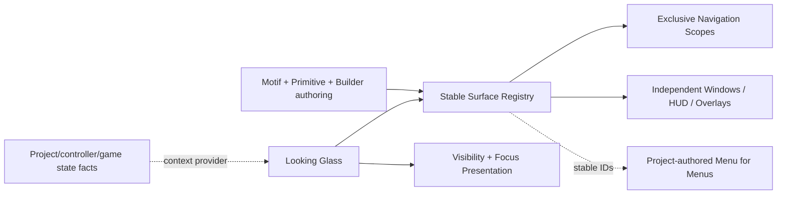

---
tags:
  - sfgss/learning
  - sfgss/wave/foundation
  - sfgss/ui
status: complete
updated: 2026-08-18
---

# PKG-LEARN-008 – The Looking Glass (`EchoUI`) Learning Review

**Review ID:** `PKG-LEARN-008`
**Package authority:** [[../Package Specifications/SFGSS-The-Looking-Glass-EchoUI-Package-Specification|The Looking Glass (`EchoUI`) Package Specification]]
**Wave:** Foundation
**Review status:** Complete
**Reviewer:** Jesse “Echo” Adams / EchoDevGames
**Started:** 2026-08-13
**Completed:** 2026-08-15
**Package authority version reviewed/reconciled:** 1.9.0
**Implementation authorization:** `EUI-M4-03` Runtime Motif Foundation COMPLETE / CLOSED; no successor Looking Glass checkpoint is active

> This review teaches the architecture and captures designer intent. It does not replace the package authority.

## 1. Exact source set

| Source | Version/status | Why it is needed |
|---|---|---|
| Looking Glass package authority | v1.9.0 Approved | Owns completed EUI-M1 through EUI-M4-03 contracts and the durable Assembly Library authoring promise |
| SFGSS-000 | v0.27.0 Approved | Owns suite authority, package independence, project composition, persistence/lifetime boundaries, and the additive Unity-default Input Actions compatibility profile |
| SFGSS-005 | v1.7.0 Approved | Owns Learn → Declare → Authorize, Green Path execution, connected-repository rehydration, and the visible slice loop |
| SFGSS-ADR-004 | Accepted / revised 2026-08-13 | Owns just-in-time package learning gate |
| SFGSS-ADR-006 | Accepted | Keeps Unity object lifetime/project composition outside UI authority |
| SFGSS-ADR-007 | Accepted | Owns Green Path self-validating execution |
| Project manifest | Unity 6000.3.8f1; uGUI 2.0.0; Input System 1.18.0 | Verifies the actual current Unity dependency baseline |
| Current Notes / Suite Health | 2026-08-18 reconciliation | Supplies current handoff context only |

**External research boundary:** official Unity documentation was consulted only for the immediate focus/visibility mental model. `EventSystem.SetSelectedGameObject` changes the EventSystem-selected GameObject and sends deselect/select callbacks; CanvasGroup can affect child alpha/interactability/raycast blocking; Unity input modules translate pointer/navigation-style input into UI events. These mechanisms inform Looking Glass but do not grant it input/game-state authority.

## 2. Plain-English purpose

The Looking Glass gives a project reusable UI **plumbing and construction pieces** without designing the project's menus for it.

It tracks individually addressable UI surfaces, controls exclusive navigation where the designer asks for it, permits independent MMO/desktop-style windows where exclusivity is unwanted, coordinates Back/focus/visibility behavior, and later provides standardized Lego-like primitives, reusable visual Motifs, and Editor tools that remove repetitive hierarchy setup.

The project still decides what its Main Menu, Settings, Inventory, Alchemy, HUD, save screen, and every other actual interface means and looks like.

## 3. Real-world analogy

Looking Glass is a theater's stage rigging plus a labeled scenery workshop.

- Navigation scopes decide which backdrop in one track is currently on stage.
- Independent windows are smaller set pieces that may remain visible together.
- Stable surface IDs are the labels the crew uses instead of saying “the third object under Canvas.”
- Motifs are reusable paint/material recipes.
- The future Builder is the workshop jig that creates correctly named parts quickly.

The analogy stops because software surfaces can be queried, opened by stable ID, react to external pause/cinematic/loading conditions, and coordinate EventSystem focus.

## 4. Practical game applications

### Console/adventure menu

```text
Canvas_MasterCanvas
└─ Panel_MenuRoot
   ├─ Panel_MainMenu      [screen: main-menu, scope: frontend]
   └─ Panel_SettingsMenu  [screen: settings,  scope: frontend]
```

`main-menu -> settings -> Back -> main-menu` uses one exclusive navigation scope.

### MMO / EverQuest / WoW-style interface

Inventory, Character, Quest Log, Alchemy, Chat, Map, and HUD may all be separately placeable/toggleable. They are not forced into one screen stack. A project may even build a registry-driven **Menu for Menus** that lists available surface IDs and toggles them.

## 5. Owns and does not own

| Owns | Does not own |
|---|---|
| Package-local UI surface registry and addressing | Gameplay truth or player-controller truth |
| Navigation scopes/history and Back behavior | Whether the game is actually paused/cinematic/loading |
| Independent UI window open/close state | Input mappings/action maps |
| UI-specific visibility/focus application | Save/settings/audio/scene-domain authority |
| UI primitive/Motif/Builder contracts | Project-specific final layout/content/art |
| UI diagnostics and validation | Universal service location or project DDOL composition |

**Boundary sentence:**

> Looking Glass owns how registered UI presentation surfaces are coordinated; project/gameplay/controller authorities own the facts those surfaces react to and the domain actions they request.

## 6. Definition/configuration versus mutable runtime state

| Authored definition/configuration | Mutable runtime state |
|---|---|
| Stable surface ID | Which surfaces are open |
| Surface role (`Screen`, `Window`, `HUD`, `Overlay`) | Current screen per navigation scope |
| Optional navigation scope | Back/history entries |
| Default selection/focus policy | Current selected UI element/modality state |
| Visibility rules | Effective visibility after current context |
| Motif definitions and local override policy | Resolved/applied appearance state |
| Builder/prefab authoring conventions | None; Editor tooling creates project-owned objects |

Definitions and Motifs remain authored assets/configuration. They must not become mutable session stores merely because the runtime consumes them.

## 7. Lifecycle and failure story

1. **Creation/registration:** one package-local root claims authority before registry/navigation side effects.
2. **Validation:** stable IDs, role/scope requirements, duplicate IDs, and initial exclusive-scope conflicts are checked.
3. **Ready state:** the root has a deterministic registry and can answer operations by stable ID.
4. **Normal request:** screens navigate inside their scope; independent windows open/close without replacing unrelated surfaces.
5. **Back/failure:** history Back restores a valid prior screen; unknown IDs/invalid scopes fail structurally without mutating unrelated surfaces.
6. **External context:** pause/cinematic/loading/input-modality facts are supplied by a project adapter or Laboratory helper; Looking Glass reacts but does not create those facts.
7. **Shutdown/removal:** package-local authority and registrations clear without claiming project-wide service composition.

## 8. Important public concepts

| Concept | Plain meaning | Why it matters |
|---|---|---|
| Surface ID | Stable project-authored address such as `settings` or `inventory` | Other UI/project code can interact without hierarchy-path coupling |
| Surface role | Screen, Window, HUD, or Overlay behavior | One package supports both console menus and MMO-style interfaces |
| Navigation scope | Optional exclusivity/history group | Only screens in the same scope replace one another |
| Back history | Prior screens in a scope | Natural Back behavior without hardcoded parent trees |
| UI context | Externally supplied conditions such as Pause/Cinematic/Loading | Enables cascading visibility without UI becoming game-state authority |
| Motif | Reusable appearance recipe | Separates visual language from layout/content/navigation |
| Primitive | Standardized Lego-like UI building block | Variants can look different while sharing behavior |
| Surface registry | Queryable set of stable UI addresses/metadata | Enables tooling and future Menu-for-Menus interfaces |

## 9. Optional bridges and commit authority

| Connected authority | Bridge purpose | Commit owner |
|---|---|---|
| The Vessel / The Will | Supply controller/input modality or UI navigation intent | Controller/Input authority owns input; Looking Glass owns selection presentation |
| The Pulse / project gameplay state | Supply Pause/Cinematic/etc. context | Gameplay-state/project authority owns truth |
| The Chronicle | Present save metadata and submit save commands | Chronicle commits save operations |
| The Accord | Present/edit preference drafts and persist Motif/accessibility preference IDs | Accord commits preference state |
| Resonance | Request semantic UI sounds | Resonance owns audio playback |
| First Light | Replace startup fallback presentation later | First Light owns startup; Looking Glass owns UI presentation |

## 10. Standalone Laboratory

**Laboratory purpose:** prove Looking Glass can coordinate real uGUI surfaces without any peer Echo package.

**First authorized proof:**

1. `main-menu -> settings -> Back -> main-menu` inside one `frontend` navigation scope.
2. Open/close `default-window` while the active frontend screen remains unchanged.
3. Create a duplicate authority or duplicate surface ID and confirm it fails without partial navigation/registry mutation.

The Laboratory initially uses a tiny sample-owned helper when it needs to simulate context. It does not pretend that helper is the future Controller/Pulse integration.

**EUI-M1-01 did not prove:** Motifs, Builder, context response rules, input-aware selection, modals, notifications, release readiness, Chronicle integration, or polished project UI. EUI-M1-02 now activates only the bounded context-response and input-aware-selection subset defined below.

## 11. Mental model diagram



## 12. Teach-back and designer declaration

### Jesse's explanation / declared intent

The review was completed conversationally through concrete design examples. Jesse established that:

- UI cannot be reduced to one top-level mutually exclusive state because Main Menu, gameplay HUD, Pause, loading/saving/system overlays, and cinematic conditions interact differently.
- Only one **menu screen inside a chosen navigation scope** should be active at once; independent MMO-style windows must be allowed to coexist.
- Back normally follows navigation history, but the designer needs explicit Navigate To / main-menu / Resume-style controls where appropriate.
- HUD visibility behind Pause is commonly desirable, but hide-on-Pause / hide-on-Cinematic behavior must be configurable per surface/policy rather than hardcoded globally.
- A screen should be allowed a default selection, but mouse-driven UI should not look arbitrarily highlighted merely because a controller-friendly first selection exists. Input-aware `Auto` selection is the desired future behavior.
- Stable surface IDs are desirable because Inventory, Alchemy, Pause selectors, and future generic window/menu launchers can interact by ID.
- The package must support individually placeable/toggleable EverQuest/WoW-style windows in addition to screen stacks.
- Context truth is supplied by a simple Laboratory helper now and eventually by project Controller/GameState adapters, not owned by Looking Glass.
- The front-facing package should have as much designer “ness” as practical: standardized Lego pieces, a Builder, reusable Motifs, capture/apply workflows, and local style overrides.
- The hierarchy convention should stay basic and descriptive: `Type_DescriptiveName`.

### Remaining questions or confusion

- The behavior contract for external context and input-aware selection is resolved by the EUI-M1-02 bounded revisit. Exact type/member names remain Level-4 implementation details so long as they preserve the approved package contract.
- Movable/resizable/persisted MMO window layouts are a desired later capability but not required by EUI-M1-01.
- Motif schema, local-override representation, and Builder UX are deferred until real primitive authoring exposes the smallest useful contract.

## 13. Completion decision

| Requirement | Result |
|---|---|
| Purpose understood | PASS |
| Authority boundary understood | PASS |
| Lifecycle understood | PASS |
| Practical use visualized | PASS |
| Laboratory understood | PASS |
| Teach-back / designer declaration completed | PASS |
| Source conflict unresolved | NO |

**Decision:** Complete
**Current implementation gate:** none for Looking Glass after EUI-M4-03 closeout
**Notes promoted to:** Looking Glass specification v1.9.0; EUI-M4-03 checkpoint closeout; Current Notes; Suite Health; Suite Graph Roadmap

## 14. EUI-M1-02 bounded JIT revisit — August 13, 2026

After EUI-M1-01 closed at final recovery baseline `57a4fa4` with full EditMode **1113 / 1113 passed, 0 failed** and manual Laboratory **5 / 5**, Jesse completed a bounded follow-up intake specifically for the next context/selection slice.

### 14.1 Designer-control declaration

- Looking Glass should expose as much straightforward per-surface control as practical because UI materially shapes how a game feels and plays.
- Fast paths should come from optional templates/premade panels/presets, not from removing configurability. Future presets are copy-in starting points that remain freely editable.
- External-context behavior is authored per surface. A surface may opt out of automatic external-context response.
- Visibility, interaction, and selection/focus are independent designer-controlled dimensions.

### 14.2 External context declaration

- Context IDs are stable and project-defined. Familiar names such as `pause`, `cinematic`, and `loading` are conventions rather than package-owned game states.
- Project-specific or oddly named domain facts may be mapped into those UI-facing IDs by project composition or optional adapters.
- Contexts are active/inactive for EUI-M1-02. They do not become arbitrary payload carriers for loading progress, dialogue data, save metadata, or other domain values.
- Multiple contexts may be active simultaneously.
- Each surface owns an ordered rule list; the designer controls precedence and may author different ordering for different surfaces/scenes/cases.
- Resolution is per controlled dimension: the highest-priority applicable rule that explicitly supplies a dimension controls that dimension; lower applicable rules may still supply other dimensions.
- No applicable value means no Looking Glass intervention for that dimension.

### 14.3 Authored and runtime override declaration

- Reusable designer-authored defaults are the base configuration.
- Scene/local and individual instance overrides may refine those defaults without forcing duplicate full configurations.
- Project runtime overrides may supersede effective authored behavior for flexible HUD/window experiences.
- Runtime overrides must not mutate authored assets and are not durable persistence. EUI-M1-02 does not activate Chronicle/Accord integration or persisted MMO window layouts.

### 14.4 Input-aware selection declaration

- Input modality remains externally supplied truth. Looking Glass does not become the input detector and does not acquire a hard dependency on The Will, Vessel, Controller, or another Echo package.
- When configured for controller/keyboard navigation, opening a surface may select its configured default control.
- Pointer/mouse behavior may open unselected.
- Designers may configure controller opening to remain unselected as well.
- Closing a temporary surface defaults to no selected control. Automatic restoration of prior selection is not part of EUI-M1-02.
- General focused-window arbitration, movable/resizable MMO windows, and persisted layout/focus histories remain later work.

### 14.5 EUI-M1-02 authorization boundary

The reconciled checkpoint is:

**EUI-M1-02 — External UI Context, Ordered Surface Response Rules, and Input-Aware Selection Contract**

It authorizes the smallest runtime/test/Laboratory slice needed to prove the decisions above. Motifs, Builder, actual preset/template tooling, broad primitive libraries, modal/notification/tooltip/full-HUD systems, peer bridges, arbitrary context payloads, automatic input detection, persistence, and project-wide lifetime composition remain excluded.

## 15. EUI-M2-01 bounded JIT revisit — August 14, 2026

After EUI-M1-02 closed at `c114ba2` with final full EditMode **1130 / 1130**, focused EchoUI **24 / 24**, and manual Laboratory **10 / 10**, Jesse completed the bounded Runtime Core intake for the first M2 screen-lifecycle slice.

### 15.1 Layer declaration
- The earlier fixed “seven named root layers” assumption is too rigid for a designer-first UI toolkit and is superseded.
- Looking Glass may provide a recommended starter layer arrangement as convenience/template content, but projects/designers may add, remove, reorder, or substitute authored layer definitions.
- Runtime addresses layers by stable project-authored IDs and validates the resolved topology rather than branching on a hard-coded count or package-reserved layer names.
- Runtime callers do not casually reorder the resolved production topology after initialization.

### 15.2 Screen ownership declaration
- `RootOwned`, `SceneOwned`, and `ExternalOwned` screen views are all first-class.
- RootOwned allows Looking Glass to create/release an explicitly defined view.
- SceneOwned coordinates an existing scene-authored view without taking destruction/lifetime ownership.
- ExternalOwned coordinates an explicitly supplied project-owned instance while the external owner remains responsible for object lifetime.
- All modes still participate in the same authoritative screen history/lifecycle after valid admission.

### 15.3 Suspension declaration
- Designers control how a suspended prior screen is presented: hidden, kept visible, or left at its authored/effective visibility.
- This flexibility does not weaken screen-scope authority: a suspended Screen is non-interactive while another Screen is the active top entry in that scope.
- The package therefore controls interaction eligibility while allowing the visual composition to remain a designer choice.

### 15.4 Serialized operation declaration
- The safe default for rapid structural requests is strict FIFO: accepted requests execute one at a time in the order Looking Glass receives them.
- M2-01 does not silently reorder, coalesce, replace, or drop accepted screen operations.
- Admission is bounded; overflow or invalid work is explicitly rejected without partial history/view mutation.
- Future duplicate/coalescing/replacement policies may be added only through a later declared contract if real use proves them useful.

### 15.5 Checkpoint boundary
The reconciled checkpoint is:

**EUI-M2-01 — Authoritative Screen Lifecycle, Project-Defined Layers, and Serialized Screen Operations**

It proves variable authored layer topology, screen definitions/entries, the three ownership modes, Push/Replace/Reset/Back/Close lifecycle semantics, suspension policy, and bounded strict-FIFO mutation ordering.

Modal blocking/exact-once result lifecycle is deliberately deferred to **EUI-M2-02**. Transition drivers, general focus-history restoration, EventSystem adoption policy, HUD/transient services, Motifs, Builder, primitive-library expansion, persistence, and peer bridges also remain outside M2-01.

## 16. EUI-M2-02 bounded JIT revisit — August 14, 2026

After EUI-M2-01 closed at `d5b9a73` with final full EditMode **1153 / 1153**, focused EchoUI **47 / 47**, M2-01 focused **23 / 23**, and manual Laboratory **10 / 10**, Jesse completed the bounded modal-lifecycle intake for the second M2 Runtime Core slice.

### 16.1 Blocking stack declaration
- Blocking modals may stack.
- Only the top eligible modal receives normal Looking Glass interaction.
- Lower modals remain live and handle-addressable; owner cleanup may remove a lower entry safely without disturbing the top modal.
- Modal visuals/backdrops remain designer/project authored; Looking Glass guarantees lifecycle/blocking rather than one mandatory dim/blur presentation.

### 16.2 Result and exact-once declaration
- Normal modal completion uses project-defined stable result IDs rather than package-reserved yes/no/cancel vocabulary.
- Each admitted modal opening receives a fresh awaiter and one runtime handle generation.
- The first valid terminal completion wins and settles exactly once.
- Later attempts are harmless structured stale/already-completed rejections.
- Unexpected owner/view loss or shutdown after admission produces structural `Aborted`, not a fabricated semantic Cancel result.
- Arbitrary typed domain payload transport is not required by EUI-M2-02.

### 16.3 Ownership and Back declaration
- Modal view lifetime reuses the M2-01 `RootOwned`, `SceneOwned`, and `ExternalOwned` rules.
- Looking Glass releases only RootOwned instances it creates.
- Back routes modal-first.
- Each modal may disable Back dismissal or map Back to one designer-authored stable result ID.

### 16.4 UI/input authority declaration
- A blocking modal blocks lower Looking Glass pointer/raycast interaction and UI navigation/submit/Back routing.
- Looking Glass does not disable project gameplay action maps, own WASD, pause the game, set time scale, or claim cursor/gameplay-input authority.
- Projects and optional future Will/Pulse/Vessel bridges may observe modal blocking state and decide whether gameplay input continues.
- The Laboratory may simulate an external project action continuing while lower uGUI is blocked.

### 16.5 Screen mutation declaration
- The simple default while a blocking modal stack is active is `Reject`: ordinary Screen structural mutations fail before changing history.
- Advanced projects may opt into bounded `DeferUntilModalStackClears`.
- Deferred Screen work remains FIFO by original submission order and executes only after the blocking modal stack becomes empty.
- EUI-M2-02 does not permit silent Screen mutation underneath an active blocking modal.

### 16.6 Checkpoint boundary
The reconciled checkpoint is:

**EUI-M2-02 — Blocking Modal Lifecycle, Exact-Once Results, and UI-Scoped Interaction Blocking**

It proves modal definitions/entries/handles, stacked top-only interaction, the three ownership modes, project-defined stable result IDs, exact-once completion, structural Aborted outcomes, fresh awaiters, Back policy, bounded capacity, Screen mutation Reject/Defer behavior, external gameplay-input separation, and retained M1/M2-01 behavior.

Full focus-history restoration/EventSystem adoption, transition drivers, generalized dim/blur effects, HUD/transient services, Motifs, Builder, primitive-library expansion, arbitrary modal domain payload transport, persistence, peer bridges, automatic gameplay-input switching, and project-wide lifetime composition remain outside EUI-M2-02.

### 16.7 Post-activation Modal/Window clarification

After EUI-M2-02 activation and before any Runtime edit, Jesse clarified an EverQuest-style target that must remain compatible with the package architecture:

- A blocking `Modal` is intentionally different from an independent `Window`.
- Blocking Modal semantics gate lower Looking Glass UI, but ordinary inventory/character/crafting/skills/quest/tool-palette Windows should remain able to coexist and remain independently interactive.
- Independent Windows may remain open while gameplay/world interaction continues according to project-authored input/raycast policy.
- M2-01 FIFO is the order accepted structural operations execute. It is **not** the intended Back/Escape dismissal order for a future multi-window UI.
- Future independent-window Back/Escape behavior should use a separate most-recent-eligible **LIFO** dismissal history.
- Designers may author Windows that never participate in automatic Back/Escape dismissal, and runtime users may later pin/lock eligible Windows out of that dismissal history.
- Durable pin/layout persistence, dragging/resizing, focused-window arbitration, and the Window dismissal manager remain future separately gated capabilities.
- EUI-M2-02 remains bounded to blocking Modal lifecycle and exact-once results; this clarification exists so its implementation does not accidentally consume or constrain the future independent-Window design space.

## 17. EUI-M3-01 bounded JIT revisit — August 15, 2026

### 17.1 EventSystem coordination declaration

EUI-M3-01 activates explicit EventSystem coordination rather than automatic ownership.

- `AdoptAssigned` uses exactly the designer/project-assigned EventSystem.
- deterministic `AdoptExisting` adopts only an unambiguous eligible existing EventSystem.
- `CreateIfMissing` may create only when explicitly configured and no eligible system exists.
- `RequireExternal` never creates one.
- Looking Glass never silently destroys, disables, or steals external EventSystems.
- multiple eligible active EventSystems enter actionable degraded/blocking focus state instead of choosing an arbitrary winner.

### 17.2 Focus memory and restoration declaration

M1-02's neutral-close/no-history behavior was an intentionally bounded earlier checkpoint rule, not a permanent prohibition.

M3-01 introduces:

- per-live-runtime-entry focus memory;
- optional transient root-session memory keyed by stable surface ID;
- designer-selectable fresh reopen versus remember-this-session behavior;
- Screen Back/resume and Modal-close restoration when current policy permits;
- deterministic resolution through explicit target -> remembered target -> authored default -> entry resolver -> global fallback -> legal no-focus;
- safe fallback when a remembered/default target is destroyed, disabled, non-interactable, or otherwise ineligible;
- no durable persistence or authored-asset mutation.

### 17.3 Modal containment and independent Window boundary

Blocking Modal focus is structural: EventSystem selection cannot legally escape the top eligible blocking Modal into lower Looking Glass UI. Lower entries retain their own focus memory for deterministic restoration after the Modal completes.

Independent Windows may retain distinct focus memory, but this does not activate:

- focused-window/z-order arbitration;
- most-recent-eligible Back/Escape LIFO history;
- pin/lock state;
- dragging/resizing;
- persisted layout.

Those remain later Window-management work.

### 17.4 Event-driven maintenance and explicit revalidation

Focus maintenance is event-driven by default. Entry lifecycle, selection/hierarchy invalidation, modality changes, explicit focus requests, and explicit revalidation trigger work.

Projects with unusually dynamic UI may explicitly request focus revalidation when their UI state changes. M3-01 does not require a universal per-frame scan. A future opt-in tick driver remains possible only if later profiling/evidence justifies it.

Focus requests carry operation/generation identity so stale requests cannot overwrite newer UI state.

### 17.5 Suite Unity-default input compatibility profile

Jesse declared the Unity default generated `InputSystem_Actions` shape as the suite's intended additive minimum compatibility template for future project/controller integrations.

Baseline maps/actions:

- `Player`: `Move`, `Look`, `Attack`, `Interact`, `Crouch`, `Jump`, `Previous`, `Next`, `Sprint`.
- `UI`: `Navigate`, `Submit`, `Cancel`, `Point`, `Click`, `RightClick`, `MiddleClick`, `ScrollWheel`, `TrackedDevicePosition`, `TrackedDeviceOrientation`.
- control-scheme names: `Keyboard&Mouse`, `Gamepad`, `Touch`, `Joystick`, `XR`.

Projects may add actions but should retain this baseline when claiming the suite compatibility profile. The convention reduces repetitive setup and permits optional adapters to use known default names.

It does **not** make `InputSystem_Actions`, its asset path, GUIDs, exact bindings, `PlayerInput`, The Will, or input-map enable/disable authority a dependency of Looking Glass or another package. Explicit project overrides remain valid.

This suite-wide convenience is promoted into SFGSS-000 v0.27.0 alongside the M3-01 activation.

### 17.6 EUI-M3-01 checkpoint boundary

EUI-M3-01 is bounded to EventSystem coordination, focus memory/restoration, Modal focus containment, independent Window focus memory, event-driven revalidation, and stale-request protection.

Explicitly deferred:

- transition drivers/animation sequencing;
- generalized dim/blur;
- Motifs/accessibility presentation implementation;
- HUD/transients;
- full Window LIFO/pinning/drag-resize/layout management;
- persistence;
- peer bridges;
- Builder;
- primitive/9-slice warehouse work;
- automatic gameplay-input/UI action-map ownership;
- polished Reference Showcase art.

Incoming retained floor before Runtime edits: full Foundry EditMode **1181 / 1181 passed, 0 failed**, EchoUI **75 / 75**, focused M2-02 **28 / 28**, manual M2-02 Laboratory **12 / 12 PASS**.

Runtime implementation has **not started** at this activation record.

## 18. EUI-M3-02 bounded JIT revisit — August 15, 2026

### 18.1 Structural operation and transition boundary

Accepted lifecycle operations remain authoritative. An authored transition is part of settling the admitted Screen/Modal/Window operation rather than a parallel animation that may finish whenever it wants.

- structural mutation does not report terminal success until its required transition settles;
- existing bounded/FIFO operation law remains intact;
- later accepted lifecycle work cannot race through the same entry while its transition is still authoritative;
- transition presentation cannot become navigation/history/game-state authority.

### 18.2 Professional replaceable-driver contract

Transition drivers own presentation only.

The built-in package examples remain intentionally small:
- Immediate / no-animation;
- unscaled CanvasGroup Fade.

The extension contract must still serve advanced projects without a package rewrite. Profiles/drivers may support separate enter/exit behavior, duration/timing, optional curve/easing data, hard timeout, reduced-motion substitution, and transient operation overrides. Animator, tween-library, shader/dissolve, slide/scale, 3D, or other project drivers remain valid. Looking Glass does not require a mandatory tween package.

Every execution owns a fresh awaitable/result and operation/generation identity. Cached/reused awaitables are forbidden. A late stale completion cannot rewind newer authoritative UI state.

### 18.3 Cancellation and deterministic recovery

Cancellation is best-effort because third-party animation systems differ.

Safety is not optional:
- operations use unscaled time;
- every transition is hard-bounded;
- stale generation cannot commit newer state;
- enter/open failure cleans the incoming entry and restores/retains the prior known-stable UI state;
- an admitted blocking Modal open failure settles structurally as Aborted rather than semantic Cancel;
- exit/close failure forces the departing entry to deterministic closed/released state so a broken animation cannot hold the UI hostage;
- root shutdown/view destruction always wins.

### 18.4 Transition authoring resolution

Effective transition policy resolves:

`project/root default -> per-definition profile -> transient operation override`

Runtime overrides are session state only and never mutate authored assets.

The transition seam is designed to be reusable by later HUD/Overlay/transient services, but EUI-M3-02 wires only already-existing lifecycle roles: Screen, blocking Modal, and independent Window. HUD, notifications, prompts, and tooltips remain M4 work.

### 18.5 Reduced-motion seam without premature accessibility implementation

EUI-M3-02 must permit a later accessibility policy to replace an authored transition with Immediate or another approved reduced-motion variant. That seam is required now so transition architecture does not need to be rewritten later. The broader Motif/accessibility service remains outside M3-02.

### 18.6 Durable Assembly Library declaration

Jesse explicitly rejected treating all future authoring convenience as one vague Builder feature. Looking Glass therefore preserves five separate authoring layers:

1. **Primitive Warehouse** — reusable focused prefab families, including buttons, close buttons, sliders, toggles, tabs, inputs, dropdowns, scroll pieces, separators, progress elements, panels, and scalable 9-sliced borders/backgrounds.
2. **Panel/Menu Template Library** — ordinary editable prefab compositions assembled from primitives. Common menu/settings/pause/confirmation/inventory/character/journal/crafting/list-detail starts are examples, not mandatory genre law.
3. **Stable-ID Template Catalog** — package starter definitions plus project-extensible add/remove/replace/regroup behavior.
4. **Assembly Utilities** — lightweight Editor operations such as create-from-template, add button/slider groups, name/parent/validate, and replace primitive families. These utilities must remain useful independently of the full Builder.
5. **Builder / Composer** — later richer tooling that consumes the same catalog and creates ordinary editable project objects instead of opaque locked generated objects.

This is a durable package promise, not M3-02 implementation scope. The exact authoring checkpoint numbers remain separately gated.

### 18.7 EUI-M3-02 checkpoint boundary

EUI-M3-02 is bounded to view lifecycle transition settlement; transition profiles/defaults/operation overrides; Immediate and CanvasGroup Fade reference drivers; fresh awaitable/result generation; cancellation/stale-generation/hard-timeout behavior; deterministic enter/exit failure recovery; Screen/Modal/Window transition wiring; reduced-motion substitution seam; and retained M3-01 focus/EventSystem behavior.

Explicitly deferred: Motif/accessibility service implementation; generalized dim/blur; HUD/notification/tooltip/prompt services; full Window LIFO/pin/drag-resize/layout management; persistence; peer bridges; implementation of Primitive Warehouse, Panel/Menu Templates, Template Catalog, Assembly Utilities, or Builder/Composer; automatic gameplay-input/UI action-map ownership; project-wide lifetime composition; polished Reference Showcase art.

Incoming retained floor before Runtime edits: full Foundry EditMode **1205 / 1205 passed, 0 failed**, EchoUI **99 / 99**, focused EUI-M3-01 **24 / 24**, manual EUI-M3-01 Laboratory **12 / 12 PASS**, bounded focus performance PASS.

## 19. EUI-M4-01 bounded JIT revisit — August 16, 2026

### 19.1 Learned boundary

HUD regions are persistent/reactive presentation addresses, not owners of health, objectives, save state, dialogue truth, diagnostics truth, gameplay input, pause, time scale, cursor, persistence, or project lifetime composition.

### 19.2 Declared contract

- Designers author stable named region IDs, ordering, and bounded capacity.
- Widget registrations and visibility requests use fresh generation-safe idempotent leases.
- Effective visibility combines authored baseline, existing external-context response, and all live reason/owner leases; one release cannot erase another live request.
- Owner loss and shutdown clean only the matching generation.
- HUD mutations remain independent of Screen history, blocking Modal order, and independent Window state.
- Notifications, prompts, tooltips, Motifs/accessibility, full Window management, persistence, authoring libraries, Builder, bridges, integration, and release remain excluded.

### 19.3 Authorization and current proof phase

Historical EUI-M4-01 phase: activation landed at `ce30ac6`; Runtime and focused tests at `df9e2be`; bounded compile/test corrections ran through `e47d43b`; Laboratory/manual proof and closeout later completed. EUI-M4-02 was not activated at that phase; Section 20 below supersedes that status.

## 20. EUI-M4-02 bounded JIT revisit — August 17, 2026

After EUI-M4-01 closed at documentation commit `5e7ad92` with implementation/Laboratory seal `29573ef`, automated focused/full gate user-confirmed green, manual HUD Laboratory **5 / 5 PASS**, retained smoke green, and package/imported parity verified, Jesse approved the bounded notification-channel intake.

### 20.1 Learned boundary

Notifications are transient presentation. Looking Glass may own admission, ordering, visible/pending lifecycle, dismissal, expiry, ownership cleanup, and structured results, but it does not own the durable event/history source, project domain meaning, localization content, audio/analytics, gameplay commands, persistence, or pause truth.

### 20.2 Channel and ordering declaration

- Channel topology is project-defined, variable-count, stable-ID-addressed, and immutable during play.
- Each channel has independent visible and pending capacities.
- Pending promotion is higher-priority-first with strict FIFO ties.
- A later higher-priority request does not silently preempt an already visible entry.
- Channels do not borrow capacity or reorder one another.

### 20.3 Coalescing and generation declaration

- Coalescing is opt-in through a nonempty stable key scoped to one channel.
- A match may be pending or visible, but it remains one logical slot rather than multiplying entries.
- Replacement creates a fresh authoritative generation, settles the prior generation, and makes old handles stale.
- The default coalescing lifetime behavior restarts the replacement's authored duration.
- Status/diagnostics expose stable identity and counts without retaining arbitrary visible text or project payloads.

### 20.4 Overflow declaration

- Overflow applies only when pending capacity is full.
- Default policy is `RejectNewest`.
- Authored alternatives are `DropOldestPending` and `ReplaceLowestPriorityPending`.
- Lowest-priority replacement requires the incoming priority to be strictly higher; equal/lower priority rejects.
- Visible entries are not silently evicted by these pending-overflow policies.
- Every rejection/eviction/replacement result is structured and observable.

### 20.5 Lifetime and ownership declaration

- Automatic duration begins when an entry becomes visible and uses an injected unscaled monotonic clock.
- Manual duration remains until explicit dismissal or structural cleanup.
- The manual seam does not activate the broader Motif/accessibility service.
- Handles are generation-safe and idempotent; owner loss, reset, and shutdown settle only matching live generations exactly once.
- Looking Glass does not set `Time.timeScale`, control the cursor, switch input maps, or persist notification history.

### 20.6 Checkpoint boundary

The reconciled checkpoint is:

**EUI-M4-02 — Bounded Notification Channels, Priority, Coalescing, Overflow, and Unscaled Lifetime**

It proves project-defined channels, bounded visible/pending capacity, deterministic priority/FIFO promotion, non-preemptive visibility, opt-in fresh-generation coalescing, deterministic pending overflow, unscaled/manual lifetime, owner-loss/stale-handle safety, structured status/events, Laboratory proof, and retained EUI-M1 through EUI-M4-01 behavior.

Prompts, tooltips, Motifs/accessibility implementation, safe-area placement, full Window management, persistence, localization/audio/analytics, domain authority, peer bridges, authoring libraries/Builder, integration, and release remain outside EUI-M4-02.

Exact post-M4 automated counts were not captured during EUI-M4-01. The first EUI-M4-02 gate is therefore to run EchoUI Editor and full Foundry EditMode on the activation commit and record the exact current baseline before any Runtime edit.

### 20.7 Implementation and closeout evidence

- Activation baseline before Runtime edits: full Foundry EditMode **1258 / 1258** and EchoUI Editor **152 / 152**, zero failed.
- Runtime/root/presenter implementation is accepted through `d93d0bd`.
- Final automated evidence: full Foundry EditMode **1383 / 1383**, EchoUI Editor **277 / 277**, aggregate notification fixtures **125 / 125**, presenter fixture **17 / 17**, zero failed/skipped/inconclusive.
- Mirrored Laboratory implementation `bde34f2` supplies three authored channels, a sample-owned plain presenter, six bounded checks, and all retained tabs.
- Manual Laboratory: **6 / 6 PASS**; baseline ready; every check preserved structural truth; 180-frame notification/presenter quiescence PASS.
- Retained M4-01/M3-02/M3-01/M2-02/M2-01/M1 smoke: user-confirmed green; exact per-tab strings not separately supplied.
- Submitted Unity screenshots confirm Check 1 PASS, zero Console errors/warnings, and the retained **1383-test** green runner.
- Package/imported Laboratory parity: **VERIFIED**.
- Final state: **EUI-M4-02 COMPLETE / CLOSED**. Its no-successor stop point was satisfied before the separate Section 21 EUI-M4-03 activation.

## 21. EUI-M4-03 bounded JIT revisit — August 17, 2026

After EUI-M4-02 closed at documentation commit `2f59251` with final automated **1383 / 1383** full and **277 / 277** EchoUI, manual Laboratory **6 / 6 PASS**, retained smoke green, and package/imported parity verified, Jesse approved the bounded Runtime Motif intake.

### 21.1 Learned boundary

A Motif is a reusable project-owned appearance recipe. Looking Glass may own stable token resolution, one effective root-session selection, explicit target application, fallback, cleanup, and structured reports. It does not own layout, navigation, content, domain commands, production art, durable settings preference, accessibility truth, project lifetime, or destructive edit-time prefab restyling.

Motif definitions are authored configuration and must remain immutable during play. Runtime application consumes detached snapshots. The absence of real Primitive Warehouse families means M4-03 must not prematurely lock the final warehouse-facing typography/provider schema or full Editor capture/local-override authoring representation.

### 21.2 Token and target declaration

- Motifs and tokens use normalized stable IDs.
- Initial typed token families are colors, uGUI `Selectable` state-color recipes, sprites, and small numeric/decorative values understood by a target.
- No mandatory TextMeshPro or peer Echo dependency is introduced.
- Targets register explicitly; no automatic scene/hierarchy scan or per-frame polling is authorized.
- Late registration immediately receives current effective truth.
- Registered-target capacity is configured and bounded; duplicate/full registration rejects without mutation.
- Missing Motif configuration degrades only Motif capability and does not block retained root/services.
- Each target binding may inherit from the Motif or preserve an authored local value.
- Production projects remain free to implement custom targets while the Laboratory supplies plain sample-owned uGUI adapters.

### 21.3 Effective state, fallback, and failure declaration

- The root owns one effective Motif for its current session and applies an authored default during initialization.
- Unknown requested IDs use the authored fallback and report fallback without rewriting the caller's external preference/source ID.
- If no requested/fallback Motif is valid, the service retains last known-good appearance and reports unavailable before partial definition commit.
- Once a valid effective Motif commits, one target or listener failure is isolated and reported. Healthy targets continue, and committed service truth is not rolled back through fake atomicity.
- Registration handles are fresh, generation-safe, and idempotent; stale release or destroyed-owner cleanup cannot remove a newer registration.
- Reset restores authored default/fallback behavior with a fresh generation; shutdown releases state and rejects new work.

### 21.4 Checkpoint boundary

The reconciled checkpoint is:

**EUI-M4-03 — Runtime Motif Definitions, Registered Targets, Fallback, and Immutable Application**

It proves immutable project Motif definitions/tokens, detached snapshots, root-local effective/default/fallback state, explicit target registration, inherit-versus-local preservation, deterministic switching/fallback, target/listener isolation, generation-safe cleanup, Laboratory proof, and retained EUI-M1 through EUI-M4-02 behavior.

Full accessibility policy, text scaling, focus-indicator policy, automatic reduced-motion policy connection, safe area, Accord/settings persistence, Motif capture/apply/preview tooling, final Primitive Warehouse-facing schema, Primitive Warehouse/templates/catalog/utilities, Builder, prompts/tooltips, richer Window management, bridges, integration, and release remain outside EUI-M4-03.

The first gate was to re-establish EchoUI Editor **277 / 277** and full Foundry EditMode **1383 / 1383** on the activation commit before any Runtime edit; that gate passed before implementation.

### 21.5 Authorization state

EUI-M4-03 was activated from clean EUI-M4-02 closeout `2f59251` under package authority v1.9.0. The authorized boundary remained unchanged through implementation and Laboratory correction.

### 21.6 Implementation and closeout evidence — August 18, 2026

- Activation: `435fc66`.
- Runtime slices: contracts `d67550d`; catalog/fallback `172d230`; session service `43da17a`; registered targets `efbc503`; reusable bindings `e17d816`; root integration `ab5906c`.
- Root teardown fixture correction: `d291885`; test-only, no Runtime source change.
- Mirrored Motif Laboratory: `b48eae68`.
- Check 3 proof assertion correction: `7f9272bd`.
- Check 4 proof sequencing correction and accepted Laboratory implementation head: `8188b91c`.
- Final automated evidence `TestResults_20260818_060619.xml`: full Foundry EditMode **1445 / 1445**, EchoUI Editor **339 / 339**, all Motif fixtures **62 / 62**, root fixture **12 / 12**, failed/skipped/inconclusive **0 / 0 / 0**.
- Manual Motif Laboratory **6 / 6 PASS**.
- 180-frame settled Motif quiescence **PASS** and authored Motif assets remained unchanged.
- Retained M4-02/M4-01/M3-02/M3-01/M2-02/M2-01/M1 representative smoke: **user-confirmed green**; exact per-tab strings were not separately supplied.
- Check 5 intentionally emitted two caught target exceptions because the deliberately broken target is exercised at immediate registration and again during the subsequent switch. Those logs are accepted isolation evidence.
- Package/imported Motif proof source parity: **VERIFIED**.
- Runtime remains `0.1.0` with the recorded uGUI `2.0.0` dependency boundary and no hard peer Echo or mandatory TextMeshPro package dependency added by M4-03.

**Final state:** **EUI-M4-03 COMPLETE / CLOSED.** No successor Looking Glass checkpoint is active. The **Primitive Warehouse** remains the named next direction only and requires a separate bounded JIT review/activation.
