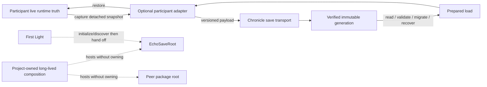

---
tags:
  - sfgss/learning
  - sfgss/wave/foundation
  - sfgss/persistence
status: complete
updated: 2026-08-09
---

# PKG-LEARN-009 – The Chronicle (`EchoSave`) Learning Review

**Review ID:** `PKG-LEARN-009`
**Package authority:** [[../Package Specifications/SFGSS-The-Chronicle-EchoSave-Package-Specification|The Chronicle (`EchoSave`) Package Specification]]
**Wave:** Foundation
**Review status:** Complete
**Reviewer:** Jesse “Echo” Adams / EchoDevGames
**Started:** 2026-08-09
**Completed:** 2026-08-09
**Package authority version reviewed:** 1.2.0
**Implementation authorization:** `ESV-M1-01` activated after completed teach-back

> This review teaches the architecture. It does not replace the package authority and does not authorize code.

## 1. Exact source set

| Source | Version/status | Why it is needed |
|---|---|---|
| Chronicle package authority | v1.2.0 Approved | Owns Chronicle behavior and boundaries |
| SFGSS-000 | v0.26.0 Approved | Owns suite-wide package independence, persistence, and lifetime rules |
| SFGSS-001 | v1.5.0 Approved | Requires the three-lifetime analysis in package specifications |
| SFGSS-INT-SUITE-001 | v1.1.0 Approved | Summarizes cross-package wiring, persistence layers, and commit ownership |
| SFGSS-ADR-006 | v1.0.0 Accepted | Separates durable persistence, runtime truth, and Unity object lifetime |
| SFGSS-002 / SFGSS-003 / SFGSS-005 | Current approved | Dependency/bridge, durable-data, and checkpoint/learning rules |
| Current Notes | 2026-08-09 | Active handoff context only |
| Package Learning Review Catalog / tracker | Active | Own navigation and learning status |

**Research boundary:** External serializer/file-format/backend research has **not** started. It is intentionally deferred until the learning review reaches a question that requires it. The present job is to understand authority, lifecycle, data ownership, failure, standalone behavior, and integration boundaries first.

## 2. Plain-English purpose

The Chronicle is the game's **durable save transport and recovery authority**.

Its job is not to become the game's database while the game is running. Instead, it coordinates a trustworthy recording process:

1. ask participating systems for detached saveable snapshots;
2. validate/version those records;
3. write them through a controlled save operation;
4. publish a complete save generation only after it is valid;
5. later read/validate/migrate/recover that record;
6. restore the detached data back into the systems that actually own the live state.

The hard problem is not "`File.WriteAllText`." The hard problem is making sure an interrupted write, old version, missing optional package, corrupt generation, scene transition, or participant failure does not quietly destroy the player's only good record.

## 3. Real-world analogy

Think of Chronicle as a **records archive and courier**, not the departments whose work it records.

- The Inventory department knows what items the player currently owns.
- The Objectives department knows which quest steps are complete.
- The Character department knows the roster.
- Chronicle asks each department for an approved record, places those records into a verified archive generation, and later returns the proper record to each department.

Chronicle owns the archive shelves, catalog, publication rules, integrity checks, retention, recovery, and handoff procedure.

It does **not** become Inventory merely because it has an inventory record.

The analogy stops being exact because software can migrate schemas, validate hashes, prepare loads asynchronously, and perform deterministic transactions that a paper archive cannot.

### The building analogy for object lifetime

A second analogy helps separate `DontDestroyOnLoad`:

- **The building** = the running Unity application/session.
- **Departments/offices** = package services that may remain open as scenes change.
- **The archive** = Chronicle's durable save data on disk.
- **The building manager/project composition** = project-owned arrangement of long-lived services.

Keeping an office open while moving from Main Menu to Level 1 does not mean its contents have been written to the archive.

## 4. Practical game application

**Scenario:** the planned Game Shell: First Light → Main Menu → Settings → Level 1.

A player:

1. launches through First Light;
2. reaches a Looking Glass main menu;
3. changes audio/graphics preferences in Accord;
4. starts a game and later reaches Level 1;
5. gains items/progression;
6. saves;
7. quits the executable;
8. restarts and loads.

Correct ownership:

```text
Audio/graphics preference meaning + preference persistence
    The Accord
        ↓ optional application
Resonance / graphics provider

Live inventory/progression/etc.
    owning gameplay packages
        ↓ detached versioned snapshots
optional Chronicle participant adapters
        ↓
The Chronicle
    slot / generation / manifest / integrity / recovery
        ↓ load
participant adapters
        ↓
owning gameplay packages restore live truth
```

Chronicle is necessary for the **game-save slot** in this scenario, but Accord's global preferences do not become Chronicle-owned merely because they also survive restart.

## 5. Owns and does not own

| Owns | Does not own |
|---|---|
| Durable local game-save transport | Global preferences |
| Save slots and slot catalog semantics | Audio/graphics setting meaning |
| Immutable save generations and publication | Inventory/objective/progression/character/world live truth |
| Save manifests and participant payload inventory | Project-specific gameplay schemas |
| Save/load orchestration | Normal scene travel |
| Participant registration/transport contracts | Production save UI |
| Serializer/backend provider seams | A universal serializer for every package |
| Migration routing and version checks | Cloud/platform account authority |
| Integrity, backup, retention, quarantine, recovery | Security authentication merely because hashes exist |
| Prepared two-phase load lifecycle | Project-wide `DontDestroyOnLoad` composition |
| Package-local `EchoSaveRoot` lifecycle | Global service locator / generic GameManager |

**Boundary sentence:**

> Chronicle owns the trustworthy transport and reconstruction of game-save records; each participant owns the meaning and live runtime truth of the data it contributes, Accord owns global preferences, and the consumer project owns composition of unrelated long-lived services.

## 6. Definition/configuration versus mutable runtime state

| Authored definition/configuration | Mutable runtime state |
|---|---|
| EchoSave configuration | Initialized/Ready/Faulted lifecycle |
| storage-root/path policy | active slot/session selection |
| retention policy | current save/load operation |
| provider selection | participant registrations |
| autosave policy | catalog snapshot/cache |
| migration/provider registrations | prepared-load handles |
| limits/bounds | operation queue/coalescing state |

Participant payload DTOs are **detached records**. They are neither shared ScriptableObject definitions nor the participant's live runtime model.

Shared configuration must not be mutated to store active slot, operation progress, or loaded gameplay values.

## 7. Lifecycle and failure story

### 7.1 The three separate lifetimes

```text
PROCESS-TO-PROCESS DURABILITY
disk/save generations
        Chronicle transport

CURRENT RUNTIME TRUTH
Inventory / Objectives / Progression / Characters / World / project state
        owning package/project

UNITY OBJECT LIFETIME
EchoSaveRoot, Accord service, Resonance service, UI service, etc.
        package-local duplicate safety
        + optional project-owned scene-surviving composition
```

They may collaborate, but they are not the same thing.

### 7.2 Chronicle lifecycle

1. **Creation/registration:** a configured EchoSaveRoot claims its package-local authority before storage/path/callback side effects.
2. **Validation:** configuration, providers, paths, IDs, limits, and participant registrations are validated.
3. **Ready state:** Chronicle can catalog slots and admit approved save/load operations.
4. **Save request:** participants capture detached payloads; Chronicle stages/serializes/writes a new generation; the generation becomes current only at the publication boundary.
5. **Load request:** Chronicle reads/validates/recovers/migrates into a prepared detached load; the project may travel; participants then apply their records.
6. **Failure/cancellation:** failures return structured results and preserve recoverable evidence. Cancellation stops only at safe boundaries.
7. **Scene change:** package-local Chronicle authority may survive; participant availability can change. A prepared load exists specifically so scene travel can remain external.
8. **Shutdown/removal:** admission stops, commit-critical work settles, handles are disposed, subscriptions/authority are cleared, and project-owned durable records are not silently deleted.

### 7.3 Duplicate rule

A duplicate Chronicle root must lose **before** it creates paths, scans catalogs, registers callbacks, accepts participants, or writes data.

That is why the first implementation checkpoint begins with duplicate-safe authority rather than file formats.

## 8. Important public concepts

| Concept | Plain meaning | Why it matters |
|---|---|---|
| Save Slot | A durable logical save destination/history | Gives menus and project rules stable save identity |
| Save Generation | One immutable committed version of a slot | Prevents overwriting the only known-good record |
| Head | Small publication pointer to the current generation | Separates complete write from final commit |
| Manifest | Metadata and inventory for one generation | Listing/validation can avoid loading full gameplay payloads |
| Participant | A system that contributes/restores one versioned payload | Keeps gameplay schemas outside Chronicle |
| Prepared Load | Validated/migrated detached data waiting to be applied | Allows scene travel before runtime state restoration |
| Migration | Controlled conversion from supported older schemas | Lets durable records outlive code revisions |
| Recovery | Selecting/preserving a valid previous generation | Prevents one damaged write from becoming silent data loss |

The exact C# names are less important during learning than recognizing these responsibilities.

## 9. Optional bridges and commit authority

| Connected authority | Bridge purpose | Commit owner |
|---|---|---|
| First Light | Initialize Chronicle / expose continue candidates during startup | Chronicle owns save catalog; First Light owns startup/handoff |
| Passage | Travel to prepared-load destination before participant apply | Passage owns Unity scene operation; Chronicle owns prepared load |
| Looking Glass | Save-slot lists, save/load commands, recovery prompts | Chronicle owns save operation; Looking Glass presents |
| Inventory | Transport inventory snapshot | Inventory owns payload/live truth; Chronicle owns save transport |
| Progression | Transport progression snapshot | Progression owns payload/live truth; Chronicle owns save transport |
| Objectives | Transport objective state/reward ledger | Objectives owns payload/live truth; Chronicle owns save transport |
| Characters | Transport roster/availability/selection | Characters owns payload/live truth; Chronicle owns save transport |
| World | Transport context/discovery/provider records | World/provider owns payload/live truth; Chronicle owns save transport |

### Accord is different

Global preferences such as master volume and resolution are **Accord data**, not Chronicle game-save payloads by default. Chronicle and Accord may both persist data, but they own different durability domains.

## 10. Standalone Laboratory

**Laboratory purpose:** prove that Chronicle can safely own game-save transport with no peer Echo packages installed.

**Core actions:**

1. initialize one configured Chronicle authority and prove duplicate rejection before side effects;
2. create/list/read an isolated save using package-owned test participants;
3. interrupt/corrupt/age a generation and prove structured recovery/migration behavior;
4. prepare a load, change the participant environment, then apply when required participants exist;
5. remove/reset Laboratory data without touching unowned project data.

**What the Laboratory does not prove:** Accord settings persistence, First Light startup integration, Looking Glass save UI, Passage scene travel, Inventory/Progression adapters, cloud storage, external clean-project installation, or release support.

## 11. Mental model diagram



### Recognition checklist

Before implementation, Jesse should be able to answer:

- Is this datum a global preference, a save-slot payload, or session-only runtime state?
- Who owns the live truth after a load?
- Does this package need Chronicle to function, or only an optional adapter to persist?
- Is a `DontDestroyOnLoad` object solving scene lifetime, or durable persistence?
- If a root is long-lived, what exact authority does it own and how does a duplicate lose before side effects?
- Can the integration be removed while both core packages still compile/use their standalone path?

## 12. Teach-back

### Jesse’s explanation

**Completed 2026-08-09.** Jesse demonstrated the Chronicle mental model interactively in his own words across the full review boundary:

- `DontDestroyOnLoad` is Unity object lifetime inside one running application; it is not process-to-process durability.
- Package runtime systems own live truth. Chronicle retains durable snapshots and uses an explicit load to reconstruct participant-owned runtime truth.
- Save scope and durability policy are distinct ideas; a datum's conceptual ownership does not by itself dictate when it is written.
- Inventory and other peer systems own their payload meaning, capture/restore semantics, and payload-schema migration. Chronicle owns the envelope, routing, transaction, integrity, and recovery behavior.
- Peer packages remain independently usable. Chronicle participation belongs in optional adapters/bridges rather than hard core dependencies.
- The consumer project owns long-lived service composition. `EchoSaveRoot` owns Chronicle only and has no authority over Accord, Resonance, UI, Inventory, or other peers.
- A duplicate `EchoSaveRoot` must lose its package-local authority claim before path, callback, participant, storage, or operation side effects.
- Shutdown must settle/cancel active Chronicle work safely, preserve the previous known-good durable state, release resources, and release the Chronicle authority claim last.
- Save candidates are transactional: required participant failure rejects the candidate and preserves the previous known-good generation.
- Optional participant failure may allow commit with an advisory and an omitted section; Chronicle must not fabricate or silently stale-copy participant payloads.
- Missing required participants block a coherent load; missing optional participants may be skipped with preserved payload and advisory.
- Chronicle envelope-format versions and participant payload-schema versions evolve independently.
- Save/load operations require exclusive orchestration. A load must not race an active save.
- A committed snapshot must represent one coherent logical runtime state; participant-level success alone is not sufficient if capture spans inconsistent moments.
- Coordinated load must not expose half-restored runtime state. Apply failure requires abort/recovery rather than continuing with mixed old/new truth.
- Runtime may become dirty after a load without creating a new generation. A generation exists only after a successful durable commit.
- Dirty state and save policy are separate. Project/game policy decides when to request a save; Chronicle owns safe persistence mechanics.
- Save model, serialization, and storage are separate responsibilities so Chronicle is not welded to one serializer, local filesystem, test backend, or future platform provider.

Jesse explicitly asked to begin building on 2026-08-09, satisfying the explicit activation requirement for `ESV-M1-01`.


### Check questions

1. What are the three separate concerns that SFGSS-ADR-006 forbids us from collapsing together?
2. If The Vault (`EchoInventory`) later needs saving, how can it participate without making `EchoSave` a hard core dependency?
3. After Chronicle loads an inventory/objective/character/world payload, who owns those live values?
4. What may a project-owned `DontDestroyOnLoad` composition root do, and what may it **not** become?
5. In the future Game Shell, what does First Light own, what does Chronicle own, what does Accord own, what does Resonance own, and what does Looking Glass own?
6. Why is a duplicate-safe Chronicle authority claim part of M1 while real file writing is deliberately not?
7. Why should an interrupted generation never become the current published save?

### Remaining questions or confusion

- No learning blocker remains for `ESV-M1-01`.
- Exact serializer/file-format/backend research remains deliberately deferred; M1 does not require choosing or implementing one.
- Exact project-owned runtime-composition authoring experience remains deferred; SFGSS-ADR-006 fixes the ownership boundary now.
- Later milestones must return to transactional save/load, generation publication, recovery, participant transport, and provider design before implementing those capabilities.

## 13. Completion decision

| Requirement | Result |
|---|---|
| Purpose understood | PASS |
| Authority boundary understood | PASS |
| Lifecycle understood | PASS |
| Practical use visualized | PASS |
| Laboratory understood | PASS |
| Teach-back completed | PASS |
| Source conflict unresolved | NO |

**Decision:** Complete
**Next implementation gate:** `ESV-M1-01` is explicitly activated for implementation
**Notes promoted to:** SFGSS-000 v0.26.0; SFGSS-001 v1.5.0; SFGSS-ADR-006; SFGSS-INT-SUITE-001 v1.1.0; Chronicle specification v1.2.0
