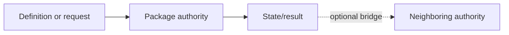

---
tags:
  - sfgss/learning
status: template
updated: 2026-08-04
---

# <PKG-LEARN-###> – <Public Title> (`<TechnicalIdentifier>`) Learning Review

**Review ID:** `<PKG-LEARN-###>`  
**Package authority:** `<relative link to package specification/foundation>`  
**Wave:** `<Foundation / Expansion / Advanced>`  
**Review status:** `<Not started / In progress / Needs revisit / Complete / Superseded>`  
**Reviewer:** Jesse “Echo” Adams / EchoDevGames  
**Started:** `<DATE>`  
**Completed:** `<DATE OR NOT COMPLETE>`  
**Package authority version reviewed:** `<VERSION>`  
**Implementation authorization:** None

> This review teaches the architecture. It does not replace the package authority and does not authorize code.

## 1. Exact source set

| Source | Version/status | Why it is needed |
|---|---|---|
| Package authority | `<VERSION>` | Owns package behavior and boundaries |
| SFGSS-000 | `<VERSION>` | Owns suite-wide boundaries |
| Full Suite Matrix | `<VERSION>` | Owns cross-package wiring summary |
| Applicable standards/ADRs/research | `<LIST>` | Own relevant rules or evidence |
| Current Notes | `<DATE>` | Supplies active handoff context only |

## 2. Plain-English purpose

`<Explain the problem this package solves without relying on API names.>`

## 3. Real-world analogy

`<Use one grounded analogy and explain where the analogy stops being accurate.>`

## 4. Practical game application

**Scenario:** `<Rescuers2D, Hackulos, Don’t Get Vince’d, Echo Systems Lab, or a generic game>`

`<Walk through one concrete request from beginning to outcome.>`

## 5. Owns and does not own

| Owns | Does not own |
|---|---|
| `<AUTHORITATIVE CONCERN>` | `<NEIGHBORING CONCERN>` |

**Boundary sentence:**

> `<PACKAGE>` owns `<TRUTH>`; `<OTHER AUTHORITY>` owns `<ADJACENT TRUTH>`.

## 6. Definition/configuration versus mutable runtime state

| Authored definition/configuration | Mutable runtime state |
|---|---|
| `<ASSET OR POLICY>` | `<SESSION VALUE OR ACTIVE OBJECT>` |

Explain why shared definitions must not become live mutable state.

## 7. Lifecycle and failure story

1. **Creation/registration:** `<WHAT HAPPENS>`
2. **Validation:** `<WHAT IS CHECKED>`
3. **Ready state:** `<WHAT READY MEANS>`
4. **Normal request:** `<REQUEST FLOW>`
5. **Failure/cancellation:** `<IMPORTANT FAILURE BEHAVIOR>`
6. **Scene change/reset:** `<BEHAVIOR>`
7. **Shutdown/removal:** `<BEHAVIOR>`

## 8. Important public concepts

| Concept | Plain meaning | Why it matters |
|---|---|---|
| `<TYPE OR TERM>` | `<MEANING>` | `<USE>` |

Keep this list small. The goal is recognition, not API memorization.

## 9. Optional bridges and commit authority

| Connected authority | Bridge purpose | Commit owner |
|---|---|---|
| `<PACKAGE>` | `<EXCHANGED REQUEST/STATE>` | `<PACKAGE THAT COMMITS>` |

## 10. Standalone Laboratory

**Laboratory purpose:** `<WHAT IT PROVES ALONE>`

**Core actions:**

1. `<ACTION>`
2. `<ACTION>`
3. `<FAILURE OR RESET CASE>`

**What the Laboratory does not prove:** `<INTEGRATION OR RELEASE CLAIM>`

## 11. Mental model diagram

Replace this generic diagram with the package’s real authority flow.

## 12. Teach-back

### Jesse’s explanation

`<Jesse explains the package in his own words.>`

### Check questions

1. What truth does this package own?
2. Name one thing it explicitly refuses to own.
3. What is authored before play, and what changes at runtime?
4. What happens when its main request fails?
5. How does its Standalone Laboratory prove independence?
6. Which bridge is easiest to confuse with ownership?

### Remaining questions or confusion

- `<QUESTION>`

## 13. Completion decision

| Requirement | Result |
|---|---|
| Purpose understood | `<PASS / REVISIT>` |
| Authority boundary understood | `<PASS / REVISIT>` |
| Lifecycle understood | `<PASS / REVISIT>` |
| Practical use visualized | `<PASS / REVISIT>` |
| Laboratory understood | `<PASS / REVISIT>` |
| Teach-back completed | `<PASS / REVISIT>` |
| Source conflict unresolved | `<YES / NO>` |

**Decision:** `<Complete / Needs revisit>`  
**Next review:** `<PKG-LEARN-###>`  
**Notes promoted to:** `<DESTINATION OR NONE>`
