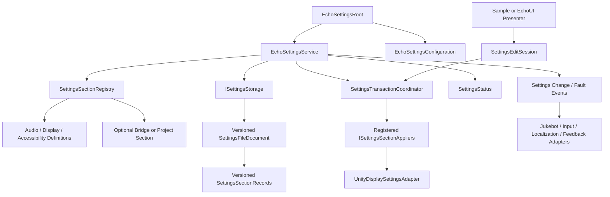

# The Accord – Global Preferences Package Specification

**Working document ID:** SFGSS-PKG-ECHOSETTINGS-001  
**Specification version:** 1.1.0
**Status:** Approved  
**Technical package name:** EchoSettings  
**Public title:** The Accord – Global Preferences
**Package ID:** `com.echodevgames.echo-settings`  
**Runtime namespace:** `EchoDevGames.EchoSettings`  
**Owner:** Jesse “Echo” Adams / EchoDevGames  
**Project boundary:** Independent solo project; not an Isekai Studios product  
**Planned repository:** `EchoDevGames/EchoSettings`
**Current Notes:** `Plan Documentation/Current Notes.md` until the package repository is created, then `Documentation~/Developer/Current Notes.md`  
**Unity baseline:** Unity 6000.3.8f1  
**Minimum public Unity version:** Unity 6000.0  
**Parent authority:** SFGSS-000 and SFGSS-001  
**Last updated:** August 4, 2026

> “Let the player establish the terms by which the game meets them.”

> **Approval rule:** This specification is approved as the authoritative package design. Runtime implementation remains intentionally deferred until the complete Foundation Wave specification pass and its cross-package consistency review are finished.

---

## Revision History

| Version | Date | Status | Summary | Approved by |
|---|---|---|---|---|
| 0.1.0 | 2026-08-03 | Proposed | Initial complete specification derived from SFGSS-000 v0.6.0, SFGSS-001 v1.1.0, First Light v1.0.0, and The Observatory v1.0.0 | Pending |
| 1.0.0 | 2026-08-03 | Approved | Approved global-preference authority, section model, transactional editing, display confirmation, storage, migration, validation, Test Lab, and bridge boundaries | Jesse “Echo” Adams |
| 1.1.0 | 2026-08-04 | Approved | Clarified Unity asset GUID versus optional runtime/export configuration IDs; Required opaque or extension-capable preservation for unknown fields inside known settings sections; Set the Editor assembly to `autoReferenced: false`. Also normalized registry metadata and evidence interpretation. | Jesse “Echo” Adams |

---

## 1. Package Identity and One-Sentence Contract

**Public title:** The Accord – Global Preferences
**Technical identifier:** EchoSettings  
**Flavor line:** Let the player establish the terms by which the game meets them.  
**Plain-language subtitle:** Versioned global preferences, safe editing and application, validation, persistence, and optional integration contracts.

**One-sentence ownership contract:**

> EchoSettings owns the project’s global preference definitions, defaults, committed and effective values, edit/apply/cancel workflow, validation, versioned persistence, migration, and safe display confirmation; it does not own settings-screen presentation, audio playback, input execution, localization content, save-slot progress, pause authority, or project-specific gameplay rules.

### 1.1 Elevator summary

The Accord provides one authoritative home for preferences that belong to the player or installation rather than to a particular save slot. It loads a versioned global settings document, merges it with project-owned defaults, validates it against current platform capabilities, exposes strongly typed sections, applies supported settings through explicit appliers, and publishes batched changes for optional consumers.

Its editing model distinguishes three states that are often blurred together in project-specific menus:

1. **Committed settings** are the last accepted authoritative values and the values intended for persistence.
2. **Effective settings** are the values currently applied to the running game or platform. During a preview, these may temporarily differ from committed settings.
3. **Draft settings** are isolated edits that can be changed, validated, reset, applied, confirmed, or canceled without mutating the authoritative state prematurely.

The package includes built-in audio-preference data, desktop display and frame-pacing preferences, and basic accessibility preferences. Display application is handled by a replaceable Unity platform adapter. Audio, UI, input, localization, feedback, and other systems remain separate authorities and connect through bridges or project adapters.

### 1.2 Why this belongs in The Sperk’s Forge

Rescuers2D identified shared settings and consistent Main, Pause, and results-menu behavior as recurring application-shell needs. Jukebot requires global audio preferences but must not become their permanent storage authority. Echo Systems Lab established the suite’s definition, runtime-state, event, and presentation separation. DeverQuest demonstrated the value of structured setup, validation, migration, repair, and documentation.

The Accord turns those recurring needs into a reusable package without importing any game’s menu hierarchy, save schema, mixer assets, input maps, quality assumptions, or art direction. It gives later Foundation packages one explicit contract to consume instead of letting each package invent its own preference file and apply/cancel behavior.

### 1.3 Verse identity boundary

| Surface | Flavor allowed? | Rule |
|---|---:|---|
| Public title | Yes | “The Accord” must be paired with “Global Preferences” on formal surfaces. |
| Setup guidance/tooltips | Yes | Flavor may introduce a section, but every action and failure remains technically explicit. |
| Samples | Optional | Accord imagery and wording must be replaceable and removable. |
| Runtime API/type names | No lore-only names | Types describe settings, sections, snapshots, drafts, validation, storage, application, confirmation, and migration. |
| Project data | No required Hackulos content | The project owns menu art, labels, defaults, quality names, locale content, and gameplay-specific preferences. |

---

## 2. Problem Statement

### 2.1 Current problem

Global preferences are frequently implemented as direct UI callbacks that immediately modify audio, display, or gameplay state and write scattered keys. That shortcut creates several recurring problems:

1. Opening a settings screen can accidentally fire change sounds, apply values, or save repeatedly while controls initialize.
2. Cancel cannot reliably restore values because there is no isolated draft.
3. Display changes can leave the user with an unusable resolution or window mode when confirmation and rollback are missing.
4. Audio, input, localization, and accessibility systems each begin storing their own overlapping preference data.
5. Save-slot progress and installation-wide preferences become mixed in the same file or manager.
6. Renamed or removed settings silently break old data because schema versions and migrations are absent.
7. Optional packages cannot be removed cleanly when their settings payload is destroyed or treated as an unknown error.
8. Corrupt, newer, or unsupported settings data may be overwritten before useful recovery evidence is preserved.
9. Display, frame pacing, quality, and platform behavior are assumed to be identical across every target.
10. A menu prefab becomes the only usable API, making tests and programmer-controlled integration difficult.

### 2.2 Evidence from existing work

| Source project/package | Existing pattern or requirement | Preserve | Improve |
|---|---|---|---|
| Rescuers2D | Shared settings and consistent application-shell menus are recurring needs | One coherent player-facing preference experience | Remove project-specific menu, audio, and save coupling |
| Echo Systems Lab | Definitions, runtime authorities, events, and presentation are separated | Data-driven configuration and semantic events | Formalize committed/effective/draft state and transactions |
| DeverQuest | Safe setup, validation, migration, backup, readiness, and documentation | Product-grade authoring and recovery | Keep Editor-product state outside runtime game preferences |
| First Light | Ordered initialization and explicit startup reports | Deterministic load/apply during startup | Keep EchoSettings independently initializable |
| The Observatory | Explicit registration, structured status, privacy, and optional bridges | Actionable diagnostics without dependency | Report settings health without exposing private values |
| Jukebot | Audio playback needs global master/category values | Clear audio preference contract | Keep playback and mixer application out of EchoSettings core |
| Future EchoInput/EchoUI | Rebinding, glyphs, screens, and navigation will consume preferences | Stable optional integration seams | Prevent input or UI from becoming settings persistence authority |

### 2.3 Consequences of doing nothing

- Every game rebuilds a fragile settings manager and menu callback web.
- Apply, Cancel, Reset, and display confirmation behave differently across projects.
- Global preferences leak into save slots or project-specific static stores.
- Optional package removal deletes or corrupts unrelated preference data.
- Accessibility values exist only in UI controls instead of an authoritative model.
- Later packages cannot agree on initialization order or change-event behavior.
- Users can become trapped in an invalid display configuration.
- Support cannot distinguish defaults, loaded values, previews, and committed values.

---

## 3. Goals, Non-Goals, and Success Measures

### 3.1 Goals

- Own global preferences independently of game-save slots.
- Provide project-owned default profiles for built-in and registered settings sections.
- Provide strongly typed built-in Audio, Display, and Accessibility sections.
- Support explicit, stable section registration for optional package and project extensions.
- Load, migrate, validate, normalize, apply, commit, and persist settings through one documented lifecycle.
- Separate committed, effective, and draft values.
- Provide optimistic revision checking so stale edit sessions cannot overwrite newer accepted changes silently.
- Apply changes transactionally and roll back already-applied sections when a required step fails.
- Require confirmation for risky display changes and revert automatically on cancel, timeout, failed persistence, or lost authority.
- Use a versioned structured JSON file as the default backend.
- Preserve unknown optional-section payloads when their codec or bridge is absent.
- Recover safely from missing, corrupt, older, newer, unsupported, or partially written settings data.
- Expose section-scoped and batched change events after authoritative state transitions.
- Allow late-registered appliers to receive the current effective values without a circular startup dependency.
- Provide setup, validation, simulation, migration, and Standalone Test Lab tooling.
- Remain fully usable without First Light, The Observatory, Jukebot, EchoUI, EchoInput, EchoSave, or any other Sperk’s Forge runtime package.

### 3.2 Non-goals

- Render the production settings menu or own general UI navigation.
- Play audio, own mixer groups, or decide how a decibel curve is applied.
- Process gameplay input, own action maps, or interpret binding overrides.
- Own localization tables, translated text, fonts, or locale content.
- Store story progress, inventory, checkpoints, character state, or other save-slot data.
- Pause the game, change high-level game state, or own cursor/input-context coordination.
- Hardcode one render pipeline, quality profile, monitor topology, or console platform policy.
- Automatically infer arbitrary project fields through reflection.
- Serialize arbitrary scene objects or ScriptableObjects as preferences.
- Provide cloud synchronization, account services, telemetry, or analytics.
- Encrypt preference files or present them as secure storage for credentials.
- Guarantee that every platform supports desktop resolution, refresh-rate, window-mode, VSync, or frame-cap controls.
- Silently overwrite corrupt or newer settings files.
- Make `PlayerPrefs` the default persistence backend.

### 3.3 User outcomes

| User | Starting condition | Desired outcome |
|---|---|---|
| Novice installer | Clean Unity project | Create defaults/configuration/root and prove settings in an isolated Lab without writing code |
| Programmer | Needs global preferences | Query typed current values, open an edit session, apply safely, and receive structured results |
| UI developer | Building a settings screen | Bind controls to a draft without firing authoritative changes during initialization |
| Audio developer | Jukebot installed later | Register an applier and immediately receive the current audio preferences |
| Input developer | EchoInput optional | Store a versioned input-owned payload through a bridge without giving EchoSettings input authority |
| Designer | Tuning defaults | Edit project-owned defaults and validate ranges/capabilities before Play Mode |
| Tester | Reproducing persistence issue | Simulate missing, corrupt, old, newer, or write-failure cases and inspect structured status |
| Maintainer | Upgrading package | Migrate document and section schemas while preserving unknown payloads and backups |

### 3.4 Measurable success criteria

- Clean supported project installation produces zero compile errors.
- The core feature runs with no other Sperk’s Forge runtime package installed.
- The Standalone Test Lab proves load, edit, apply, cancel, reset, display confirmation, timeout rollback, save, reload, corruption recovery, duplicate rejection, and late applier registration.
- Duplicate roots perform no load, apply, file, event, timer, or registration side effects.
- Opening and populating the sample settings view does not change effective or committed settings.
- A canceled edit leaves committed and persisted values unchanged.
- A failed required applier or storage write restores the previous effective and committed state.
- An unconfirmed risky display change reverts automatically using unscaled time.
- Unknown section payloads survive load and save while their owner is absent.
- A stale edit session returns a revision conflict rather than overwriting newer committed settings.
- Missing configuration or invalid defaults produce actionable status and safe fallback behavior.
- Idle runtime produces no recurring managed allocation after initialization when no confirmation timer is active.
- Samples can be removed without breaking runtime assemblies.
- Removing an optional bridge leaves the package compiling and preserves its stored payload.

---

## 4. Users and Primary Use Cases

### 4.1 Intended users

- Solo and small-team Unity developers.
- Gameplay, UI, audio, accessibility, input, and tools programmers.
- Designers configuring project defaults.
- QA testers validating settings and platform behavior.
- Maintainers migrating old versions or integrating packages into existing games.

### 4.2 Primary use cases

| ID | Use case | Actor | Preconditions | Expected result | Release phase |
|---|---|---|---|---|---|
| UC-001 | Initialize from defaults | Developer | No settings file exists | Defaults become committed/effective and a confirmed document can be created safely | MVP |
| UC-002 | Load existing preferences | Runtime | Valid supported document exists | Data migrates/validates/applies and status records the result | MVP |
| UC-003 | Edit without side effects | UI/presenter | Service ready | Draft changes remain isolated until Apply | MVP |
| UC-004 | Apply ordinary changes | Player | Valid current-revision draft | Required appliers succeed, storage commits atomically, one change set is published | MVP |
| UC-005 | Cancel edits | Player | Draft differs | Draft is discarded; authoritative values remain unchanged | MVP |
| UC-006 | Preview display changes | Player | Risky display values selected | Values apply provisionally and return a confirmation handle | MVP |
| UC-007 | Confirm display changes | Player | Preview active | Values become committed and persist | MVP |
| UC-008 | Timeout/cancel display preview | Player/runtime | Preview active | Previous platform/effective state is restored | MVP |
| UC-009 | Reset one category | Player | Service ready | Section draft receives project defaults; normal apply rules still govern commit | MVP |
| UC-010 | Reset all | Player | Service ready | All registered sections return to defaults through a transaction | MVP |
| UC-011 | Handle corrupt file | Runtime/tester | Primary file unreadable | Valid backup loads when possible; otherwise defaults load without deleting evidence | MVP |
| UC-012 | Migrate older document | Runtime/maintainer | Supported old version | Migration completes before application and a new version persists only after success | MVP |
| UC-013 | Reject newer document | Runtime | File schema is newer than package | Original remains untouched; safe defaults/current platform state are used with read-only recovery status | MVP |
| UC-014 | Register optional section | Bridge/project | Service exists | Stable section definition/codec registers explicitly and loads preserved payload/default | MVP extension seam |
| UC-015 | Register late applier | Bridge | Settings already initialized | Applier receives current effective section and future updates | MVP extension seam |
| UC-016 | Inspect health | Developer | Runtime active | Structured status explains state, revision, file health, pending confirmation, and issues without exposing values | MVP |
| UC-017 | Use profile layers | Project | Named player profiles required | Global defaults plus profile overrides merge predictably | Later |
| UC-018 | Import/export | Support/developer | Explicit tooling invoked | Versioned filtered package is previewed before write | Later |

### 4.3 Explicitly unsupported use cases

- Using EchoSettings as a password, token, credential, or secret store.
- Saving mutable game-world or character progress.
- Treating a settings screen prefab as the runtime authority.
- Letting two roots write the same document concurrently.
- Applying arbitrary reflected fields or calling unknown setters by string.
- Assuming unsupported platform display controls succeeded because no exception occurred.
- Applying a risky display change permanently without confirmation policy.
- Using a missing optional bridge as a reason to delete its payload.
- Automatically uploading settings files or support data.
- Writing directly into immutable package source.

---

## 5. Authority and Ownership Boundaries

### 5.1 The package owns

- The global-settings runtime authority and duplicate-safe root.
- Project-owned global default profiles and core configuration.
- Stable section identity, registration, defaults, serialization, validation, and migration contracts.
- Built-in Audio, Display, and Accessibility preference data.
- Committed settings revision and authoritative snapshot.
- Effective runtime settings, including temporary previews.
- Isolated edit sessions and draft values.
- Apply planning, validation, ordering, provisional application, confirmation, commit, cancellation, and rollback coordination.
- Default structured JSON persistence, backup, temporary-write, replacement, recovery, and document migration policy.
- Preservation of unknown section payloads.
- Built-in Unity display/quality/frame-pacing capability adapter and its availability reporting.
- Settings-specific status, results, diagnostic codes, and events.
- Settings setup, validation, migration, simulation, and Test Lab tooling.

### 5.2 The package does not own

- Production menu screens, widgets, navigation, focus, styling, prompts, or notifications.
- Music, SFX, ambience, voice, UI audio playback, mixer assets, or decibel conversion.
- Input action execution, input contexts, active-device state, glyphs, or binding meaning.
- Locale tables, localized assets, language download, formatting, or fonts.
- Camera shake, flashes, haptics, motion, or feedback execution.
- Save slots, autosaves, story progress, inventory, checkpoints, or game-state serialization.
- High-level game state, pause, time scale, cursor, or scene transitions.
- Project-specific gameplay options unless a project-owned extension section registers them.
- Cloud sync, account identity, analytics, telemetry, or secure secrets.

### 5.3 Neighboring authorities

| Concern | Authoritative owner | How EchoSettings interacts |
|---|---|---|
| Initial startup ordering | EchoLaunch | Optional startup-step bridge calls initialization and reports result |
| Runtime diagnostics | EchoDiagnostics | Optional bridge maps SettingsStatus/results without exposing values |
| Audio playback/mix | Jukebot | Audio settings bridge registers an applier and maps preference values to Jukebot |
| Settings screens and prompts | EchoUI | UI bridge/presenter creates drafts, submits requests, and displays confirmation/results |
| Input execution/rebinding meaning | EchoInput | Bridge owns an input section codec/applier; EchoSettings persists the opaque versioned payload |
| Locale content/application | EchoLocalization | Later bridge owns locale section meaning and applies selection |
| Reduced-motion/flash/shake behavior | EchoFeedback/project systems | Consumers observe accessibility preferences through a bridge or project adapter |
| High-level pause/input coordination | EchoGameState | No direct ownership transfer; UI/game code decides when settings UI changes state |
| Game-save files/slots | EchoSave | No dependency; global settings remain in EchoSettings storage |
| Starter composition | EchoGameStarter | Editor composer creates configuration/defaults/root and reports selected bridges |
| Project gameplay preferences | Project code | Project registers an explicit stable section and optional applier |

### 5.4 Boundary tests

A proposed feature belongs in EchoSettings only when all of the following are true:

1. The value is global or installation/profile-wide rather than save-slot progress.
2. EchoSettings can store and validate it without owning the behavior it influences.
3. The behavior can be applied by a built-in platform adapter, an optional bridge, or project adapter.
4. The feature remains usable without a production settings screen.
5. The feature does not require reflection over arbitrary game objects.
6. The setting can receive a stable section ID, schema version, defaults, validation, and migration policy.
7. Removing the consuming package does not make the stored document unreadable or force data deletion.

If these tests fail, the feature belongs to another package, project code, an optional bridge, or a later design record.

---

## 6. Independence Contract

Independence is a release gate, not a preference.

### 6.1 Standalone guarantees

EchoSettings must:

- Compile with only declared Unity/platform dependencies.
- Initialize without First Light.
- Store, load, edit, validate, apply built-in display values, and expose audio/accessibility values without Jukebot, EchoUI, EchoInput, EchoSave, or The Observatory.
- Avoid direct references to project assemblies.
- Keep configured defaults and generated project assets outside immutable package source.
- Expose a direct prefab/setup path and programmer API.
- Expose storage, clock, platform-capability, display-application, section, and applier test seams.
- Fail visibly and safely when optional collaborators are absent.
- Preserve unknown optional payloads rather than treating absence as corruption.

### 6.2 Independence proof matrix

| Condition | Expected behavior | Test evidence |
|---|---|---|
| Installed alone | Root, built-in sections, JSON storage, display adapter, events, and Lab function | Clean-project install and Lab checklist |
| Enter Standalone Test Lab directly | Lab root initializes once and exposes all MVP flows | LAB-001 through LAB-024 |
| First Light absent | Root self-initializes according to configuration | PlayMode test |
| EchoUI absent | API and sample presenter work; core creates no general UI | Assembly and Lab test |
| Jukebot absent | Audio values persist and report no registered applier without failure | PlayMode test |
| EchoInput absent | No input section is required; unknown preserved payload survives | Removal/preservation test |
| Observatory absent | Structured status/API/logs remain available | Clean-project test |
| EchoSave absent | Global settings load/save normally | Clean-project test |
| Optional bridge removed | Core compiles, payload remains, applier unregisters safely | Removal test |
| Duplicate root present | Duplicate rejects itself before file, event, timer, or apply side effects | Duplicate lifecycle test |
| Required configuration missing | Root enters failed-safe status; no file is overwritten; defaults may be supplied only by explicit fallback policy | Failure test |
| Primary file corrupt | Backup/default recovery occurs without deleting original evidence | Recovery test |
| Newer document present | Original remains untouched; safe fallback and read-only recovery status are reported | Version test |
| Sample content deleted | Runtime and Editor package assemblies remain valid | Sample removal test |

### 6.3 Allowed dependencies

| Dependency | Type | Required? | Minimum version | Reason | Removal behavior |
|---|---|---:|---|---|---|
| Unity Core modules | Platform | Yes | Unity 6000.0 | MonoBehaviour, ScriptableObject, Awaitable, Application path, Screen/Quality APIs, serialization support | Package cannot run without Unity |
| `UnityEngine.UI` | Sample-only | No | Project baseline | Standalone Lab/sample presenter | Removing sample/UI dependency does not affect runtime core |
| TextMeshPro | Sample-only | No | Project baseline | Readable Lab labels/status | Removing sample does not affect runtime core |
| Unity Test Framework | Test-only | No at runtime | Compatible with baseline | EditMode/PlayMode tests | Runtime unaffected |
| System.IO/BCL | Platform | Yes | Unity baseline | Default file storage and atomic-write strategy | Storage adapter can be replaced |

The runtime core must not require uGUI, TextMeshPro, Input System, Localization, Addressables, Jukebot, EchoUI, EchoSave, EchoDiagnostics, or any render-pipeline package.

### 6.4 Forbidden dependencies

- Project-specific code or assemblies.
- Another Sperk’s Forge runtime package in the core assembly.
- Samples, test assets, or Editor assemblies at runtime.
- A mandatory `Resources` path, scene name, build index, tag, layer, input map, or mixer asset.
- Direct file writes outside the configured safe storage root by the default backend.
- Reflection-based discovery of settings fields or optional packages.
- Shared mutable ScriptableObject state.
- `PlayerPrefs` as the default backend.
- Unlicensed or non-redistributable sample content.

---

## 7. Capability Scope

### 7.1 Capability matrix

| ID | Capability | Description | Status | MVP? | Surface | Notes |
|---|---|---|---|---:|---|---|
| CAP-001 | Duplicate-safe authority | One root claims settings authority before side effects | Approved | Yes | Runtime | Application-session lifetime |
| CAP-002 | Project configuration | Storage, defaults, startup, confirmation, fallback, and validation policy | Approved | Yes | Runtime/Data | Project-owned asset |
| CAP-003 | Typed core sections | Audio, Display, Accessibility data and typed keys | Approved | Yes | Runtime/Data | No UI assumptions |
| CAP-004 | Section registry | Explicit stable-ID definition/codec registration | Approved | Yes | Runtime | No reflection |
| CAP-005 | Unknown payload preservation | Unregistered section records survive round-trip | Approved | Yes | Runtime/Persistence | Critical for optional removal |
| CAP-006 | Defaults merge | Missing fields/sections receive configured defaults | Approved | Yes | Runtime | Does not mutate defaults asset |
| CAP-007 | Committed snapshot | Last accepted authoritative global values | Approved | Yes | Runtime | Revisioned/immutable to callers |
| CAP-008 | Effective snapshot | Currently applied values, including provisional preview | Approved | Yes | Runtime | May differ during confirmation |
| CAP-009 | Edit sessions | Isolated working copy based on a committed revision | Approved | Yes | Runtime | Multiple read/draft sessions allowed |
| CAP-010 | Optimistic conflict detection | Stale drafts cannot overwrite newer commits silently | Approved | Yes | Runtime | Return conflict result |
| CAP-011 | Validation | Field, section, cross-section, document, and platform checks | Approved | Yes | Runtime/Editor | Issues are structured |
| CAP-012 | Apply plan | Deterministic change set, applier order, risks, and confirmation need | Approved | Yes | Runtime | Can preview plan before execution |
| CAP-013 | Transactional apply | Required appliers apply provisionally; failures trigger reverse rollback | Approved | Yes | Runtime | Optional appliers may warn |
| CAP-014 | Display confirmation | Risky display changes require confirm or automatic rollback | Approved | Yes | Runtime | Uses unscaled monotonic clock |
| CAP-015 | Atomic commit | Persist only after successful application/confirmation | Approved | Yes | Runtime/Persistence | Failed save rolls runtime back |
| CAP-016 | Reset by section/all | Draft receives configured defaults, then normal apply workflow | Approved | Yes | Runtime | No direct authoritative mutation |
| CAP-017 | Versioned document | Top-level schema/revision plus versioned section records | Approved | Yes | Runtime/Persistence | Structured JSON default |
| CAP-018 | Migration | Ordered top-level and per-section migrations | Approved | Yes | Runtime/Editor | Backup before destructive replacement |
| CAP-019 | Backup/recovery | Temp, confirmed, backup, quarantine, and recovery policy | Approved | Yes | Runtime/Editor | Platform capability aware |
| CAP-020 | Async storage | Public operations use fresh Unity `Awaitable<T>` instances | Approved | Yes | Runtime | File work may switch threads safely |
| CAP-021 | Batched events | Load, preview, commit, revert, reset, fault, and section changes | Approved | Yes | Runtime | After state transitions |
| CAP-022 | Late applier registration | Newly available consumer receives current effective values | Approved | Yes | Runtime/Integration seam | Avoids startup cycles |
| CAP-023 | Structured status | Initialization, revision, storage health, pending confirmation, issues | Approved | Yes | Runtime | Values redacted by default |
| CAP-024 | Setup/repair | Create-only setup, preview, validation, explicit repair/migration | Approved | Yes | Editor | Repeatable/non-destructive |
| CAP-025 | Standalone Test Lab | Complete isolated user-visible settings workflow | Approved | Yes | Sample | No other Echo package |
| CAP-026 | Global named profiles | Global base plus selected profile override | Deferred | No | Runtime/Persistence | Design after core proof |
| CAP-027 | Import/export | Explicit filtered preview/merge/replace workflow | Deferred | No | Editor/Runtime | Support and portability |
| CAP-028 | Cloud/provider sync | Conflict-aware remote synchronization | Deferred | No | Provider adapter | Separate package/provider research |
| CAP-029 | Locale section | Locale preference and application bridge | Deferred | No | Bridge | EchoLocalization authority |
| CAP-030 | Input/rebinding section | Input-owned versioned payload through bridge | Deferred to EchoInput spec | No | Bridge | Meaning owned by EchoInput |
| CAP-031 | Monitor selection | Move/select main display | Deferred | No | Platform adapter | Cross-platform validation required |
| CAP-032 | HDR/dynamic resolution | Advanced graphics preferences | Deferred | No | Project/provider adapter | Pipeline/platform-specific |
| CAP-033 | Secure/encrypted storage | Credentials/secrets | Rejected | No | N/A | Outside preference scope |

### 7.2 MVP capability set

The smallest complete first release contains:

- One duplicate-safe persistent `EchoSettingsRoot`.
- One project-owned `EchoSettingsConfiguration` and `SettingsDefaultsProfile`.
- Built-in `AudioPreferences`, `DisplayPreferences`, and `AccessibilityPreferences` sections.
- Explicit section and applier registries with stable IDs.
- Versioned sectioned JSON document under the default persistent-data storage root.
- Missing-file defaults, supported migration, backup recovery, corruption quarantine, newer-version protection, and unknown payload preservation.
- Immutable committed/effective snapshots and revisioned edit sessions.
- Validation, apply-plan preview, transactional application, reverse rollback, persistence, reset, and batched events.
- Built-in desktop display/quality/frame-pacing adapter with capability reporting.
- Risky display confirmation and automatic unscaled timeout rollback.
- Structured status and diagnostic codes.
- Create/validate/repair/simulate Editor tools.
- One independent Standalone Test Lab and automated critical lifecycle/persistence tests.

### 7.3 Later capability set

Approved later expansion may include:

- Named global user profiles and profile-selection policy.
- Import/export with field-level preview and merge policies.
- Additional built-in preference sections only after ownership review.
- UI Toolkit sample adapter.
- Cloud/platform preference synchronization adapters.
- Platform-specific display adapters.
- Locale and input bridges after owning package specifications are approved.
- Command-line and automated-test overrides.
- Optional developer presets for benchmark, accessibility, and compatibility testing.

### 7.4 Deferred and rejected ideas

| Idea | Disposition | Reason | Revisit trigger |
|---|---|---|---|
| Save settings inside EchoSave slots | Rejected | Global preferences must survive independently of slots | Only a separate game-specific per-save option may use EchoSave |
| Use PlayerPrefs as default | Rejected | Weak document/schema/backup/unknown-section workflow and synchronous save concerns | May become a small optional backend for constrained platforms after tests |
| One reflection-driven universal setting dictionary | Rejected | Hides ownership/type/migration and risks arbitrary project coupling | Never unless a later ADR overturns typed sections |
| Production settings menu in core | Rejected | EchoUI/project owns presentation | Provide bridge/sample only |
| Automatically delete unknown sections | Rejected | Breaks clean optional-package removal | Never |
| Apply every draft change immediately | Rejected | Breaks cancel, validation, transaction, and silent UI binding | Preview remains explicit |
| Encrypt settings by default | Rejected | Preferences are not secure secrets; false security claim | Separate secure-storage concern |
| Profile layers | Deferred | Useful but not required for first standalone proof | After MVP adoption validates base document model |
| Monitor selection | Deferred | Platform behavior requires focused validation | After Windows/macOS/Linux adapter tests |
| HDR and render-pipeline options | Deferred | Pipeline/project-specific and easy to overclaim | Provider adapter/specification |
| Automatic settings upload | Rejected | Privacy/network scope | Separate explicit provider product only |

---

## 8. Architecture Overview

### 8.1 Design model

| Layer | Contains | Must not contain |
|---|---|---|
| Definition/configuration | `EchoSettingsConfiguration`, `SettingsDefaultsProfile`, section descriptors, policies, default values | Active draft, loaded document, current resolution, file handles, timers |
| Runtime state/behavior | Root, service, registry, storage, migration, snapshots, drafts, transactions, confirmation, adapters, status | Editor APIs, menu widgets, audio playback, input processing |
| Presentation/feedback | Sample settings view, status presenter, EchoUI bridge/presenters | Authoritative settings state or file writes |

### 8.2 Component topology



The root owns one service instance. The service owns the registry, current state, storage coordination, transactions, and status. Registered sections describe data and validation. Registered appliers perform behavior outside the core data model. Presenters edit drafts and submit requests; they never write files or mutate committed state directly.

### 8.3 Authoritative root

| Question | Decision |
|---|---|
| Persistent root required? | Yes for the default runtime setup |
| Root type | `EchoSettingsRoot` |
| Lifetime | Application session; `DontDestroyOnLoad` when configured |
| Duplicate behavior | Reject duplicate before loading, subscribing, registering built-ins, applying, starting timers, or writing |
| Initialization trigger | Explicit `InitializeAsync`; optional self-initialize for standalone; First Light bridge may invoke it |
| Shutdown | Cancel active operation, revert provisional preview, flush no unconfirmed state, dispose registrations/storage, clear static access |
| Direct-scene behavior | Optional development initializer creates the configured root only when absent |
| Test injection | Constructor/factory seams for storage, clock, platform capabilities, display adapter, codecs, and appliers |
| Convenience access | Documented current-instance access may exist, but interfaces/service references remain usable for tests and adapters |

### 8.4 Authoritative state model

The service maintains three separate state spaces:

| State | Meaning | Can be persisted? | Can differ from platform? |
|---|---|---:|---:|
| Defaults | Project-authored fallback values | Asset, not runtime file | Yes until applied |
| Committed | Last accepted authoritative settings revision | Yes | Should match effective except during recovery/fault |
| Effective | Values currently applied or exposed to consumers | No separate permanent file | Yes during provisional preview or partial recovery |
| Draft | Edit-session working copy | No | Yes; has no authority |
| Preserved unknown records | Serialized optional sections whose definition is absent | Yes, verbatim | Not applied while unknown |

Callers receive immutable snapshots. Mutable working copies exist only inside an edit session or transaction coordinator.

### 8.5 Section registration and document model

Each section has:

- A stable `SettingsSectionId` using a reverse-domain or package-qualified pattern.
- A current section schema version.
- A strongly typed section key exposed by its owner.
- A default-value factory or project default source.
- A codec that converts between typed data and a serialized payload.
- Validation and migration functions.
- Optional apply behavior registered separately.

The default file document uses a serializable list rather than relying on runtime dictionary or polymorphic serialization:

```text
SettingsFileDocument
├── documentSchemaVersion
├── committedRevision
├── savedAtUtc
├── packageVersion
└── sectionRecords[]
    ├── sectionId
    ├── sectionSchemaVersion
    ├── payloadFormat
    └── payload
```

When a section definition is absent, its record remains opaque and is preserved on the next successful save. When the definition registers later, the service decodes, migrates, validates, merges defaults, and applies it.

For a **known section**, the registered codec must also preserve unrecognized members through either an opaque raw section envelope or an extension-data-capable serializer. A `JsonUtility` decode/re-encode alone is not sufficient evidence of unknown-field preservation. Unsupported newer known-section payloads remain protected and are not destructively rewritten.

### 8.6 Edit and apply transaction

1. Caller begins an edit session from committed revision `R`.
2. The session clones registered section values into a draft.
3. UI or code modifies draft values without changing authoritative state.
4. The caller requests validation or an apply plan.
5. The service rejects the request if the session revision is stale.
6. The coordinator computes changed sections, ordering, required/optional appliers, unsupported fields, restart requirements, and whether confirmation is required.
7. Required appliers capture rollback state and apply provisionally in deterministic order.
8. Optional applier failures become warnings unless the section contract marks them required.
9. If any required step fails, successful steps revert in reverse order.
10. If no risky confirmation is required, the service writes the new confirmed document atomically.
11. If a risky display change is present, the service enters `AwaitingConfirmation`, exposes a single-use confirmation handle, and starts an unscaled timeout.
12. Confirm writes the document and promotes effective values to committed revision `R+1`.
13. Cancel, timeout, authority loss, quit, required-applier failure, or storage failure reverts the provisional state.
14. One authoritative change set is published only after commit; preview/revert events use separate event types.

A storage failure after runtime application is not treated as a successful commit. The coordinator attempts to restore the prior effective state so the running session and next launch do not disagree silently.

### 8.7 Initialization lifecycle

1. **Claim authority** before side effects.
2. **Validate configuration/default assets** and build the core registry.
3. **Initialize storage** and resolve safe file paths.
4. **Read candidate files**: confirmed, temporary, backup, or recovery source according to policy.
5. **Parse document** with size and schema guards.
6. **Migrate** supported top-level and registered section versions.
7. **Merge defaults** for missing sections/fields.
8. **Validate** values and current platform capabilities.
9. **Select safe effective values** without overwriting protected evidence.
10. **Apply** built-in required sections and available optional appliers.
11. **Publish ready/degraded/failed status** and initialization result.
12. **Accept late registrations** and apply current values to them.

### 8.8 Failure model

| Failure | Detection point | User-visible/result behavior | Runtime fallback | Code |
|---|---|---|---|---|
| Duplicate root | Authority claim | Duplicate rejected | Existing authority continues; zero duplicate side effects | ESET-001 |
| Missing configuration | Preflight | Blocking configuration result | No file write; explicit fallback only if configured | ESET-002 |
| Missing defaults | Preflight | Blocking or degraded result | Use code-safe defaults only when allowed | ESET-003 |
| Invalid default value | Validation | Structured issue with field/section | Clamp only safe numeric fields; otherwise fail section | ESET-004 |
| Storage path unavailable | Storage init | Error/degraded status | In-memory session only; no false persistence claim | ESET-005 |
| Primary file missing | Load | Informational first-run result | Merge defaults | ESET-006 |
| Corrupt primary file | Parse | Warning/error, preserve/quarantine evidence | Try valid backup, else defaults | ESET-007 |
| Newer document schema | Version check | Blocking persistence warning | Do not overwrite; safe in-memory defaults/current state | ESET-008 |
| Unsupported old schema | Migration | Error and recovery options | Valid backup/defaults; original preserved | ESET-009 |
| Section migration failure | Migration | Section-specific error | Preserve original record; default/degraded section | ESET-010 |
| Unknown section | Registry | Informational status | Preserve opaque record; do not apply | ESET-011 |
| Stale edit revision | Apply preflight | Conflict result | No changes | ESET-012 |
| Draft validation failure | Apply preflight | Field/section issues | No changes | ESET-013 |
| Required applier missing | Apply plan | Error | No commit; optional data-only sections exempt | ESET-014 |
| Required applier fails | Provisional apply | Error plus rollback result | Revert prior applied sections | ESET-015 |
| Rollback fails | Revert | Critical diagnostic | Apply safest known fallback; mark inconsistent/degraded | ESET-016 |
| Confirmation timeout | Confirmation | Reverted result | Restore prior platform/effective state | ESET-017 |
| Confirmation handle reused/expired | Confirmation | Rejected request | Current transaction state unchanged | ESET-018 |
| Atomic write fails | Commit | Error | Roll back provisional runtime state; preserve old confirmed file | ESET-019 |
| Backup recovery fails | Recovery | Error | Defaults/in-memory degraded mode | ESET-020 |
| Platform setting unsupported | Capability validation | Unavailable/warning | Preserve preference; skip unsupported application | ESET-021 |
| Late applier rejects current state | Registration | Warning/error for that applier | Settings service remains ready | ESET-022 |
| Active transaction during shutdown | Shutdown | Cancellation/revert report | Revert provisional state; do not persist unconfirmed data | ESET-023 |

### 8.9 Unity integration basis

The initial implementation uses Unity’s `Awaitable<T>` for public asynchronous operations and creates a fresh awaitable per call. File parsing and writes may switch to a background thread, then return to Unity’s main thread before calling Unity APIs. Unity documents `Awaitable.BackgroundThreadAsync` and `Awaitable.MainThreadAsync` for those transitions and notes that an `Awaitable` instance must not be awaited repeatedly.

The default file backend stores data beneath `Application.persistentDataPath`, which Unity documents as the per-application location intended to persist between runs. The backend always combines a full sanitized path and does not assume relative file paths resolve there.

Desktop display application is isolated behind `IDisplaySettingsAdapter`. Unity’s `Screen.SetResolution`, `QualitySettings`, and `Application.targetFrameRate` APIs have platform-specific behavior. The adapter must report capabilities and effective results rather than promising uniform behavior. VSync and target frame rate are modeled together because Unity documents that their interaction differs by platform and VSync can take precedence.

The default document/section serialization may use Unity-supported structured JSON for serializable DTOs. The format is wrapped behind storage and codec interfaces so serialization can change in a major version or optional backend without changing settings authority.

Reference material for implementation checkpoints:

- [Unity Awaitable API](https://docs.unity3d.com/6000.0/Documentation/ScriptReference/Awaitable.html)
- [Unity Awaitable continuation/thread guidance](https://docs.unity3d.com/6000.0/Documentation/Manual/async-awaitable-continuations.html)
- [Application.persistentDataPath](https://docs.unity3d.com/6000.0/Documentation/ScriptReference/Application-persistentDataPath.html)
- [Screen.SetResolution](https://docs.unity3d.com/6000.0/Documentation/ScriptReference/Screen.SetResolution.html)
- [QualitySettings.vSyncCount](https://docs.unity3d.com/6000.0/Documentation/ScriptReference/QualitySettings-vSyncCount.html)
- [Application.targetFrameRate](https://docs.unity3d.com/6000.0/Documentation/ScriptReference/Application-targetFrameRate.html)
- [Unity JSON serialization](https://docs.unity3d.com/6000.0/Documentation/Manual/json-serialization.html)

---

## 9. Runtime Data and State Model

### 9.1 Definitions and configuration assets

| Type | Purpose | Stable ID? | Mutable at runtime? | Project-owned instance? |
|---|---|---:|---:|---:|
| `EchoSettingsConfiguration` | Root startup, storage, fallback, confirmation, path, and validation policy | Unity asset GUID for Editor identity; optional `ConfigurationId` only when exported/runtime-addressed | No | Yes |
| `SettingsDefaultsProfile` | Default built-in section values and registered default references | Unity asset GUID for Editor identity; optional `DefaultsProfileId` only when exported/runtime-addressed | No | Yes |
| `AudioPreferences` | Global audio category values/mutes/dynamic range | Section ID | Draft copies only | Embedded/default/project data |
| `DisplayPreferences` | Window, resolution, quality, VSync, frame-cap preferences | Section ID | Draft copies only | Embedded/default/project data |
| `AccessibilityPreferences` | Basic subtitle, motion, shake, flash, contrast, interaction, and text-speed preferences | Section ID | Draft copies only | Embedded/default/project data |
| `SettingsSectionDescriptor` | Display metadata, ownership, version, application requirements | Section ID | No | Package/bridge/project |
| `SettingsStoragePolicy` | File name, backup, max size, recovery, write behavior | Configuration | No | Yes |
| `DisplayConfirmationPolicy` | Which changes are risky, timeout, and fallback behavior | Configuration | No | Yes |

### 9.2 Built-in section contracts

#### Audio section

**Stable section ID:** `com.echodevgames.echo-settings.audio`  
**Owner:** EchoSettings for preference data; playback application remains external.

MVP fields:

- Master, Music, SFX, Ambience, Voice, and UI volume normalized from `0.0` to `1.0`.
- Master and per-category mute flags.
- Dynamic-range preference: `Wide`, `Standard`, or `Night`.

The section does not contain AudioMixer references, clips, buses, snapshots, decibel curves, or active playback state. A Jukebot bridge maps values to Jukebot configuration and mixer behavior.

#### Display section

**Stable section ID:** `com.echodevgames.echo-settings.display`  
**Owner:** EchoSettings for preferences and built-in platform application where supported.

MVP fields:

- Window mode using a neutral enum mapped by the platform adapter.
- Width and height.
- Preferred refresh rate represented without depending on display-label text.
- Quality level name plus fallback index.
- VSync count/policy.
- Target frame-rate limit with explicit `PlatformDefault` and `Uncapped` representations.

Monitor selection, HDR, dynamic resolution, render scale, anti-aliasing, upscaler selection, and pipeline-specific options are not part of the MVP.

#### Accessibility section

**Stable section ID:** `com.echodevgames.echo-settings.accessibility`  
**Owner:** EchoSettings for preference data; each consuming authority applies its own behavior.

MVP fields:

- Subtitles enabled.
- Reduced motion enabled.
- Screen-shake scale from `0.0` to `1.0`.
- Flash-intensity scale from `0.0` to `1.0`.
- High-contrast preference.
- Text-speed multiplier within configured safe bounds.
- Interaction hold behavior: `ProjectDefault`, `PreferHold`, or `PreferToggle`.

The section does not define subtitle layout, camera implementation, VFX, UI theme, input action behavior, or dialogue typing logic.

### 9.3 Runtime state

| State object | Owner | Lifetime | Reset rule | Serialization rule |
|---|---|---|---|---|
| `SettingsSnapshot` committed | Service | Until next commit/shutdown | Replaced atomically | Encoded to document |
| `SettingsSnapshot` effective | Service | Runtime | Recomputed on apply/revert | Not separately persisted |
| `SettingsEditSession` | Caller/service | Until dispose/apply/cancel | Disposable | Never persisted |
| `SettingsApplyTransaction` | Coordinator | One operation | Ends after commit/revert | Never persisted |
| `SettingsConfirmationState` | Coordinator | Until confirm/cancel/timeout | Single active confirmation | Never persisted |
| `SettingsFileDocument` | Storage | File operation | New revision on commit | Top-level persistence DTO |
| `UnknownSectionRecord` | Service/storage | Across loads/commits | Removed only by explicit migration/owner action | Preserved verbatim |
| `SettingsStatus` | Service | Application session | Updated on meaningful transitions | Optional diagnostic snapshot only |
| `SettingsRegistrationHandle` | Registry | Registration lifetime | Dispose unregisters | Never persisted |

### 9.4 Stable identifiers

- Core section IDs are immutable package-qualified strings.
- Project/bridge IDs should use `<reverse-domain>.<package-or-project>.<section>`.
- Empty, whitespace, malformed, or duplicate IDs are rejected before registration.
- A display label may change without changing the stable ID.
- Released ID changes require an alias or migration map.
- File/document schema versions and section schema versions are independent.
- Registration order is not identity.
- Quality level names are project-owned labels and are not used as section identity.

### 9.5 ScriptableObject safety

Configuration and defaults assets are immutable runtime inputs. The package must not write loaded values, current volume, active resolution, draft changes, file state, or confirmation timers back into those assets. Runtime copies protect Editor assets from Play Mode contamination and permit multiple test instances with injected configuration.

### 9.6 Serialization and migration

- The document declares a top-level schema version and committed revision.
- Each section record declares its own schema version and payload format.
- Supported older versions migrate in ordered, tested steps.
- Migration operates on copies and does not replace the confirmed file until the full initialization/apply/commit path succeeds.
- A pre-migration backup is retained according to policy.
- Unknown records are preserved byte-for-byte or semantically equivalent when the storage format requires normalization.
- Newer top-level schemas enter protected recovery mode and are never overwritten automatically.
- Newer individual section schemas remain preserved and unavailable unless the section owner explicitly supports forward compatibility.
- Downgrade is not promised.
- Migrations cannot depend on scene objects or production UI.

---

## 10. Public Runtime API

Names below define the approved responsibility and shape. Exact signatures may receive non-breaking refinement during M1/M2, but any ownership or semantic change requires specification/ADR reconciliation first.

### 10.1 Public types

| Type | Kind | Responsibility | Construction/ownership |
|---|---|---|---|
| `EchoSettingsRoot` | `MonoBehaviour` | Claims authority, owns lifecycle/service, optional persistence across scenes | Setup prefab/project scene |
| `IEchoSettingsService` | Interface | Programmer-facing query/edit/apply/status contract | Implemented by service |
| `EchoSettingsService` | Class | Authoritative settings state and coordination | Owned by root/injected in tests |
| `EchoSettingsConfiguration` | ScriptableObject | Startup, storage, validation, confirmation, fallback policy | Project asset |
| `SettingsDefaultsProfile` | ScriptableObject | Project defaults for built-in/registered sections | Project asset |
| `SettingsSectionId` | Value type | Validated stable section identity | Section owner |
| `SettingsSectionKey<T>` | Typed value | Type-safe lookup for one section | Core/bridge/project static key |
| `SettingsSectionDescriptor` | Record/class | Section metadata, version, ownership, apply requirement | Registered definition |
| `ISettingsSectionDefinition` | Interface | Defaults, codec, migration, validation, type contract | Core/bridge/project |
| `ISettingsSectionApplier` | Interface | Applies/reverts one or more owned sections | Core/bridge/project |
| `SettingsRegistrationHandle` | Disposable struct/class | Explicit registration lifetime | Registry returns |
| `SettingsSnapshot` | Immutable class | Committed/effective typed section view and revision | Service |
| `SettingsEditSession` | Disposable class | Revisioned draft and validation/apply entry point | Service returns |
| `SettingsApplyPlan` | Immutable record | Changes, order, warnings, unsupported/restart/confirm flags | Coordinator |
| `SettingsApplyRequest` | Record | Draft, expected revision, save/confirm policy, reason | Caller |
| `SettingsApplyResult` | Record | Success/failure, issues, revision, changes, confirmation | Coordinator |
| `SettingsConfirmationHandle` | Single-use handle | Confirms or cancels one provisional transaction | Coordinator |
| `SettingsConfirmationResult` | Record | Confirmed/reverted/expired/failure outcome | Coordinator |
| `SettingsChangeSet` | Immutable record | Batched section/field-level authoritative changes | Service event |
| `SettingsValidationIssue` | Record | Code, severity, section/field, message, remedy | Validators |
| `SettingsInitializationResult` | Record | Ready/degraded/failed load/apply result | Service |
| `SettingsStatus` | Immutable record | Authority, state, revision, storage, migration, confirmation, issue summary | Service |
| `ISettingsStorage` | Interface | Async read/write/backup/recovery contract | Default JSON or injected backend |
| `SettingsFileDocument` | Serializable DTO | Top-level persisted document | Storage |
| `SettingsSectionRecord` | Serializable DTO | Versioned section payload | Storage/codec |
| `ISettingsClock` | Interface | Unscaled monotonic time/timeout test seam | Runtime/test |
| `IDisplaySettingsAdapter` | Interface | Capabilities, capture, apply, verify, revert display/quality/frame pacing | Built-in/injected |
| `DisplayCapabilitySnapshot` | Record | Supported modes, resolutions, rates, quality, limits | Adapter |
| `AudioPreferences` | Serializable data | Global audio values | Core section |
| `DisplayPreferences` | Serializable data | Global display/frame values | Core section |
| `AccessibilityPreferences` | Serializable data | Global accessibility preferences | Core section |

### 10.2 Public members

| Member | Purpose | Preconditions | Result/failure | Thread rule |
|---|---|---|---|---|
| `InitializeAsync(...)` | Claim/load/migrate/validate/apply service | Authority/config valid | Fresh `Awaitable<SettingsInitializationResult>` | Unity calls/main-thread boundaries explicit |
| `BeginEdit()` | Create draft from committed snapshot | Service ready/degraded with editable state | `SettingsEditSession` | Main thread by default |
| `GetCommitted<T>(key)` | Query last committed typed value | Section registered | Immutable/copy or typed failure | Read-only; main thread unless documented snapshot-safe |
| `GetEffective<T>(key)` | Query currently applied/exposed typed value | Section registered | Immutable/copy or typed failure | Read-only |
| `GetStatus()` | Obtain redacted structured status | Root/service exists | Immutable status | Snapshot-safe |
| `Validate(session)` | Validate draft without applying | Session active | Issue collection | Synchronous bounded pure work |
| `BuildApplyPlan(session)` | Preview changes/order/confirmation/unsupported fields | Session active/current | Plan or conflict/failure | Synchronous bounded |
| `ApplyAsync(request)` | Execute provisional apply and commit or return confirmation | Ready; no conflicting transaction | Fresh `Awaitable<SettingsApplyResult>` | Storage may background; Unity application main thread |
| `ConfirmAsync(handle)` | Accept active provisional transaction | Handle active/current | Fresh awaitable result | Main thread plus storage background |
| `CancelAsync(handle)` | Revert active provisional transaction | Handle active/current | Fresh awaitable result | Main thread |
| `ResetSection(session,key)` | Replace one draft section with defaults | Session/key valid | Draft change result | No authoritative side effect |
| `ResetAll(session)` | Replace all draft sections with defaults | Session valid | Draft change result | No authoritative side effect |
| `RegisterSection(definition)` | Add explicit section codec/default/migration/validation | Unique valid ID | Disposable handle/result | Main thread during runtime |
| `RegisterApplier(applier)` | Add behavior consumer and apply current effective values | Compatible registered section(s) | Awaitable/result plus handle | Unity behavior main thread |
| `ReloadAsync(policy)` | Development/support reload | No active transaction | Structured result | Restricted/documented |
| `ShutdownAsync()` | Cancel/revert/dispose cleanly | Authority active | Structured completion | Main thread boundary |

### 10.3 Events

| Event | Timing | Payload | Rule |
|---|---|---|---|
| `InitializationCompleted` | After state and initial application are finalized | `SettingsInitializationResult` | Raised once per initialization attempt |
| `PreviewApplied` | After provisional effective values change | Preview change set/confirmation state | Not a committed change event |
| `SettingsCommitted` | After application and persistent commit succeed | `SettingsChangeSet`, new revision | Authoritative event |
| `SettingsReverted` | After preview/failure rollback completes | Revert result/change set | Reflects final effective state |
| `SettingsResetCommitted` | After a reset transaction commits | Change set/scope | May also be represented by committed event reason |
| `SettingsLoadRecovered` | After backup/default recovery | Recovery result | No raw private values |
| `SettingsFaulted` | On storage/migration/applier/rollback fault | Structured fault | No per-frame spam |
| `SectionRegistered` | After registration/load/validation | Section ID/status | Late applier/definition lifecycle visible |
| `SectionUnregistered` | After clean removal | Section ID | Payload preservation remains separate |
| `ConfirmationChanged` | Start/confirm/cancel/timeout | Redacted state/deadline | Presenter can update prompt |

Events are raised after the state they describe. A listener is never required for an apply, commit, revert, or shutdown operation to complete.

### 10.4 Async and cancellation policy

- Public async methods return fresh Unity `Awaitable<T>` instances.
- The same awaitable instance must never be cached or awaited twice.
- Only one authoritative apply/confirmation transaction may be active.
- Read-only queries and independent drafts may exist concurrently.
- Applying a stale draft returns a conflict; it is not automatically merged.
- Storage I/O may switch to a background thread; Unity APIs and events return to the main thread.
- `Application.exitCancellationToken`, root destruction, explicit shutdown, or test cancellation cancels background work where safe.
- Cancellation before provisional application leaves state unchanged.
- Cancellation after provisional application triggers rollback before completion when possible.
- A display confirmation timer uses unscaled monotonic time and is not suspended by game time scale.
- Shutdown never persists an unconfirmed preview.

### 10.5 API ergonomics

**Novice path:** run Setup, accept generated configuration/defaults/root, import the Test Lab, and use the sample menu.

**Programmer path:** inject or obtain `IEchoSettingsService`, use typed section keys, edit a draft, inspect validation/plan, apply, and handle results. Register optional section definitions and appliers explicitly through disposable handles.

No caller must manipulate JSON, file paths, ScriptableObject internals, or scene hierarchy names for ordinary use.

---

## 11. Editor Tooling and Authoring Experience

### 11.1 Setup workflow

1. Install the package.
2. Open **Tools > EchoDevGames > The Accord > Setup**.
3. Choose or create a project configuration and defaults profile.
4. Review storage file name/subfolder, startup mode, display-confirmation timeout, fallback policy, and enabled built-in sections.
5. Preview scene/prefab/assets that will be created or modified.
6. Create the root prefab and optionally add it to the selected Boot/preload scene.
7. Run validation.
8. Import/open the Standalone Test Lab.
9. Execute the first-run, apply/cancel, display rollback, save/reload, duplicate, and recovery checks.

### 11.2 Setup operations

| Operation | Creates | Modifies | Repeat-safe? | Undo/backup | Report |
|---|---|---|---:|---|---|
| Create configuration | Project `EchoSettingsConfiguration` | Nothing existing | Yes | Unity Undo/delete new | Asset/result list |
| Create defaults | Project `SettingsDefaultsProfile` | Nothing existing | Yes | Undo/delete new | Values/validation |
| Create root prefab | Project prefab | Nothing unless explicit repair | Yes | Undo/backup | Components/references |
| Add root to scene | Root instance | Selected scene | Yes, duplicate-aware | Unity Undo/scene backup | Object/reference report |
| Repair missing references | None/new safe assets if chosen | Explicit targets only | Yes | Preview + Undo/backup | Before/after |
| Validate project | None | None | Yes | N/A | Stable issue codes |
| Simulate file cases | Test files under isolated simulation location | Test-only data | Yes | Reset command | Scenario report |
| Migrate persisted file | New migrated candidate/backup | Confirmed file only after approval | Yes by version | Mandatory backup | Migration report |
| Clear preferences | Backup/quarantine | Persistent file after explicit confirmation | Yes | Mandatory backup option | Deletion/recovery report |

### 11.3 Inspectors and windows

| Tool | User | Purpose | Runtime dependency? |
|---|---|---|---:|
| Accord Setup Window | Novice/maintainer | Create/repair root, config, defaults, scene setup | No |
| Defaults Profile Inspector | Designer | Edit built-in defaults with range/capability guidance | No |
| Configuration Inspector | Developer | Storage/startup/confirmation/fallback policy | No |
| Settings Validator | Developer/QA | Project, scene, asset, path, defaults, duplicate, release checks | No |
| Persistence Inspector | Maintainer/QA | Read metadata, backup, reveal path, simulate/migrate/clear safely | No |
| Apply Plan Debugger | Programmer | Preview changed sections/order/risks/applier availability | No runtime requirement outside Play Mode |
| Test Scenario Window | QA | Inject corrupt/old/newer/write/applier/platform cases | Test/development only |

### 11.4 Validation and repair

| Check ID | Condition | Severity | Fix? | Safe auto-fix? |
|---|---|---|---:|---:|
| ESET-VAL-001 | No configuration assigned | Blocker | Yes | Create only |
| ESET-VAL-002 | No defaults profile assigned | Blocker | Yes | Create only |
| ESET-VAL-003 | Duplicate roots in scene/build setup | Error | Yes | No automatic deletion |
| ESET-VAL-004 | Root side effects configured before claim | Blocker | Code/config review | No |
| ESET-VAL-005 | Invalid or unsafe file name/subfolder | Error | Yes | Suggest sanitized value |
| ESET-VAL-006 | Default values out of range | Error | Yes | Numeric clamp only with preview |
| ESET-VAL-007 | Duplicate/malformed section IDs | Blocker | Owner action | No |
| ESET-VAL-008 | Missing required display adapter | Error | Yes | Assign built-in |
| ESET-VAL-009 | Unsupported default display mode/platform | Warning/Error | Suggest fallback | No silent change |
| ESET-VAL-010 | Confirmation timeout outside safe bounds | Warning | Yes | Preview |
| ESET-VAL-011 | Development direct-scene initializer enabled in release | Error | Yes | Disable with confirmation |
| ESET-VAL-012 | Persistent file newer than package | Blocker for write | Upgrade/backup | No |
| ESET-VAL-013 | Corrupt primary and backup | Error | Restore defaults/backup | No silent overwrite |
| ESET-VAL-014 | Optional section has no current definition | Info | Install owner or keep preserved | N/A |
| ESET-VAL-015 | Required applier missing | Error | Install/assign | No |
| ESET-VAL-016 | uGUI/TMP leaked into runtime core assembly | Blocker | Move dependency | No |
| ESET-VAL-017 | Runtime assembly references UnityEditor | Blocker | Move code | No |
| ESET-VAL-018 | Storage file exceeds configured maximum | Error | Backup/quarantine | No |
| ESET-VAL-019 | Package/project asset GUID changed unexpectedly | Error | Restore/migrate | No |
| ESET-VAL-020 | Documentation/config API mismatch | Release blocker | Update docs/code | No |

Validation never mutates production configuration merely by running. Repairs are explicit, previewed, and reported.

---

## 12. Installation, Scene Setup, and Direct Testing

### 12.1 Installation routes

Supported for the first release:

- Embedded package development.
- Local UPM path installation.
- Git URL installation after repository publication.
- Tarball installation.
- The Workshop selection after EchoGameStarter exists.

Every release route must preserve package `.meta` files and project-owned configuration.

### 12.2 Minimal scene setup

Minimum standalone production setup:

1. One `EchoSettingsConfiguration` project asset.
2. One `SettingsDefaultsProfile` project asset.
3. One `EchoSettingsRoot` with serialized references to configuration/defaults or a configuration that references defaults.
4. One built-in `UnityDisplaySettingsAdapter` owned by the root/service setup.
5. No required Canvas, EventSystem, Input System asset, Jukebot, EchoUI, EchoSave, or Observatory object.

### 12.3 Boot-scene setup

Recommended production setup places one root in a Boot or preload scene and configures it to persist. If First Light is installed, a separate startup-step bridge may initialize the existing root or create it through an explicit factory. The bridge must not create a second settings authority or make First Light mandatory.

### 12.4 Direct-scene setup

`EchoSettingsDirectSceneInitializer` is an optional development helper. It:

- Checks for an existing authority first.
- Creates only the configured settings root when absent.
- Identifies the session as development initialization in status.
- Uses the same duplicate claim and storage rules as production.
- Can use an isolated development storage suffix to protect real preferences.
- Is disabled/excluded from release builds by default.

Projects may require canonical Boot startup for sensitive platform/display tests.

### 12.5 Scene isolation rule

The Standalone Test Lab contains only EchoSettings runtime, its imported sample presenter/utilities, declared Unity UI dependencies, and redistributable placeholders. No other Echo package may be required for proof.

---

## 13. Standalone Test Lab and Samples

### 13.1 Standalone Test Lab purpose

The **Accord Standalone Test Lab** proves the complete global-preference loop in isolation: defaults, load, draft, silent view binding, validation, plan, apply, confirm, cancel, reset, save, reload, migration/recovery, duplicate safety, optional applier registration, and status.

### 13.2 Required contents

- `Accord_TestLab.unity`.
- Test-only configuration/default profiles and isolated storage suffix.
- One settings root.
- Sample uGUI/TextMeshPro presenter with Audio, Display, Accessibility, and Diagnostics tabs.
- Committed, effective, and draft value readouts.
- Apply, Cancel, Reset Section, Reset All, Confirm, and Revert controls.
- Confirmation countdown using unscaled time.
- Mock audio applier that displays received values without playing audio.
- Safe simulated display adapter for Editor tests and an explicit real-player display test mode.
- Late registration/unregistration controls.
- Duplicate-root spawn control.
- Scenario controls for missing, corrupt, old, newer, unsupported, write failure, applier failure, rollback failure, and stale revision.
- Reset test storage control.
- Visible expected-result instructions and sample README.

### 13.3 Test Lab acceptance checklist

| Test | Action | Expected result | Type | Status |
|---|---|---|---|---|
| LAB-001 | Enter Lab with no file | Defaults become committed/effective; no error | Manual/automated | Not run |
| LAB-002 | Populate UI from snapshot | No preview, commit, sound, or save event fires | Automated/manual | Not run |
| LAB-003 | Edit audio draft | Draft changes; effective/committed remain unchanged | Manual | Not run |
| LAB-004 | Cancel audio draft | Draft discarded; authoritative values unchanged | Manual | Not run |
| LAB-005 | Apply audio draft | Mock applier receives values; file/revision/events update once | Manual/automated | Not run |
| LAB-006 | Reset Audio section in draft | Draft receives project defaults only | Manual | Not run |
| LAB-007 | Apply Reset All | All sections commit through normal transaction | Manual/automated | Not run |
| LAB-008 | Apply safe accessibility change | Commit succeeds without confirmation | Manual | Not run |
| LAB-009 | Apply risky simulated display change | Effective changes provisionally; committed/file unchanged; prompt active | Manual/automated | Not run |
| LAB-010 | Confirm display change | Revision/file commit; prompt closes | Manual/automated | Not run |
| LAB-011 | Cancel display change | Prior effective display state restored | Manual/automated | Not run |
| LAB-012 | Let confirmation expire | Automatic unscaled rollback occurs while time scale is zero | Automated/manual | Not run |
| LAB-013 | Force required applier failure | Earlier applied sections revert; no commit | Automated | Not run |
| LAB-014 | Force storage write failure | Runtime provisional state reverts; old file/revision remain | Automated | Not run |
| LAB-015 | Open two drafts, commit first, apply second | Second returns revision conflict | Automated/manual | Not run |
| LAB-016 | Reload after save | Committed values restore and apply | Automated/manual | Not run |
| LAB-017 | Corrupt primary with valid backup | Backup recovers; original evidence preserved | Automated/manual | Not run |
| LAB-018 | Corrupt primary and backup | Defaults/in-memory degraded mode with actionable error | Automated/manual | Not run |
| LAB-019 | Load supported old schema | Migration succeeds and reports versions | Automated | Not run |
| LAB-020 | Load newer schema | File remains untouched; write disabled/protected | Automated/manual | Not run |
| LAB-021 | Include unknown section record | Save round-trip preserves payload | Automated | Not run |
| LAB-022 | Register its definition late | Record decodes/migrates/validates/applies | Automated/manual | Not run |
| LAB-023 | Spawn duplicate root | Duplicate produces zero file/event/apply/timer side effects | Automated/manual | Not run |
| LAB-024 | Delete sample folder | Runtime package still compiles | Packaging test | Not run |
| LAB-025 | Build Windows player and test real display adapter | Supported settings apply/confirm/revert safely | Manual player | Not run |
| LAB-026 | Quit during preview | Previous confirmed state is used next launch | Manual/automated | Not run |

### 13.4 Optional integration samples

| Sample | Packages | Purpose | Why not standalone proof |
|---|---|---|---|
| First Light + Accord | EchoLaunch/EchoSettings bridge | Initialize settings during startup and report progress | Depends on both packages |
| Accord + Observatory | EchoSettings/EchoDiagnostics bridge | Display redacted health/revision/confirmation status | Depends on both packages |
| Accord + Resonance | EchoSettings/Jukebot bridge | Apply audio values to Jukebot | Depends on Jukebot |
| Accord + Looking Glass | EchoSettings/EchoUI bridge | Production-style settings screen/prompt | Depends on UI framework |
| Accord + Will | EchoSettings/EchoInput bridge | Persist/apply input-owned preferences/rebinding payload | Depends on EchoInput |

Samples are separately importable and removable.

---

## 14. Presentation, UI, and Accessibility

### 14.1 Presentation ownership

EchoSettings core is nonvisual. It provides state, edit sessions, plans, issues, results, confirmation handles, and events. The Standalone Lab includes a sample presenter. EchoUI or project code owns production screens, navigation, focus, labels, animations, and confirmation dialogs.

The core never creates a project-wide Canvas or EventSystem.

### 14.2 Required presentation states

A presenter must be able to represent:

- Initializing/loading.
- Ready.
- Draft clean/dirty.
- Validation warning/error.
- Applying.
- Awaiting display confirmation with remaining time.
- Saving.
- Applied/committed.
- Canceled/reverted.
- Revision conflict.
- Unsupported setting.
- Missing optional applier.
- Storage degraded/read-only recovery.
- Failure with actionable remedy.

### 14.3 Silent binding rule

When a settings screen opens:

1. It begins or receives a draft.
2. It populates controls from the draft using notification suppression or one-way initialization.
3. It must not call authoritative setters, preview, apply, save, play feedback, or emit “user changed” events merely because values were displayed.
4. User-originated changes update only the draft until an explicit preview or Apply request.

This is a release requirement for the EchoUI integration sample.

### 14.4 Accessibility requirements

- Sample UI supports mouse and keyboard; controller support is required only when the sample declares an input dependency.
- Status cannot rely on color alone.
- Confirmation includes clear text, remaining time, Confirm and Revert actions.
- Countdown uses readable numeric/text feedback and does not require audio.
- Text is scalable and contrast is readable.
- Reduced-motion preference suppresses nonessential sample animations.
- Reset and destructive persistence actions require explicit confirmation.
- The package exposes preference data without claiming that storage alone makes a game accessible; consumers must apply it.

### 14.5 Visual customization

All sample visuals, wording, controls, icons, and timing presentation are replaceable. Runtime code references neutral interfaces/results, not specific prefab hierarchies.

---

## 15. Diagnostics and Observability

### 15.1 Standalone diagnostics

| Diagnostic | Surface | Availability | Cost |
|---|---|---|---|
| Initialization state/result | API/Inspector/log | Editor/Development/Release summary | Event-driven |
| Root identity/duplicate result | API/log | All builds | One-time |
| Configuration/default source | API/Inspector | Editor/Development; redacted release | One-time |
| Document schema/revision | API/report | Development/Release safe summary | Event-driven |
| Storage health/source | API/report | All builds safe status | Event-driven |
| Registered sections/appliers | API/Inspector | Development | On change |
| Unknown/preserved section count | API/report | Development/Release summary | On load/save |
| Active transaction/confirmation | API/event | All builds | While active |
| Last load/apply/save/revert result | API/log | All builds safe summary | Bounded |
| Validation issue summary | API/Editor window | All builds as appropriate | On validation |
| Raw preference values | Not logged by default | Explicit developer tooling only | N/A |

### 15.2 Structured status

`SettingsStatus` includes:

- Package/service version.
- Initialization state: uninitialized, initializing, ready, degraded, failed, shutting down.
- Authority/root instance identity suitable for duplicate diagnosis.
- Configuration/default asset identity without leaking full paths in release.
- Current committed revision.
- Document and registered section schema summary.
- Storage backend type and health.
- Whether persistence is writable, degraded, or protected read-only.
- Last load source: confirmed, backup, defaults, in-memory recovery.
- Registered, unknown, degraded, and failed section counts.
- Registered required/optional applier counts.
- Active transaction and confirmation state/deadline.
- Last result codes and issue counts.

### 15.3 Diagnostic codes

Stable runtime codes are defined in Section 8.8. Editor validation uses `ESET-VAL-*`. Additional rules:

- Codes remain searchable and documented.
- Logs do not include complete file content, binding payloads, or sensitive path information in release.
- Repeated identical warnings are throttled or emitted once per operation.
- Results carry codes even when logging is disabled.

### 15.4 Observatory bridge

A separate EchoSettings–EchoDiagnostics bridge maps `SettingsStatus`, operation results, issue counts, section/applier health, and confirmation state into neutral Observatory providers/events. It must:

- Depend on both packages; neither core depends on the other.
- Exclude preference values by default.
- Redact or omit file paths according to Observatory privacy policy.
- Register/unregister explicitly with disposable handles.
- Never allow the Observatory to edit, confirm, reset, or repair settings.

### 15.5 Logging policy

- Categorized and searchable under EchoSettings.
- One summary per initialization/transaction plus actionable faults.
- No per-frame logs or countdown spam.
- No raw JSON or complete values in normal logs.
- Development verbosity configurable separately from release-safe reporting.
- Exceptions are converted into structured failures at package boundaries without hiding stack evidence in development.

---

## 16. Persistence and Save Integration

### 16.1 Persistence classification

| State | Scope | Owner | Saved? | Backend |
|---|---|---|---:|---|
| Audio preferences | Global installation/player | EchoSettings data | Yes | Default JSON section |
| Display preferences | Global installation/device | EchoSettings | Yes | Default JSON section |
| Accessibility preferences | Global player | EchoSettings data | Yes | Default JSON section |
| Draft | UI/session | Edit session | No | Memory |
| Effective preview | Session | Transaction coordinator | No | Memory/adapter rollback receipt |
| Committed snapshot | Global runtime authority | EchoSettings | Yes | Confirmed document |
| Unknown optional payload | Global | Original section owner; preserved by EchoSettings | Yes | Opaque section record |
| Settings UI layout/state | Project/EchoUI | Not EchoSettings unless explicitly defined as preference | Not by core | Project/bridge decision |
| Save-slot progress | Slot/profile | EchoSave/game | No in EchoSettings | EchoSave/project |

### 16.2 Default storage behavior

The MVP default backend is `JsonFileSettingsStorage`:

- Root directory: configured subfolder beneath `Application.persistentDataPath`.
- File name: configurable, sanitized, default `echo-settings.json`.
- Candidate files: confirmed, temporary, backup, and quarantined recovery copies.
- Maximum file size: configurable with a conservative default; oversized files are rejected before parse.
- Write strategy: serialize candidate, write temporary file, flush/close, preserve previous backup, replace/move according to platform capability, then verify metadata/parse when configured.
- No arbitrary absolute path in normal project configuration.
- No `PlayerPrefs` dependency.
- Storage failures return results; they do not masquerade as successful saves.

### 16.3 Standalone behavior

EchoSettings owns its own global persistence and does not require EchoSave. A project with no save system still retains preferences. Installing EchoSave does not redirect or duplicate the settings document automatically.

### 16.4 Optional participant/provider contracts

EchoSave has no required role in the MVP. Future account/profile synchronization may use an explicit adapter, but local global settings remain authoritative according to a documented conflict policy.

Optional section owners such as EchoInput provide their own section definition/codec/migration. EchoSettings stores the record but does not interpret the package-specific meaning.

### 16.5 Failure and recovery

| Case | Policy |
|---|---|
| No file | Use defaults; optionally create confirmed file after successful initial application according to config |
| Empty/malformed file | Preserve/quarantine; try valid backup; otherwise defaults/degraded status |
| Temporary file after interrupted write | Validate revision/schema; recover only through deterministic policy; never choose solely by timestamp |
| Valid backup newer than confirmed | Require policy/validation; report chosen source |
| Older supported document | Migrate copy; retain backup; commit only after full success |
| Newer document | Protected read-only recovery; do not overwrite |
| Unknown section | Preserve; skip application |
| Missing field in known section | Fill from current defaults; report migration/normalization |
| Out-of-range numeric | Clamp only when section policy marks safe; report change |
| Unsupported display value | Apply safe supported fallback provisionally; do not persist hardware fallback without successful confirmation |
| Write denied/full disk | Return failure and roll back provisional state |
| App quit during confirmation | Do not write preview; next launch uses previous confirmed document |
| Corrupt backup too | Use defaults/in-memory; require explicit repair before claiming persistence healthy |

---

## 17. Integration and Bridge Contracts

### 17.1 Integration philosophy

Optional connections are explicit, removable, versioned, and one-directional around the owning truth. EchoSettings owns preference values and transactions. A consumer owns the behavior it applies. Installing or removing a peer does not silently change the document schema beyond that peer’s explicitly registered section.

### 17.2 Planned integrations

| Other authority | Connection | Bridge owner/placement | Direction/data | Required? |
|---|---|---|---|---:|
| EchoLaunch | Startup step | Separate two-package bridge | Launch calls `InitializeAsync`; result/progress returned | No |
| EchoDiagnostics | Status provider | Separate two-package bridge | Settings status/results to Observatory | No |
| Jukebot | Audio applier | Separate two-package bridge | AudioPreferences to Jukebot mixer/players; apply result back | No |
| EchoUI | Presenter/view-model | Separate two-package bridge or UI-owned integration | Drafts/plans/results/confirmation to screens | No |
| EchoInput | Input section/applier | Separate two-package bridge | EchoInput-owned versioned payload stored/applied | No |
| EchoLocalization | Locale section/applier | Later separate bridge | Locale preference to localization authority | No |
| EchoFeedback | Accessibility consumer | Tiny compile-safe bridge or project adapter | Reduced motion/shake/flash scales to feedback authority | No |
| EchoGameState | Project/UI coordination | Project adapter | Settings screen may request pause/input context; no settings dependency | No |
| EchoGameStarter | Editor composition | Workshop Editor integration | Generate config/defaults/root/bridges/report | No runtime dependency |

### 17.3 Bridge placement decisions

- First Light, Observatory, Jukebot, EchoUI, EchoInput, and Localization integrations depend directly on two optional packages and therefore should be separate bridge packages unless later assembly/version analysis proves a compile-safe owner integration cleaner.
- EchoFeedback consumption may be a tiny bridge or project adapter because it only maps neutral accessibility values, but it must remain removable.
- The Workshop owns Editor-time composition only.
- Game-specific options remain project-local section definitions/adapters.

### 17.4 Initialization and late registration

EchoSettings must not require all consumers to initialize first. The service loads and owns preferences independently. A consumer bridge may register later and receives the current effective value through the registration result/application handshake.

If an applier unregisters:

- Its section values remain committed/persisted.
- Future changes may commit as data-only only if the section descriptor permits an optional applier.
- A required-applier section returns a clear apply-plan error while unavailable.
- Removal does not delete the section record.

### 17.5 Integration failure behavior

- Missing peer: bridge does not load; EchoSettings core remains ready.
- Version mismatch: bridge refuses registration with actionable result; cores remain independent.
- Peer initializes after settings: current effective values are applied once.
- Peer shuts down first: handle disposal unregisters cleanly; no callbacks to destroyed objects.
- Applier failure: transaction policy determines required failure or optional warning.
- Bridge removed from project: core compiles and unknown/preserved payload survives.
- Circular startup request: prohibited. Consumers may receive current values after their own initialization rather than blocking EchoSettings startup indefinitely.

---

## 18. Performance and Resource Policy

### 18.1 Performance targets

| Metric | Target | Measurement | Release threshold |
|---|---|---|---|
| Idle allocations | 0 B/frame after warmup with no active confirmation | Profiler/Lab | No recurring core allocation |
| Idle updates | No required per-frame `Update` | Code review/Profiler | Event-driven; confirmation timer bounded |
| Built-in draft creation | Under 1 ms typical desktop baseline | Performance test | Document measured result; no visible hitch |
| Validation/apply-plan | Under 2 ms for built-in sections typical baseline | Performance test | No frame-spanning work required for MVP data |
| File parse/serialize | Background-capable; no long main-thread stall for normal file | Lab/profile | Normal document under configured target |
| Default expected file | Under 256 KB | Persistence test | Warning above target |
| Hard file-size guard | 1 MB default unless config approves another limit | Load test | Reject before parse above limit |
| Confirmation timer | No per-frame managed allocation | Profiler | Pass |
| 32 registered sections | Correct and bounded | Stress test | Apply/load/status remain usable |
| 1000 field-level changes in plan | Bounded test scenario | Stress test | No unbounded recursion/log spam |

Targets are starting release gates, not universal hardware guarantees. Measured baselines are recorded during implementation.

### 18.2 Allocation policy

- Snapshots/change sets may allocate at operation boundaries, not every frame.
- Reuse buffers/builders during parse/validation/apply where practical.
- Avoid LINQ in hot or repeated transaction loops unless profiling proves acceptable.
- No reflection scanning during runtime initialization.
- Confirmation countdown exposes queried time or low-frequency events rather than allocating formatted text in core.
- Unknown payloads remain serialized strings/records and are not repeatedly parsed.

### 18.3 Scene and domain reload behavior

- Static authority access resets through Unity subsystem registration and root lifecycle.
- Duplicate claim is deterministic with Enter Play Mode options.
- Registrations dispose/unsubscribe on shutdown/domain reload.
- Active edit sessions become invalid when service generation changes.
- Active preview reverts on orderly shutdown; tests cover abrupt Play Mode exit and next-load confirmed state.
- Storage test files use isolated paths and clean teardown.

### 18.4 Scalability limits

MVP is validated with 32 sections, 1 MB guarded document size, one active transaction, multiple concurrent drafts, and one active confirmation. Larger catalogs may work but are not advertised until tested. The package is not a general database.

---

## 19. Security, Privacy, and Platform Considerations

### 19.1 Data sensitivity

Typical preferences are low sensitivity, but files may reveal display hardware, locale, accessibility choices, input bindings, account/profile labels, or internal project section names. The package:

- Does not treat the file as secure storage.
- Does not store credentials, tokens, or secrets.
- Does not upload or transmit data.
- Redacts paths and values from release-safe diagnostics by default.
- Requires explicit preview/confirmation for import/export or destructive actions.

### 19.2 Trust boundaries

- File name/subfolder is sanitized and constrained under the default persistent root.
- File size is checked before parse.
- Document and section versions are validated before migration.
- Imported/external data is untrusted and never applied before preview/validation.
- Optional section codecs/appliers are code dependencies and can fail; failures are isolated at package boundaries.
- Serialized payloads do not instantiate arbitrary types by name.
- Newer schemas are protected from overwrite.
- Backup/quarantine names are generated safely.

### 19.3 Platform behavior

| Platform | Initial status | Special behavior | Required validation |
|---|---:|---|---|
| Windows | Primary initial release target | Full MVP desktop display/storage path, subject to hardware/mode support | Editor and standalone player tests |
| macOS | Planned before claim | Window/fullscreen/refresh behavior may differ | Hardware/player matrix |
| Linux | Planned before claim | Desktop environment/display behavior and case-sensitive paths | X11/Wayland-supported matrix |
| WebGL | Capability-limited/planned | Persistent path maps to browser storage; desktop window controls may be unsupported | Browser persistence/flush/build tests |
| Android/iOS | Capability-limited/planned | Resolution/window controls differ; app lifecycle and storage permissions vary | Device tests; unsupported fields report unavailable |
| tvOS | Not initially supported by default file backend | Unity reports no normal persistent data path | Alternate backend required |
| Console | Unknown/planned | Platform SDK/storage/display certification rules | Provider/platform approval |

A platform is listed as supported only after its installation, storage, lifecycle, and applicable settings are validated. Unsupported fields remain stored when safe and report `Unavailable`; they do not produce false success.

---

## 20. Package and Repository Structure

### 20.1 Required package anatomy

```text
Packages/com.echodevgames.echo-settings/
├── package.json
├── README.md
├── CHANGELOG.md
├── LICENSE.md
├── Third Party Notices.md
├── Documentation~/
│   ├── Index.md
│   ├── User/
│   │   ├── Installation.md
│   │   ├── Quick Start.md
│   │   ├── Settings Sections.md
│   │   ├── Display Confirmation.md
│   │   ├── Test Lab.md
│   │   ├── Troubleshooting.md
│   │   └── Migration.md
│   └── Developer/
│       ├── Architecture.md
│       ├── Public API.md
│       ├── Section Extension Guide.md
│       ├── Storage and Migration.md
│       ├── Integration Guide.md
│       ├── Current Notes.md
│       ├── ADR/
│       └── Checkpoints/
├── Runtime/
│   ├── Core/
│   ├── Configuration/
│   ├── Data/
│   ├── Sections/
│   ├── Editing/
│   ├── Application/
│   ├── Persistence/
│   ├── Migration/
│   ├── Diagnostics/
│   ├── Development/
│   ├── Prefabs/
│   └── EchoDevGames.EchoSettings.Runtime.asmdef
├── Editor/
│   ├── Setup/
│   ├── Validation/
│   ├── Inspectors/
│   ├── Persistence/
│   ├── Simulation/
│   └── EchoDevGames.EchoSettings.Editor.asmdef
├── Samples~/
│   └── Standalone Labs/
│       └── The Accord Lab/
│           ├── Scenes/
│           ├── Scripts/
│           ├── Prefabs/
│           ├── Configuration/
│           └── README.md
└── Tests/
    ├── Editor/
    │   └── EchoDevGames.EchoSettings.Tests.Editor.asmdef
    └── Runtime/
        └── EchoDevGames.EchoSettings.Tests.Runtime.asmdef
```

### 20.2 Proposed source tree

```text
Runtime/
├── Core/
│   ├── EchoSettingsRoot.cs
│   ├── IEchoSettingsService.cs
│   ├── EchoSettingsService.cs
│   ├── SettingsInitializationState.cs
│   └── SettingsAuthorityClaim.cs
├── Configuration/
│   ├── EchoSettingsConfiguration.cs
│   ├── SettingsDefaultsProfile.cs
│   ├── SettingsStoragePolicy.cs
│   └── DisplayConfirmationPolicy.cs
├── Data/
│   ├── SettingsSectionId.cs
│   ├── SettingsSectionKey.cs
│   ├── SettingsSnapshot.cs
│   ├── SettingsStatus.cs
│   ├── SettingsChangeSet.cs
│   └── SettingsResults.cs
├── Sections/
│   ├── ISettingsSectionDefinition.cs
│   ├── SettingsSectionRegistry.cs
│   ├── Audio/
│   ├── Display/
│   └── Accessibility/
├── Editing/
│   ├── SettingsEditSession.cs
│   ├── SettingsDraft.cs
│   ├── SettingsValidator.cs
│   └── SettingsApplyPlan.cs
├── Application/
│   ├── ISettingsSectionApplier.cs
│   ├── SettingsTransactionCoordinator.cs
│   ├── SettingsConfirmationHandle.cs
│   ├── ISettingsClock.cs
│   └── Display/
│       ├── IDisplaySettingsAdapter.cs
│       └── UnityDisplaySettingsAdapter.cs
├── Persistence/
│   ├── ISettingsStorage.cs
│   ├── JsonFileSettingsStorage.cs
│   ├── SettingsFileDocument.cs
│   ├── SettingsSectionRecord.cs
│   ├── SettingsPathPolicy.cs
│   └── SettingsRecoveryResult.cs
├── Migration/
│   ├── ISettingsDocumentMigration.cs
│   ├── ISettingsSectionMigration.cs
│   └── SettingsMigrationPipeline.cs
├── Diagnostics/
│   ├── EchoSettingsDiagnosticCodes.cs
│   └── EchoSettingsLog.cs
└── Development/
    └── EchoSettingsDirectSceneInitializer.cs
```

Names may be consolidated when implementation proves a smaller file set clearer, but responsibilities and assembly boundaries remain.

### 20.3 Assembly definitions

| Assembly | Platform | References | Auto referenced? | Purpose |
|---|---|---|---:|---|
| `EchoDevGames.EchoSettings.Runtime` | Runtime | Unity core modules only | Yes | Authority, data, editing, application, persistence, diagnostics |
| `EchoDevGames.EchoSettings.Editor` | Editor | Runtime, UnityEditor | No | Setup, validation, migration, simulation, inspectors, and Workshop facade |
| `EchoDevGames.EchoSettings.Tests.Runtime` | Tests | Runtime, Test Framework | No | EditMode/PlayMode package tests |
| `EchoDevGames.EchoSettings.Tests.Editor` | Editor tests | Runtime, Editor, Test Framework | No | Setup/validation/file-tool tests |
| Sample assembly | Sample | Runtime, optional uGUI/TMP | No | Lab presenter and test utilities |

Optional two-package bridges use their own packages/assemblies and do not enter the core references.

### 20.4 Repository files

- Root README routing to package docs.
- Approved specification and architecture summary.
- Current Notes link.
- Changelog.
- License and third-party notices.
- Contribution/development guidance when public collaboration is allowed.
- Release checklist and compatibility matrix.
- Stable `.meta` files/GUIDs.
- Obsidian-compatible links among spec, ADRs, checkpoints, tests, migration, and guides.

---

## 21. Compatibility, Versioning, and Deprecation

### 21.1 Supported versions

| Dependency | Minimum | Primary tested | Notes |
|---|---|---|---|
| Unity | 6000.0 | 6000.3.8f1 | Additional Unity 6 versions claimed only after validation |
| C#/.NET profile | Unity baseline | Unity baseline | No external JSON package required for MVP |
| uGUI/TMP | Sample only | Project baseline | Not a runtime-core dependency |

### 21.2 Semantic versioning

- **Patch:** fixes that do not alter public contracts, stored schema, IDs, default meaning, or setup output compatibility.
- **Minor:** additive sections/members/events, optional backends, new migrations, new sample/tooling, and compatible schema additions with defaults.
- **Major:** breaking API, section ID change, incompatible document/payload change, changed apply/rollback semantics, removed fields without migration, root/lifecycle change, or changed ownership boundary.
- Document and section schema versions are not identical to package SemVer, though release notes map them.

### 21.3 Deprecation policy

- Mark APIs/fields/section versions deprecated with replacement and migration guidance.
- Preserve read/migration support for the documented window.
- Do not remove a serialized field/section ID without tested migration or explicit major-version break.
- Diagnostics and Editor validation identify deprecated data before removal.
- Downgrade compatibility is not implied.

### 21.4 GUID and asset compatibility

Public scripts, configuration/default templates, prefabs, samples, and documentation assets preserve committed `.meta` files. Moves/renames retain GUIDs when identity survives. A replaced asset requires migration notes and validation.

---

## 22. Documentation Requirements

### 22.1 Required user documentation

- Package overview and authority/non-goals.
- Installation routes.
- Five-minute quick start.
- Setup and root configuration.
- Built-in Audio, Display, and Accessibility fields.
- Apply, Cancel, Reset, and display confirmation behavior.
- Standalone Test Lab guide.
- Persistence paths, backups, recovery, and clearing preferences.
- Platform capability/limitation matrix.
- Troubleshooting and diagnostic code reference.
- Upgrade/migration guide.
- Optional integration index.
- Known limitations.
- License, credits, and notices.

### 22.2 Required developer documentation

- Architecture and committed/effective/draft model.
- Root/lifecycle/duplicate behavior.
- Public API and async/cancellation rules.
- Section ID, codec, validation, migration, and unknown-payload contract.
- Applier registration and transaction/rollback contract.
- Storage document schema and recovery policy.
- Test injection seams.
- Bridge direction and examples.
- Testing/release workflow.
- ADRs, checkpoint status, and linked Current Notes.

### 22.3 Documentation truth rule

Examples must compile against the documented release. Menu paths, file names, default values, schema versions, platform claims, and screenshots must match the current package. A setting is not documented as applied on a platform until verified.

### 22.4 Living repository and Obsidian workflow

Documentation lives in Git beside development and is opened directly in Obsidian. Current Notes captures active observations, proposals, questions, test evidence, defects, risks, and handoff details. At each checkpoint, durable information is promoted into this specification, ADRs, tests, migration docs, guides, changelog, or status record, then committed with or immediately adjacent to implementation.

### 22.5 Repository scan order

1. Repository README/index.
2. SFGSS-000.
3. This package specification.
4. Applicable ADRs and bridge specifications.
5. Current Notes.
6. Current checkpoint, tests, issue log, changelog, and migration notes.
7. Relevant implementation and automated tests.

---

## 23. Testing Strategy

### 23.1 Test layers

| Layer | Scope | Examples | MVP? |
|---|---|---|---:|
| EditMode unit | IDs, codecs, defaults merge, validation, migrations, apply plans, document selection | Pure policy tests | Yes |
| PlayMode unit/integration | Root claim, initialization, transactions, appliers, confirmation, shutdown | Injected storage/adapters/clock | Yes |
| Standalone Test Lab | Full isolated player-facing loop | LAB-001 through LAB-026 | Yes |
| Bridge Integration Lab | Optional peer contract | First Light, Observatory, Jukebot, EchoUI later | When bridge ships |
| Showcase | Combined application shell | Multi-package demo | No |
| Clean-project install | Manifest/assembly/dependency proof | Embedded/local/Git/tarball | Yes |
| Existing-project adoption | Incremental replacement | Rescuers2D first target | Before parity claim |
| Player platform | Real persistence/display behavior | Windows initial | Yes for supported claim |

### 23.2 Required categories

- Happy path, first run, reload, and reset.
- Missing/invalid configuration and defaults.
- Duplicate authority before/after scene changes.
- Corrupt, empty, oversized, old, newer, temp, backup, and denied-write files.
- Unknown section preservation and later registration.
- Section/ID/version/migration failures.
- Draft isolation and silent UI binding.
- Revision conflicts.
- Required/optional applier availability and failure.
- Transaction rollback and rollback failure.
- Display confirm/cancel/timeout/quit.
- Time scale zero and unscaled confirmation.
- Direct-scene entry.
- Enter Play Mode options/domain reload.
- Sample removal and bridge removal.
- Platform capability unavailable states.
- Performance/allocation/file-size guards.
- Documentation examples and migration fixtures.

### 23.3 Test registry

| ID | Requirement | Setup/action | Expected | Automated? | Status |
|---|---|---|---|---:|---|
| ESET-T-001 | Duplicate before side effects | Two roots Awake same frame | One authority; duplicate does zero work | Yes | Not run |
| ESET-T-002 | First-run defaults | No file | Defaults load/apply; result identifies first run | Yes | Not run |
| ESET-T-003 | Valid reload | Save then recreate service | Same committed values/revision load | Yes | Not run |
| ESET-T-004 | Draft isolation | Modify draft | Committed/effective/file unchanged | Yes | Not run |
| ESET-T-005 | Silent binding | Populate sample controls | No authoritative event/save/apply | Yes/manual | Not run |
| ESET-T-006 | Cancel | Dispose/cancel dirty draft | No authoritative change | Yes | Not run |
| ESET-T-007 | Ordinary commit | Apply valid safe draft | Appliers/storage/revision/change event succeed once | Yes | Not run |
| ESET-T-008 | Reset section | Reset Audio draft then apply | Only Audio changes to defaults | Yes | Not run |
| ESET-T-009 | Reset all | Reset all then apply | All registered sections default transactionally | Yes | Not run |
| ESET-T-010 | Stale revision | Two drafts, first commits | Second returns conflict | Yes | Not run |
| ESET-T-011 | Validation | Out-of-range/invalid values | Structured issues; no apply | Yes | Not run |
| ESET-T-012 | Required applier failure | Inject failure after prior success | Reverse rollback, no commit | Yes | Not run |
| ESET-T-013 | Optional applier failure | Optional consumer fails | Commit according to policy with warning | Yes | Not run |
| ESET-T-014 | Storage failure | Fail atomic replace | Runtime rolls back; old file valid | Yes | Not run |
| ESET-T-015 | Display confirmation | Risky change | Effective provisional, committed unchanged | Yes | Not run |
| ESET-T-016 | Confirm | Confirm current handle | Commit/persist/new revision | Yes | Not run |
| ESET-T-017 | Timeout | Advance fake unscaled clock | Revert | Yes | Not run |
| ESET-T-018 | Time scale zero | Timeout with paused game clock | Still reverts | Yes | Not run |
| ESET-T-019 | Handle reuse | Confirm same handle twice | Second rejected safely | Yes | Not run |
| ESET-T-020 | Quit during preview | Shutdown active preview | Revert/no unconfirmed write | Yes | Not run |
| ESET-T-021 | Missing file | Storage NotFound | Defaults; no false error | Yes | Not run |
| ESET-T-022 | Corrupt + backup | Invalid primary/valid backup | Backup selected; evidence preserved | Yes | Not run |
| ESET-T-023 | Corrupt all | Invalid primary/backup | Defaults/degraded status | Yes | Not run |
| ESET-T-024 | Old migration | Fixture versions | Ordered migration; backup; current output | Yes | Not run |
| ESET-T-025 | Newer document | Newer fixture | Protected, untouched, no write | Yes | Not run |
| ESET-T-026 | Unknown round-trip | Add opaque record | Exact/semantic payload survives save | Yes | Not run |
| ESET-T-027 | Late definition | Register owner after load | Decode/migrate/validate becomes active | Yes | Not run |
| ESET-T-028 | Late applier | Register after ready | Current effective applied once | Yes | Not run |
| ESET-T-029 | Unregister | Dispose bridge handle | No future callbacks; data preserved | Yes | Not run |
| ESET-T-030 | Unsupported display | Adapter reports unavailable | Value preserved; warning/no false success | Yes | Not run |
| ESET-T-031 | File size guard | Oversized file | Reject before parse | Yes | Not run |
| ESET-T-032 | Path guard | Traversal/absolute file input | Validation rejects/sanitizes | Yes | Not run |
| ESET-T-033 | Domain reload | Supported Play Mode configurations | Authority/registrations reset | Yes/manual | Not run |
| ESET-T-034 | Direct scene | Dev initializer absent/present | Creates minimum root once | Yes/manual | Not run |
| ESET-T-035 | Sample removal | Remove Samples | Runtime compiles | Packaging | Not run |
| ESET-T-036 | Bridge removal | Remove optional integration | Core compiles/payload persists | Packaging | Not run |
| ESET-T-037 | Idle allocation | Profile warmed runtime | 0 B/frame recurring core allocation | Manual/perf | Not run |
| ESET-T-038 | Windows display player | Real build apply/confirm/revert | Safe verified behavior | Manual | Not run |
| ESET-T-039 | JSON/schema fixtures | Serialize/deserialize supported docs | Deterministic compatible result | Yes | Not run |
| ESET-T-040 | Documentation examples | Compile/run snippets | Match public API | CI/manual | Not run |

---

## 24. Release Gates and Definition of Done

### 24.1 Specification gate

- [x] Ownership/non-ownership approved.
- [x] Global-vs-save boundary approved.
- [x] MVP/deferred scope separated.
- [x] Core sections and extension model defined.
- [x] Committed/effective/draft model defined.
- [x] Apply/rollback/confirmation/storage semantics defined.
- [x] Root, direct scene, failure, diagnostics, and Test Lab defined.
- [x] Bridge directions defined.
- [x] No release-blocking design questions remain.
- [x] Implementation held by Foundation documentation gate.

### 24.2 Implementation gate

- [ ] Runtime compiles with declared dependencies only.
- [ ] Editor/sample code isolated.
- [ ] Root claims before side effects.
- [ ] Default storage and migration fixtures implemented/tested.
- [ ] Built-in sections and typed APIs implemented.
- [ ] Draft/revision/transaction/rollback/confirmation implemented.
- [ ] Setup/repair repeat safely.
- [ ] Public behavior matches spec or spec/ADR changes first.

### 24.3 Standalone gate

- [ ] Clean-project install succeeds.
- [ ] Package works without unrelated Echo packages.
- [ ] Accord Test Lab passes.
- [ ] Samples remove safely.
- [ ] Direct-scene behavior matches docs.
- [ ] Optional bridge removal compiles and preserves data.
- [ ] Windows standalone display/storage proof passes for initial claim.

### 24.4 Quality gate

- [ ] Automated tests pass.
- [ ] Manual Lab/player checklist passes.
- [ ] No blocker/critical defect.
- [ ] Performance/allocation/file-size targets pass.
- [ ] Recovery and newer-file protection pass.
- [ ] Diagnostics/actionable errors pass.
- [ ] Documentation and examples match build.
- [ ] Current Notes reconciled.
- [ ] Decisions promoted to spec/ADRs.
- [ ] Licenses/notices complete.

### 24.5 Distribution gate

- [ ] Manifest valid.
- [ ] Version/changelog updated.
- [ ] Stable `.meta` files included.
- [ ] Embedded/local/Git/tarball routes tested as claimed.
- [ ] Upgrade from previous supported version tested.
- [ ] Repository tag/release prepared.
- [ ] Documentation/status committed and pushed.
- [ ] Central compatibility catalog updated.

---

## 25. Adoption and Migration Plan

### 25.1 Initial integration targets

| Project | Existing system | Replacement strategy | Parity gate | Rollback |
|---|---|---|---|---|
| Rescuers2D | Project-specific shared/menu/audio/display settings behavior | Inventory current fields/flows, install Accord standalone, map one section at a time, connect UI/audio through adapters | Existing defaults, apply/cancel/reset, persistence, and menu outcomes preserved or intentionally documented | Keep old manager/data disabled but available until parity |
| Don’t Get Vince’d | Project-local application preferences when present | Add only needed built-in sections; avoid importing Rescuers2D assumptions | Independent second-project proof | Remove bridge/root and restore old flow |
| Hackulos | Future application shell | Adopt approved package before project-specific settings grow | Clean global-vs-save separation | Remove package before content depends on it |
| Echo Systems Lab | Portfolio validation target | Demonstrate typed settings architecture and diagnostics | Standalone/system case-study evidence | Keep existing lab scene separate |

### 25.2 Preserve-until-parity rule

Existing settings code, files, and menu flows remain intact until:

1. Accord passes in isolation.
2. Current project fields/defaults/storage are inventoried.
3. One category is migrated with backup and rollback.
4. UI and consumer adapters prove parity.
5. Old data can be restored.
6. The project owner approves removal.

### 25.3 Migration tooling

Adoption tooling should:

- Detect known project files/keys only through explicit project-specific migrators.
- Preview source fields and target sections.
- Back up source data.
- Validate ranges and unsupported fields.
- Create a candidate Accord document without deleting source.
- Apply through the same transaction/confirmation path.
- Produce a migration report.
- Support rollback until parity is accepted.

The core package does not attempt to guess arbitrary PlayerPrefs keys or managers.

---

## 26. Risks and Mitigations

| ID | Risk | Likelihood | Impact | Mitigation |
|---|---|---|---|---|
| R-001 | Package becomes a universal game-options framework | High | High | Enforce global-preference contract and section ownership review |
| R-002 | UI leaks into authority | Medium | High | Nonvisual core; drafts/results; sample/bridge only |
| R-003 | Audio/input/localization behavior absorbed | Medium | High | Separate appliers/bridges; values vs behavior boundary |
| R-004 | Save-slot data enters settings | Medium | High | Explicit classification/tests/docs |
| R-005 | Duplicate root writes/applies twice | Medium | Critical | Claim before all side effects; duplicate tests |
| R-006 | Shared ScriptableObjects become mutable state | Medium | High | Runtime copies and Play Mode contamination tests |
| R-007 | Display change traps user | Medium | Critical | Provisional apply, unscaled timeout, rollback receipts, safe defaults |
| R-008 | Storage succeeds but runtime apply fails | Medium | High | Apply before commit; transaction rollback |
| R-009 | Runtime applies but storage fails | Medium | High | No commit claim; reverse rollback |
| R-010 | Rollback itself fails | Low | Critical | Capture actual prior platform state, safe fallback, critical diagnostics |
| R-011 | Stale screens overwrite newer values | Medium | High | Committed revision and optimistic conflict |
| R-012 | Optional package removal loses payload | Medium | High | Opaque unknown-record preservation |
| R-013 | Extension model becomes stringly/untyped | Medium | High | Typed keys and explicit definitions/codecs |
| R-014 | Reflection or serialization limitations break files | Medium | High | DTO/list record format, codec abstraction, fixtures |
| R-015 | Newer package file is overwritten by older build | Medium | Critical | Protected read-only newer-schema policy |
| R-016 | Corruption recovery destroys evidence | Medium | High | Quarantine/backup; no silent overwrite |
| R-017 | PlayerPrefs chosen for convenience later | Medium | Medium | Default backend decision and release gates |
| R-018 | Platform display differences cause false success | High | High | Capability adapter/effective verification/unavailable result |
| R-019 | VSync/frame-cap semantics conflict | High | Medium | Unified frame-pacing validation and platform status |
| R-020 | File operations hitch gameplay | Medium | Medium | Awaitable/background I/O, bounded size, profile gate |
| R-021 | Confirmation timer pauses with game | Medium | High | Unscaled monotonic clock and tests at timeScale 0 |
| R-022 | Late applier creates startup cycle | Medium | High | Settings initializes independently; current-state handshake |
| R-023 | Raw settings leak in logs/snapshots | Medium | Medium | Redacted status and no value logging by default |
| R-024 | Setup overwrites project assets | Low | High | Create-only default, preview, Undo/backup, repeat tests |
| R-025 | Defaults change unexpectedly alters existing users | Medium | High | Existing committed values win; migration/default-fill rules documented |
| R-026 | Section IDs/GUIDs change after release | Low | Critical | Stable registry, migration aliases, package asset GUID gate |
| R-027 | Import/export creates security/support burden | Medium | Medium | Deferred; explicit preview/validation only |
| R-028 | Profile layers complicate MVP | High | Medium | Defer until base model proven |
| R-029 | Direct-scene helper writes production preferences | Medium | Medium | Isolated dev storage suffix by default |
| R-030 | Documentation claims unsupported platform behavior | Medium | High | Platform validation matrix and truth gate |

---

## 27. Architecture Decisions and Open Questions

### 27.1 Package decisions

| ID | Decision | Status | Reason/consequence |
|---|---|---|---|
| ESET-D-001 | Own global preferences, not save-slot progress or consumer behavior | Approved | Preserves suite authority boundaries |
| ESET-D-002 | One duplicate-safe application-session root | Approved | Stable cross-scene authority and storage coordination |
| ESET-D-003 | Claim authority before registration, load, apply, timers, events, or file work | Approved | Zero-side-effect duplicate guarantee |
| ESET-D-004 | Public async operations use fresh Unity `Awaitable<T>` | Approved | Aligns Foundation Unity 6 pattern |
| ESET-D-005 | Default backend is versioned structured JSON under persistent data path, not PlayerPrefs | Approved | Supports schema, migration, backup, unknown records, diagnostics |
| ESET-D-006 | Top-level document and each section have independent schema versions | Approved | Localized migration and optional ownership |
| ESET-D-007 | Unknown optional-section records are preserved, not deleted | Approved | Clean package removal/reinstallation |
| ESET-D-008 | Core uses explicit stable-ID typed section registration; no reflection discovery | Approved | Predictable ownership/testability |
| ESET-D-009 | Committed, effective, and draft settings are separate states | Approved | Correct Apply/Cancel/preview semantics |
| ESET-D-010 | Edit sessions record base revision; stale apply returns conflict | Approved | Prevents silent overwrite |
| ESET-D-011 | Applies are transactional with deterministic order and reverse rollback | Approved | Prevents partial accepted state |
| ESET-D-012 | Risky display changes are provisional and require confirmation | Approved | User safety |
| ESET-D-013 | Confirmation uses unscaled monotonic time and one single-use handle | Approved | Works during pause and prevents duplicate resolution |
| ESET-D-014 | Persistent commit occurs only after required application/confirmation succeeds | Approved | File and runtime remain coherent |
| ESET-D-015 | Storage failure after provisional apply triggers rollback | Approved | No false success/next-launch mismatch |
| ESET-D-016 | Built-in display application is replaceable/capability-aware | Approved | Platform variation and test injection |
| ESET-D-017 | Audio/accessibility core stores values; consumers apply through bridges/adapters | Approved | Keeps Jukebot/feedback/UI independent |
| ESET-D-018 | Late appliers receive current effective state and cannot block base initialization indefinitely | Approved | Avoids circular startup |
| ESET-D-019 | MVP sections are Audio, Display, and basic Accessibility | Approved | Matches SFGSS-000 minimum release |
| ESET-D-020 | Named profiles, import/export, monitor selection, HDR, and cloud sync are deferred | Approved | Protects first vertical slice |
| ESET-D-021 | Core is nonvisual; sample/EchoUI presents drafts/results/confirmation | Approved | Preserves UI authority |
| ESET-D-022 | Corrupt/newer files are preserved; defaults/recovery do not silently overwrite evidence | Approved | Safe migration/support |
| ESET-D-023 | Diagnostics expose status and codes, not raw values by default | Approved | Privacy and useful support boundary |
| ESET-D-024 | Unity 6000.0 floor; 6000.3.8f1 baseline | Approved | Foundation alignment |

### 27.2 Release-blocking questions

None. Authority, MVP, storage, section model, transaction semantics, display safety, diagnostics, Test Lab, and bridge direction are approved.

### 27.3 Non-blocking later questions

- Final licensing and contribution policy.
- Exact validated default confirmation timeout after user testing.
- Which additional Unity 6 versions/platforms become officially supported.
- Profile-layer identity and account relationship.
- Import/export merge semantics.
- Monitor-selection adapter feasibility.
- Optional PlayerPrefs backend for constrained platforms.
- Exact EchoInput-owned rebinding payload after its specification.
- Exact EchoLocalization locale section after its specification.
- Whether a tiny shared neutral setting-value utility is ever justified by three packages; no shared core is approved now.

---

## 28. Milestones and Checkpoint Path

### 28.1 Approved milestones

| Milestone | Outcome | Included capabilities | Evidence |
|---|---|---|---|
| M0 – Specification | Approved package contract | Design only | Approval record |
| M1 – Skeleton | Installable package anatomy | Manifest, assemblies, docs shell, assets shell | Clean compile/install |
| M2 – Core model | Root, config/defaults, IDs, snapshots, registry, built-in data | CAP-001 through core model | Unit/lifecycle tests |
| M3 – Persistence | JSON document, storage, migration, recovery, unknown records | CAP-017 through CAP-020 | Fixture/recovery tests |
| M4 – Editing/transactions | Drafts, revisions, validation, plans, appliers, rollback | CAP-009 through CAP-015 | Transaction tests |
| M5 – Display safety | Built-in adapter, capabilities, confirmation, timeout/revert | Display MVP | Player/Lab tests |
| M6 – Test Lab | Complete isolated user proof | Sample presenter/scenarios | LAB checklist |
| M7 – Editor tooling | Setup, validation, persistence inspector, simulation, repair | CAP-024 | Repeatability tests |
| M8 – Foundation bridges | First Light/Observatory and later selected bridge | Explicit integration | Integration Lab/removal tests |
| M9 – Adoption beta | First real-project migration | Rescuers2D category-by-category | Parity/rollback report |
| M10 – Release | Distribution-ready package | Docs, licenses, package, platform claim | External clean install |

### 28.2 Checkpoint rule

Each milestone becomes small SFGSS-005 Checkpoint Build Plans with exact files, Editor work, tests, rollback, documentation, and commit/push stop points. No implementation begins before FW-DOC-12.

### 28.3 First recommended implementation checkpoint

**ESET-M1-01:** Create only the package skeleton, manifests, assembly boundaries, documentation shell, package configuration/default asset type shells, and clean-project compile proof. Do not implement persistence or runtime behavior in the skeleton checkpoint.

The suite still expects First Light M1 to be the first Foundation implementation checkpoint unless FW-DOC-11/12 changes the order.

---

## 29. New-Conversation Handoff

```text
We are continuing development of The Sperk’s Forge – EchoDevGames Game Systems Suite.

Treat SFGSS-000 as suite authority and the approved EchoSettings Specification
as authority for The Accord’s global preference model, root, sections, storage,
editing, apply/rollback/confirmation workflow, Test Lab, and release gates.
Follow SFGSS-005 for implementation checkpoints.

Current package: EchoSettings – The Accord
Specification: 1.0.0
Checkpoint: <CHECKPOINT>
Unity: <VERSION>
Repository: <PROJECT>
Status: <STATUS>
Blockers: <BLOCKERS>

Before code:
1. Summarize global-preference ownership and save/UI/audio/input boundaries.
2. Preserve committed/effective/draft separation.
3. Preserve versioned section records and unknown payloads.
4. Keep optional consumers behind explicit bridges/adapters.
5. Apply transactionally and protect display changes with confirmation/rollback.
6. Do not use PlayerPrefs as the default or store save-slot progress.
7. Use the Checkpoint Build Plan format.
```

### 29.1 Current status

| Field | Value |
|---|---|
| Package version | Not implemented; approved specification 1.0.0 |
| Completed checkpoint | FW-DOC-03 / ESET-M0 approved |
| Files/assets created | Specification only |
| Tests passed | None; implementation intentionally not started |
| Tests failed | None |
| Known issues | None blocking; held by Foundation documentation gate |
| Decisions | ESET-D-001 through ESET-D-024 |
| Next Foundation checkpoint | FW-DOC-04 – The Passage (`EchoSceneFlow`) specification |
| First package implementation | Deferred until FW-DOC-12 |

---

## 30. Approval

### 30.1 Approval checklist

- [x] Package identity and global-preference responsibility are clear.
- [x] Save-slot, UI, audio, input, localization, feedback, and game-state exclusions align with SFGSS-000.
- [x] Standalone independence and optional bridge direction are credible.
- [x] MVP is small enough to implement and large enough to be useful.
- [x] Built-in sections and extension seams are defined.
- [x] Configuration, committed/effective/draft state, and presentation are separated.
- [x] Root, duplicate, lifecycle, shutdown, and direct-scene behavior are defined.
- [x] Public API, async, revision, event, validation, apply, rollback, and confirmation semantics are defined.
- [x] Default storage, schema, migration, unknown payload, backup, and recovery behavior are defined.
- [x] Display safety and platform availability are explicit.
- [x] Setup, validation, repair, simulation, and isolated Test Lab are defined.
- [x] Diagnostics exist without requiring The Observatory.
- [x] Test, performance, migration, and distribution evidence are measurable.
- [x] No Isekai Studios identity or ownership is introduced.
- [x] No release-blocking design question remains.
- [x] Implementation remains deferred until FW-DOC-12.

### 30.2 Approval record

**Decision:** Approved  
**Approved by:** Jesse “Echo” Adams  
**Date:** August 3, 2026  
**Conditions:** Continue the Foundation Specification Pass. Do not begin Foundation runtime implementation until all ten Foundation package specifications and the cross-package consistency review are approved.

---

## Template Completion Review

A new collaborator can determine what EchoSettings owns and refuses, its standalone MVP, built-in sections, defaults-versus-runtime state, public API, persistence and migration model, apply/cancel/confirmation behavior, failure recovery, isolated Lab, bridge direction, and release evidence without consulting an old conversation.

This document is **Approved** as the Level 2 authority for The Accord (`EchoSettings`). Implementation remains deferred by the Foundation documentation gate.


---


## SUITE-DOC-30 Consistency Addendum

**Review status:** Passed  
**Review date:** August 4, 2026  
**Current governing authorities:** SFGSS-000 v0.20.0; SFGSS-001 v1.2.0; SFGSS-002 v1.1.0; SFGSS-003 v1.1.0; SFGSS-004 v1.2.0; SFGSS-005 v1.2.0; SFGSS-006 through SFGSS-010; SFGSS-ADR-001 through SFGSS-ADR-003; and the approved Foundation, Expansion, and Advanced integration matrices.

The original parent-authority header remains approval provenance. This addendum records the standards that govern the specification after the full consistency review.

- The formal public title, technical identifier, package ID, namespace family, document ID, diagnostic/test prefix, setup facade, and planned repository were checked against SFGSS-008 and SFGSS-009.
- All implementation, compatibility, platform, performance, migration, Laboratory, provider, and release evidence remains `Not run` unless a retained execution record says otherwise.
- Package-qualified test and Laboratory IDs are authoritative. Pre-code range tables are planning shorthand only; implementation registries must expand them into individual definitions with separate automation class, execution status, evidence reference, and issue reference fields.
- A platform cell written as `Yes` in an older pre-code table means **planned design support**, not `Tested` or `Supported`, until SFGSS-004 evidence exists.
- Primary public Runtime assemblies may remain `autoReferenced: true`; Editor, test, sample, internal support, bridge, and provider assemblies default to `false` under SFGSS-002 unless this specification explicitly records a justified exception.
- Current Notes captures future discoveries, but durable changes return to this specification or an ADR before implementation advances.

**Package-specific repairs:**

- Clarified Unity asset GUID versus optional runtime/export configuration IDs.
- Required opaque or extension-capable preservation for unknown fields inside known settings sections.
- Set the Editor assembly to `autoReferenced: false`.

## Graph Navigation

#sfgss/package #sfgss/wave/foundation #sfgss/status/approved

- [[Suite_Graph_Roadmap|Suite Graph Roadmap]]
- [[Full_Suite_Documentation_Program_Roadmap|Documentation Program Roadmap]]
- [[Echo_Game_Systems_Suite_Bible|SFGSS-000 Suite Bible]]
- [[SFGSS-001_Package_Specification_Template|SFGSS-001 Package Template]]
- [[Package_Learning_Review_Catalog|Package Learning Review Catalog]]
