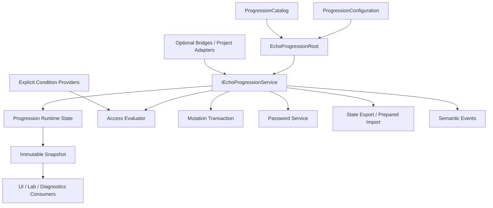

# The Ascent – Progression, Unlocks, Passwords, and Checkpoints Package Specification

**Working document ID:** SFGSS-PKG-ECHOPROGRESSION-001  
**Specification version:** 1.1.1
**Status:** Approved  
**Technical package name:** EchoProgression  
**Public title:** The Ascent – Progression, Unlocks, Passwords, and Checkpoints
**Package ID:** `com.echodevgames.echo-progression`  
**Runtime namespace:** `EchoDevGames.EchoProgression`  
**Owner:** Jesse “Echo” Adams / EchoDevGames  
**Project boundary:** Independent solo project; not an Isekai Studios product  
**Planned repository:** `EchoDevGames/EchoProgression`
**Current Notes:** `Plan Documentation/Current Notes.md` until the package repository is created, then `Documentation~/Developer/Current Notes.md`  
**Unity baseline:** Unity 6000.3.8f1  
**Minimum supported Unity version:** Unity 6000.0  
**Parent authority:** SFGSS-000 v0.13.0, SFGSS-001 v1.1.0, SFGSS-002 v1.0.0, SFGSS-003 v1.0.0, SFGSS-004 v1.0.0, and SFGSS-005 v1.1.0  
**Last updated:** August 4, 2026

> “Mark what has been earned, remember where the climb paused, and never confuse the summit with the road that leads there.”

> **Approval rule:** This specification is approved as the Level 2 authority for EchoProgression. Package implementation remains locked until SUITE-DOC-33 passes.

---

## Revision History

| Version | Date | Status | Summary | Approved by |
|---|---|---|---|---|
| 0.1.0 | 2026-08-04 | Proposed | Initial complete specification derived from SFGSS-000 through SFGSS-005 and the approved Foundation, Impact, and Wellspring authorities | Pending |
| 1.0.0 | 2026-08-04 | Approved | Approved progression authority, definitions, access rules, unlocks, completions, checkpoints, authored passwords, persistence seams, diagnostics, Laboratory, integrations, and release gates | Jesse “Echo” Adams |
| 1.1.0 | 2026-08-04 | Approved | Clarified progression-node completion ownership versus objective-run completion, selected one active persistence source, and registered the ADR-001 Workshop setup facade | Jesse “Echo” Adams |
| 1.1.1 | 2026-08-04 | Approved | Normalized registry metadata and formal title; added the SUITE-DOC-30 governing-authority, evidence, test-registry, and compatibility clarification without authorizing implementation. | Jesse “Echo” Adams |

---

## 1. Package Identity and One-Sentence Contract

**Public title:** The Ascent – Progression, Unlocks, Passwords, and Checkpoints
**Technical identifier:** EchoProgression  
**Flavor line:** Record each rung without deciding who climbs, what waits above, or how the world is loaded.  
**Plain-language subtitle:** A neutral runtime for unlocks, access rules, checkpoints, progression-node completion records, local rankings, password grants, and versioned progression state.

**One-sentence ownership contract:**

> EchoProgression owns stable progression definitions, unlock and access state, checkpoint records, progression-node completion records, local rank snapshots, password-to-progression grants, atomic progression mutations, state snapshots, migration-ready progression documents, and diagnostics; it does not own general save-file transport, scene loading, menus, inventory, character statistics or experience, quest logic, platform achievements, online leaderboards, networking authority, or the gameplay events that earn progression.

### 1.1 Elevator summary

The Ascent gives a project one clear place to answer questions such as: Is this level available? Has this mode been unlocked? Which checkpoint should a Continue action resume from? How many times was a challenge completed? What is the best local time or score? Does this password grant access to a later stage? The package stores and evaluates those progression truths without becoming the system that loads a scene, awards an item, levels a character, renders a menu, uploads an achievement, or writes an entire save slot.

Project-owned ScriptableObject definitions describe progression nodes, categories, prerequisites, checkpoints, metrics, local rank tables, and authored password schemes. One duplicate-safe runtime authority owns mutable unlocks, progression-node completion records, checkpoint state, provider registrations, histories, and the current immutable snapshot. Mutations are validated as complete batches and publish once, so a password or reward cannot unlock one thing, fail on the second operation, and leave the player in a half-granted state.

The package works alone in memory and exports a detached versioned state document. A separate Chronicle bridge may persist that document inside a save slot. A small optional local provider may support password-only or lightweight games that need only progression persistence. Passage, Looking Glass, Objectives, Characters, Inventory, platform services, and multiplayer connect through explicit bridges or project adapters and retain their own authority.

### 1.2 Why this belongs in The Sperk’s Forge

Progression is repeatedly rebuilt as static lists, booleans in unrelated managers, hard-coded password switches, scene-index checks, save-file fields, or UI button logic. Those shortcuts work until a game needs multiple unlock categories, migration, password normalization, checkpoint recovery, best-score rules, optional content removal, or a second presentation surface.

| Source project or authority | Existing need or failure pattern | Preserve | Improve |
|---|---|---|---|
| Rescuers2D | Password-based progression, level access, role unlocks, and continue/menu flow | Simple player-facing codes and explicit level access | Move progression truth out of menu and scene scripts; use stable IDs and structured results |
| Echo Systems Lab | Mission completion and unlocks stored by mission IDs | Stable IDs and event-driven updates | Generalize beyond one project while preserving project-owned content |
| Hackulos | Class, spell, quest, checkpoint, and future unlock needs | Data-driven definitions and RPG extension seams | Keep RPG XP/stat rules outside the general package |
| The Chronicle | Versioned participant payloads and unknown-data preservation | Detached state documents and migrations | Use a bridge instead of making progression a save transport |
| The Passage | Validated scene travel and route ownership | Caller chooses destination after rules succeed | Progression evaluates access/checkpoint identity but never loads scenes |
| The Looking Glass | Password entry, level select, completion summaries, and Continue UI | Presenter/view separation | Keep menus as consumers rather than rule owners |
| The Path | Objectives may reward unlocks or observe progression | Semantic requests/events | Avoid absorbing quest conditions and rewards |
| The Fellowship | Characters may be locked/unlocked | Stable character identity and roster authority | Map progression nodes to character availability through a bridge |
| SFGSS-003 | Stable IDs, immutable definitions, versioned DTOs, migration, unknown-data retention | Documentation-as-contract data discipline | Apply the standard consistently to progression |

### 1.3 Verse identity boundary

| Surface | Flavor allowed? | Rule |
|---|---:|---|
| Public title and documentation | Yes | “The Ascent” may lead only when paired with the progression responsibility |
| Setup guidance and tooltips | Yes | Climb, rung, summit, and path may decorate but not replace technical meaning |
| Standalone Laboratory | Optional | Sample names remain replaceable and removable |
| Runtime API/type names | No lore-only names | Use `ProgressionNodeDefinition`, `ProgressionStateSnapshot`, and other direct names |
| Project data | No required Verse content | Games own levels, characters, rewards, codes, copy, visuals, and progression design |


## 2. Problem Statement

### 2.1 Current problem

Uncoordinated progression commonly fails in predictable ways:

- level buttons decide access independently from gameplay and save data;
- password logic is a hard-coded switch statement with no normalization, migration, or diagnostics;
- checkpoint IDs are scene names or build indexes that break when content moves;
- unlock flags are scattered across `PlayerPrefs`, static fields, save DTOs, ScriptableObjects, and UI components;
- completion counts and best results use inconsistent tie and comparison rules;
- character levels, quest stages, achievements, scene travel, inventory rewards, and global progression are merged into one manager;
- a reward applies several changes and leaves partial state when one target is invalid;
- removed optional content causes old save records to be discarded;
- a renamed display label silently breaks durable identity;
- platform achievement services or online leaderboards leak into the core;
- direct-scene testing creates a second progression truth;
- planned compatibility and migration claims are treated as evidence before they are tested.

### 2.2 Evidence from existing work

| Source | Existing pattern or problem | Preserve | Improve |
|---|---|---|---|
| SFGSS-000 | EchoProgression owns unlocks, passwords, checkpoints, level access, and advancement | One authority per concern | Specify boundaries with save, scene, UI, objectives, inventory, characters, and platforms |
| SFGSS-002 | Optional connections must be visible and removable | Separate bridges/providers | No direct core dependency on Chronicle, Passage, Looking Glass, or platform SDKs |
| SFGSS-003 | Durable state requires stable IDs, versions, migrations, and unknown-data policy | Definition/state separation | No Unity asset GUID or display name as runtime progression identity |
| SFGSS-004 | Test definitions are not executed evidence | Complete pre-code registry | Keep every runtime, platform, migration, and release result `Not run` |
| Foundation matrix | Chronicle owns save files; Passage owns transitions; UI owns presentation | Clear authority handoffs | Progression exposes requests, results, snapshots, and events only |

### 2.3 Consequences of doing nothing

- Every project invents another incompatible unlock manager.
- Password and checkpoint systems remain hard to test, migrate, and explain.
- Save files become tightly coupled to scene names and UI assumptions.
- Removing optional content destroys or misinterprets player progress.
- UI, scene flow, objectives, characters, and inventory create competing progression truth.
- Platform SDK decisions become hidden inside general runtime code.
- The suite cannot offer a trustworthy Game Jam or password-platformer pathway.


## 3. Goals, Non-Goals, and Success Measures

### 3.1 Goals

- Provide one duplicate-safe progression authority with an injectable interface.
- Represent unlockable/access-controlled concepts through stable project-owned definitions.
- Support project-defined categories without a genre-locked public enum.
- Evaluate built-in prerequisite trees and explicit project condition providers.
- Grant, revoke where approved, reset, and query unlock state through structured operations.
- Record completions, counts, bounded numeric metrics, best values, and local rank snapshots.
- Track checkpoint identity and opaque resume tokens without loading scenes.
- Validate, preview, generate, and apply authored progression passwords safely.
- Validate every mutation batch completely before one atomic publication.
- Export/import a detached versioned progression state with migration and unknown-record preservation.
- Remain useful without Chronicle, Passage, Looking Glass, Objectives, Characters, or any platform SDK.
- Expose actionable diagnostics, setup, repair, and a standalone Laboratory.

### 3.2 Non-goals

- Write, enumerate, back up, recover, or migrate general game-save files and slots.
- Load scenes, choose routes, fade screens, or own Continue-menu behavior.
- Render level select, password entry, checkpoint, ranking, or completion UI.
- Own RPG experience points, character levels, attributes, skills, classes, equipment, or combat power.
- Own quest/objective logic, dialogue flow, inventory rewards, crafting, or character rosters.
- Replace platform achievements, trophies, entitlements, commerce, cloud saves, or online leaderboards.
- Treat passwords as secure credentials, encryption, DRM, anti-cheat, or proof of purchase.
- Decide which gameplay events earn progression.
- Replicate progression over a network or choose multiplayer authority in the MVP.
- Provide a branching gameplay scripting language.
- Store mutable progression state inside shared ScriptableObject definitions.

### 3.3 User outcomes

| User | Starting condition | Desired outcome |
|---|---|---|
| Novice installer | Clean Unity project and a few levels | Create definitions, unlock a level, enter a password, and inspect state without building a manager |
| Gameplay programmer | A win condition or checkpoint event | Submit one semantic mutation request and receive a structured result |
| Designer | Project progression plan | Author categories, prerequisites, rank tiers, checkpoint metadata, and password entries safely |
| UI developer | Level-select/password/completion screen | Consume snapshots/results and issue commands without owning progression truth |
| Save integrator | Chronicle or project persistence | Export/import one versioned state document through an explicit adapter |
| Tester | Suspected unlock, migration, password, or checkpoint defect | Reproduce the operation in the Laboratory with clear diagnostics |

### 3.4 Measurable success criteria

- The package installs into a clean supported Unity project with zero compile errors.
- The runtime core works with no other Sperk’s Forge package installed.
- Access results are deterministic for the same catalog, state, context, and provider responses.
- A mixed mutation batch either commits completely or leaves state unchanged.
- A valid authored password may preview and apply a complete mutation grant without logging plaintext.
- Checkpoint state may be queried and persisted without any scene-management dependency.
- Completion records update best-value and local-rank rules deterministically.
- Export/import round trips all known and unknown records supported by the schema.
- Missing optional providers yield `Unavailable`, never an implicit allow.
- Removing samples or optional bridges leaves the core compiling and functional.
- Every advertised feature has planned SFGSS-004 evidence and remains `Not run` until executed.


## 4. Users and Primary Use Cases

### 4.1 Intended users

- Solo Unity developers creating prototypes, game jams, password games, adventures, platformers, puzzle games, and RPG-adjacent systems.
- Gameplay programmers submitting semantic progression changes.
- Designers authoring project-owned progression data.
- UI and scene integrators consuming neutral snapshots and results.
- Testers validating unlocks, passwords, checkpoints, migration, and removal.

### 4.2 Primary use cases

| ID | Use case | Actor | Preconditions | Expected result | Release phase |
|---|---|---|---|---|---|
| EPROG-UC-001 | Create progression configuration | Installer | Package installed | Project-owned configuration and catalog are created | MVP |
| EPROG-UC-002 | Register progression definitions | Designer | Valid stable IDs and catalog | Definitions validate and become queryable | MVP |
| EPROG-UC-003 | Initialize empty progression state | Runtime | Valid configuration | Root becomes Ready with defaults and no fabricated unlocks | MVP |
| EPROG-UC-004 | Grant an unlock | Gameplay/project code | Target definition exists and policy allows grant | Unlock commits atomically and event is raised | MVP |
| EPROG-UC-005 | Evaluate level or feature access | Gameplay/project code | Definition and current state available | Structured allow/deny result lists blocking reasons | MVP |
| EPROG-UC-006 | Record a completion | Gameplay/project code | Completion target exists | Count, latest result, best metrics, and rank snapshot update transactionally | MVP |
| EPROG-UC-007 | Activate a checkpoint | Gameplay/project code | Checkpoint definition valid | Current checkpoint record updates without loading a scene | MVP |
| EPROG-UC-008 | Resolve a resume target | Project/Passage adapter | Checkpoint active | Checkpoint ID and resume token are returned for project mapping | MVP |
| EPROG-UC-009 | Validate an authored password | Player/project code | Password scheme configured | Normalized code yields a structured valid/invalid result | MVP |
| EPROG-UC-010 | Generate an authored password | Player/project code | Current state matches a configured authored entry | Matching code is returned without logging plaintext | MVP |
| EPROG-UC-011 | Apply a password grant | Player/project code | Validated grant exists | All unlock/checkpoint/completion mutations validate then commit once | MVP |
| EPROG-UC-012 | Reject partial password mutation | Runtime | One grant operation is invalid | No progression state changes | MVP |
| EPROG-UC-013 | Evaluate built-in prerequisites | Runtime | Prerequisite graph configured | Unlock/completion/checkpoint requirements resolve deterministically | MVP |
| EPROG-UC-014 | Evaluate project-defined condition | Project provider | Provider registered | Provider returns structured met/unmet/unavailable result | MVP |
| EPROG-UC-015 | Preserve orphaned state | Persistence adapter | Definition temporarily missing | Unknown records round-trip without becoming active grants | MVP |
| EPROG-UC-016 | Export state snapshot | Persistence/project code | Root Ready | Detached versioned state document is produced | MVP |
| EPROG-UC-017 | Import prepared state | Persistence/project code | Document parsed and validated | State replaces current state atomically or fails unchanged | MVP |
| EPROG-UC-018 | Reset selected progression | Developer/project code | Explicit reset policy and confirmation | Only selected categories/records reset | MVP |
| EPROG-UC-019 | Inspect progression history | Tester | Runtime active | Bounded mutation and access histories are visible | MVP |
| EPROG-UC-020 | Start a gameplay scene directly | Developer | Direct-scene helper enabled | Development root initializes once and identifies development mode | MVP |
| EPROG-UC-021 | Persist through Chronicle | Chronicle bridge | Both packages installed | Progression contributes one versioned participant payload | Later bridge |
| EPROG-UC-022 | Use progression-only local storage | Local provider | Provider installed and configured | Small versioned progression document persists without becoming a general save system | Later provider |
| EPROG-UC-023 | Navigate through Passage | Passage bridge/project adapter | Access allowed and route mapped | Adapter requests route; progression never loads scene | Later bridge |
| EPROG-UC-024 | Present progression through UI | Looking Glass bridge | Both packages installed | Screens consume snapshots and issue commands | Later bridge |
| EPROG-UC-025 | Publish platform achievement | Platform adapter | Completion/unlock event occurs | Adapter maps semantic event; core remains platform-neutral | Later adapter |
| EPROG-UC-026 | Coordinate objective reward | Objectives adapter | Objective completes | Adapter requests an explicit mutation batch | Later bridge |
| EPROG-UC-027 | Unlock a character | Characters adapter | Character definition mapped to progression node | Progression grant changes availability through bridge | Later bridge |
| EPROG-UC-028 | Unlock inventory content | Inventory/project adapter | Item/content mapping exists | Adapter observes unlock without moving item ownership | Later adapter |
| EPROG-UC-029 | Synchronize multiplayer progression | Multiplayer adapter | Authority model approved | Server/provider validates and replicates semantic progression changes | Advanced adapter |
| EPROG-UC-030 | Build validation | BuildTools adapter | Project configured | Definitions, IDs, schemes, and migrations are checked before build | Later bridge |

### 4.3 Explicitly unsupported use cases

- Using EchoProgression as a universal player-stat or RPG leveling system.
- Storing inventory stacks, quest steps, character health, or crafting state as generic progression flags merely to avoid using the proper authority.
- Using a password as a secure login, entitlement, payment receipt, or anti-cheat mechanism.
- Treating a checkpoint token as a raw scene-loading command.
- Uploading leaderboard scores or platform achievements directly from the core.
- Letting UI buttons modify private state without the public mutation API.
- Allowing a missing condition provider to default to access granted.
- Using mutable ScriptableObject assets as the live unlock state.


## 5. Authority and Ownership Boundaries

### 5.1 The package owns

- Stable progression, category, checkpoint, metric, rank-table, and password-scheme definitions.
- Catalog validation and prerequisite graph validation.
- Runtime unlock state and access evaluation.
- Progression-node completion counts, latest results, best metrics, and local rank snapshots. These records apply only to registered progression definitions such as stages, modes, challenges, and comparable access nodes; they are not objective-run or quest completion truth.
- Current/reached checkpoint records and opaque resume tokens.
- Authored password normalization, validation, generation, preview, and grant application.
- Atomic progression mutation batches and immutable post-commit snapshots.
- Versioned progression state documents, migration seams, aliases, and orphan-record preservation.
- Condition-provider registration, lifecycle, and failure isolation.
- Progression-specific diagnostics, setup, validation, repair, and standalone Laboratory behavior.

### 5.2 The package does not own

- Save slots, file transport, backups, corruption recovery, cloud synchronization, or general persistence authority.
- Scene references, scene loading, loading screens, route execution, or destination validation.
- UI views, menus, navigation, focus, notifications, or text localization.
- Objectives, quests, dialogue, inventory, characters, controllers, combat, abilities, or world state.
- RPG XP curves, attributes, skills, classes, equipment bonuses, or character levels.
- Platform achievements, trophies, online leaderboards, entitlements, or commerce.
- Network session authority, replication, conflict resolution, or anti-cheat.
- The gameplay event that earns an unlock or completion.

### 5.3 Neighboring authorities

| Concern | Authoritative owner | How EchoProgression interacts |
|---|---|---|
| Save files, slots, backup, recovery | The Chronicle / project persistence | Exports/imports one versioned state document; separate bridge implements participant contract |
| Global preferences | The Accord | At most stores global presentation preferences through a bridge; never progression state |
| Scene travel | The Passage | Progression returns access/checkpoint IDs; bridge/project maps to routes and requests travel |
| Runtime mode/pause | The Pulse | Optional adapter may gate progression changes or request transient state; no core dependency |
| Screens and HUD | The Looking Glass or project UI | Consumes snapshots/results/events and issues commands |
| Input/rebinding | The Will | UI integration requests input contexts/locks; progression does not read devices |
| Audio | Resonance | Presentation/project adapter requests semantic cues after results |
| Diagnostics dashboard | The Observatory | Optional provider bridge exposes health and counts |
| Objectives and quests | The Path | The Path owns objective-run and step completion. A bridge may translate an objective result into an idempotent progression-node mutation or query progression prerequisites; it must not mirror one completion record in both authorities. |
| Character availability | The Fellowship | Bridge maps progression node state to roster availability |
| Inventory/content rewards | The Vault/project code | Adapter observes progression; inventory remains item authority |
| Build validation | The Foundry | Future validator bridge runs catalog, migration, and scheme checks |
| Platform achievements/leaderboards | Provider adapters | Adapters observe semantic events and apply platform policy |
| Multiplayer authority | The Convergence/provider | Future adapter validates server/provider-authoritative progression |

### 5.3.1 Completion and checkpoint ownership clarification

- A **progression-node completion record** belongs to a registered `ProgressionNodeId`, such as a stage, challenge, mode, route, or comparable progression definition.
- An **objective-run completion** belongs to The Path and is keyed by its objective/run identity. EchoProgression must not store a shadow copy of that same objective-run truth.
- A bridge may react to objective completion by submitting an idempotent progression mutation, but the resulting progression record represents the configured progression node, not the foreign objective run.
- A checkpoint record identifies progression resume intent. The Passage owns transition execution, and The Atlas owns semantic world/location/entry identity when installed. EchoProgression stores only its own `CheckpointId` plus an opaque adapter token.
- Exactly one persistence source may be authoritative for EchoProgression state at a time. The in-memory service is always the runtime truth; the Chronicle bridge, a progression-only local provider, or project code may load/store it, but two persistence providers must not race or publish competing documents.

### 5.4 Boundary tests

A feature belongs in EchoProgression only when:

1. It describes or changes durable/semi-durable access, unlock, checkpoint, completion, local rank, or password-grant truth.
2. It can be represented without knowing a scene, UI prefab, inventory item instance, character stat block, quest implementation, or platform SDK.
3. It remains meaningful when Chronicle, Passage, Looking Glass, and every gameplay package are absent.
4. It can expose a semantic result instead of directly causing foreign-system behavior.
5. Its mutable state can live in the runtime state document rather than a shared definition asset.
6. Its optional integration can be expressed as a bridge, provider, or project adapter.
7. Its failure can be reported without guessing or silently granting access.

Features that fail these tests belong to another package, an adapter, project code, or a deferred provider.


## 6. Independence Contract

Independence is a release gate.

### 6.1 Standalone guarantees

EchoProgression must:

- Compile with only declared Unity/runtime dependencies.
- Initialize without First Light or The Workshop.
- Work without Chronicle, Passage, Pulse, Resonance, Will, Looking Glass, Observatory, or any Expansion/Advanced package.
- Use in-memory state by default and expose explicit export/import rather than choosing a hidden file path.
- Avoid direct references to project assemblies.
- Keep project definitions and durable state outside immutable package source.
- Offer an injectable service interface and explicit provider registration.
- Enter a safe blocked or unavailable state when required configuration/providers are absent.
- Preserve unknown durable records rather than deleting them silently.

### 6.2 Independence proof matrix

| Condition | Expected behavior | Planned evidence |
|---|---|---|
| Installed alone | Catalog, runtime state, access, mutation, completion, checkpoint, authored password, export/import, and diagnostics work | Clean-project install and Laboratory |
| Enter Standalone Laboratory directly | One development root initializes and labels development mode | Direct-scene lifecycle test |
| Chronicle absent | In-memory state and export/import remain complete | Standalone persistence seam test |
| Passage absent | Checkpoint/access queries work; project coordinates scenes manually | Standalone checkpoint test |
| Looking Glass absent | All commands/results remain available through API and Laboratory presenter | Sample independence test |
| Condition provider absent | Affected evaluation returns unavailable, never allowed | Provider absence test |
| Duplicate root present | Duplicate rejects before state import or subscription | Lifecycle test |
| Configuration missing | Root blocks with `EPROG-CFG-001` | Failure test |
| Sample deleted | Runtime and tests compile | Sample-removal test |
| Optional content definition removed | Record remains orphaned and round-trips | Unknown-record preservation test |

### 6.3 Allowed dependencies

| Dependency | Type | Required? | Minimum version | Reason | Removal behavior |
|---|---|---:|---|---|---|
| Unity core modules | Platform | Yes | Supported Unity baseline | MonoBehaviour, ScriptableObject, serialization, lifecycle | Package cannot function without Unity |
| Unity Test Framework | Test-only | Tests only | Verified at implementation | EditMode/PlayMode evidence | Removing tests does not affect runtime |

No other Echo package is a core dependency.

### 6.4 Forbidden dependencies

- Another Sperk’s Forge runtime package in the core assembly.
- `UnityEditor` in runtime assemblies.
- UI, Input System, scene-management route assets, platform achievement SDKs, cloud providers, or networking SDKs in the core.
- Project-specific assemblies.
- Samples or Laboratory presenters as runtime requirements.
- Raw scene names, build indexes, `PlayerPrefs` keys, hidden file paths, or Resources lookups.
- Reflection-based provider discovery.


## 7. Capability Scope

### 7.1 Capability matrix

| ID | Capability | Description | Status | MVP? | Surface |
|---|---|---|---|---|---|
| EPROG-CAP-001 | Duplicate-safe authority | One root claims runtime before subscriptions or state import | Approved | Yes | Runtime |
| EPROG-CAP-002 | Stable progression IDs | Definitions use validated domain IDs independent of names and asset GUIDs | Approved | Yes | Runtime/Editor |
| EPROG-CAP-003 | Catalog validation | Duplicate, missing, circular, and unresolved references are reported | Approved | Yes | Editor |
| EPROG-CAP-004 | Unlock state | Grant, query, optional explicit revoke, and reset operations | Approved | Yes | Runtime |
| EPROG-CAP-005 | Access evaluation | Structured allowed/denied/unavailable results with reasons | Approved | Yes | Runtime |
| EPROG-CAP-006 | Built-in conditions | Unlocked, completed, checkpoint, metric, all/any/not rules | Approved | Yes | Runtime |
| EPROG-CAP-007 | External conditions | Explicit provider registration for project-owned truth | Approved | Yes | Runtime |
| EPROG-CAP-008 | Progression-node completion records | Counts, latest result, best metrics, timestamps, and rank snapshot for registered progression definitions only | Approved | Yes | Runtime |
| EPROG-CAP-009 | Metric definitions | Stable numeric metric IDs and comparison policy | Approved | Yes | Runtime/Editor |
| EPROG-CAP-010 | Rank tables | Project-authored local tiers evaluated from one approved metric | Approved | Yes | Runtime/Editor |
| EPROG-CAP-011 | Checkpoint records | Activate/query current checkpoint without scene authority | Approved | Yes | Runtime |
| EPROG-CAP-012 | Resume tokens | Opaque project-owned tokens for adapters, never raw scene authority | Approved | Yes | Runtime |
| EPROG-CAP-013 | Authored password scheme | Normalized codes map to atomic mutation batches | Approved | Yes | Runtime/Editor |
| EPROG-CAP-014 | Password generation | Generate only when current state matches an authored scheme entry | Approved | Yes | Runtime |
| EPROG-CAP-015 | Password validation | No plaintext logging; structured result and grant preview | Approved | Yes | Runtime |
| EPROG-CAP-016 | Atomic mutation batches | Validate all operations before one state publication | Approved | Yes | Runtime |
| EPROG-CAP-017 | Immutable snapshots | Consumers receive detached read-only state views | Approved | Yes | Runtime |
| EPROG-CAP-018 | Versioned state document | Export/import detached durable representation | Approved | Yes | Runtime |
| EPROG-CAP-019 | Unknown-record preservation | Orphan definitions and extension payloads round-trip safely | Approved | Yes | Runtime |
| EPROG-CAP-020 | Migration pipeline | Contiguous state-document migrations with source preservation | Approved | Yes | Runtime/Editor |
| EPROG-CAP-021 | Bounded histories | Mutation, access, password, and diagnostic histories have caps | Approved | Yes | Runtime |
| EPROG-CAP-022 | Standalone diagnostics | Status, catalog health, state counts, and last result exposed | Approved | Yes | Runtime/Editor |
| EPROG-CAP-023 | Setup/repair | Create configuration, catalogs, sample definitions, and reports safely | Approved | Yes | Editor |
| EPROG-CAP-024 | Standalone Laboratory | Unlock, password, checkpoint, completion, migration, and failure proof | Approved | Yes | Sample |
| EPROG-CAP-025 | Chronicle participant bridge | Versioned save contribution | Approved | No | Bridge |
| EPROG-CAP-026 | Progression-only local provider | Small optional local persistence backend | Approved | No | Provider |
| EPROG-CAP-027 | Passage mapping bridge | Checkpoint/access to route requests | Approved | No | Bridge |
| EPROG-CAP-028 | Looking Glass presenters | Optional menus, password entry, and progression views | Approved | No | Bridge/Sample |
| EPROG-CAP-029 | Platform achievement adapter | Semantic unlock/completion mapping | Deferred | No | Provider |
| EPROG-CAP-030 | Algorithmic state password codec | Compact generated state codes beyond authored entries | Deferred | No | Provider |
| EPROG-CAP-031 | Online leaderboards | Provider-specific publication and retrieval | Rejected | No | Provider |
| EPROG-CAP-032 | RPG experience and character levels | Belongs to project code or EchoRPG.Foundation | Rejected | No | Other |

### 7.2 MVP capability set

The smallest complete release includes:

- duplicate-safe root and injectable service;
- project-owned configuration/catalog;
- stable progression/category/checkpoint/metric/rank/password IDs;
- unlock state and structured access evaluation;
- built-in prerequisite tree plus explicit provider conditions;
- atomic mutation batches;
- completion counts, latest/best numeric metrics, and local rank snapshots;
- checkpoint activation/query with opaque resume token;
- authored password normalization, validation, preview, exact-state generation, and atomic grant application;
- immutable snapshots and versioned state export/import;
- migration hooks and unknown-record preservation;
- setup, validation, repair, diagnostics, and standalone Laboratory.

### 7.3 Later capability set

Approved later work may include:

- Chronicle participant bridge;
- small local progression-only persistence provider;
- Passage checkpoint/route mapping bridge;
- Looking Glass progression/password/level-select presenters;
- Objectives, Characters, Inventory, BuildTools, and platform adapters;
- richer rank evaluators;
- algorithmic compact password codecs;
- multiplayer-authoritative progression adapter after Convergence approval.

### 7.4 Deferred and rejected ideas

| Idea | Disposition | Reason | Revisit trigger |
|---|---|---|---|
| Compact bit-packed state password codec | Deferred | Requires careful schema/version/error-detection design | Authored scheme proves insufficient in a real project |
| Online leaderboards | Deferred/provider | Network/platform service concern | Approved provider adapter specification |
| Platform achievements/trophies | Deferred/provider | SDK and policy-specific | Provider research and adapter |
| Temporary session buffs/unlocks | Deferred | May belong to gameplay state rather than durable progression | Concrete cross-project need |
| RPG XP/levels/attributes | Rejected from core | Genre-specific mutable statistics | EchoRPG.Foundation or project system |
| Quest/objective graph | Rejected from core | Owned by The Path | Objectives specification/bridge |
| Scene loading from checkpoint | Rejected from core | Owned by Passage/project | Bridge mapping |
| General analytics/telemetry | Rejected from core | Not progression authority | Separate analytics provider/product |
| Secure entitlement codes | Rejected | Passwords are not security | Separate authenticated service |


## 8. Architecture Overview

### 8.1 Design model

| Layer | Contains | Must not contain |
|---|---|---|
| Definition/configuration | Catalog, node/category/checkpoint/metric/rank/password definitions, policies, limits, aliases | Live unlocks, completion counts, active checkpoint, provider instances, scene objects |
| Runtime state/behavior | Root, state document, sets/records, access evaluator, mutation transaction, provider registry, histories | Editor tooling, production UI, scene travel, save-file transport |
| Presentation/feedback | Laboratory presenter and optional bridge presenters | Authoritative progression state or mutation rules |

### 8.2 Component topology



The root owns the concrete runtime service, state, provider registry, histories, and shutdown. Definitions remain project-owned assets. Consumers never mutate internal collections directly.

### 8.3 Authoritative root

| Question | Decision |
|---|---|
| Does the package require a persistent root? | Yes for the default scene-based runtime; an injected service may be used in tests |
| Root type | `EchoProgressionRoot` |
| Duplicate behavior | Reject duplicate before subscriptions, provider registration, state import, or events |
| Initialization trigger | Explicit `Initialize` from root/startup step; safe optional Awake bootstrap may be configured |
| Default lifetime | Application session |
| Shutdown behavior | Dispose providers, invalidate prepared imports, clear static access, retain no hidden durable writes |
| Direct-scene behavior | Development initializer creates only when absent and marks development mode |
| Test injection seam | `IEchoProgressionService`, clock, migration registry, condition providers |

### 8.4 Lifecycle sequence

1. Claim authority.
2. Validate configuration and catalog identities.
3. Validate prerequisite graph, rank tables, password normalization, aliases, and migration registry.
4. Create empty/default runtime state.
5. Optionally prepare and commit an explicitly supplied state document.
6. Publish immutable initial snapshot.
7. Enter Ready and accept queries/mutations/provider registrations.
8. Process atomic changes and publish events after commit.
9. Export/import only through explicit calls.
10. Dispose registrations, invalidate handles, and clear authority on shutdown.

### 8.5 Failure model

| Failure | Detection point | User-visible result | Runtime fallback | Diagnostic code |
|---|---|---|---|---|
| Duplicate root | Awake/claim | Duplicate object disables or destroys itself | Existing authority remains untouched | EPROG-LIFE-001 |
| Missing configuration | Initialization | Blocked status with actionable message | No defaults fabricated | EPROG-CFG-001 |
| Duplicate stable ID | Catalog validation | Blocker in Editor and initialization | No catalog published | EPROG-ID-001 |
| Circular prerequisite graph | Catalog validation | Blocker with cycle path | Affected catalog unavailable | EPROG-GRAPH-001 |
| Unknown mutation target | Request validation | Structured rejection | No state change | EPROG-MUT-001 |
| Condition provider missing | Access evaluation | Unavailable result names provider | No implicit allow | EPROG-COND-001 |
| Provider throws | Evaluation | Unavailable result and bounded diagnostic | Other providers/state remain available | EPROG-COND-002 |
| Invalid metric value | Completion validation | Completion rejected | No partial record update | EPROG-METRIC-001 |
| Password scheme missing | Password operation | Unavailable result | No mutation | EPROG-PASS-001 |
| Password invalid | Password operation | Invalid result without plaintext logging | No mutation | EPROG-PASS-002 |
| Password grant stale | Apply grant | Rejected because catalog/state revision changed | Revalidate required | EPROG-PASS-003 |
| State document newer | Import preparation | Unsupported-newer result | Current state unchanged | EPROG-DATA-001 |
| Migration gap | Import preparation | Blocking migration result | Source preserved | EPROG-MIG-001 |
| Orphan record | Import/query | Preserved but inactive | Round-trip until definition returns or explicit prune | EPROG-DATA-002 |
| History capacity reached | Diagnostic write | Oldest entry evicted | Runtime behavior continues | EPROG-DIAG-001 |


## 9. Runtime Data and State Model

### 9.1 Definitions and configuration assets

| Type | Purpose | Stable ID? | Mutable at runtime? | Project-owned instance? |
|---|---|---:|---:|---:|
| `ProgressionConfiguration` | Catalogs, policies, caps, defaults, migration settings | Configuration domain ID recommended | No | Yes |
| `ProgressionCatalog` | Aggregates package definitions and revision fingerprint | Yes | No | Yes |
| `ProgressionNodeDefinition` | Unlockable/access-controlled concept | Yes: `ProgressionId` | No | Yes |
| `ProgressionCategoryDefinition` | Project-defined classification/reset/filter scope | Yes: `ProgressionCategoryId` | No | Yes |
| `ProgressionCheckpointDefinition` | Checkpoint identity and opaque resume token | Yes: `ProgressionCheckpointId` | No | Yes |
| `ProgressionMetricDefinition` | Numeric completion metric and comparison policy | Yes: `ProgressionMetricId` | No | Yes |
| `ProgressionRankTableDefinition` | Ordered local rank thresholds | Yes: `ProgressionRankTableId` and rank IDs | No | Yes |
| `ProgressionPasswordScheme` | Normalization and authored code entries | Yes: `ProgressionPasswordSchemeId` | No | Yes |
| `ProgressionConditionDefinition` | Built-in tree or provider-key condition | Referenced through owner/condition key | No | Yes |

### 9.2 Runtime state

| State object | Owner | Lifetime | Reset rule | Serialization rule |
|---|---|---|---|---|
| Unlock set | Runtime service | Active progression state | Explicit scoped reset/revoke policy | Stable IDs in state document |
| Completion records | Runtime service | Active progression state | Explicit target/category reset | Counts, metrics, rank snapshot, timestamps |
| Checkpoint record/history | Runtime service | Active progression state | Explicit checkpoint reset | Stable checkpoint ID and opaque token snapshot |
| Orphan records | Runtime service | Until recognized or explicitly pruned | Never silently removed | Preserved opaque/known DTO records |
| Provider registry | Runtime service | Registration lease/application session | Dispose lease/shutdown | Never serialized |
| Mutation/access/password histories | Runtime service | Bounded session history | Capacity eviction/reset | Diagnostic only; not saved by default |
| Prepared import candidates | Runtime service | Short-lived handle | Dispose, commit, timeout, shutdown | Never serialized |
| Catalog revision/fingerprint | Runtime service | Initialization/catalog refresh | Recomputed from canonical definition data | Stored with exported state for compatibility |

### 9.3 Stable identifiers

- Domain IDs use package-qualified validated strings such as `game.level.forest-01`, not display names or Unity asset GUIDs.
- Category, checkpoint, metric, rank, scheme, and provider keys use their own ID types to prevent accidental interchange.
- IDs are generated for new unreleased assets by Editor tooling, validated for emptiness/collision, and treated as locked after release.
- Display-name changes do not alter durable identity.
- Aliases may map retired IDs to current IDs during import/evaluation; aliases cannot form cycles or collisions.
- Runtime instance/correlation IDs are session-local and never replace durable IDs.
- Unity `.meta` GUIDs preserve asset references in Unity but are not the Player-runtime progression identity.

### 9.4 ScriptableObject safety

Definition assets remain immutable during Play Mode. They must not store:

- unlocked state;
- completion counts or best scores;
- current checkpoint;
- used passwords;
- provider registrations;
- migration progress;
- runtime histories;
- scene object references;
- save-slot/profile state.

The Laboratory must prove definitions remain byte/fingerprint equivalent after reset and repeated operations.

### 9.5 Serialization and migration

`ProgressionStateDocument` includes at minimum:

- package/document schema version;
- catalog identity/fingerprint metadata;
- state revision;
- unlocked node records;
- completion records and metric values;
- checkpoint record/history according to configuration;
- extension/unknown records;
- optional informational timestamps;
- no Unity object references and no raw password input history.

Migration rules follow SFGSS-003:

1. Parse without mutating active state.
2. Preserve the source document/evidence.
3. Apply a contiguous migration chain.
4. Resolve aliases.
5. Validate known records.
6. Preserve unknown records.
7. Build a detached prepared import.
8. Commit only through an explicit atomic call.

Downgrade is not assumed. Newer unsupported documents are rejected without changing active state.


## 10. Public Runtime API

### 10.1 Public types

| Type | Kind | Responsibility | Construction/ownership |
|---|---|---|---|
| EchoProgressionRoot | sealed MonoBehaviour | Duplicate-safe application-session authority | Scene/project prefab; injectable service seam |
| IEchoProgressionService | interface | Query, evaluate, mutate, snapshot, import/export, and password operations | Implemented by root/runtime service |
| ProgressionConfiguration | ScriptableObject | Catalogs, limits, policies, defaults, history caps, and provider settings | Project-owned asset |
| ProgressionCatalog | ScriptableObject | Collection of progression nodes, categories, checkpoints, metrics, ranks, and password schemes | Project-owned asset |
| ProgressionNodeDefinition | ScriptableObject | Stable unlockable/access-controlled concept | Project-owned asset |
| ProgressionCategoryDefinition | ScriptableObject | Stable project-defined classification for nodes and reset scopes | Project-owned asset |
| ProgressionConditionDefinition | serializable definition | Built-in or provider-backed requirement tree | Owned by node/rule asset |
| ProgressionCheckpointDefinition | ScriptableObject | Stable checkpoint identity, display metadata, and resume token | Project-owned asset |
| ProgressionMetricDefinition | ScriptableObject | Stable numeric completion metric and comparison policy | Project-owned asset |
| ProgressionRankTableDefinition | ScriptableObject | Ordered local rank tiers for one metric | Project-owned asset |
| ProgressionPasswordScheme | ScriptableObject | Normalization policy and authored code entries | Project-owned asset |
| ProgressionPasswordEntry | serializable definition | Normalized-code mapping to mutation batch and optional generation predicate | Owned by scheme |
| ProgressionStateDocument | serializable DTO | Versioned durable progression state | Detached data |
| ProgressionStateSnapshot | immutable class/struct | Read-only active state for consumers | Created by service |
| ProgressionMutationRequest | struct/class | Atomic list of semantic mutations plus source metadata | Caller-created |
| ProgressionMutationResult | struct/class | Success/failure, diagnostics, and committed change set | Service-created |
| ProgressionAccessRequest | struct | Target ID and explicit evaluation context | Caller-created |
| ProgressionAccessResult | struct/class | Allowed, denied, unavailable, and blocking reasons | Service-created |
| ProgressionCompletionRequest | struct/class | Target, metrics, optional rank table, and metadata | Caller-created |
| ProgressionCheckpointRecord | serializable DTO | Current/reached checkpoint state and resume token snapshot | Runtime/durable state |
| ProgressionPasswordResult | struct/class | Valid/invalid/unavailable, scheme, preview, and diagnostics | Service-created |
| IProgressionConditionProvider | interface | Evaluate project-owned conditions without core dependency | Project/bridge implementation |
| IProgressionClock | interface | UTC/unscaled timestamps for records and diagnostics | Injected provider |
| ProgressionRegistrationHandle | disposable struct/class | Idempotent provider registration lease | Service-created |

### 10.2 Public methods and properties

| Member | Purpose | Preconditions | Result/failure behavior | Thread/main-loop rule |
|---|---|---|---|---|
| ProgressionInitializationResult Initialize(ProgressionConfiguration configuration) | Validate configuration, claim state, and enter Ready | Root authority claimed and not initialized | No partial state; structured blockers | Main thread |
| ProgressionStateSnapshot GetSnapshot() | Return immutable current state | Ready | Never returns mutable internal collections | Main thread |
| bool IsUnlocked(ProgressionId id) | Query unlock state | Ready | Unknown ID returns false plus optional diagnostic context | Main thread |
| ProgressionAccessResult EvaluateAccess(in ProgressionAccessRequest request) | Evaluate built-in and external conditions | Ready | Returns allowed/denied/unavailable; no mutation | Main thread |
| ProgressionMutationResult Apply(in ProgressionMutationRequest request) | Validate and commit mutation batch atomically | Ready; request valid | All-or-nothing result | Main thread |
| ProgressionMutationResult RecordCompletion(in ProgressionCompletionRequest request) | Update completion count, metrics, and rank | Ready | No partial metric update | Main thread |
| ProgressionMutationResult ActivateCheckpoint(ProgressionCheckpointId id, string source) | Set current checkpoint record | Ready; definition exists | Does not load scene | Main thread |
| ProgressionPasswordResult ValidatePassword(ProgressionPasswordSchemeId schemeId, string input) | Normalize and resolve authored code | Ready; scheme exists | No plaintext logs; no mutation | Main thread |
| ProgressionMutationResult ApplyPasswordGrant(in ProgressionPasswordResult validated) | Commit prevalidated grant with freshness check | Validated result from current catalog revision | Reject stale preview; no partial commit | Main thread |
| ProgressionPasswordResult GeneratePassword(ProgressionPasswordSchemeId schemeId) | Find authored entry matching active state | Ready | Returns unavailable when no exact entry matches | Main thread |
| ProgressionStateDocument ExportState() | Create detached versioned document | Ready | No Unity object references | Main thread capture; detached processing allowed later |
| ProgressionImportResult PrepareImport(ProgressionStateDocument document) | Validate, migrate, and build replacement candidate | Ready | Current state unchanged | Main thread/pure migration seam |
| ProgressionMutationResult CommitPreparedImport(PreparedProgressionImport handle) | Atomically replace active state | Prepared handle current and undisposed | Stale handle rejected | Main thread |
| ProgressionRegistrationHandle RegisterConditionProvider(IProgressionConditionProvider provider) | Add explicit provider | Ready or initializing as allowed | Duplicate/provider conflicts rejected | Main thread |
| ProgressionResetResult Reset(in ProgressionResetRequest request) | Explicit scoped reset | Ready; policy allows | Only approved state removed | Main thread |

### 10.3 Events and callbacks

| Event | Raised by | Timing | Payload | Listener assumptions |
|---|---|---|---|---|
| Initialized | EchoProgressionRoot | After successful initialization and state publication | ProgressionInitializedEvent | Listeners are optional |
| StateImported | Runtime service | After prepared import commits | ProgressionStateImportedEvent | Raised once per successful import |
| ProgressionChanged | Runtime service | After atomic mutation commits | ProgressionChangeSet | Presentation is never required |
| UnlockChanged | Runtime service | After unlock/revoke operation commits | ProgressionUnlockChangedEvent | May be coalesced within batch |
| CompletionRecorded | Runtime service | After completion record commits | ProgressionCompletionEvent | Metrics are immutable snapshot values |
| CheckpointChanged | Runtime service | After checkpoint commits | ProgressionCheckpointChangedEvent | No scene load implied |
| PasswordValidated | Runtime service | After validation result created | Redacted ProgressionPasswordAuditEvent | Payload excludes plaintext code |
| ProviderHealthChanged | Runtime service | After provider registration/failure state changes | ProgressionProviderHealthEvent | Diagnostic only |
| ResetCompleted | Runtime service | After explicit reset commits | ProgressionResetEvent | Lists affected categories/record counts |

Events are raised after authoritative state publication. A presentation listener, platform adapter, save bridge, or scene adapter is never required for the change to complete.

### 10.4 Async and cancellation policy

The MVP runtime operations are synchronous main-thread transactions because they operate on bounded in-memory data and explicit provider calls. Exported detached documents may be serialized by a persistence adapter on another thread after capture.

- No mutation yields mid-commit.
- Condition providers are synchronous in the MVP and must remain bounded; long-running providers return unavailable or belong to a future async adapter.
- Prepared imports separate potentially expensive parsing/migration from publication.
- Disposing a prepared import cancels it before commit.
- Shutdown invalidates outstanding prepared imports and registrations.
- Future async codecs/providers require a package revision and explicit cancellation/timeouts.

### 10.5 API ergonomics

Novice path:

1. Create configuration/catalog through setup.
2. Add nodes/checkpoints/metrics/password entries.
3. Place or create the root.
4. Call `IsUnlocked`, `EvaluateAccess`, `Apply`, `RecordCompletion`, or password methods.
5. Inspect results in the Laboratory/Inspector.

Programmer path:

- inject `IEchoProgressionService`;
- create explicit requests and correlation/source metadata;
- register condition providers through disposable handles;
- use prepared import for persistence;
- consume immutable snapshots/events;
- build bridges without touching package internals.


## 11. Editor Tooling and Authoring Experience

### 11.1 Setup workflow

1. Install the package.
2. Open **Sperk’s Forge > The Ascent > Setup**.
3. Choose create-only project paths.
4. Preview configuration, catalog, root prefab/scene object, sample definitions, and Laboratory import.
5. Apply approved operations.
6. Open the standalone Ascent Laboratory.
7. Run validation and review the setup report.

### 11.2 Setup operations

| Operation | Creates | Modifies | Repeats safely? | Undo/backup | Report output |
|---|---|---|---:|---|---|
| Create configuration | Project-owned configuration asset | Nothing existing by default | Yes | Unity Undo/create receipt | Created path and stable ID |
| Create catalog | Project-owned catalog asset | Configuration reference when approved | Yes | Undo/receipt | Definitions/references |
| Create root | Prefab or scene object | Selected scene only after preview | Yes, adopts valid existing root | Undo | Root identity/report |
| Add sample progression set | Sample nodes, category, metrics, ranks, checkpoints, passwords | Sample catalog only | Yes with fingerprint checks | Delete sample/Undo | Asset list |
| Repair references | Missing safe references | Approved target assets | Yes | Preview and Undo where possible | Before/after diff |
| Generate IDs for unreleased assets | Empty IDs | Selected assets | Yes until release lock | Preview/Undo | Generated IDs |
| Export validation report | Markdown/JSON report | None | Yes | Not applicable | Stable check IDs/results |

### 11.3 Inspectors and windows

| Tool | User | Purpose | Runtime dependency? |
|---|---|---|---:|
| Ascent Setup Window | Installer | Create/adopt configuration, root, catalog, and sample | No |
| Progression Catalog Inspector | Designer | Search definitions, IDs, categories, references, and graph health | No |
| Prerequisite Graph Viewer | Designer/tester | Display dependency graph and cycle/missing-reference paths | No |
| Password Scheme Inspector | Designer/tester | Preview normalization, collisions, grants, and generation predicates | No |
| State Document Inspector | Maintainer | Inspect detached fixture data without applying | No |
| Migration Fixture Runner | Maintainer | Execute supported fixture migrations | No |
| Runtime Monitor | Tester | View snapshot, counts, histories, providers, and diagnostics | Development only |

### 11.4 Validation and repair

| Check ID | Condition | Severity | Fix available? | Safe auto-fix? |
|---|---|---|---|---|
| EPROG-VAL-001 | Missing ProgressionConfiguration | Blocker | Yes | Yes, create project-owned asset |
| EPROG-VAL-002 | Duplicate progression ID | Blocker | Yes | No automatic ID rewrite after release |
| EPROG-VAL-003 | Empty stable ID | Blocker | Yes | Safe only for unreleased new asset |
| EPROG-VAL-004 | Duplicate category/checkpoint/metric/scheme ID | Blocker | Yes | No after release |
| EPROG-VAL-005 | Circular prerequisite graph | Blocker | No | No |
| EPROG-VAL-006 | Missing referenced definition | Error | No | No |
| EPROG-VAL-007 | Unknown provider condition key | Error | No | No |
| EPROG-VAL-008 | Rank thresholds unsorted or overlapping | Error | Yes | Safe reorder only with preview |
| EPROG-VAL-009 | Password normalization collision | Blocker | No | No |
| EPROG-VAL-010 | Password entry has empty mutation batch | Warning | Yes | No |
| EPROG-VAL-011 | Generated-password predicate ambiguous | Error | No | No |
| EPROG-VAL-012 | Checkpoint resume token empty | Warning | Yes | No |
| EPROG-VAL-013 | Mutation/history limit out of range | Error | Yes | Yes with documented clamp |
| EPROG-VAL-014 | Migration chain gap | Blocker | No | No |
| EPROG-VAL-015 | Direct-scene helper enabled for release | Warning/Blocker by policy | Yes | Yes |
| EPROG-VAL-016 | Bridge installed without required peer | Blocker in bridge | Yes | Remove/repair bridge |

Setup, repair, ID generation, and migration tools are non-destructive by default. Any operation that could alter released identity or durable data requires a preview, explicit acknowledgement, and backup/receipt.


### 11.5 Workshop setup facade

EchoProgression’s Editor assembly must expose the exact ADR-001 protocol facade:

```text
EchoDevGames.EchoProgression.Editor.Workshop.EchoProgressionWorkshopSetupFacade
```

Its package-owned setup schema covers configuration, progression catalogs, prerequisite graphs, checkpoint definitions, metric/rank definitions, authored password schemes, root/prefab choices, diagnostics policy, and the Standalone Laboratory. The facade remains optional for package usability, adds no runtime dependency on The Workshop, and must return a visible manual path when a domain is unsupported.

## 12. Installation, Scene Setup, and Direct Testing

### 12.1 Installation routes

Planned routes:

- embedded package during package development;
- local path package in the integration workspace;
- Git URL after repository publication;
- tarball for external installation testing;
- Workshop selection after the package setup facade is implemented.

Registry support remains unclaimed until tested and released.

### 12.2 Minimal scene setup

Minimum standalone runtime setup:

1. One `EchoProgressionRoot` GameObject or injected service host.
2. One project-owned `ProgressionConfiguration`.
3. One `ProgressionCatalog` with at least one valid node.
4. Configuration assigned to the root.
5. Optional project code that issues a query or mutation.

No EventSystem, Canvas, Input Action asset, audio mixer, scene catalog, save configuration, or other Echo root is required.

### 12.3 Boot-scene setup

Recommended production setup:

- place one protected root in the Boot/preload scene;
- initialize it explicitly through First Light when that bridge exists, or through the root’s documented standalone path;
- import progression state only after configuration validation and before gameplay systems query access;
- let Chronicle/other persistence coordinate document loading through an adapter;
- keep direct-scene helper disabled in release builds.

### 12.4 Direct-scene setup

`EchoProgressionDirectSceneInitializer` may:

- check for an existing authority;
- create the configured development root only when absent;
- use the same duplicate-safety path as production;
- optionally load a named Laboratory fixture in memory;
- mark diagnostics as development initialization;
- refuse operation in release builds when configuration requires canonical Boot.

It may not create save files, choose a scene route, or fabricate production unlocks silently.

### 12.5 Scene isolation rule

The standalone Laboratory contains only EchoProgression runtime/editor/sample code and Unity dependencies. Bridge demonstrations belong to separate Integration Laboratories and cannot count as standalone proof.


## 13. Standalone Test Lab and Samples

### 13.1 Standalone Laboratory purpose

The **Ascent Progression Laboratory** proves the complete core loop in isolation:

```text
Initialize -> Query -> Deny -> Grant -> Allow -> Complete -> Rank
-> Activate Checkpoint -> Validate Password -> Preview -> Atomic Apply
-> Export -> Reset -> Prepare Import -> Commit -> Migrate -> Preserve Orphan
```

### 13.2 Required Laboratory contents

- Visible instructions and current initialization mode.
- Project-neutral sample category, nodes, checkpoint, metrics, rank table, and password scheme.
- Controls for queries, mutations, completions, checkpoint changes, password validation/application, export/import, provider availability, reset, and failure simulation.
- Simulated external condition provider.
- Readouts for immutable state, access reasons, mutation changes, completion/rank records, checkpoint, provider health, and diagnostics.
- Older/newer/orphaned state fixtures.
- Duplicate-root fixture.
- Reset control proving definitions remain immutable.
- No copyrighted or project-specific content.

### 13.3 Laboratory acceptance checklist

| Test | Action | Expected result | Automated/manual | Status |
|---|---|---|---|---|
| EPROG-LAB-001 | Enter Laboratory | Ready with zero fabricated unlocks and healthy catalog | Manual with automated support | Not run |
| EPROG-LAB-002 | Press Grant | Unlock state changes once and event appears | Manual with automated support | Not run |
| EPROG-LAB-003 | Grant same node again | Configured no-op result; count does not duplicate | Manual with automated support | Not run |
| EPROG-LAB-004 | Press Revoke | Only revocable node locks and event records reason | Manual with automated support | Not run |
| EPROG-LAB-005 | Revoke non-revocable node | Structured failure; state unchanged | Manual with automated support | Not run |
| EPROG-LAB-006 | Meet prerequisites | Allowed result with no blockers | Manual with automated support | Not run |
| EPROG-LAB-007 | Remove prerequisite | Denied result names blocker | Manual with automated support | Not run |
| EPROG-LAB-008 | Evaluate provider-backed condition | Unavailable result; no implicit allow | Manual with automated support | Not run |
| EPROG-LAB-009 | Enable simulated provider | Access reevaluates successfully | Manual with automated support | Not run |
| EPROG-LAB-010 | Throw from simulated provider | Unavailable result and diagnostic; root stays Ready | Manual with automated support | Not run |
| EPROG-LAB-011 | Submit completion metrics | Count, latest metrics, best metrics, rank update | Manual with automated support | Not run |
| EPROG-LAB-012 | Submit lower higher-is-better score | Latest changes; best remains | Manual with automated support | Not run |
| EPROG-LAB-013 | Submit lower lower-is-better duration | Best time updates | Manual with automated support | Not run |
| EPROG-LAB-014 | Submit NaN/out-of-policy metric | No completion state changes | Manual with automated support | Not run |
| EPROG-LAB-015 | Submit threshold values | Expected rank IDs selected at boundaries | Manual with automated support | Not run |
| EPROG-LAB-016 | Press checkpoint button | Current checkpoint and history update | Manual with automated support | Not run |
| EPROG-LAB-017 | Activate another checkpoint | Old/new IDs reported; no scene load | Manual with automated support | Not run |
| EPROG-LAB-018 | Query current checkpoint | Opaque token returned for adapter mapping | Manual with automated support | Not run |
| EPROG-LAB-019 | Enter valid mixed-format code | Normalization resolves correct entry | Manual with automated support | Not run |
| EPROG-LAB-020 | Enter unknown code | Invalid result; code absent from logs | Manual with automated support | Not run |
| EPROG-LAB-021 | Validate without apply | Mutation preview shown; state unchanged | Manual with automated support | Not run |
| EPROG-LAB-022 | Apply fresh preview | Entire batch commits once | Manual with automated support | Not run |
| EPROG-LAB-023 | Change state/catalog revision before apply | Preview rejected; revalidation required | Manual with automated support | Not run |
| EPROG-LAB-024 | Set exact entry state | Configured code returned | Manual with automated support | Not run |
| EPROG-LAB-025 | Set unmatched state | Unavailable result, not fabricated code | Manual with automated support | Not run |
| EPROG-LAB-026 | Include one invalid operation | No operation commits | Manual with automated support | Not run |
| EPROG-LAB-027 | Include unlock, completion, checkpoint | All publish in one change set | Manual with automated support | Not run |
| EPROG-LAB-028 | Export, reset, prepare, commit | Equivalent state restored | Manual with automated support | Not run |
| EPROG-LAB-029 | Prepare then dispose | Current state unchanged | Manual with automated support | Not run |
| EPROG-LAB-030 | Prepare then mutate current state | Commit rejected | Manual with automated support | Not run |
| EPROG-LAB-031 | Load supported old document | Migration succeeds and source remains available in evidence | Manual with automated support | Not run |
| EPROG-LAB-032 | Load future version | Current state unchanged; clear unsupported result | Manual with automated support | Not run |
| EPROG-LAB-033 | Import unknown node ID then export | Unknown record remains round-tripped | Manual with automated support | Not run |
| EPROG-LAB-034 | Add matching fixture definition | Preserved state becomes recognized after revalidation | Manual with automated support | Not run |
| EPROG-LAB-035 | Reset one category | Other categories/completions/checkpoint preserved per plan | Manual with automated support | Not run |
| EPROG-LAB-036 | Load duplicate fixture | Duplicate rejected before subscriptions/state import | Manual with automated support | Not run |
| EPROG-LAB-037 | Enter Laboratory directly | One development root created and labeled | Manual with automated support | Not run |
| EPROG-LAB-038 | Generate beyond capacity | Oldest entries evict; state remains correct | Manual with automated support | Not run |
| EPROG-LAB-039 | Delete sample after import | Runtime package and tests still compile | Manual with automated support | Not run |
| EPROG-LAB-040 | Press Reset Lab | Definitions remain immutable; runtime state returns to baseline | Manual with automated support | Not run |

### 13.4 Optional showcase and integration samples

| Sample | Packages involved | Purpose | Why it is not standalone proof |
|---|---|---|---|
| Password Platformer Integration Lab | EchoProgression + EchoUI + EchoSceneFlow | Enter code, unlock level, request route | Requires presentation and scene authorities |
| Save-Based Adventure Integration Lab | EchoProgression + EchoSave | Persist unlock/completion/checkpoint state | Requires Chronicle participant bridge |
| Character Unlock Integration Lab | EchoProgression + EchoCharacters | Map progression node to roster availability | Requires Fellowship authority |
| Objective Reward Integration Lab | EchoProgression + EchoObjectives | Objective completion requests mutation batch | Requires The Path authority |

Samples are independently importable and removable.


## 14. Presentation, UI, and Accessibility

### 14.1 Presentation ownership

The core is nonvisual. It exposes snapshots, results, reason codes, and events. Production password entry, level selection, checkpoint display, completion summary, rankings, and confirmation prompts belong to Looking Glass or project presentation through adapters.

The standalone Laboratory may include a sample uGUI/TMP presenter in a sample-only or presentation assembly according to SFGSS-002.

### 14.2 Required states

Presenters must be able to represent:

- Ready/available.
- Loading/importing when an adapter performs asynchronous persistence work.
- Empty/no progression data.
- Locked/denied with one or more reasons.
- Unavailable because a provider or definition is missing.
- Password invalid, valid-preview, applied, and stale-preview states.
- Completion recorded and rank updated.
- Checkpoint active/unavailable.
- Warning and blocking failure.

### 14.3 Accessibility requirements

- Password entry must support keyboard, controller, paste where appropriate, and a clear cancellation path.
- Codes should permit grouped display and configurable normalization without relying on color.
- Ambiguous glyphs should be avoidable by authored schemes.
- Lock/access reasons need text or icon labels, not color alone.
- Rank and completion status require readable text alternatives.
- Timed transient confirmations must respect accessibility timing through the presentation authority.
- No audio-only indication of success or denial.
- Localized display text belongs to project/Many Tongues integration; IDs remain neutral.

### 14.4 Visual customization

All project-facing visuals, copy, icons, lock art, rank badges, checkpoint names, and password formatting remain project-owned and replaceable without editing runtime code.


## 15. Diagnostics and Observability

### 15.1 Standalone diagnostics

| Diagnostic | Surface | Release availability | Cost |
|---|---|---|---|
| Initialization state/root identity | API/Inspector/report | Development and safe release summary | Constant |
| Configuration/catalog revision | API/report | Development/release-safe | Constant |
| Definition/provider health | API/validator | Development | Bounded |
| Unlock/completion/checkpoint counts | API/monitor | Development; optional release summary | Constant/bounded |
| Last mutation/access/password result | API/history | Development | Bounded ring buffer |
| Orphan/unknown record counts | API/report | Development/support | Bounded |
| Migration report | Prepared import result/report | Development/support | Per import |

### 15.2 Structured status

`ProgressionStatusSnapshot` includes:

- package version;
- initialization state and mode;
- authority identity;
- configuration/catalog identity and revision;
- state revision;
- known/orphan unlock/completion/checkpoint counts;
- registered condition providers and health;
- last mutation/import/password/access result category;
- bounded warning/error codes;
- no raw password input or project-private payload contents.

### 15.3 Diagnostic codes

| Code | Severity | Meaning | User action |
|---|---|---|---|
| `EPROG-LIFE-001` | Warning/Error | Duplicate root rejected | Remove duplicate or validate direct-scene helper |
| `EPROG-CFG-001` | Blocker | Configuration missing/invalid | Assign or create configuration |
| `EPROG-ID-001` | Blocker | Stable ID missing or duplicated | Repair unreleased ID or migrate released ID |
| `EPROG-GRAPH-001` | Blocker | Prerequisite graph cycle | Break cycle and rerun validation |
| `EPROG-COND-001` | Warning/Error | Required condition provider unavailable | Install/register provider or change rule |
| `EPROG-COND-002` | Error | Condition provider failed | Inspect provider diagnostic |
| `EPROG-MUT-001` | Error | Mutation target/operation invalid | Correct request/catalog |
| `EPROG-METRIC-001` | Error | Completion metric invalid | Correct metric value/definition |
| `EPROG-PASS-001` | Error | Password scheme unavailable | Assign/repair scheme |
| `EPROG-PASS-002` | Info/Warning | Password invalid | Re-enter code; do not expose plaintext in logs |
| `EPROG-PASS-003` | Warning | Password preview stale | Revalidate before apply |
| `EPROG-DATA-001` | Error | State document newer/unsupported | Use compatible release or migration path |
| `EPROG-DATA-002` | Advisory | Orphan record preserved | Restore definition or explicitly prune with backup |
| `EPROG-MIG-001` | Blocker | Migration chain gap/failure | Add/test migration; preserve source |
| `EPROG-DIAG-001` | Advisory | Bounded history evicted oldest entry | Increase cap only with measured need |

### 15.4 Observatory bridge

A separate bridge may publish:

- root/configuration health;
- catalog revision and definition counts;
- unlock/completion/checkpoint counts;
- provider health;
- recent redacted mutation/access/password results;
- orphan/migration warnings.

The core never depends on The Observatory.

### 15.5 Logging policy

- Stable package-qualified codes.
- No per-frame logs in normal operation.
- No raw password input, player names, save paths, platform identifiers, or opaque extension payloads.
- Invalid-password logs are rate-limited/disabled by default and record only scheme/result category.
- Development verbosity is separable from release-safe diagnostics.
- Listener/provider exceptions are reported once per bounded policy and do not corrupt state.


## 16. Persistence and Save Integration

### 16.1 Persistence classification

| State | Scope | Owner | Saved? | Backend |
|---|---|---|---:|---|
| Unlock/completion/checkpoint progression | Slot/profile/project-selected | EchoProgression state authority | Usually | Chronicle bridge, local provider, or project adapter |
| Configuration/catalog definitions | Project | Project | Unity assets | Asset database/package references |
| Provider registry and histories | Session | EchoProgression runtime | No | Memory only |
| Password plaintext input | Transient | Caller/presenter | No | Never retained by core |
| Unknown/orphan progression records | Same as state document | Persistence owner transports; EchoProgression preserves | Yes when document saved | Same chosen backend |

### 16.2 Standalone behavior

Without Chronicle or a local provider:

- progression state exists in memory for the application session;
- callers may export/import `ProgressionStateDocument` explicitly;
- no hidden file or `PlayerPrefs` key is created;
- password validation/grants work normally;
- the project decides whether losing session state on quit is acceptable.

### 16.3 Optional participant/provider contract

**Chronicle bridge:**

- separate package depending on EchoProgression and EchoSave;
- contributes one versioned participant payload;
- captures detached state on the main thread;
- prepares import during Chronicle load;
- commits after project/scene readiness according to integration contract;
- preserves unknown progression records;
- never makes EchoProgression aware of slots/files.

**Progression-only local provider:**

- optional provider artifact with explicit file path/configuration;
- stores only the versioned progression document and small metadata;
- does not implement slots, screenshots, playtime, general participants, cloud sync, or arbitrary game state;
- uses SFGSS-003 transaction/recovery rules;
- may be selected for password-only/lightweight projects.

### 16.4 Failure and recovery

- Missing data: initialize approved defaults and report no prior state.
- Corrupt data: active state remains unchanged; provider/persistence owner handles backup/recovery.
- Older supported data: migrate in a prepared import.
- Newer data: reject safely without partial application.
- Missing definitions: preserve records as orphaned/inactive.
- Partially written local-provider data: provider follows publish/backup/recovery policy.
- Locked/unavailable storage: runtime remains usable in memory and returns structured persistence failure through adapter.


## 17. Integration and Bridge Contracts

### 17.1 Integration philosophy

Every connection is explicit, removable, versioned, and independently tested. Installing a peer package does not silently alter the progression core. Bridges translate semantic IDs, requests, results, and state documents; they do not recreate either authority.

### 17.2 Planned integrations

| Other authority | Connection type | Bridge owner | Direction | Data/events exchanged | Required? |
|---|---|---|---|---|---:|
| First Light | Startup step | Separate bridge | Launch -> Progression | Initialize config and optional prepared state | No |
| Observatory | Diagnostics provider | Separate bridge | Progression -> Diagnostics | Health, counts, redacted history | No |
| Chronicle | Save participant | Separate two-package bridge | Both | Versioned state document and import result | No |
| Passage | Route/checkpoint adapter | Separate/project adapter | Both | Access result, checkpoint/resume token, route request result | No |
| Pulse | Permission/state adapter | Separate/project adapter | Both | Mutation permission or state intent | No |
| Resonance | Semantic feedback | Project/UI adapter | Event -> audio request | Unlock/password/completion cue intent | No |
| Will | UI context/lock | UI/project adapter | UI operation -> input lease | Input context while entering code | No |
| Looking Glass | Presenters | Separate bridge | Both | Snapshots, results, commands, focus/prompt state | No |
| Workshop | Editor setup facade | Package Editor assembly | Workshop -> project | Dry-run setup plan and receipts | No |
| BuildTools | Validator adapter | Separate bridge | BuildTools -> Progression | Catalog/migration/password validation | No |
| Objectives | Reward/condition adapter | Separate/project adapter | Both | Objective event -> mutation; progression query | No |
| Characters | Availability adapter | Separate bridge | Progression -> roster | Node state mapped to character availability | No |
| Inventory | Content adapter | Project/separate bridge | Progression -> inventory/content | Unlock semantic IDs only | No |
| Platform services | Provider adapter | Separate provider package | Events -> platform API | Achievement/trophy/leaderboard mapping | No |
| Multiplayer | Authority adapter | Separate provider/bridge | Both | Validated mutations and replicated snapshot | No |

### 17.3 Bridge placement decision

- Two-package Echo integrations ship separately by default under SFGSS-002.
- Tiny game-specific mappings remain project-local adapters.
- Platform and networking SDK work ships as provider adapters.
- The progression-only local persistence provider is a separate optional artifact/assembly with no peer Echo dependency.
- The core exposes no compile-time optional references to peers.

### 17.4 Integration failure behavior

- Missing bridge: core continues.
- Missing peer: bridge disables itself and reports one actionable code.
- Version mismatch: bridge does not partially register.
- Provider unavailable: access result becomes unavailable when the rule requires it.
- Persistence adapter failure: active state remains unchanged unless a commit already succeeded; result is explicit.
- Passage mapping missing: checkpoint remains valid progression state; travel request is unavailable.
- Platform/network failure: local semantic state follows project authority policy; core does not retry foreign services silently.
- Teardown: registrations and subscriptions dispose idempotently before peer destruction.


## 18. Performance and Resource Policy

### 18.1 Performance targets

| Metric | Target | Measurement scene/tool | Release threshold |
|---|---|---|---|
| Idle runtime | No per-frame work when no request/diagnostic sampling occurs | Profiler in standalone Laboratory | Evidence pending; no recurring allocations in idle path |
| Unlock query | Constant-time set lookup for known ID | EditMode benchmark | Threshold defined after implementation baseline |
| Access evaluation | Linear in evaluated condition tree plus explicit provider cost | Stress catalog fixture | Bounded by configured node/condition limits |
| Mutation batch | Linear in operation count and affected records | Stress mutation fixture | No partial publish; measured budget before stable release |
| Snapshot creation | Bounded/cached according to revision strategy | Runtime profiler | No unbounded per-frame snapshot generation |
| Catalog validation | Editor-time bounded graph/ID checks | Validator benchmark | Completes for advertised catalog size without Editor hang |

All numeric performance claims remain `Not run` until measured.

### 18.2 Allocation policy

- No per-frame LINQ/reflection in runtime core.
- Use dictionaries/sets internally for stable-ID lookup; serialization uses SFGSS-003-compatible lists/DTOs.
- Reuse bounded buffers where clarity permits after measurement.
- Snapshot/event payloads are immutable and may be cached per state revision.
- Password normalization avoids retaining raw input beyond the operation.
- Provider exceptions/results do not create unbounded histories.

### 18.3 Scene and domain reload behavior

- Root event subscriptions and provider registrations dispose cleanly.
- Static convenience access resets on subsystem registration/domain reload.
- Enter Play Mode without domain reload must not retain previous session state or authority.
- Direct-scene helper uses the same claim path.
- Scene transitions do not automatically reset progression.
- Shutdown invalidates prepared imports and temporary handles.

### 18.4 Scalability limits

Configuration exposes validated caps for:

- definitions per catalog;
- condition depth and child count;
- mutation operations per batch;
- completion metrics per target;
- checkpoint history length;
- orphan records;
- histories and diagnostics;
- password schemes/entries and normalized code length.

Advertised and tested limits remain evidence-pending until implementation.


## 19. Security, Privacy, and Platform Considerations

### 19.1 Data sensitivity

Progression data may reveal game completion, unlocked content, scores, times, or checkpoint position. It is game-state data, not authentication data. The core does not handle credentials, payment data, platform account identities, or personal profiles unless a project/provider explicitly adds them outside the core.

Passwords in this package are convenience codes. They may be visible in assets, builds, memory, or reverse engineering and must not protect valuable entitlements or secrets.

### 19.2 Trust boundaries

- Validate all imported state documents and password inputs.
- Never execute code or load arbitrary types from imported progression data.
- Condition providers are trusted project/bridge code but failures are isolated.
- Platform and multiplayer adapters validate foreign responses according to their own authority.
- Client-submitted progression is not automatically authoritative in multiplayer.
- Raw password input is not written to normal logs or support snapshots.
- Reset/prune operations require explicit destructive approval and persistence backup policy.

### 19.3 Platform behavior

| Platform | Supported? | Special behavior | Validation required |
|---|---:|---|---|
| Windows | Planned | Standard runtime behavior | Clean install, Player, persistence-adapter tests |
| macOS | Planned | Standard runtime behavior | Player and file-provider tests when claimed |
| Linux | Planned | Standard runtime behavior | Player and path/case tests when claimed |
| WebGL | Planned/limited | Persistence provider may require browser-compatible backend | Player and provider-specific tests |
| Mobile | Planned | Input/presentation adapters handle keyboard/code entry | Device, pause/resume, provider tests |
| Console | Unknown/planned | Platform achievement/save certification rules apply to adapters | Platform-holder evidence before support claim |

No platform is marked Supported until SFGSS-004 evidence exists.


## 20. Package and Repository Structure

### 20.1 Required package anatomy

```text
Packages/com.echodevgames.echo-progression/
├── package.json
├── README.md
├── CHANGELOG.md
├── LICENSE.md
├── Third Party Notices.md
├── Runtime/
│   ├── Core/
│   ├── Definitions/
│   ├── State/
│   ├── Conditions/
│   ├── Passwords/
│   ├── Persistence/
│   └── EchoDevGames.EchoProgression.Runtime.asmdef
├── Editor/
│   ├── Setup/
│   ├── Validation/
│   ├── Inspectors/
│   ├── Migration/
│   └── EchoDevGames.EchoProgression.Editor.asmdef
├── Documentation~/
│   ├── Index.md
│   ├── User/
│   └── Developer/
├── Samples~/
│   └── The Ascent Progression Laboratory/
└── Tests/
    ├── Editor/
    └── Runtime/
```

### 20.2 Proposed source tree

```text
Runtime/
├── Core/
│   ├── EchoProgressionRoot.cs
│   ├── IEchoProgressionService.cs
│   ├── ProgressionRuntime.cs
│   └── ProgressionStatusSnapshot.cs
├── Definitions/
│   ├── ProgressionConfiguration.cs
│   ├── ProgressionCatalog.cs
│   ├── ProgressionNodeDefinition.cs
│   ├── ProgressionCategoryDefinition.cs
│   ├── ProgressionCheckpointDefinition.cs
│   ├── ProgressionMetricDefinition.cs
│   ├── ProgressionRankTableDefinition.cs
│   └── ProgressionPasswordScheme.cs
├── State/
│   ├── ProgressionStateDocument.cs
│   ├── ProgressionStateSnapshot.cs
│   ├── ProgressionCompletionRecord.cs
│   ├── ProgressionCheckpointRecord.cs
│   └── ProgressionPreparedImport.cs
├── Conditions/
│   ├── ProgressionConditionDefinition.cs
│   ├── ProgressionAccessEvaluator.cs
│   ├── IProgressionConditionProvider.cs
│   └── ProgressionConditionRegistry.cs
├── Mutations/
│   ├── ProgressionMutationRequest.cs
│   ├── ProgressionMutationResult.cs
│   ├── ProgressionChangeSet.cs
│   └── ProgressionTransaction.cs
├── Passwords/
│   ├── ProgressionPasswordResult.cs
│   ├── ProgressionPasswordNormalizer.cs
│   └── AuthoredPasswordCodec.cs
├── Persistence/
│   ├── ProgressionMigrationRegistry.cs
│   └── ProgressionImportResult.cs
└── Diagnostics/
    ├── ProgressionDiagnosticCode.cs
    └── ProgressionHistory.cs
```

### 20.3 Assembly definitions

| Assembly | Platform | References | Auto referenced? | Purpose |
|---|---|---|---:|---|
| `EchoDevGames.EchoProgression.Runtime` | Runtime | Unity modules only | Yes | Core definitions, state, API, and behavior |
| `EchoDevGames.EchoProgression.Editor` | Editor | Runtime, UnityEditor | No | Setup, validation, inspectors, migration tooling, setup facade |
| `EchoDevGames.EchoProgression.Tests.Editor` | Editor tests | Runtime, Editor, Test Framework | No | Pure validation, IDs, graph, migration, Editor tools |
| `EchoDevGames.EchoProgression.Tests.Runtime` | PlayMode tests | Runtime, Test Framework | No | Root lifecycle, mutations, providers, events, state |
| `EchoDevGames.EchoProgression.Samples.Laboratory` | Sample | Runtime and sample UI dependencies only | No | Standalone Laboratory presenter/controller |

Optional bridges/providers receive separate packages or assemblies according to SFGSS-002.

### 20.4 Repository files

- README and five-minute quick start.
- Full package documentation and public API guide.
- Linked `Current Notes.md`.
- Architecture and lifecycle diagrams.
- Data/ID/migration guide.
- Password design and security-limits guide.
- Laboratory guide and test registry.
- Troubleshooting/diagnostic reference.
- Changelog, license, third-party notices, release checklist, and stable `.meta` files.


## 21. Compatibility, Versioning, and Deprecation

### 21.1 Supported versions

| Dependency | Minimum | Tested | Notes |
|---|---|---|---|
| Unity | 6000.0 planned | 6000.3.8f1 development baseline | Actual tested/support claims remain Not run |
| Unity Test Framework | Implementation-selected compatible version | Not run | Test-only dependency |

### 21.2 Semantic versioning policy

Patch:

- fixes that preserve public API, stable IDs, state schema meaning, and behavior contracts;
- validator/documentation corrections;
- new diagnostics without compatibility break.

Minor:

- additive APIs, condition types, optional providers, definitions, metrics, or migrations;
- backward-compatible state/schema additions;
- new Laboratory scenarios or bridges.

Major:

- breaking public API/assembly changes;
- incompatible state schema or stable-ID semantics;
- changed password normalization/generation meaning that cannot migrate;
- removed condition/mutation behavior;
- altered authority boundary.

### 21.3 Deprecation policy

- Mark deprecated API with replacement and diagnostic/documentation guidance.
- Preserve reading/migration of released state formats for the documented support window.
- Never recycle stable IDs or diagnostic/test IDs.
- Remove only in a major version unless security/data-loss risk requires an emergency exception.
- Provide migration notes and fixtures before removal.

### 21.4 GUID and asset compatibility

Public scripts, prefabs, templates, definitions, and samples preserve committed `.meta` GUIDs. Asset moves/renames retain GUIDs when identity survives. Runtime domain IDs remain independent and require alias/migration when changed.


## 22. Documentation Requirements

### 22.1 Required user documentation

- Overview, ownership, and explicit non-goals.
- Installation and five-minute unlock/checkpoint/password quick start.
- Catalog and definition authoring.
- Access conditions and provider integration.
- Completion metrics and local ranks.
- Checkpoints and resume-token mapping.
- Password normalization, authored entries, generation limits, and security warning.
- State export/import and persistence choices.
- Laboratory guide.
- Troubleshooting and diagnostics.
- Migration, removal, and reinstallation.
- Known limitations, license, credits, and notices.

### 22.2 Required developer documentation

- Root/lifecycle and transaction model.
- Stable IDs, aliases, fingerprints, and unknown-record policy.
- Public API, events, provider contracts, and threading rules.
- State-document schema and migration registry.
- Bridge/provider packaging decisions.
- Test strategy, fixtures, release workflow, ADRs, and Current Notes.

### 22.3 Documentation truth rule

Examples must compile against the documented release. Screenshots, menu paths, exact package versions, performance numbers, compatibility, migrations, and release results remain unclaimed until executed. A planned test table is not a pass report.

### 22.4 Living repository and Obsidian workflow

Use the repository-hosted Markdown workflow from SFGSS-000/SFGSS-005. At each checkpoint, reconcile Current Notes, promote decisions, update tests/issues/guides/changelog, verify documentation against observed implementation, and commit adjacent documentation changes.

### 22.5 Repository scan and handoff order

1. README.
2. SFGSS-000.
3. This specification.
4. SFGSS-002 through SFGSS-005.
5. Applicable ADRs and bridge specs.
6. Current Notes.
7. Current checkpoint, tests, issues, and changelog.
8. Relevant implementation and fixtures.


## 23. Testing Strategy

### 23.1 Test layers

| Layer | Scope | Examples | Required for MVP? |
|---|---|---|---:|
| EditMode unit | IDs, graph, normalization, ranks, transactions, migrations | Duplicate IDs, cycle detection, best metric, password collision | Yes |
| PlayMode unit/integration | Root lifecycle, state, events, providers, direct-scene behavior | Duplicate root, atomic mutation, provider disposal | Yes |
| Standalone Laboratory | Complete isolated user workflow | Unlock, complete, checkpoint, password, export/import | Yes |
| Bridge Integration Lab | Optional peer connection | Chronicle participant, Passage route mapping, UI presenter | When bridge ships |
| Showcase | Combined project presentation | Password platformer or adventure shell | No |
| Clean-project install | Package and missing-dependency proof | Embedded/local/Git/tarball | Yes |
| Existing-project migration | Adoption without regressions | Rescuers2D password/progression replacement | Before integration claim |

### 23.2 Required test categories

- Installation, compilation, removal, and sample removal.
- Root lifecycle, duplicate safety, direct-scene entry, shutdown, and domain reload.
- IDs, aliases, catalog validation, and graph cycles.
- Access conditions and provider availability/failure.
- Atomic mutations, events, reset, and revoke policy.
- Completion metrics, ties, ranks, and record bounds.
- Checkpoint identity, resume tokens, and reset.
- Password normalization, collision, validation, preview, generation, stale apply, and redaction.
- State export/import, migrations, newer data, corrupt data, and unknown records.
- Diagnostics, privacy, performance, platform, and release evidence.

### 23.3 Test case registry

| Test ID | Requirement / planned proof | Automated? | Status |
|---|---|---|---|
| EPROG-T-001 | Embedded package compiles with declared dependencies only | Planned automated or manual per implementation | Not run |
| EPROG-T-002 | Local-path package installs in a clean project | Planned automated or manual per implementation | Not run |
| EPROG-T-003 | Git package install plan is valid | Planned automated or manual per implementation | Not run |
| EPROG-T-004 | Tarball package installs in a clean project | Planned automated or manual per implementation | Not run |
| EPROG-T-005 | Runtime assembly contains no UnityEditor reference | Planned automated or manual per implementation | Not run |
| EPROG-T-006 | Editor assembly does not leak into Player build | Planned automated or manual per implementation | Not run |
| EPROG-T-007 | Samples import independently | Planned automated or manual per implementation | Not run |
| EPROG-T-008 | Samples remove without breaking runtime | Planned automated or manual per implementation | Not run |
| EPROG-T-009 | Optional bridge absent leaves core compiling | Planned automated or manual per implementation | Not run |
| EPROG-T-010 | Package removal leaves unrelated packages compiling | Planned automated or manual per implementation | Not run |
| EPROG-T-011 | Canonical root initializes once | Planned automated or manual per implementation | Not run |
| EPROG-T-012 | Duplicate root present before Play Mode rejects before side effects | Planned automated or manual per implementation | Not run |
| EPROG-T-013 | Duplicate root introduced during scene load rejects safely | Planned automated or manual per implementation | Not run |
| EPROG-T-014 | Direct-scene helper creates only one development root | Planned automated or manual per implementation | Not run |
| EPROG-T-015 | Development helper disabled in release configuration | Planned automated or manual per implementation | Not run |
| EPROG-T-016 | Shutdown disposes providers and clears static access | Planned automated or manual per implementation | Not run |
| EPROG-T-017 | Domain reload resets static authority state | Planned automated or manual per implementation | Not run |
| EPROG-T-018 | Enter Play Mode without domain reload resets package statics | Planned automated or manual per implementation | Not run |
| EPROG-T-019 | Reinitialize after teardown follows policy | Planned automated or manual per implementation | Not run |
| EPROG-T-020 | Missing configuration blocks without fabricated defaults | Planned automated or manual per implementation | Not run |
| EPROG-T-021 | Empty node ID is rejected | Planned automated or manual per implementation | Not run |
| EPROG-T-022 | Duplicate node IDs are rejected | Planned automated or manual per implementation | Not run |
| EPROG-T-023 | Duplicate category IDs are rejected | Planned automated or manual per implementation | Not run |
| EPROG-T-024 | Duplicate checkpoint IDs are rejected | Planned automated or manual per implementation | Not run |
| EPROG-T-025 | Duplicate metric IDs are rejected | Planned automated or manual per implementation | Not run |
| EPROG-T-026 | Duplicate password scheme IDs are rejected | Planned automated or manual per implementation | Not run |
| EPROG-T-027 | Display-name rename preserves stable ID | Planned automated or manual per implementation | Not run |
| EPROG-T-028 | Unity asset GUID change does not change domain ID | Planned automated or manual per implementation | Not run |
| EPROG-T-029 | Alias resolves supported renamed ID | Planned automated or manual per implementation | Not run |
| EPROG-T-030 | Alias collision is rejected | Planned automated or manual per implementation | Not run |
| EPROG-T-031 | Orphan stable ID round-trips | Planned automated or manual per implementation | Not run |
| EPROG-T-032 | Released ID is never silently regenerated | Planned automated or manual per implementation | Not run |
| EPROG-T-033 | Unlocked prerequisite allows access | Planned automated or manual per implementation | Not run |
| EPROG-T-034 | Locked prerequisite denies access | Planned automated or manual per implementation | Not run |
| EPROG-T-035 | Completion prerequisite evaluates count | Planned automated or manual per implementation | Not run |
| EPROG-T-036 | Checkpoint prerequisite evaluates current/reached state | Planned automated or manual per implementation | Not run |
| EPROG-T-037 | Metric threshold higher-is-better evaluates boundaries | Planned automated or manual per implementation | Not run |
| EPROG-T-038 | Metric threshold lower-is-better evaluates boundaries | Planned automated or manual per implementation | Not run |
| EPROG-T-039 | All condition requires every child | Planned automated or manual per implementation | Not run |
| EPROG-T-040 | Any condition requires one child | Planned automated or manual per implementation | Not run |
| EPROG-T-041 | Not condition inverts supported child | Planned automated or manual per implementation | Not run |
| EPROG-T-042 | Circular condition graph is rejected | Planned automated or manual per implementation | Not run |
| EPROG-T-043 | Missing referenced condition target reports error | Planned automated or manual per implementation | Not run |
| EPROG-T-044 | Missing provider returns unavailable not allowed | Planned automated or manual per implementation | Not run |
| EPROG-T-045 | Condition provider registers explicitly | Planned automated or manual per implementation | Not run |
| EPROG-T-046 | Duplicate provider key is rejected | Planned automated or manual per implementation | Not run |
| EPROG-T-047 | Provider lease disposes idempotently | Planned automated or manual per implementation | Not run |
| EPROG-T-048 | Provider removed makes dependent access unavailable | Planned automated or manual per implementation | Not run |
| EPROG-T-049 | Provider exception is isolated | Planned automated or manual per implementation | Not run |
| EPROG-T-050 | Provider-declared unavailable result propagates without implicit allow | Planned automated or manual per implementation | Not run |
| EPROG-T-051 | Late provider registration supports reevaluation | Planned automated or manual per implementation | Not run |
| EPROG-T-052 | Shutdown does not call disposed provider | Planned automated or manual per implementation | Not run |
| EPROG-T-053 | Provider result includes structured reason | Planned automated or manual per implementation | Not run |
| EPROG-T-054 | Reflection discovery is not required | Planned automated or manual per implementation | Not run |
| EPROG-T-055 | Single unlock grant commits | Planned automated or manual per implementation | Not run |
| EPROG-T-056 | Repeated idempotent grant returns no-op | Planned automated or manual per implementation | Not run |
| EPROG-T-057 | Revocable unlock can be revoked | Planned automated or manual per implementation | Not run |
| EPROG-T-058 | Protected unlock revoke is rejected | Planned automated or manual per implementation | Not run |
| EPROG-T-059 | Mixed valid batch commits atomically | Planned automated or manual per implementation | Not run |
| EPROG-T-060 | Mixed invalid batch commits nothing | Planned automated or manual per implementation | Not run |
| EPROG-T-061 | Mutation source and correlation ID are retained | Planned automated or manual per implementation | Not run |
| EPROG-T-062 | Events raise after state publication | Planned automated or manual per implementation | Not run |
| EPROG-T-063 | One batch emits one aggregate change set | Planned automated or manual per implementation | Not run |
| EPROG-T-064 | Listener exception does not roll back committed state | Planned automated or manual per implementation | Not run |
| EPROG-T-065 | Reset request affects only selected category | Planned automated or manual per implementation | Not run |
| EPROG-T-066 | Reset requires explicit policy/confirmation context | Planned automated or manual per implementation | Not run |
| EPROG-T-067 | First completion creates record | Planned automated or manual per implementation | Not run |
| EPROG-T-068 | Completion count increments | Planned automated or manual per implementation | Not run |
| EPROG-T-069 | Latest metrics replace latest snapshot | Planned automated or manual per implementation | Not run |
| EPROG-T-070 | Higher-is-better best metric updates correctly | Planned automated or manual per implementation | Not run |
| EPROG-T-071 | Lower-is-better best metric updates correctly | Planned automated or manual per implementation | Not run |
| EPROG-T-072 | Equal-value tie policy is deterministic | Planned automated or manual per implementation | Not run |
| EPROG-T-073 | Unknown metric is rejected or preserved by policy | Planned automated or manual per implementation | Not run |
| EPROG-T-074 | NaN metric is rejected | Planned automated or manual per implementation | Not run |
| EPROG-T-075 | Infinity metric is rejected | Planned automated or manual per implementation | Not run |
| EPROG-T-076 | Rank threshold lower boundary evaluates correctly | Planned automated or manual per implementation | Not run |
| EPROG-T-077 | Rank threshold upper boundary evaluates correctly | Planned automated or manual per implementation | Not run |
| EPROG-T-078 | Unranked result remains valid | Planned automated or manual per implementation | Not run |
| EPROG-T-079 | Completion event contains immutable record snapshot | Planned automated or manual per implementation | Not run |
| EPROG-T-080 | Completion import/export round-trips | Planned automated or manual per implementation | Not run |
| EPROG-T-081 | Activate first checkpoint | Planned automated or manual per implementation | Not run |
| EPROG-T-082 | Change current checkpoint | Planned automated or manual per implementation | Not run |
| EPROG-T-083 | Unknown checkpoint activation is rejected | Planned automated or manual per implementation | Not run |
| EPROG-T-084 | Checkpoint resume token is opaque and preserved | Planned automated or manual per implementation | Not run |
| EPROG-T-085 | Checkpoint operation never loads a scene | Planned automated or manual per implementation | Not run |
| EPROG-T-086 | Reached checkpoint history follows configured policy | Planned automated or manual per implementation | Not run |
| EPROG-T-087 | Checkpoint reset follows scoped reset plan | Planned automated or manual per implementation | Not run |
| EPROG-T-088 | Checkpoint import/export round-trips | Planned automated or manual per implementation | Not run |
| EPROG-T-089 | Password normalization trims whitespace | Planned automated or manual per implementation | Not run |
| EPROG-T-090 | Password normalization applies configured case rule | Planned automated or manual per implementation | Not run |
| EPROG-T-091 | Password normalization removes configured separators | Planned automated or manual per implementation | Not run |
| EPROG-T-092 | Normalization collision blocks scheme | Planned automated or manual per implementation | Not run |
| EPROG-T-093 | Valid authored password returns preview | Planned automated or manual per implementation | Not run |
| EPROG-T-094 | Invalid password returns invalid without mutation | Planned automated or manual per implementation | Not run |
| EPROG-T-095 | Plaintext password is excluded from normal logs | Planned automated or manual per implementation | Not run |
| EPROG-T-096 | Password audit event is redacted | Planned automated or manual per implementation | Not run |
| EPROG-T-097 | Fresh preview applies atomically | Planned automated or manual per implementation | Not run |
| EPROG-T-098 | Stale preview is rejected | Planned automated or manual per implementation | Not run |
| EPROG-T-099 | Entry with invalid mutation does not apply | Planned automated or manual per implementation | Not run |
| EPROG-T-100 | Generate password returns exact matching authored entry | Planned automated or manual per implementation | Not run |
| EPROG-T-101 | Generate password returns unavailable for unmatched state | Planned automated or manual per implementation | Not run |
| EPROG-T-102 | Ambiguous generation predicate blocks scheme | Planned automated or manual per implementation | Not run |
| EPROG-T-103 | Password scheme version is included in result | Planned automated or manual per implementation | Not run |
| EPROG-T-104 | Password grant import/export does not store plaintext entry usage unless configured | Planned automated or manual per implementation | Not run |
| EPROG-T-105 | Export produces detached DTO | Planned automated or manual per implementation | Not run |
| EPROG-T-106 | Export contains no Unity object references | Planned automated or manual per implementation | Not run |
| EPROG-T-107 | Import preparation leaves current state unchanged | Planned automated or manual per implementation | Not run |
| EPROG-T-108 | Prepared import commit replaces state atomically | Planned automated or manual per implementation | Not run |
| EPROG-T-109 | Prepared import disposal leaves state unchanged | Planned automated or manual per implementation | Not run |
| EPROG-T-110 | Stale prepared import is rejected | Planned automated or manual per implementation | Not run |
| EPROG-T-111 | Older supported document migrates contiguously | Planned automated or manual per implementation | Not run |
| EPROG-T-112 | Migration gap blocks import | Planned automated or manual per implementation | Not run |
| EPROG-T-113 | Newer document version is rejected safely | Planned automated or manual per implementation | Not run |
| EPROG-T-114 | Unknown node records are preserved | Planned automated or manual per implementation | Not run |
| EPROG-T-115 | Unknown metric records are preserved | Planned automated or manual per implementation | Not run |
| EPROG-T-116 | Unknown extension payload is preserved | Planned automated or manual per implementation | Not run |
| EPROG-T-117 | Corrupt document fails without state change | Planned automated or manual per implementation | Not run |
| EPROG-T-118 | Import event raises after publication | Planned automated or manual per implementation | Not run |
| EPROG-T-119 | Chronicle bridge payload versioning plan maps one participant record | Planned automated or manual per implementation | Not run |
| EPROG-T-120 | Local provider removal preserves project-owned file by policy | Planned automated or manual per implementation | Not run |
| EPROG-T-121 | Status snapshot reports initialization state | Planned automated or manual per implementation | Not run |
| EPROG-T-122 | Status snapshot reports catalog revision | Planned automated or manual per implementation | Not run |
| EPROG-T-123 | Status snapshot reports unlock/completion/checkpoint counts | Planned automated or manual per implementation | Not run |
| EPROG-T-124 | History capacity evicts oldest record | Planned automated or manual per implementation | Not run |
| EPROG-T-125 | No per-frame log spam in Ready state | Planned automated or manual per implementation | Not run |
| EPROG-T-126 | Diagnostic codes are stable and searchable | Planned automated or manual per implementation | Not run |
| EPROG-T-127 | Password diagnostics remain redacted | Planned automated or manual per implementation | Not run |
| EPROG-T-128 | Support snapshot excludes project secrets and typed codes | Planned automated or manual per implementation | Not run |
| EPROG-T-129 | All 40 Laboratory scenarios have planned evidence entries | Planned automated or manual per implementation | Not run |
| EPROG-T-130 | Standalone Laboratory uses no peer Echo package | Planned automated or manual per implementation | Not run |
| EPROG-T-131 | Laboratory definitions remain immutable after reset | Planned automated or manual per implementation | Not run |
| EPROG-T-132 | Clean-project smallest workflow passes after compile when implemented | Planned automated or manual per implementation | Not run |
| EPROG-T-133 | Setup repeats without duplicate assets | Planned automated or manual per implementation | Not run |
| EPROG-T-134 | Repair previews changes | Planned automated or manual per implementation | Not run |
| EPROG-T-135 | Build validator detects blocker catalog errors | Planned automated or manual per implementation | Not run |
| EPROG-T-136 | Beta gate requires executed core tests | Planned automated or manual per implementation | Not run |
| EPROG-T-137 | Release-candidate gate requires clean external install | Planned automated or manual per implementation | Not run |
| EPROG-T-138 | Stable gate requires supported compatibility evidence | Planned automated or manual per implementation | Not run |
| EPROG-T-139 | Performance claims remain Not run before measurement | Planned automated or manual per implementation | Not run |
| EPROG-T-140 | Platform support remains Planned until executed | Planned automated or manual per implementation | Not run |
| EPROG-T-141 | Bridge Integration Lab is separate from standalone proof | Planned automated or manual per implementation | Not run |
| EPROG-T-142 | Removal test removes bridges before core | Planned automated or manual per implementation | Not run |
| EPROG-T-143 | Documentation examples compile before release | Planned automated or manual per implementation | Not run |
| EPROG-T-144 | Current Notes reconciliation is required at checkpoint closeout | Planned automated or manual per implementation | Not run |

**Registry totals:** 144 unique package-qualified planned test cases and 40 unique Laboratory scenarios. Every execution remains `Not run` until implementation evidence exists.


## 24. Release Gates and Definition of Done

### 24.1 Specification gate

- [x] Ownership and non-ownership approved.
- [x] MVP and deferred scope separated.
- [x] Dependencies and bridge direction explicit.
- [x] Public API/data/lifecycle/failure model defined.
- [x] Standalone Laboratory designed.
- [x] Release-blocking design questions resolved.

### 24.2 Implementation gate

- [ ] Runtime compiles with declared dependencies only.
- [ ] Editor code isolated.
- [ ] Definitions remain immutable.
- [ ] Setup/repair repeat safely.
- [ ] Duplicate/root/domain-reload behavior passes.
- [ ] Public API matches this spec or is updated through approved change control.

### 24.3 Standalone gate

- [ ] Clean-project install succeeds.
- [ ] Package works without unrelated Echo packages.
- [ ] All required Laboratory scenarios execute with evidence.
- [ ] Samples remove safely.
- [ ] Direct-scene entry behaves as documented.
- [ ] In-memory/export/import path works without Chronicle.

### 24.4 Quality gate

- [ ] Required automated tests pass.
- [ ] Manual Laboratory checklist passes.
- [ ] No Blocker/Critical defect remains.
- [ ] Performance budgets are measured and pass.
- [ ] Password privacy/security-limit documentation matches behavior.
- [ ] Migration fixtures pass.
- [ ] Diagnostics are actionable and redacted.
- [ ] Documentation and Current Notes are reconciled.

### 24.5 Distribution gate

**Beta:** core compile, standalone workflow, docs, IDs, migrations, and known limitations validated.  
**Release candidate:** clean external Git/tarball install, upgrade/removal, sample, and migration evidence complete.  
**Stable:** supported Unity/platform claims, performance evidence, adoption parity, licenses/notices, version/changelog/tag, and compatibility catalog complete.

All checkboxes remain unexecuted until implementation.


## 25. Adoption and Migration Plan

### 25.1 Initial integration targets

| Project | Existing system | Replacement strategy | Parity gate | Rollback |
|---|---|---|---|---|
| Rescuers2D | Password/level access and menu-linked progression | Inventory current codes, unlock rules, continue behavior, and save locations; install package in isolation; map one level/password slice | Existing codes, access, UI, and scene flow behave identically through adapters | Preserve original manager/scripts and feature flag |
| Echo Systems Lab | Mission completion/unlock records | Map mission stable IDs to progression nodes and completion records | Existing mission unlock/save behavior passes with no UI/save authority moved | Keep original progression store and integration branch |
| Hackulos | Future class/spell/quest/content unlocks and checkpoints | Use only neutral progression concepts; keep XP/stats/quests in owning systems | One unlock/checkpoint slice works without RPG concepts entering core | Project adapter and original data retained |

### 25.2 Preserve-until-parity rule

1. Inventory current flags, passwords, IDs, scenes, UI, saves, checkpoints, metrics, and reset behavior.
2. Preserve the original system and data.
3. Install/pass EchoProgression alone.
4. Create stable-ID mappings and migration fixtures.
5. Migrate one low-risk vertical slice.
6. Connect persistence/UI/scene flow through adapters.
7. Compare valid, invalid, migration, reset, and failure cases.
8. Record parity gaps.
9. Remove the old slice only after parity and rollback pass.
10. Repeat until legacy authority can be retired deliberately.

### 25.3 Migration tooling

Potential tooling may:

- inventory existing bools, PlayerPrefs keys, password tables, scene names, and save fields;
- propose stable IDs without modifying source;
- generate project-owned definitions and mapping reports;
- create old/new state fixtures;
- preview password normalization collisions;
- preserve original files/assets;
- generate adapters rather than editing project rules into package source;
- validate rollback and unknown-record preservation.

No automated migration overwrites released identity or deletes source data without explicit approval and backup.


## 26. Risks and Mitigations

| Risk ID | Risk | Likelihood | Impact | Mitigation | Trigger/owner |
|---|---|---|---|---|---|
| EPROG-R-001 | Scope inflation into RPG XP, quests, achievements, inventory, or scene flow | High | High | Enforce ownership contract and move consumers to bridges/project code | Any API begins owning foreign mutable state |
| EPROG-R-002 | Progression graph becomes a general visual scripting language | Medium | High | Limit MVP to built-in condition tree plus explicit providers | Requests for arbitrary actions inside conditions |
| EPROG-R-003 | Stable ID changes orphan durable progression | Medium | High | Validate IDs, aliases, migrations, and release-time locking | Definition ID edited after release |
| EPROG-R-004 | Password system mistaken for security or anti-cheat | Medium | High | Document codes as convenience state transport; no secrets/credentials | Use proposed for entitlement or secure authentication |
| EPROG-R-005 | Circular prerequisite graph | Medium | Medium | Editor cycle validation and runtime publication block | Catalog update introduces cycle |
| EPROG-R-006 | External condition provider makes access nondeterministic | Medium | Medium | Structured unavailable state, explicit context, no hidden reflection | Provider reads transient foreign state without contract |
| EPROG-R-007 | Completion metric model becomes unbounded analytics | Medium | Medium | Bound numeric metrics and extension payloads; analytics out of scope | Requests for arbitrary telemetry streams |
| EPROG-R-008 | Checkpoint identity becomes hidden scene authority | Medium | High | Use opaque resume tokens and bridge mapping | Checkpoint definition stores raw scene travel behavior |
| EPROG-R-009 | Unknown-record preservation grows files forever | Low | Medium | Bound diagnostics, provide explicit prune plan with backup | Long-lived removed content accumulates |
| EPROG-R-010 | Runtime asset mutation contaminates tests/sessions | Low | High | Immutable definitions; state in runtime document | Any operation writes unlock state into ScriptableObject |
| EPROG-R-011 | Reset/revoke destroys player progress unexpectedly | Medium | High | Explicit scoped plan, confirmation, backup through persistence owner | One-click destructive reset |
| EPROG-R-012 | Package becomes mandatory for simple projects | Low | Medium | Standalone optional package and clean removal docs | Foundation package starts assuming progression exists |
| EPROG-R-013 | Migration fixtures are insufficient | Medium | High | Keep every released schema fixture and execution record | Schema change without fixture |
| EPROG-R-014 | Multiplayer progression authority is guessed pre-code | Medium | High | Keep advanced adapter deferred until Convergence authority approved | Core API accepts client truth as authoritative |


## 27. Architecture Decisions and Open Questions

### 27.1 Package decisions

| Decision ID | Decision | Status | Reason | Consequences | ADR required? |
|---|---|---|---|---|---|
| EPROG-D-001 | EchoProgression owns unlock/access/checkpoint/completion/password progression truth, not save transport or consumer systems | Approved | Preserves one authority per concern | Chronicle/Passage/UI/etc. integrate explicitly | No |
| EPROG-D-002 | One duplicate-safe application-session root exposes an injectable service interface | Approved | Consistent suite lifecycle and testability | Direct-scene helper remains development-only | No |
| EPROG-D-003 | Categories are stable project-defined assets rather than a fixed public enum | Approved | Avoids genre lock and enum compatibility debt | Reset/filter logic uses category IDs | No |
| EPROG-D-004 | Access conditions use a bounded built-in tree plus explicit provider keys | Approved | Supports common cases without becoming scripting | Unavailable providers never imply allow | No |
| EPROG-D-005 | Mutations validate completely then publish atomically | Approved | Prevents partial unlock/password/completion state | Events raise after publication | No |
| EPROG-D-006 | Checkpoint definitions store identity and opaque resume token, never scene authority | Approved | Preserves Passage/project ownership | Adapters map checkpoint to route | No |
| EPROG-D-007 | MVP passwords use authored normalized entries with generation only for exact matching state | Approved | Useful and deterministic without premature bit-packing codec | Algorithmic codecs deferred/provider seam retained | No |
| EPROG-D-008 | Passwords are convenience state codes, not credentials, entitlements, DRM, encryption, or anti-cheat | Approved | Prevents dangerous security claims | Plaintext excluded from diagnostics | No |
| EPROG-D-009 | Completion records support bounded numeric metrics and local rank snapshots | Approved | Covers scores/times/stars without owning analytics or online boards | Provider-specific leaderboard work deferred | No |
| EPROG-D-010 | Core persistence is export/import only; Chronicle bridge and small local provider remain optional | Approved | Preserves general save authority and standalone password-game path | No hidden filename or PlayerPrefs | Yes, bridge spec later |
| EPROG-D-011 | Unknown durable records are preserved but inactive until definitions return | Approved | Supports optional package/content removal | Explicit prune operation required to delete | No |
| EPROG-D-012 | Platform achievements and multiplayer progression are provider/adapter concerns | Approved | Avoids SDK and authority coupling | Advanced work waits for provider specifications | No |

### 27.2 Release-blocking questions

None remain for specification approval. Implementation must still choose concrete serialization types, caching details, and package versions within this contract and record any architectural change before code diverges.

### 27.3 Non-blocking later questions

- Which real project first requires an algorithmic compact password codec?
- Whether rank evaluation needs multi-metric providers after the single-metric MVP is proven.
- Exact local-provider package ID and transaction backend.
- Exact Chronicle/Passage/Looking Glass bridge package IDs and compatibility ranges.
- Multiplayer progression authority after EchoMultiplayer research/prototypes.
- Platform achievement adapters after provider approval.


## 28. Milestones and Checkpoint Path

### 28.1 Proposed milestones

| Milestone | Outcome | Included capabilities | Required evidence |
|---|---|---|---|
| M0 — Specification | Approved package contract | Design only | Approved v1.0.0 document |
| M1 — Skeleton | Installable package anatomy | Manifest, assemblies, docs shell | Clean compile and removal evidence |
| M2 — Identity and catalog core | Definitions, IDs, validation, immutable snapshots | Catalog/configuration and pure validators | EditMode tests |
| M3 — Runtime state and mutations | Root, state, access, atomic mutations, events | Core runtime loop | PlayMode tests |
| M4 — Completion/checkpoint/password | Records, rank, checkpoint, authored code flow | Feature-complete MVP | Standalone functional tests |
| M5 — Persistence and migration seams | Export/import, migrations, orphan preservation | Detached state contract | Fixture tests |
| M6 — Laboratory and tooling | Setup, validation, repair, isolated sample | User-visible proof | Laboratory checklist |
| M7 — First bridges | Chronicle and optional Passage/UI integrations | Explicit bridge evidence | Integration Laboratories |
| M8 — Release | Distribution-ready package | Docs, notices, tarball, compatibility | SFGSS-004 release gates |

### 28.2 Checkpoint rule

Every implementation milestone is divided into SFGSS-005 Checkpoint Build Plans. Each checkpoint shows complete code in the conversation, exact paths, architecture explanations, Editor steps, expected results, tests, common failures, rollback, documentation updates, and a stop point so Jesse can enter and understand the work himself.

### 28.3 First recommended checkpoint

After SUITE-DOC-33 authorizes implementation:

> **EPROG-M1-01 — Package Skeleton:** create only the UPM manifest, Runtime/Editor/Test asmdefs, documentation shell, changelog/license/notices placeholders as approved, and clean compile/removal proof. No progression runtime code in the skeleton checkpoint.


## 29. New-Conversation Handoff

```text
We are continuing documentation-first development of The Sperk’s Forge — EchoDevGames Game Systems Suite.

Treat SFGSS-000 as the suite-wide authority. Treat the approved EchoProgression
Package Specification as the Level 2 authority for progression definitions,
unlocks, access evaluation, checkpoints, completion records, local ranks,
authored passwords, atomic mutations, state export/import, migration, tooling,
Laboratory behavior, and release gates. Follow SFGSS-002 through SFGSS-005.

Current package: EchoProgression — The Ascent
Current specification version: 1.0.0
Implementation authorization: locked until SUITE-DOC-33

Before writing code:
1. Restate the ownership and non-ownership boundary.
2. Preserve Chronicle, Passage, UI, Objectives, Characters, Inventory, platform,
   and multiplayer authority through bridges/adapters.
3. Keep definitions immutable and runtime state in detached models.
4. Show every complete code file and explain each step when implementation is authorized.
5. Keep empirical evidence Not run until actually executed.
```

### 29.1 Current status record

| Field | Current value |
|---|---|
| Package version | 1.0.0 specification; package not implemented |
| Completed checkpoint | SUITE-DOC-07 — EchoProgression Package Specification |
| Files/assets created | Documentation only |
| Tests passed | Documentation structure/ID audit only; no runtime tests |
| Tests failed | None executed |
| Known issues | Empirical compatibility/performance/provider evidence remains Not run |
| Decisions added | EPROG-D-001 through EPROG-D-012 |
| Next suite checkpoint | SUITE-DOC-08 — EchoBuildTools: The Foundry Package Specification |


## 30. Approval

### 30.1 Approval checklist

- [x] Package identity and responsibility are clear.
- [x] Ownership aligns with SFGSS-000.
- [x] Save, scene, UI, objectives, inventory, characters, platform, and multiplayer boundaries are explicit.
- [x] Independence proof is credible.
- [x] MVP is useful and bounded.
- [x] Public API, state, lifecycle, failure, and migration behavior are specified.
- [x] Password limitations and privacy rules are explicit.
- [x] Standalone Laboratory and test registry are complete as planned evidence.
- [x] Optional integrations are separated.
- [x] No Isekai Studios identity or ownership is introduced.
- [x] Jesse approved the documentation-first package-foundation workflow.

### 30.2 Approval record

**Decision:** Approved  
**Approved by:** Jesse “Echo” Adams / EchoDevGames  
**Date:** {DATE_LONG}  
**Conditions:** Package implementation remains locked until SUITE-DOC-33. All execution, compatibility, performance, migration, provider, platform, and release evidence remains `Not run` until observed.

---

## Specification Completion Rule

This specification is complete because a new collaborator can determine:

1. what EchoProgression owns and refuses to own;
2. the smallest standalone release;
3. how unlocks, access, completions, checkpoints, ranks, and passwords work;
4. how definitions differ from runtime/durable state;
5. how mutations and imports remain atomic;
6. how unknown records and migrations are handled;
7. how optional packages connect without becoming dependencies;
8. what the Laboratory proves;
9. what evidence remains unexecuted;
10. what must be true before release or project adoption.


---


## SUITE-DOC-30 Consistency Addendum

**Review status:** Passed  
**Review date:** August 4, 2026  
**Current governing authorities:** SFGSS-000 v0.20.0; SFGSS-001 v1.2.0; SFGSS-002 v1.1.0; SFGSS-003 v1.1.0; SFGSS-004 v1.2.0; SFGSS-005 v1.2.0; SFGSS-006 through SFGSS-010; SFGSS-ADR-001 through SFGSS-ADR-003; and the approved Foundation, Expansion, and Advanced integration matrices.

The original parent-authority header remains approval provenance. This addendum records the standards that govern the specification after the full consistency review.

- The formal public title, technical identifier, package ID, namespace family, document ID, diagnostic/test prefix, setup facade, and planned repository were checked against SFGSS-008 and SFGSS-009.
- All implementation, compatibility, platform, performance, migration, Laboratory, provider, and release evidence remains `Not run` unless a retained execution record says otherwise.
- Package-qualified test and Laboratory IDs are authoritative. Pre-code range tables are planning shorthand only; implementation registries must expand them into individual definitions with separate automation class, execution status, evidence reference, and issue reference fields.
- A platform cell written as `Yes` in an older pre-code table means **planned design support**, not `Tested` or `Supported`, until SFGSS-004 evidence exists.
- Primary public Runtime assemblies may remain `autoReferenced: true`; Editor, test, sample, internal support, bridge, and provider assemblies default to `false` under SFGSS-002 unless this specification explicitly records a justified exception.
- Current Notes captures future discoveries, but durable changes return to this specification or an ADR before implementation advances.

## Graph Navigation

#sfgss/package #sfgss/wave/expansion #sfgss/status/approved

- [[Suite_Graph_Roadmap|Suite Graph Roadmap]]
- [[Full_Suite_Documentation_Program_Roadmap|Documentation Program Roadmap]]
- [[Echo_Game_Systems_Suite_Bible|SFGSS-000 Suite Bible]]
- [[SFGSS-001_Package_Specification_Template|SFGSS-001 Package Template]]
- [[Package_Learning_Review_Catalog|Package Learning Review Catalog]]
