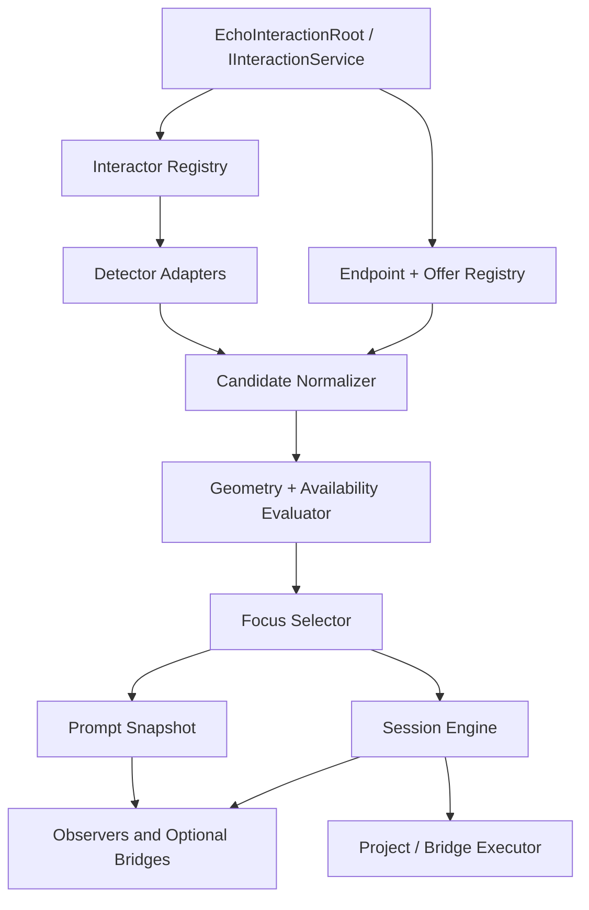

# The Hand - World Interaction Package Specification

**Working document ID:** SFGSS-PKG-ECHOINTERACTION-001  
**Specification version:** 1.0.0  
**Status:** Approved  
**Technical package name:** EchoInteraction  
**Public title:** The Hand - World Interaction  
**Package ID:** `com.echodevgames.echo-interaction`  
**Runtime namespace:** `EchoDevGames.EchoInteraction`  
**Owner:** Jesse “Echo” Adams / EchoDevGames  
**Project boundary:** Independent solo project; not an Isekai Studios product  
**Planned repository:** `EchoDevGames/EchoInteraction`  
**Current Notes:** `Plan Documentation/Current Notes.md` until the package repository is created, then `Documentation~/Developer/Current Notes.md`  
**Unity baseline:** Unity 6000.3.8f1  
**Minimum supported Unity version:** Unity 6000.0  
**Parent authority:** SFGSS-000 v0.12.0, SFGSS-001 v1.1.0, SFGSS-002 v1.0.0, SFGSS-003 v1.0.0, SFGSS-004 v1.0.0, and SFGSS-005 v1.1.0  
**Last updated:** August 4, 2026

> “Reach into the world with clear intent; let every object answer in its own voice.”

> **Approval rule:** This specification is approved as the Level 2 authority for EchoInteraction. Package implementation remains locked until SUITE-DOC-33 passes.

---

## Revision History

| Version | Date | Status | Summary | Approved by |
|---|---|---|---|---|
| 0.1.0 | 2026-08-04 | Proposed | Initial complete specification derived from SFGSS-000 through SFGSS-005 and approved package authorities through The Vault | Pending |
| 1.0.0 | 2026-08-04 | Approved | Approved detection, offers, focus, availability, prompts, interaction modes, requests, sessions, cancellation, concurrency, diagnostics, authoring, Laboratory, bridge, and release contracts | Jesse “Echo” Adams |

---

## 1. Package Identity and One-Sentence Contract

**Public title:** The Hand - World Interaction  
**Technical identifier:** EchoInteraction  
**Flavor line:** Reach into the world with clear intent; let every object answer in its own voice.  
**Plain-language subtitle:** A standalone Unity package for 2D/3D interaction discovery, normalized offers, deterministic focus, range/angle/line-of-sight/availability evaluation, prompt snapshots, tap/hold/toggle/timed/repeated requests, cancellation, concurrency, diagnostics, authoring, validation, and optional bridges.

**One-sentence ownership contract:**

> EchoInteraction owns interaction action definitions, interactor/detector/endpoint registration, normalized interaction offers, candidate freshness and deduplication, range/angle/line-of-sight/availability evaluation, deterministic focused-offer selection, semantic prompt snapshots, tap/hold/toggle/timed/repeated command and session lifecycles, cancellation and commit-point policy, bounded concurrency/reservations, diagnostics, authoring, validation, isolated 2D/3D Laboratories, and explicit bridge seams; it does not own the unique gameplay result of an interaction, input devices or bindings, production UI, audio playback, feedback execution, objective truth, inventory mutation, dialogue flow, camera control, scene loading, save transport, character movement, world-state persistence, or multiplayer authority.

### 1.1 Elevator summary

The Hand provides the neutral infrastructure between “something is near the player” and “project code performs a meaningful world action.” It detects candidate endpoints through replaceable adapters, asks each endpoint what actions it currently offers, evaluates those offers against geometric and project rules, selects one deterministic focus, exposes prompt-ready semantic data, and routes an authorized command into a bounded interaction session. A door may offer Open and Lockpick; a survivor may offer Rescue and Speak; a device point may offer Place Charge; a world item may offer Pick Up and Inspect. EchoInteraction understands the offers and their lifecycle, but not the project-specific state changes behind them.

The package uses **interaction offers** rather than treating a GameObject as one indivisible action. An offer combines one endpoint, one action definition, current availability, prompt semantics, priority, geometry, freshness, concurrency state, and a generational identity. This allows one target to expose several actions without hard-coding those actions into detectors, UI, input, or scene scripts. Focus is selected through a deterministic lexicographic policy with configurable hysteresis so small physics jitter does not make prompts flutter between candidates.

Execution remains explicit and honest. Tap, Hold, Timed, Toggle, and Repeated modes share one request/session model, but each has distinct input-lifetime and cancellation semantics. Executors are project or bridge implementations. They receive a typed context, may perform asynchronous work, and declare the point after which their result is irreversible. Cancellation before that commit point may be honored; cancellation afterward returns Too Late and preserves the committed outcome. The package never pretends it can roll back an external inventory grant, scene transition, network command, or gameplay mutation it does not own.

### 1.2 Why this belongs in The Sperk's Forge

World interaction is rebuilt in almost every project and often becomes a tangle of overlap triggers, raycasts, input polling, UI text, quest mutation, audio calls, animation triggers, and object-specific branching. The same failures recur: several colliders create duplicate prompts; focus flickers; UI decides whether an action is allowed; hold progress survives after the target disappears; one interaction partially mutates several systems; scene unload leaves subscriptions behind; and a “generic” interaction manager quietly learns every door, NPC, pickup, ladder, rescue, bomb, and crafting station in the game.

Rescuers2D already demonstrates why the concern is reusable: ladders, axe use, survivor rescue, shield actions, C4 placement, pickups, and role-specific interactions need consistent discovery and prompts while retaining project-owned outcomes. Hackulos needs NPC talk, vendors, bags, corpses, pickups, quest placement, and world devices without forcing RPG logic into the interaction package. Echo Systems Lab provides the focused-component and semantic-event precedent. The Hand captures the stable infrastructure while leaving each game’s world rules in project code or explicit bridges.

### 1.3 Verse identity boundary

| Surface | Flavor allowed? | Rule |
|---|---:|---|
| Public title | Yes | Always paired with “World Interaction.” |
| Setup guidance/tooltips | Yes | Must remain immediately understandable. |
| Samples | Optional | Hand/rune imagery may decorate Laboratories but is removable. |
| Runtime API/type names | No lore-only names | Types use `InteractionOffer`, `InteractionEndpoint`, `InteractionSession`, and similar technical names. |
| Project data | No required Verse content | Games own verbs, prompt text, icons, objects, outcomes, animations, and world rules. |

## 2. Problem Statement

### 2.1 Current problem

Projects need a consistent way to discover world actions, choose which action is currently intended, explain availability, display prompts, support short and sustained interactions, cancel safely, and route execution. Without a reusable boundary, detection scripts directly call gameplay methods, UI becomes an authorization layer, input components know target classes, and each interactable invents its own hold timer and cleanup rules.

A reusable package must support both 2D and 3D projects, multiple interactors, multiple offers per target, blocked-but-visible actions, deterministic focus, dynamic availability, input-independent command semantics, asynchronous execution, and scene-safe teardown. It must do so without becoming the owner of doors, dialogue, inventory, quests, cameras, characters, saves, or networking.

### 2.2 Evidence from existing work

| Source project/system | Existing pattern or problem | Preserve | Improve |
|---|---|---|---|
| Rescuers2D | Character-specific interactions for ladders, survivor rescue, tools, shields, and C4 | Clear action intent and role restrictions | Replace direct controller branching with offers, availability reasons, prompts, and project executors |
| Echo Systems Lab | `Interactor`/`Interactable` separation and semantic mission events | Narrow capability interfaces and event-driven presentation | Add multi-offer focus, hold/timed modes, cancellation, diagnostics, and package isolation |
| Hackulos planning | NPCs, vendors, corpses, bags, pickups, quest placement, world devices | Data-driven actions and authored world content | Keep RPG, inventory, objective, and dialogue outcomes outside the neutral core |
| The Will | Central input contexts, locks, glyph data, and rebinding | Input translates player intent | EchoInteraction consumes semantic commands rather than polling one mandatory action map |
| The Looking Glass | Prompt, tooltip, modal, and notification layers | Presentation listens to structured state | UI must not decide availability or perform world outcomes |
| The Path and The Vault | Objective and inventory authorities with atomic contracts | Explicit request/result boundaries | Successful interactions may request those systems through bridges without absorbing them |
| The Passage and Voices | Scene travel and conversation flow are separate authorities | Explicit asynchronous operations | Interaction executors may request them, but EchoInteraction never owns them |

### 2.3 Consequences of doing nothing

- Every project repeats raycast/overlap/focus/prompt code.
- Several colliders create duplicate or unstable candidate lists.
- UI text and button state become hidden gameplay authority.
- Hold and timed interactions leak when targets disable or scenes unload.
- Input code gains direct references to doors, NPCs, pickups, and devices.
- “Interaction managers” grow project-specific switch statements.
- Multiplayer, save, objective, and inventory boundaries become impossible to separate later.
- Debugging cannot explain why one target was selected or rejected.

## 3. Goals, Non-Goals, and Success Measures

### 3.1 Goals

- Provide one standalone interaction authority with injectable service seams.
- Support explicit interactor, detector, endpoint, action, offer, request, session, and result identities.
- Normalize 2D and 3D detector output into one core candidate model.
- Support several offers per endpoint.
- Evaluate range, angle, line of sight, priority, concurrency, and project availability.
- Select focus deterministically with configurable hysteresis and freshness.
- Expose semantic prompt snapshots without requiring UI, localization, audio, or input packages.
- Support Tap, Hold, Timed, Toggle, and Repeated interaction modes.
- Support cancellation, timeout, invalidation, commit points, and exact-once terminal results.
- Support multiple interactors and bounded endpoint concurrency.
- Provide reason-based block leases and development direct-scene initialization.
- Provide actionable diagnostics, setup, validation, repair, and isolated 2D/3D Laboratories.
- Preserve package removal and bridge independence.

### 3.2 Non-goals

- Implement the unique result of opening a door, rescuing a survivor, placing a device, talking to an NPC, looting a corpse, or picking up an item.
- Own input devices, bindings, action maps, glyph selection, or rebinding.
- Render production prompts or progress bars.
- Play audio, animate characters, move cameras, shake screens, or trigger rumble directly.
- Own objective, inventory, crafting, dialogue, progression, character, combat, ability, or world state.
- Load scenes or save active interaction sessions as durable truth.
- Replace a networking stack or validate remote authority in the MVP.
- Provide one universal AI interaction planner.
- Require every interaction to use physics detection; projects may register custom detectors.

### 3.3 User outcomes

| User | Starting condition | Desired outcome |
|---|---|---|
| Novice installer | Clean 2D or 3D Unity project | Import one Laboratory, create configuration, and see stable prompts and interactions without another Echo package |
| Programmer | Project-specific doors, NPCs, pickups, or devices | Implement narrow endpoint/executor contracts instead of editing package code |
| Designer | Wants to tune verb, duration, range, angle, priority, prompt, and cancellation | Author reusable action definitions and validate them before Play Mode |
| UI developer | Needs prompts and progress | Consume immutable prompt/session snapshots without owning interaction truth |
| Tester | Needs reproducible failure cases | Simulate blocked, unavailable, stale, cancelled, timed-out, busy, and saturated states |
| Maintainer | Upgrading or removing package | Preserve project-owned action/configuration assets and remove bridges cleanly |

### 3.4 Measurable success criteria

- Package installs into a clean supported Unity project with zero compile errors.
- Neutral Runtime compiles without optional Echo packages or presentation dependencies.
- Physics2D and Physics3D adapters can be installed/used independently.
- Both Standalone Laboratories prove the advertised MVP.
- Focus is deterministic under exact ties and stable under configured jitter/hysteresis tests.
- Every interaction mode reaches one terminal result under success, rejection, cancellation, timeout, destruction, and scene-unload tests.
- Stale handles and duplicate commands cannot control later sessions.
- Optional bridges can be removed without breaking core.
- Setup and repair operations are repeatable and non-destructive.
- All empirical claims remain `Not run` until executed evidence exists.

## 4. Users and Primary Use Cases

### 4.1 Intended users

- Unity developers building 2D or 3D prototypes and games.
- Designers authoring reusable interaction verbs and policies.
- Gameplay programmers implementing project-specific outcomes.
- UI/audio/feedback programmers consuming semantic interaction state.
- QA testers validating focus, cancellation, concurrency, and teardown.
- Maintainers integrating interaction with other Sperk's Forge packages.

### 4.2 Primary use cases

| ID | Use case | Actor | Preconditions | Expected result | Release phase |
|---|---|---|---|---|---|
| EITR-UC-001 | Focus a nearby action | Interactor | Detector and endpoint registered | One deterministic focused offer and prompt snapshot | MVP |
| EITR-UC-002 | Tap an interactable | Player/project adapter | Focused offer Available | Executor receives one request and one terminal result publishes | MVP |
| EITR-UC-003 | Hold to rescue/repair/use | Player/project adapter | Hold action and valid target | Progress advances while command remains active and completes/cancels safely | MVP |
| EITR-UC-004 | Start a timed action | Player/project adapter | Timed action accepted | Action continues independently of held input under authored cancellation policy | MVP |
| EITR-UC-005 | Toggle an ongoing interaction | Player/project adapter | Toggle-capable endpoint | First command starts; matching command requests stop | MVP |
| EITR-UC-006 | Repeat an action while held | Player/project adapter | Repeated action accepted | Pulses execute at bounded cadence and stop at release/limit | MVP |
| EITR-UC-007 | Show why interaction is blocked | UI/tester | Offer visible but not actionable | Structured reason appears without executor invocation | MVP |
| EITR-UC-008 | Use several verbs on one object | Designer/player | Endpoint exposes multiple offers | Each offer remains independently evaluated and identifiable | MVP |
| EITR-UC-009 | Use several local interactors | Project code | Unique interactors registered | Focus and sessions remain isolated by interactor | MVP |
| EITR-UC-010 | Protect an exclusive endpoint | Project code | Endpoint concurrency is Exclusive | Only one active reservation succeeds | MVP |
| EITR-UC-011 | Block interactions during a mode | Project/Pulse bridge | Block lease acquired | New commands reject with reasons until all applicable leases release | MVP |
| EITR-UC-012 | Replace physics discovery | Programmer | Custom detector implements contract | Core selection/execution continues without package edits | MVP |
| EITR-UC-013 | Connect input and prompt UI | Integrator | Optional bridges installed | Input phases become commands and prompt snapshots become presentation | Integration |
| EITR-UC-014 | Request inventory/objective/dialogue outcome | Project executor/bridge | Neighbor authority installed/configured | Neighbor system owns the mutation and returns a structured result | Integration |
| EITR-UC-015 | Coordinate network authority | Future provider | Convergence provider approved | Provider validates/reserves before local execution | Later |

### 4.3 Explicitly unsupported use cases

- Treating prompt visibility as proof that an action is authorized.
- Saving and resuming arbitrary in-flight interactions in the MVP.
- Automatically converting every MonoBehaviour method into an interaction through reflection.
- Using interaction action IDs as input binding IDs, localization keys, save slot IDs, or network credentials.
- Letting UI call target implementation methods directly.
- Assuming one camera, one player, one physics dimension, or one scene layout.
- Guaranteeing rollback of project effects after an executor commit point.

## 5. Authority and Ownership Boundaries

### 5.1 The package owns

- Interaction action definitions and catalogs.
- Runtime registration of interactors, detectors, endpoints, rule providers, and executors.
- Normalized offer/candidate identity and freshness.
- Geometric and project-rule evaluation orchestration.
- Focus selection, hysteresis, and focus snapshots.
- Prompt-semantic snapshots and interaction progress state.
- Interaction command admission, request IDs, sessions, modes, cancellation, timeout, and terminal results.
- Endpoint concurrency and local reservations.
- Reason-based interaction block leases.
- Standalone diagnostics, setup, validation, repair, and Laboratories.

### 5.2 The package does not own

- The unique gameplay mutation behind an interaction.
- Input devices, bindings, contexts, or glyphs.
- UI layout, prompt visuals, notifications, or focus navigation.
- Audio playback, camera movement, feedback execution, animation, or VFX.
- Inventory, objectives, progression, dialogue, crafting, characters, combat, abilities, or world-state truth.
- Scene loading, save transport, cloud storage, networking, or anti-cheat.
- Project colliders, layers, tags, prefabs, verbs, icons, text, and content.

### 5.3 Neighboring authorities

| Concern | Authoritative owner | How EchoInteraction interacts |
|---|---|---|
| Input contexts, bindings, action phases, glyphs | The Will (`EchoInput`) | Optional bridge translates input phases and enriches prompt presentation data |
| Prompt/HUD presentation | The Looking Glass (`EchoUI`) or project UI | Reads snapshots and submits commands; never authorizes outcomes |
| Localization | Many Tongues (`EchoLocalization`) | Optional bridge resolves prompt references and reasons |
| Audio playback | Resonance (`Jukebot`) | Bridge/project adapter requests semantic cues after events |
| Coordinated feedback | Impact (`EchoFeedback`) | Bridge requests focus/start/complete/fail recipes |
| Runtime mode and pause | The Pulse (`EchoGameState`) | Bridge acquires interaction blocks or applies session policy |
| Objectives and quests | The Path (`EchoObjectives`) | Project/bridge submits progress after an authored outcome succeeds |
| Items and containers | The Vault (`EchoInventory`) | Project/bridge executes pickup/container transactions |
| Dialogue | Voices (`EchoDialogue`) | Project executor requests conversation start |
| Scene travel | The Passage (`EchoSceneFlow`) | Project executor requests a route; core does not load scenes |
| Character identity/control | The Fellowship (`EchoCharacters`) | Future bridge associates interactor owner/control handoff |
| Camera targets/origins | The Eye (`EchoCamera`) or project code | Optional origin/aim helpers; no camera ownership |
| Save files | The Chronicle (`EchoSave`) | Owning systems persist outcomes; active sessions remain session-only |
| Multiplayer authority | The Convergence (`EchoMultiplayer`) | Future provider validates/reserves/executes authoritative requests |

### 5.4 Boundary tests

A proposed feature belongs in EchoInteraction only when it answers at least one of these questions:

1. What interaction actions does this endpoint currently offer?
2. Which offers are detectable, visible, available, focused, busy, or blocked?
3. What semantic prompt/session state should observers receive?
4. How should a command enter, progress, cancel, timeout, reserve, and terminate?
5. How can a project-owned executor be invoked safely without the package learning its game rule?

If the feature calculates damage, changes inventory, completes a quest, starts dialogue, moves a camera, loads a scene, saves world state, or validates a remote client, it belongs to another authority or project adapter.

## 6. Independence Contract

### 6.1 Standalone guarantees

EchoInteraction must:

- Compile with only declared Unity/platform dependencies.
- Work without First Light, Observatory, Accord, Passage, Pulse, Resonance, Will, Looking Glass, Chronicle, or any Expansion/Advanced peer.
- Keep neutral Runtime free from uGUI, TextMeshPro, Input System, Physics2D-specific, and Physics3D-specific references.
- Keep Physics2D and Physics3D adapters in separate assemblies.
- Provide manual Laboratory controls and source prompt fallbacks.
- Expose explicit registration and injection seams.
- Avoid reflection-based discovery and project-assembly references.
- Reject missing optional providers visibly and safely.
- Preserve project-owned definitions/configuration after sample or package removal.

### 6.2 Independence proof matrix

| Condition | Expected behavior | Test evidence |
|---|---|---|
| Installed alone | Core plus selected physics adapter compiles and runs | Clean-project install, Not run |
| Enter 2D Laboratory directly | Development initializer creates one root and manual controls work | EITR-LAB-003, Not run |
| Enter 3D Laboratory directly | Development initializer creates one root and manual controls work | EITR-LAB-003, Not run |
| Optional bridge absent | Core uses source semantics/fake sample controls | EITR-LAB-023/054, Not run |
| Duplicate root present | Later root rejects before side effects | EITR-LAB-002, Not run |
| Required configuration missing | Root reports Failed with diagnostic | Planned test, Not run |
| Sample content deleted | Runtime and Editor assemblies still compile | Planned test, Not run |
| Physics2D assembly removed | Core and Physics3D remain valid | Planned test, Not run |
| Physics3D assembly removed | Core and Physics2D remain valid | Planned test, Not run |

### 6.3 Allowed dependencies

| Dependency | Type | Required? | Minimum version | Reason | Removal behavior |
|---|---|---:|---|---|---|
| Unity Engine/Core modules | Platform | Yes | Unity 6000.0 | MonoBehaviour, ScriptableObject, scene lifecycle, Awaitable/main-loop integration | Package cannot function |
| Unity Physics2D module | Platform adapter | Only for Physics2D assembly/sample | Unity baseline | 2D detection and LOS adapter | Core/3D remain valid |
| Unity Physics module | Platform adapter | Only for Physics3D assembly/sample | Unity baseline | 3D detection and LOS adapter | Core/2D remain valid |
| Unity Test Framework | Test only | Yes for tests | Version verified at implementation | Automated test assemblies | Runtime unaffected |

### 6.4 Forbidden dependencies

- Another Sperk's Forge runtime package in the core package.
- Project-specific assemblies.
- Production UI or input assets.
- Samples, tests, or Editor assemblies at runtime.
- Hidden scene names, build indexes, tags, layers, input maps, Resources paths, or save files.
- Reflection that scans arbitrary project methods/components into executors.
- Durable identity based only on GameObject names, hierarchy paths, collider indexes, or Unity instance IDs.

## 7. Capability Scope

### 7.1 Capability matrix

| ID | Capability | Description | Status | MVP? | Surface | Notes |
|---|---|---|---|---:|---|---|
| EITR-CAP-001 | Authority root/service | Duplicate-safe lifecycle and injectable public service | Approved | Yes | Runtime | One application-session authority |
| EITR-CAP-002 | Action definitions/catalogs | Stable verbs, modes, timing, geometry, priority, prompts, policies | Approved | Yes | Data | Project-owned immutable assets |
| EITR-CAP-003 | Interactor registration | Stable interactor identity, origins, ownership metadata, blocks | Approved | Yes | Runtime | Several interactors supported |
| EITR-CAP-004 | Detector contract | Replaceable normalized candidate discovery | Approved | Yes | Runtime | Physics is not mandatory |
| EITR-CAP-005 | Physics2D adapter | Overlap/cast/ray discovery and LOS | Approved | Yes | Adapter/Sample | Separate assembly |
| EITR-CAP-006 | Physics3D adapter | Overlap/cast/ray discovery and LOS | Approved | Yes | Adapter/Sample | Separate assembly |
| EITR-CAP-007 | Endpoint/offers | Several current offers per endpoint | Approved | Yes | Runtime | Project executors remain external |
| EITR-CAP-008 | Candidate evaluation | Freshness, range, angle, LOS, availability, priority | Approved | Yes | Runtime | Structured reasons |
| EITR-CAP-009 | Focus selection | Deterministic ranking, tie-breaks, hysteresis, overrides | Approved | Yes | Runtime | One focus per interactor |
| EITR-CAP-010 | Prompt snapshots | Semantic prompt, mode, availability, reason, progress | Approved | Yes | Runtime | Presentation-neutral |
| EITR-CAP-011 | Tap mode | Immediate validated request/execution | Approved | Yes | Runtime | Exact-once terminal result |
| EITR-CAP-012 | Hold mode | Input-maintained progress and release/invalidation policy | Approved | Yes | Runtime | Unscaled default clock |
| EITR-CAP-013 | Timed mode | Accepted progress independent from held input | Approved | Yes | Runtime | Explicit cancellation policy |
| EITR-CAP-014 | Toggle mode | Start/active/stop session lifecycle | Approved | Yes | Runtime | Session-only active state |
| EITR-CAP-015 | Repeated mode | Bounded cadence/pulses under one session | Approved | Yes | Runtime | No unbounded per-frame calls |
| EITR-CAP-016 | Cancellation/commit | Cooperative cancellation, timeout, irreversible commit point | Approved | Yes | Runtime | Honest Too Late result |
| EITR-CAP-017 | Concurrency/reservations | Interactor admission and endpoint shared/exclusive limits | Approved | Yes | Runtime | Local only in MVP |
| EITR-CAP-018 | Block leases | Reason-based global/interactor/category blocks | Approved | Yes | Runtime | Out-of-order safe |
| EITR-CAP-019 | Diagnostics | Structured status, histories, counters, redacted export | Approved | Yes | Runtime/Editor | No Observatory requirement |
| EITR-CAP-020 | Setup/validation/repair | Non-destructive authoring and scene checks | Approved | Yes | Editor | SFGSS-005 facade later |
| EITR-CAP-021 | 2D/3D Laboratories | Independently importable proof scenes | Approved | Yes | Sample | No unrelated Echo package |
| EITR-CAP-022 | Optional bridges | Input, UI, localization, feedback, audio, state, gameplay peers | Approved | Later/when bridge ships | Bridge | Separate packages/adapters |
| EITR-CAP-023 | Network authority provider | Remote validation/reservation/execution | Deferred | No | Provider | Requires Convergence research |
| EITR-CAP-024 | Durable interaction resumption | Save/restore arbitrary in-flight sessions | Rejected for MVP | No | Runtime | Unsafe across project effects |

### 7.2 MVP capability set

The smallest complete release includes one duplicate-safe root/service, action definitions/catalogs, interactors, endpoints with several offers, custom detector contract, 2D and 3D detector adapters, geometric/project availability evaluation, deterministic focus/hysteresis, semantic prompts, all five interaction modes, command/session/cancellation/commit semantics, local concurrency/reservations, block leases, diagnostics, setup/validation, and both Standalone Laboratories.

### 7.3 Later capability set

- Provider-neutral network authority/reservation integration.
- AI interaction planning adapters.
- Multi-actor cooperative interactions.
- Rich interaction chains/graphs when proven distinct from Objectives/Dialogue.
- Radial/manual offer selection presenters.
- Animation synchronization/provider protocols.
- Device-specific spatial/VR interaction providers.
- Addressable endpoint/action-definition providers.
- Optional durable job-style interactions only after a dedicated save/authority design.

### 7.4 Deferred and rejected ideas

| Idea | Disposition | Reason | Revisit trigger |
|---|---|---|---|
| Universal project outcome switch statement | Rejected | Violates package neutrality | Never |
| Reflection-discovered interaction methods | Rejected | Hidden coupling, stripping risk, unsafe signatures | Never for core |
| One mandatory input map | Rejected | Input authority belongs to project/Will | Never |
| Prompt rendering in neutral Runtime | Rejected | UI authority belongs elsewhere | Only separate presenter package |
| Save arbitrary active sessions | Deferred/rejected MVP | External commit/rollback cannot be guaranteed | Dedicated approved durable-job model |
| Multiplayer authority in core | Deferred | Requires provider research and security model | Convergence foundation/prototypes |
| Cooperative multi-character progress | Deferred | Needs ownership and cancellation design | Fellowship/Convergence integration spec |
| Automatic scene travel or objective completion | Rejected | Neighboring authorities own truth | Project/bridge only |


## 8. Architecture Overview

### 8.1 Design model

| Layer | Contains | Must not contain |
|---|---|---|
| Definition/configuration | Action definitions, catalogs, evaluation profiles, detector policies, limits, prompt semantics | Live focus, progress, scene objects, current availability, reservations |
| Runtime authority/state | Registries, scans, candidates, evaluator, focus, commands, sessions, reservations, blocks, diagnostics | Editor code, production UI, project gameplay results |
| Adapters/providers | Physics2D/3D detection/LOS, project rules, project executors, optional bridges | Competing interaction authority |
| Presentation/feedback | Sample presenter and optional UI/audio/feedback bridges | Authorization or project outcome truth |

### 8.2 Component topology



The root owns orchestration and lifetime. Interactors own origins and command identity. Detectors only discover possible endpoints. Endpoints expose offers and executors. Evaluation is read-only. Focus is one selected offer per interactor. Sessions own progress, cancellation, reservations, and terminal results. Executors own project outcomes.

### 8.3 Authoritative root

| Question | Decision |
|---|---|
| Does the package require a persistent root? | Yes by default; injectable service permits tests/project-managed lifetime |
| Root type | `EchoInteractionRoot` |
| Duplicate behavior | First valid authority wins; duplicates reject before side effects |
| Initialization trigger | `Awake` claims only; explicit initialization validates/publishes registries |
| Shutdown behavior | Reject new commands, cancel safe sessions, release reservations/blocks, dispose registrations, invalidate handles |
| Direct-scene behavior | Development initializer creates configured root only when absent |
| Test injection seam | `IInteractionService`, clocks, detectors, rules, executors, ID factories, in-memory fixtures |

### 8.4 Lifecycle sequence

1. Claim authority without detectors, scans, subscriptions, or sessions.
2. Validate configuration, action catalogs, IDs, limits, and built-in policies.
3. Build immutable action and policy registries.
4. Initialize candidate, evaluation, focus, session, reservation, and diagnostics services.
5. Accept interactor, detector, endpoint, rule-provider, and executor registrations.
6. Enter Ready; scan/evaluate according to configured cadence.
7. Accept semantic commands, revalidate, reserve, execute, publish, and clean up.
8. Reconcile disabled/destroyed/scene-unloaded registrations.
9. On shutdown, stop scans, reject new work, cancel uncommitted sessions, finish committed policy, release all leases, and invalidate handles.

### 8.5 Failure model

| Failure | Detection point | User-visible result | Runtime fallback | Diagnostic code |
|---|---|---|---|---|
| Duplicate root | Claim | Later root disabled/destroyed | Existing authority continues | EITR-ROOT-001 |
| Missing configuration | Initialization | Blocker report | Root remains Failed | EITR-CFG-001 |
| Duplicate stable ID | Registry build | Blocker | Registry not published | EITR-ID-002 |
| Detector failure | Scan | Warning/error | Detector isolated; prior candidates expire | EITR-DET-004 |
| Missing action definition | Candidate normalization | Unavailable candidate | Candidate rejected | EITR-DATA-003 |
| Range/angle/LOS denial | Evaluation | Structured Blocked | No execution | EITR-EVAL-002 |
| Required provider missing | Evaluation | Structured Unavailable | No implicit grant | EITR-PRV-003 |
| No focused offer | Command admission | Rejected | No session | EITR-CMD-001 |
| Stale focus/session generation | Admission/control | Stale result | Refresh snapshot | EITR-SES-004 |
| Endpoint busy | Reservation | Busy result | No execution | EITR-CON-002 |
| Executor timeout/exception | Execution | Failed/cancelled result | Cleanup and release | EITR-EXE-004 |
| Cancellation after commit | Cancellation | Too Late | Committed outcome completes | EITR-CAN-003 |
| Event listener throws | Publication | Diagnostic | Authoritative state remains | EITR-EVT-002 |
| Candidate buffer saturation | Detection | Advisory | Deterministic truncation | EITR-PERF-003 |

## 9. Runtime Data and State Model

### 9.1 Definitions and configuration assets

| Type | Purpose | Stable ID? | Mutable at runtime? | Project-owned instance? |
|---|---|---:|---:|---:|
| `EchoInteractionConfiguration` | Catalogs, limits, cadences, default policies, diagnostics | Yes | No | Yes |
| `InteractionActionDefinition` | Verb/mode, timing, geometry, priority, prompt semantics, cancellation/concurrency defaults | Yes | No | Yes |
| `InteractionActionCatalog` | Explicit action definitions and aliases | Yes | No | Yes |
| `InteractionEvaluationProfile` | Range/angle/LOS, visibility, hysteresis, refresh policy | Yes | No | Yes |
| `InteractionDetectorProfile2D` | 2D query shape, layer mask, trigger, buffer, cadence | Yes | No | Yes |
| `InteractionDetectorProfile3D` | 3D query shape, layer mask, trigger, buffer, cadence | Yes | No | Yes |
| `InteractionPromptSemantic` | Source fallback, localized reference, icon/cue references | Yes | No | Yes |
| `InteractionRuleTreeDefinition` | Built-in/provider rule composition | Yes | No | Yes |

### 9.2 Runtime state

| State object | Owner | Lifetime | Reset rule | Serialization rule |
|---|---|---|---|---|
| `InteractionRuntimeRegistry` | Root | Application session | Rebuilt on initialization | Not durable |
| `InteractorRuntimeState` | Service | Registration generation | Removed/disposed/shutdown | Not durable |
| `DetectorRuntimeState` | Service | Detector registration | Removed/disposed/shutdown | Not durable |
| `EndpointRuntimeState` | Service | Endpoint registration | Removed/disposed/scene unload | Not durable |
| `InteractionOfferSnapshot` | Endpoint/evaluator | One refresh snapshot | Replaced by newer generation | Not durable |
| `InteractionCandidateSnapshot` | Candidate service | Scan freshness window | Expires/replaced | Not durable |
| `InteractionFocusSnapshot` | Focus service | Until selection changes | Replaced/cleared | Not durable |
| `InteractionSessionState` | Session engine | Request through terminal cleanup | Removed after bounded history | Not resumable in MVP |
| `InteractionReservationState` | Reservation service | Session duration | Released on every terminal path | Not durable |
| `InteractionBlockState` | Block service | Lease duration | Disposed/shutdown | Not durable |
| `InteractionDiagnosticSnapshot` | Diagnostics | Bounded development record | Trimmed/reset | Exportable redacted support record |

### 9.3 Stable identifiers

| Identity | Meaning | Durable? | Notes |
|---|---|---:|---|
| `InteractionActionId` | Reusable authored verb/policy | Yes | Independent from input/localization identity |
| `InteractionCatalogId` | Action catalog identity | Yes | Merge/validation |
| `InteractorId` | Logical interaction actor | Session or durable by project choice | Never Unity instance ID alone |
| `DetectorId` | Detector registration identity | Session | Generation protected |
| `InteractionEndpointId` | Logical endpoint identity | Session; may map to project stable world ID | Core does not persist world outcome |
| `InteractionOfferId` | Endpoint-local authored offer | Stable within endpoint contract | Combined with action/endpoint |
| `InteractionCandidateKey` | Interactor + endpoint + offer + action | Session | Deduplication/focus identity |
| `InteractionRequestId` | Idempotent command request | Bounded history | Never reused in window |
| `InteractionSessionId` | One accepted interaction lifecycle | Session/history | Generation protected |
| `InteractionPulseId` | One repeated pulse | Session | Derived from session + pulse index |
| Registration/lease handles | Root + slot + generation | No | Reject stale/foreign handles |

IDs follow SFGSS-003. Scene object references and Unity instance IDs are session implementation details, never durable identity. If a game needs persistent world identity, its endpoint/project adapter maps to EchoWorld or project-owned stable IDs.

### 9.4 Offers, candidates, and focus

An endpoint produces zero or more immutable `InteractionOfferSnapshot` values. Each offer contains endpoint/offer/action identity, executor descriptor, current semantic overrides, priority, concurrency override, provider payload references, and a generation. It contains no production UI instance and performs no state mutation during enumeration.

Detectors produce possible endpoints plus source geometry. The candidate normalizer deduplicates and joins detector data with endpoint offers. Evaluation produces structured geometry, availability, visibility, busy, and score fields. Focus selection uses a documented lexicographic order rather than one opaque float:

1. Visibility and actionable availability rank.
2. Explicit focus override, when valid.
3. Current-focus retention inside hysteresis policy.
4. Authored action/offer priority.
5. Detector-source priority.
6. Normalized distance quality.
7. Angle quality.
8. Stable endpoint, offer, and action IDs.

Blocked offers may remain focusable when authored so the player can see “Locked,” “Requires Key,” or another source/localized reason. Unavailable offers caused by missing providers may be visible in development but default hidden in production unless configured.

### 9.5 Interaction modes

- **Tap:** one accepted command immediately enters validation/reservation/execution.
- **Hold:** command must remain active until duration completes; release or invalidation follows authored cancel/pause policy.
- **Timed:** accepted command starts duration progress independent from held input; explicit cancellation/invalidation follows policy.
- **Toggle:** first command starts one active session; matching command requests stop through the executor/session contract.
- **Repeated:** one active command emits bounded child pulses at an authored interval and maximum count; every pulse has a unique ID.

All clocks are explicit. Unscaled time is the MVP default for interaction progress so pause/time-scale behavior is predictable; project clock providers may override through explicit registration. Core never polls an input device.

### 9.6 Cancellation and commit points

Executors receive an `InteractionExecutionContext` with request/session identity, interactor/endpoint/action identities, cancellation token, bounded payload access, and an explicit `MarkCommitted()` seam. Before commit, cancellation may return Cancelled and require executor cleanup. After commit, cancellation returns Too Late; the executor completes the already-authoritative result. The package does not claim to roll back external state it does not own.

### 9.7 ScriptableObject safety

Configuration, action, detector, evaluation, prompt, and rule assets remain immutable during Play Mode. Candidates, focus, progress, reservations, blocks, provider state, and diagnostics live in authority-owned runtime objects. Tests compare serialized assets before and after every Laboratory reset and interaction mode.

### 9.8 Serialization and migration

The MVP does not serialize focus or active sessions. Definition/configuration schemas carry versions and support contiguous Editor-time or project-owned migrations under SFGSS-003. Released stable action IDs use aliases/tombstones. Redacted diagnostic exports may be serialized as bounded support records. World outcomes and durable availability state are serialized by their owning systems, not EchoInteraction.

## 10. Public Runtime API

### 10.1 Public types

| Type | Kind | Responsibility | Construction/ownership |
|---|---|---|---|
| `EchoInteractionRoot` | MonoBehaviour | Claims authority and hosts default service | Package prefab/project scene |
| `IInteractionService` | Interface | Registration, snapshots, commands, blocks, diagnostics | Root or injected implementation |
| `EchoInteractionConfiguration` | ScriptableObject | Project policies and catalogs | Project-owned |
| `InteractionActionDefinition` | ScriptableObject | Reusable action contract | Project-owned |
| `InteractionActionCatalog` | ScriptableObject | Explicit action registry/aliases | Project-owned |
| `IInteractionInteractor` | Interface | Interactor identity, origins, owner metadata, active state | Project component/adapter |
| `IInteractionDetector` | Interface | Collect normalized possible endpoints | Physics/custom adapter |
| `IInteractionEndpoint` | Interface | Expose current immutable offers and pose/aim data | Project component/adapter |
| `IInteractionRuleProvider` | Interface | Read-only project availability rule | Project/bridge provider |
| `IInteractionExecutor` | Interface | Perform one project-owned interaction outcome | Project/bridge provider |
| `InteractionOfferSnapshot` | Struct/value | Endpoint's current offered action | Endpoint output |
| `InteractionCandidateSnapshot` | Struct/value | Evaluated candidate data | Service output |
| `InteractionAvailabilityResult` | Struct/value | Available/Blocked/Unavailable and reasons | Evaluator/provider output |
| `InteractionFocusSnapshot` | Struct/value | Current selected offer and prompt state | Service output |
| `InteractionPromptSnapshot` | Struct/value | Presentation-neutral semantics/progress | Service output |
| `InteractionCommand` | Struct/value | Started/Performed/Cancelled semantic command | Input/project caller |
| `InteractionRequest` | Struct/value | Validated execution request | Session engine |
| `InteractionRequestResult` | Struct/value | Accepted/rejected/busy/stale/etc. | Command admission |
| `InteractionSessionHandle` | Struct | Generational session control/query handle | Service-issued |
| `InteractionSessionSnapshot` | Struct/value | State, progress, commit, timing, reasons | Service output |
| `InteractionExecutionContext` | Class/value | Executor context and commit/cancellation seam | Session engine |
| `InteractionExecutionResult` | Struct/value | Success/failure/cancelled project result | Executor output |
| `InteractionBlockLease` | Struct/IDisposable | Reason-based block | Service-issued |
| Registration handles | Struct/IDisposable | Interactor/detector/endpoint/provider/executor lifetime | Service-issued |

### 10.2 Public methods and properties

| Member | Purpose | Preconditions | Result/failure behavior | Thread/main-loop rule |
|---|---|---|---|---|
| `Initialize(EchoInteractionConfiguration)` | Validate and enter Ready | Claimed root/service | Structured initialization result | Main thread |
| `RegisterInteractor(IInteractionInteractor)` | Add one interactor | Ready; unique ID | Disposable generational handle | Main thread |
| `RegisterDetector(InteractorId, IInteractionDetector)` | Add detector to interactor | Ready; valid interactor | Disposable handle or rejection | Main thread |
| `RegisterEndpoint(IInteractionEndpoint)` | Add endpoint/offers | Ready; unique registration | Disposable handle or rejection | Main thread |
| `RegisterRuleProvider(IInteractionRuleProvider)` | Add project availability provider | Ready; unique provider ID | Disposable handle | Main thread |
| `RegisterExecutor(IInteractionExecutor)` | Add executor by descriptor/provider ID | Ready; unique provider ID | Disposable handle | Main thread |
| `TryGetFocus(InteractorId, out InteractionFocusSnapshot)` | Read current focus | Ready | False when none/missing | Main thread; snapshot only |
| `GetPromptSnapshot(InteractorId)` | Read semantic prompt/session state | Ready | Empty/disabled snapshot when none | Main thread |
| `SubmitCommand(InteractionCommand)` | Admit/start/control/cancel session | Ready; valid interactor/request | Structured result and optional handle | Main thread |
| `TryGetSession(InteractionSessionHandle, out InteractionSessionSnapshot)` | Query active/history state | Valid handle | False for stale/foreign | Main thread |
| `Cancel(InteractionSessionHandle, InteractionCancelReason)` | Request cooperative cancellation | Active valid session | Cancelled/TooLate/Rejected | Main thread |
| `AcquireBlock(InteractionBlockRequest)` | Block selected interaction scope | Ready | Disposable lease | Main thread |
| `RefreshInteractor(InteractorId)` | Request immediate bounded rescan/evaluation | Ready | Accepted/throttled/rejected | Main thread |
| `CreateDiagnosticSnapshot(RedactionPolicy)` | Export bounded support state | Ready/Failed | Structured redacted DTO | Main thread capture; detached serialization optional |
| `Shutdown()` | Stop and clean up | Any initialized state | Structured terminal status | Main thread |

### 10.3 Events and callbacks

| Event | Raised by | Timing | Payload | Listener assumptions |
|---|---|---|---|---|
| `OnReadyChanged` | Root/service | After state commit | Initialization snapshot | Listener failure isolated |
| `OnCandidateSetChanged` | Candidate service | After immutable snapshot publication | Interactor + candidate summary | No project mutation required |
| `OnFocusChanged` | Focus service | Lost then gained after selection commit | Previous/current focus | UI/audio may observe |
| `OnPromptChanged` | Prompt service | After focus/session/availability change | Prompt snapshot | Presentation-neutral |
| `OnSessionStarted` | Session engine | After admission/reservation commit | Session snapshot | Exact once |
| `OnSessionProgressed` | Session engine | Throttled after progress commit | Session/progress snapshot | Not per-frame by default |
| `OnSessionCommitted` | Execution context | After executor marks irreversible point | Session snapshot | Exact once |
| `OnSessionCompleted` | Session engine | After cleanup/result commit | Terminal result | Exact once |
| `OnSessionCancelled` | Session engine | After cancellation cleanup | Terminal result | Exact once |
| `OnSessionFailed` | Session engine | After failure cleanup | Terminal result | Exact once |
| `OnBlockStateChanged` | Block service | After lease mutation | Structured block snapshot | No input authority |

Events are raised after authoritative state changes. Listener exceptions are caught, diagnosed, and never roll back focus/session truth.

### 10.4 Async and cancellation policy

Executor work uses a Unity-compatible asynchronous abstraction based on the suite's Unity 6 `Awaitable` direction. Executors must document main-thread/background behavior and cannot access Unity objects from background threads. One executor invocation is single-consumption. Timeouts are measured by an injected clock. Cancellation is cooperative before commit and advisory/Too Late afterward. Scene destruction, endpoint removal, interactor removal, shutdown, and explicit caller cancellation follow the same terminal-cleanup contract.

### 10.5 API ergonomics

The novice path uses a setup-created root, one action definition, one `InteractionInteractor`, one Physics2D/3D detector, one `InteractionEndpoint` component, and one sample executor. The advanced path injects `IInteractionService`, custom detectors, rule providers, executors, clocks, and project adapters. Static convenience access may exist as a documented facade, but it is never the only API or test seam.

## 11. Editor Tooling and Authoring Experience

### 11.1 Setup workflow

1. Install the package.
2. Open **Tools > EchoDevGames > The Hand > Setup**.
3. Choose Core only, 2D, 3D, or both adapters.
4. Select/create project output folder.
5. Preview configuration, catalog, root prefab, detector profile, layers/masks, and scene changes.
6. Apply create-only-safe operations.
7. Open the selected Standalone Laboratory.
8. Run validation and inspect the setup receipt.

### 11.2 Setup operations

| Operation | Creates | Modifies | Repeats safely? | Undo/backup | Report output |
|---|---|---|---:|---|---|
| Create core configuration | Config/catalog/action assets | Nothing existing by default | Yes | Undo/create receipt | Setup report |
| Create canonical root prefab | Root prefab | Nothing existing | Yes | Undo | Setup report |
| Add 2D interactor/adapter | Components/profile | Selected scene object only after preview | Yes | Undo | Scene change receipt |
| Add 3D interactor/adapter | Components/profile | Selected scene object only after preview | Yes | Undo | Scene change receipt |
| Create endpoint template | Project-owned prefab/component template | Nothing existing | Yes | Undo | Creation receipt |
| Repair safe references | Missing assignments only | Selected assets/scenes | Yes | Undo and before/after report | Repair report |
| Generate validation snapshot | None | None | Yes | N/A | Portable report |

No operation silently creates project layers/tags, overwrites prefabs/scenes, changes input assets, or deletes authored data.

### 11.3 Inspectors and windows

| Tool | User | Purpose | Runtime dependency? |
|---|---|---|---:|
| Hand Setup Window | Installer | Preview/apply setup | No |
| Action Definition Inspector | Designer | Mode/timing/geometry/prompt/policy authoring | No |
| Action Catalog Inspector | Designer | ID/alias/duplicate validation | No |
| Interactor/Detector Inspectors | Developer | Origins, masks, buffers, cadence, debug visualization | No |
| Endpoint Inspector | Designer/developer | Offers, executor descriptors, aim points, concurrency | No |
| Runtime Monitor | Tester | Candidates, focus, score fields, sessions, blocks, timings | Editor-only observer |
| Interaction Simulator | Tester | Force blocked/unavailable/busy/timeout/cancel cases | No production dependency |

### 11.4 Validation and repair

| Check ID | Condition | Severity | Fix available? | Safe auto-fix? |
|---|---|---|---:|---:|
| EITR-VAL-001 | Missing configuration/root | Blocker | Yes | Create-only |
| EITR-VAL-002 | Duplicate roots | Blocker | Guided | No destructive auto-fix |
| EITR-VAL-003 | Empty/duplicate action ID | Blocker | Guided | Only unreleased empty IDs |
| EITR-VAL-004 | Invalid mode timing/range/angle | Error | Guided | Safe clamps only before approval |
| EITR-VAL-005 | Missing action catalog reference | Error | Yes | Assign/create with preview |
| EITR-VAL-006 | Invalid detector mask/origin/buffer | Error | Guided | Some fields |
| EITR-VAL-007 | Endpoint duplicate offer IDs | Error | Guided | Only unreleased IDs |
| EITR-VAL-008 | Missing executor descriptor/provider | Warning/Error by requiredness | No | No |
| EITR-VAL-009 | Required rule provider missing | Warning/Error | No | No |
| EITR-VAL-010 | 2D endpoint used by 3D-only adapter or inverse | Warning | Guided | No |
| EITR-VAL-011 | Unsafe unbounded limits | Blocker | Yes | Apply approved defaults with consent |
| EITR-VAL-012 | Sample/project assets inside immutable package source | Warning | Guided move | No silent move |
| EITR-VAL-013 | Released ID changed without alias | Blocker | Guided | No |
| EITR-VAL-014 | Diagnostics/prompt may expose production text | Warning | Guided | No |
| EITR-VAL-015 | Unsupported bridge/provider version | Error | No | No |
| EITR-VAL-016 | Setup facade contract missing after Workshop integration ships | Error | Generate package-owned facade shell only when authorized | No |

## 12. Installation, Scene Setup, and Direct Testing

### 12.1 Installation routes

Planned support:

- Unity Package Manager Git URL.
- Local package path.
- Tarball.
- Embedded package development.
- Workshop selection after its setup facade is implemented.

Registry publication remains future evidence. Every route is `Planned/Not run` until executed.

### 12.2 Minimal scene setup

Core-only custom detector path:

1. One configured `EchoInteractionRoot` or injected service.
2. One project-owned configuration/action catalog.
3. One interactor registration.
4. One custom detector registration.
5. One endpoint exposing at least one offer.
6. One executor registration.
7. A project caller submitting semantic commands.

Physics path adds one 2D or 3D detector adapter and compatible colliders/aim points.

### 12.3 Boot-scene setup

Normal production setup places the canonical root in the project Boot/preload scene or creates it through First Light when that bridge exists. The root claims before side effects and persists only according to project configuration. Endpoints/interactors remain scene/project objects and self-register after authority Ready.

### 12.4 Direct-scene setup

`EchoInteractionDirectSceneInitializer` may create the configured development root only when absent, clearly marks the session as development-initialized, and can be excluded/disabled in release builds. It is not a second production bootstrap.

### 12.5 Scene isolation rule

- **2D Standalone Laboratory** depends only on core, Physics2D adapter, declared Unity dependencies, and redistributable sample assets.
- **3D Standalone Laboratory** depends only on core, Physics3D adapter, declared Unity dependencies, and redistributable sample assets.
- Integration scenes for Will/UI/Inventory/Objectives/etc. are separate bridge evidence.
- A combined showcase never replaces either standalone proof.

## 13. Standalone Test Lab and Samples

### 13.1 Standalone Laboratory purpose

The package ships two independent Laboratories:

- **Hand Interaction 2D Laboratory:** overlap/cast discovery, 2D LOS, multi-collider dedupe, focus/hysteresis, all modes, cancellation, exclusive/shared endpoints, blocks, teardown, saturation.
- **Hand Interaction 3D Laboratory:** ray/overlap discovery, 3D LOS, aim points, the same core session/concurrency contracts, and adapter isolation.

Both use sample executors that modify only sample-local state. Neither requires another Echo package.

### 13.2 Required Laboratory contents

- Visible instructions and package/version/status readout.
- Manual semantic command controls independent from The Will.
- Plain prompt/focus/session diagnostic presentation independent from The Looking Glass.
- Several endpoints with multiple offers.
- Available, blocked, unavailable, busy, disabled, occluded, out-of-range, and stale cases.
- Tap, Hold, Timed, Toggle, and Repeated demonstrations.
- Duplicate-root, target-destruction, scene-unload, timeout, cancellation, late-commit, and reset controls.
- Candidate/LOS/buffer stress controls.
- Definition-immutability and cleanup checks.

### 13.3 Laboratory acceptance checklist

| Test | Action | Expected result | Automated/manual | Status |
|---|---|---|---|---|
| EITR-LAB-001 | Initialize one configured root | Root becomes Ready with no candidates, focus, sessions, or providers beyond built-ins | Manual unless automated later | Not run |
| EITR-LAB-002 | Introduce a duplicate root before initialization | Duplicate is rejected before detector registration, subscriptions, scans, or session work | Manual unless automated later | Not run |
| EITR-LAB-003 | Start either Laboratory scene directly | Development initializer creates only the missing configured authority | Manual unless automated later | Not run |
| EITR-LAB-004 | Delete the sample prompt presenter | Detection, focus, commands, and diagnostics remain available through the API | Manual unless automated later | Not run |
| EITR-LAB-005 | Load an empty action catalog | Root reaches Ready with an actionable empty-catalog advisory | Manual unless automated later | Not run |
| EITR-LAB-006 | Load duplicate action IDs | Validation blocks publication and identifies every conflicting asset | Manual unless automated later | Not run |
| EITR-LAB-007 | Load an invalid duration or repeat interval | Validation blocks the action and reports the exact field | Manual unless automated later | Not run |
| EITR-LAB-008 | Enter the 2D detector volume | A normalized candidate appears from the Physics2D adapter | Manual unless automated later | Not run |
| EITR-LAB-009 | Aim the 3D detector at a target | A normalized candidate appears from the Physics3D adapter | Manual unless automated later | Not run |
| EITR-LAB-010 | Detect the same endpoint through two detectors | Candidate deduplication retains one offer with deterministic source metadata | Manual unless automated later | Not run |
| EITR-LAB-011 | Disable an endpoint while detected | Its offers leave the candidate set without stale focus | Manual unless automated later | Not run |
| EITR-LAB-012 | Move outside authored range | Offer becomes non-actionable or disappears according to visibility policy | Manual unless automated later | Not run |
| EITR-LAB-013 | Rotate outside authored angle | Angle rule rejects the offer without changing target state | Manual unless automated later | Not run |
| EITR-LAB-014 | Place an occluder between interactor and target | Line-of-sight rule blocks the offer with a structured reason | Manual unless automated later | Not run |
| EITR-LAB-015 | Return a known project-state denial | Offer remains focusable when authored to show a blocked prompt | Manual unless automated later | Not run |
| EITR-LAB-016 | Remove a required availability provider | Offer becomes Unavailable rather than silently executable | Manual unless automated later | Not run |
| EITR-LAB-017 | Present two valid offers with different priorities | Higher authored priority wins deterministically | Manual unless automated later | Not run |
| EITR-LAB-018 | Present an exact score tie | Stable action, endpoint, and interactor IDs resolve the tie | Manual unless automated later | Not run |
| EITR-LAB-019 | Move two close candidates around the switch threshold | Focus hysteresis prevents prompt flutter | Manual unless automated later | Not run |
| EITR-LAB-020 | Invalidate the focused offer | Focus moves to the next eligible offer or clears exactly once | Manual unless automated later | Not run |
| EITR-LAB-021 | Read the focused prompt snapshot | Snapshot exposes semantic action, target, availability, mode, and progress data | Manual unless automated later | Not run |
| EITR-LAB-022 | Use localization references with source fallback | Core returns references/fallback without requiring Many Tongues | Manual unless automated later | Not run |
| EITR-LAB-023 | Run with The Will and Looking Glass absent | Manual sample controls and plain diagnostics prove standalone operation | Manual unless automated later | Not run |
| EITR-LAB-024 | Perform a Tap interaction | One validated execution completes and publishes one terminal result | Manual unless automated later | Not run |
| EITR-LAB-025 | Tap a blocked offer | Request is rejected with reasons and executor is never called | Manual unless automated later | Not run |
| EITR-LAB-026 | Maintain a Hold command through its duration | Progress reaches completion and execution commits once | Manual unless automated later | Not run |
| EITR-LAB-027 | Release Hold before completion | Session cancels according to policy without committing the project result | Manual unless automated later | Not run |
| EITR-LAB-028 | Lose range or line of sight during Hold | Session cancels or pauses according to the authored invalidation policy | Manual unless automated later | Not run |
| EITR-LAB-029 | Start a Timed interaction and release input | Progress continues independently and completes once | Manual unless automated later | Not run |
| EITR-LAB-030 | Explicitly cancel a Timed interaction before commit | Executor receives cancellation and state returns to idle | Manual unless automated later | Not run |
| EITR-LAB-031 | Start a Toggle interaction | Endpoint enters an active toggle session and exposes active prompt state | Manual unless automated later | Not run |
| EITR-LAB-032 | Submit the matching Toggle command again | Stop request closes the session through the same endpoint contract | Manual unless automated later | Not run |
| EITR-LAB-033 | Maintain a Repeated command | Bounded pulses execute at authored cadence with unique pulse IDs | Manual unless automated later | Not run |
| EITR-LAB-034 | Reach the authored repeat maximum | Repeated session stops without an extra pulse | Manual unless automated later | Not run |
| EITR-LAB-035 | Start a second session from one interactor | Admission policy rejects or replaces according to configuration | Manual unless automated later | Not run |
| EITR-LAB-036 | Target an exclusive endpoint from two interactors | Only one reservation succeeds and the other receives Busy | Manual unless automated later | Not run |
| EITR-LAB-037 | Target a shared endpoint from two interactors | Both sessions proceed when endpoint concurrency permits | Manual unless automated later | Not run |
| EITR-LAB-038 | Use a stale session handle after completion | Handle is rejected and cannot control a later recycled session | Manual unless automated later | Not run |
| EITR-LAB-039 | Destroy the target during an active session | Session cancels safely and releases reservations and progress state | Manual unless automated later | Not run |
| EITR-LAB-040 | Unload a scene containing endpoints | Scene-bound registrations and sessions reconcile without leaks | Manual unless automated later | Not run |
| EITR-LAB-041 | Make the executor return failure | Session ends Failed with structured reasons and no hidden retry | Manual unless automated later | Not run |
| EITR-LAB-042 | Let an executor exceed its timeout | Session cancels or fails by policy and diagnostics identify the endpoint | Manual unless automated later | Not run |
| EITR-LAB-043 | Cancel before the executor commit point | Cancellation is honored and result remains uncommitted | Manual unless automated later | Not run |
| EITR-LAB-044 | Cancel after the executor commit point | Cancellation returns Too Late and authoritative completion is preserved | Manual unless automated later | Not run |
| EITR-LAB-045 | Acquire an interaction block lease | Addressed interactors stop accepting new commands while state stays observable | Manual unless automated later | Not run |
| EITR-LAB-046 | Release several block leases out of order | Interaction resumes only after the last applicable lease is gone | Manual unless automated later | Not run |
| EITR-LAB-047 | Transfer an interactor owner or controlled character | Registration updates without duplicating interactor identity or sessions | Manual unless automated later | Not run |
| EITR-LAB-048 | Export a redacted diagnostic snapshot | Snapshot includes IDs, states, counts, timings, and reasons but no production prompt text | Manual unless automated later | Not run |
| EITR-LAB-049 | Reset either Laboratory repeatedly | Every run returns to a deterministic baseline without mutating definition assets | Manual unless automated later | Not run |
| EITR-LAB-050 | Exceed the 2D candidate buffer | Adapter truncates deterministically and reports saturation without allocation storms | Manual unless automated later | Not run |
| EITR-LAB-051 | Exceed the 3D candidate buffer | Adapter truncates deterministically and reports saturation without corrupting focus | Manual unless automated later | Not run |
| EITR-LAB-052 | Lower scan and availability refresh rates | Focus and prompt updates obey configured cadence and freshness limits | Manual unless automated later | Not run |
| EITR-LAB-053 | Throw from an event listener | Authoritative focus/session state remains committed and the listener failure is isolated | Manual unless automated later | Not run |
| EITR-LAB-054 | Disable every optional bridge | Core, Physics2D, Physics3D, fake executors, and source prompts continue independently | Manual unless automated later | Not run |
| EITR-LAB-055 | Use Enter Play Mode without domain reload | Static authority and registration state reset through explicit hooks | Manual unless automated later | Not run |
| EITR-LAB-056 | Shut down with active sessions and registrations | New work stops, safe cancellation runs, reservations release, and handles invalidate | Manual unless automated later | Not run |

### 13.4 Optional showcase and integration samples

| Sample | Packages involved | Purpose | Why it is not standalone proof |
|---|---|---|---|
| Hand + Will + Looking Glass | Interaction, Input, UI | Input-driven prompt and hold progress | Depends on two peers/bridge |
| Hand + Vault pickup | Interaction, Inventory | Atomic world pickup request | Inventory owns mutation |
| Hand + Path objective | Interaction, Objectives | Submit progress after project outcome | Objectives owns progress |
| Hand + Voices NPC | Interaction, Dialogue | Start conversation through executor | Dialogue owns flow |
| Hand + Impact/Resonance | Interaction, Feedback/Audio | Semantic feedback on focus/results | Providers own presentation |

## 14. Presentation, UI, and Accessibility

### 14.1 Presentation ownership

Core presentation is limited to immutable semantic snapshots and sample diagnostics. Production prompts, progress bars, icons, world-space markers, denied messages, colors, animations, fonts, and navigation belong to The Looking Glass or project UI. Many Tongues resolves references; The Will resolves glyphs; Resonance and Impact perform feedback through bridges.

### 14.2 Required states

Prompt/session data must distinguish:

- No candidate.
- Focused and Available.
- Focused but Blocked.
- Unavailable because a required provider is absent/failed.
- Busy/reserved.
- Hold/Timed progress.
- Toggle active/stopping.
- Repeated pulse count.
- Cancelled.
- Failed.
- Completed.
- Disabled by block policy.

### 14.3 Accessibility requirements

- Prompt data includes text/reference and semantic icon/cue alternatives.
- Status never relies on color alone.
- Hold duration and repeat cadence are authored/configurable and may be modified by project accessibility policy before command submission, without mutating shared definitions.
- Presenters may suppress motion and flash independently.
- Input bridge supports hold/toggle preference mapping while core preserves semantic mode contract.
- Blocked reasons are structured for readable presentation.
- Progress snapshots are bounded and screen-reader-friendly through presentation adapters.

### 14.4 Visual customization

All production visuals are project-owned and replaceable without editing core Runtime. Sample visuals are deliberately plain and removable.

## 15. Diagnostics and Observability

### 15.1 Standalone diagnostics

| Diagnostic | Surface | Release availability | Cost |
|---|---|---|---|
| Root/configuration status | API/Inspector/report | All, redacted | Low |
| Interactor/detector/endpoint registry | API/Editor monitor | Development | Low/medium |
| Candidate/focus score breakdown | Editor monitor/snapshot | Development | Configurable |
| Session/reservation/block state | API/monitor | Development; limited release | Low |
| Scan/evaluation/LOS/execution timing | Counters/report | Development | Configurable |
| Saturation/timeout/provider failures | Diagnostic codes | All | Low |
| Redacted support snapshot | Explicit export | Development/support | Bounded |

### 15.2 Structured status

The service exposes:

- Initialization/root/configuration identity.
- Registered interactors, detectors, endpoints, offers, rule providers, executors.
- Candidate counts, truncation, freshness, evaluation outcomes.
- Focused offer and score fields per interactor.
- Prompt/session mode, progress, state, commit status, terminal reason.
- Active reservations, blocks, queue depth, timeouts, cancellation reasons.
- Package/Unity version and optional bridge/provider status.

### 15.3 Diagnostic codes

| Code | Severity | Meaning | User action |
|---|---|---|---|
| EITR-ROOT-001 | Error | Duplicate root rejected | Remove duplicate setup/scene root |
| EITR-CFG-001 | Blocker | Required configuration missing/invalid | Run setup/validator |
| EITR-ID-002 | Blocker | Stable ID collision | Repair before implementation/release |
| EITR-DET-004 | Error | Detector failed | Inspect adapter/provider |
| EITR-PERF-003 | Warning | Candidate/query buffer saturated | Increase bounded capacity or narrow detection |
| EITR-EVAL-002 | Info/Warning | Geometric/rule evaluation blocked | Inspect structured reason |
| EITR-PRV-003 | Warning/Error | Required provider unavailable | Install/register provider or change requiredness |
| EITR-CMD-001 | Info | Command rejected because no valid focus | Refresh/inspect prompt state |
| EITR-SES-004 | Warning | Stale/foreign session handle | Refresh caller snapshot/handle |
| EITR-CON-002 | Info | Endpoint busy/reservation denied | Wait or adjust concurrency |
| EITR-EXE-004 | Error | Executor timeout/exception | Inspect project executor |
| EITR-CAN-003 | Info | Cancellation arrived after commit | Treat committed result as authoritative |
| EITR-EVT-002 | Warning | Listener threw after commit | Fix observer; state remains valid |
| EITR-DATA-003 | Error | Offer references missing action | Repair endpoint/catalog |

### 15.4 Observatory bridge

A separate bridge publishes root health, registration counts, candidate/focus summaries, scan/evaluation timings, saturation, active sessions, reservations, blocks, timeout/failure history, and redacted reasons. Core never references The Observatory.

### 15.5 Logging policy

- Stable `EITR-*` codes.
- No per-frame normal logs.
- Repeated issues rate-limited and aggregated.
- Production prompt text, executor payloads, typed input, hierarchy paths, and private provider data excluded/redacted.
- Development verbosity separable from release diagnostics.

## 16. Persistence and Save Integration

### 16.1 Persistence classification

| State | Scope | Owner | Saved? | Backend |
|---|---|---|---:|---|
| Action/configuration definitions | Project asset | Project/EchoInteraction schema | Yes as assets | Unity assets |
| Focus/candidates | Session | EchoInteraction | No | Runtime only |
| Active sessions/progress | Session | EchoInteraction | No MVP | Runtime only |
| Reservations/blocks | Session | EchoInteraction | No | Runtime only |
| World outcome state | Project/neighbor system | Door/Inventory/Objectives/World/etc. | As owner decides | Chronicle/project provider |
| Diagnostic export | Development/support | EchoInteraction | Optional explicit | Redacted JSON/report |

### 16.2 Standalone behavior

Without The Chronicle or The Accord, EchoInteraction functions normally. It does not silently choose a save filename or PlayerPrefs key. Every play session begins with no focus, sessions, reservations, or blocks. Project endpoints derive availability from their owning runtime state.

### 16.3 Optional participant/provider contract

No general EchoSave participant is required for MVP because interaction runtime state is not durable truth. A future bridge may persist carefully approved package-level preferences or durable-job records only after an integration specification. Normal door-open, pickup, objective, dialogue, and world state is saved by the owner that performed it.

### 16.4 Failure and recovery

- Missing package configuration blocks initialization.
- Missing project availability/executor providers produce structured Unavailable/Failed results.
- Removing/reinstalling the package preserves project-owned definitions/configuration when the project retains them.
- Active sessions are cancelled on shutdown/reload; they are not guessed back into existence.
- Released definition migrations preserve source assets/backups under SFGSS-003.

## 17. Integration and Bridge Contracts

### 17.1 Integration philosophy

Optional connections are explicit, versioned, removable, and directionally visible under SFGSS-002. Installing a peer package never silently changes core behavior. Project executors remain the ordinary seam for unique outcomes.

### 17.2 Planned integrations

| Other authority | Connection type | Owner of bridge | Direction | Data/events exchanged | Required? |
|---|---|---|---|---|---:|
| The Will | Separate bridge | Bridge package | Input -> Interaction; prompt metadata back | Semantic action phases, interactor command IDs, optional binding references | No |
| The Looking Glass | Separate bridge | Bridge package | Interaction -> UI; commands back | Focus/prompt/session snapshots, command requests | No |
| Many Tongues | Tiny presenter/bridge integration | Localization/UI bridge | References -> resolved text | Localized references/reasons | No |
| Resonance | Separate/project bridge | Bridge/project | Events -> Audio | Semantic cue requests | No |
| Impact | Separate bridge | Bridge package | Events -> Feedback | Focus/start/progress/terminal signals | No |
| The Pulse | Separate bridge | Bridge package | Runtime state -> block/session policy | Block leases and policy requests | No |
| The Path | Project/separate bridge | Project/bridge | Successful outcome -> Objectives | Stable progress request IDs | No |
| The Vault | Project/separate bridge | Project/bridge | Executor -> Inventory | Atomic pickup/container transaction/result | No |
| Voices | Project/separate bridge | Project/bridge | Executor -> Dialogue | Conversation start/result | No |
| The Fellowship | Future bridge | Bridge package | Character/control -> interactor | Owner/control handoff metadata | No |
| The Eye | Project adapter | Project | Camera/aim helper -> interactor | Origin/aim transforms or pose snapshots | No |
| The Chronicle | Project integration | Owning system | Outcome state -> Save | No active interaction session payload | No |
| The Convergence | Provider adapter | Multiplayer package/provider | Network authority <-> Interaction | validation, reservation, authoritative result | No |

### 17.3 Bridge placement decision

- Input/UI/Pulse/Impact/Character bridges are separate two-package bridge packages when they reference both runtimes.
- Audio, objective, inventory, dialogue, camera, and scene outcomes may remain project-local adapters unless a repeatable distributed bridge proves justified.
- Physics2D/3D adapters are package-owned technical adapter assemblies because they connect one package to Unity modules, not optional Echo peers.
- Networking authority is a provider adapter under The Convergence, never hidden in core.

### 17.4 Integration failure behavior

Missing bridges leave core unchanged. Missing required project providers yield Unavailable/Failed results. Version mismatch blocks bridge registration with a diagnostic. Bridge disposal removes subscriptions/providers and releases leases. Removing the core requires bridges first. Project outcome state remains owned by the neighboring system and is not deleted by bridge removal.

## 18. Performance and Resource Policy

### 18.1 Performance targets

All targets are proposed until measured.

| Metric | Proposed target | Measurement scene/tool | Release threshold |
|---|---|---|---|
| Idle core overhead | Negligible when no interactors/detectors | Profiler/Observatory bridge | Measured before stable |
| Scan allocations | Zero managed allocations per steady-state scan after warmup | 2D/3D Labs + Profiler | No recurring avoidable allocation |
| Focus/evaluation time | Bounded at advertised candidate/provider counts | Stress controls | Published measured limit |
| Prompt/session publication | Throttled/bounded | Lab counters | No unbounded per-frame events |
| History memory | Fixed configured caps | Diagnostic snapshot | Never unbounded |

### 18.2 Allocation policy

- Non-alloc physics queries and reusable buffers where supported.
- No LINQ/reflection in scan/evaluation/session hot paths.
- Immutable public snapshots may copy into bounded structs/arrays; live mutable collections are never exposed.
- Expensive provider/LOS work is budgeted and cached only with explicit freshness/invalidation rules.
- Repeated interaction pulses are interval-based and bounded.

### 18.3 Scene and domain reload behavior

- Scene unload removes scene-bound endpoints/detectors/interactors and cancels affected uncommitted sessions.
- Every registration and event subscription is disposable/idempotent.
- Static authority resets under supported Enter Play Mode options.
- Persistent root does not retain destroyed scene references.
- Tests cover domain reload enabled/disabled and direct-scene starts.

### 18.4 Scalability limits

Configuration explicitly bounds interactors, detectors per interactor, endpoints/offers, candidates per detector/interactor, provider calls, LOS checks, active/queued sessions, reservations, repeat pulses, events, and diagnostic history. Exceeding a limit returns truncation/rejection/advisory, never unbounded growth.

## 19. Security, Privacy, and Platform Considerations

### 19.1 Data sensitivity

Core handles no credentials, analytics, purchases, personal identity, or network secrets. It may observe semantic action IDs, endpoint IDs, positions/distances, availability reasons, and timing. Diagnostic exports redact production prompt text, executor payloads, hierarchy paths, typed input, platform account data, and provider-private details by default.

### 19.2 Trust boundaries

- Availability and prompts are not security authorization.
- Project executors validate their own domain preconditions immediately before commit.
- Future network providers validate remote requests authoritatively.
- External/provider payloads are bounded and typed.
- Reflection-based arbitrary method invocation is forbidden.
- Stale request/session/reservation/registration generations are rejected.
- Scene object destruction never implies a successful project outcome.

### 19.3 Platform behavior

| Platform | Supported? | Special behavior | Validation required |
|---|---:|---|---|
| Windows | Planned | Standard 2D/3D physics | Clean install, Labs, Player build |
| macOS | Planned | Same core; verify physics/input bridge behavior | Clean install, Labs, Player build |
| Linux | Planned | Same core; verify build/runtime | Clean install, Labs, Player build |
| WebGL | Planned/conditional | Main-thread execution; async/provider limits | Player build and both relevant Labs |
| Mobile | Planned | Touch/input presentation external; physics budgets | Device tests |
| Console | Unknown/planned later | Platform certification/provider concerns | Approved hardware/provider evidence |
| XR | Deferred | Requires spatial detector/presenter/provider design | Dedicated specification/prototype |

No platform is claimed Supported until SFGSS-004 evidence exists.

## 20. Package and Repository Structure

### 20.1 Required package anatomy

```text
Packages/com.echodevgames.echo-interaction/
├── package.json
├── README.md
├── CHANGELOG.md
├── LICENSE.md
├── Third Party Notices.md
├── Documentation~/
├── Runtime/
│   ├── Core/
│   ├── Data/
│   ├── Registration/
│   ├── Candidates/
│   ├── Evaluation/
│   ├── Focus/
│   ├── Sessions/
│   ├── Diagnostics/
│   └── EchoDevGames.EchoInteraction.Runtime.asmdef
├── Runtime.Physics2D/
│   ├── Detection/
│   ├── LineOfSight/
│   └── EchoDevGames.EchoInteraction.Physics2D.asmdef
├── Runtime.Physics3D/
│   ├── Detection/
│   ├── LineOfSight/
│   └── EchoDevGames.EchoInteraction.Physics3D.asmdef
├── Editor/
│   ├── Setup/
│   ├── Validation/
│   ├── Inspectors/
│   ├── Monitoring/
│   └── EchoDevGames.EchoInteraction.Editor.asmdef
├── Samples~/
│   ├── Standalone Labs/
│   │   ├── Hand Interaction 2D Lab/
│   │   └── Hand Interaction 3D Lab/
│   └── Integration Labs/
└── Tests/
    ├── Editor/
    ├── Runtime/
    ├── Physics2D/
    └── Physics3D/
```

### 20.2 Proposed source tree

```text
Runtime/Core/
    EchoInteractionRoot.cs
    IInteractionService.cs
    EchoInteractionService.cs
Runtime/Data/
    EchoInteractionConfiguration.cs
    InteractionActionDefinition.cs
    InteractionActionCatalog.cs
    InteractionEvaluationProfile.cs
Runtime/Registration/
    InteractorRegistry.cs
    EndpointRegistry.cs
    ProviderRegistry.cs
Runtime/Candidates/
    InteractionCandidate.cs
    CandidateNormalizer.cs
    CandidateBuffer.cs
Runtime/Evaluation/
    InteractionEvaluator.cs
    InteractionAvailabilityResult.cs
    InteractionScore.cs
Runtime/Focus/
    InteractionFocusSelector.cs
    InteractionFocusSnapshot.cs
Runtime/Sessions/
    InteractionCommand.cs
    InteractionSessionEngine.cs
    InteractionExecutionContext.cs
    InteractionSessionHandle.cs
Runtime/Diagnostics/
    InteractionDiagnosticSnapshot.cs
```

File names are proposed architecture, not implementation authorization.

### 20.3 Assembly definitions

| Assembly | Platform | References | Auto referenced? | Purpose |
|---|---|---|---:|---|
| `EchoDevGames.EchoInteraction.Runtime` | Runtime | Unity core only | Yes for consumer convenience; revisit suite consistency gate | Neutral interaction authority |
| `EchoDevGames.EchoInteraction.Physics2D` | Runtime | Core + Unity Physics2D module | Yes | Optional 2D adapter |
| `EchoDevGames.EchoInteraction.Physics3D` | Runtime | Core + Unity Physics module | Yes | Optional 3D adapter |
| `EchoDevGames.EchoInteraction.Editor` | Editor | Runtime + adapter metadata as needed | No | Setup/validation/inspectors/monitor |
| `EchoDevGames.EchoInteraction.Tests.Editor` | Editor tests | Editor + Runtime | No | Validation/tooling tests |
| `EchoDevGames.EchoInteraction.Tests.Runtime` | Runtime tests | Runtime + Test Framework | No | Core PlayMode tests |
| `EchoDevGames.EchoInteraction.Tests.Physics2D` | Runtime tests | Runtime + Physics2D | No | 2D adapter/Lab tests |
| `EchoDevGames.EchoInteraction.Tests.Physics3D` | Runtime tests | Runtime + Physics3D | No | 3D adapter/Lab tests |

SFGSS-002 governs final GUID references and Auto Referenced consistency. Exact Unity module/package references are verified during implementation.

### 20.4 Repository files

- README and routed documentation index.
- User quick start, 2D guide, 3D guide, endpoint/executor guide, troubleshooting.
- Developer architecture, modes/cancellation, scoring, diagnostics, bridge, testing, migration, release docs.
- Current Notes, ADRs, checkpoints, issue/test records.
- Changelog, license, notices, support/security/contribution guidance.
- Stable `.meta` files and GUIDs.

## 21. Compatibility, Versioning, and Deprecation

### 21.1 Supported versions

| Dependency | Minimum | Tested | Notes |
|---|---|---|---|
| Unity | 6000.0 planned | 6000.3.8f1 planned | Evidence Not run |
| Physics2D module | Unity baseline | Not run | Optional adapter |
| Physics module | Unity baseline | Not run | Optional adapter |
| Test Framework | Implementation-selected | Not run | Test only |

### 21.2 Semantic versioning policy

- Patch: fixes preserving public API, serialized schema, IDs, action semantics, and sample contracts.
- Minor: backward-compatible actions/providers/adapters/modes or optional fields with safe defaults.
- Major: breaking API, stable-ID interpretation, scoring order, mode/cancellation semantics, serialized schema without compatible migration, or setup output changes requiring project action.

### 21.3 Deprecation policy

Deprecated APIs/fields receive documentation, diagnostics/compile warnings where practical, replacement path, migration guidance, and at least one supported transition period unless a security/data-loss issue requires faster removal. Stable action IDs use aliases/tombstones; IDs are never silently recycled.

### 21.4 GUID and asset compatibility

Public scripts, action/configuration assets, root prefabs, samples, and templates preserve committed `.meta` identities. Runtime domain IDs remain distinct from Unity GUIDs. Moves/renames retain GUIDs when asset identity survives.

## 22. Documentation Requirements

### 22.1 Required user documentation

- Package overview, authority, and non-goals.
- Installation and five-minute quick start.
- Core-only/custom detector path.
- Physics2D and Physics3D setup guides.
- Action/endpoint/executor authoring.
- Prompt/UI/input integration overview.
- All mode and cancellation semantics.
- 2D and 3D Laboratory guides.
- Diagnostic code/troubleshooting reference.
- Upgrade/removal guide.
- Known limitations, license, credits, and notices.

### 22.2 Required developer documentation

- Architecture and lifecycle.
- Identity and generation model.
- Candidate normalization and deterministic focus algorithm.
- Availability/provider contracts.
- Session modes, cancellation, commit points, concurrency, reservations, and blocks.
- Adapter/bridge extension points.
- Performance budgets and profiling plan.
- Testing/release strategy.
- ADRs, current checkpoint/status, Current Notes.

### 22.3 Documentation truth rule

Examples compile against the documented release. Screenshots/menu paths match the supported Unity baseline. Measured claims show evidence. Unsupported bridges remain Planned. Implementation discoveries that alter authority update the specification/ADR first.

### 22.4 Living repository and Obsidian workflow

Use the repository Markdown vault directly. Capture discoveries in Current Notes, label proposals, promote durable decisions at checkpoints, update tests/issues/changelog/guides, and commit documentation beside implementation when implementation is later authorized.

### 22.5 Repository scan and handoff order

1. Repository README.
2. SFGSS-000.
3. SFGSS-002 through SFGSS-005.
4. This package specification.
5. Applicable ADRs/bridge specs.
6. Current Notes.
7. Current checkpoint, tests, issues, changelog.
8. Relevant implementation/tests once they exist.

## 23. Testing Strategy

### 23.1 Test layers

| Layer | Scope | Examples | Required for MVP? |
|---|---|---|---:|
| EditMode unit | IDs, definitions, scoring, rules, migrations, validators | Exact ties, invalid durations, aliases | Yes |
| PlayMode core | Registrations, scans, focus, sessions, cancellation, blocks | Fake detectors/executors | Yes |
| Physics2D PlayMode | 2D queries, LOS, scene unload, buffers | 2D Laboratory | Yes |
| Physics3D PlayMode | 3D queries, LOS, scene unload, buffers | 3D Laboratory | Yes |
| Standalone Laboratories | User-visible isolated workflows | 56 scenarios | Yes |
| Bridge Integration Labs | Optional package connections | Will/UI/Vault/etc. | When bridge ships |
| Clean-project install | Package/assembly/removal proof | Git/local/tarball | Yes |
| Existing-project migration | Rescuers2D/Echo Systems Lab adoption | Parity/rollback | Before integration claim |

### 23.2 Required test categories

- Installation, assembly, and removal.
- Authority, lifecycle, direct-scene, domain reload.
- IDs, definitions, validation, immutable assets.
- Custom, Physics2D, and Physics3D detector behavior.
- Candidate normalization, freshness, deduplication.
- Geometry, availability, providers, priority, focus, hysteresis.
- Prompts/accessibility semantics.
- Every interaction mode.
- Cancellation, commit, timeout, stale handles, destruction, unload.
- Concurrency, reservations, blocks, multi-interactor ownership.
- Diagnostics, privacy, performance, saturation, bounded resources.
- Optional bridge absence/presence/removal.
- Beta, release-candidate, and stable evidence gates.

### 23.3 Test case registry

| Test ID | Category | Planned test | Automation | Status |
|---|---|---|---|---|
| EITR-T-001 | Installation and assembly | Install from a Git URL in a clean supported Unity project. | Planned | Not run |
| EITR-T-002 | Installation and assembly | Install from a local package path. | Planned | Not run |
| EITR-T-003 | Installation and assembly | Install from a tarball. | Planned | Not run |
| EITR-T-004 | Installation and assembly | Embed the package for development. | Planned | Not run |
| EITR-T-005 | Installation and assembly | Compile the neutral Runtime assembly with no other Echo package installed. | Planned | Not run |
| EITR-T-006 | Installation and assembly | Compile the Physics2D adapter assembly independently from Physics3D. | Planned | Not run |
| EITR-T-007 | Installation and assembly | Compile the Physics3D adapter assembly independently from Physics2D. | Planned | Not run |
| EITR-T-008 | Installation and assembly | Compile Editor tooling without runtime references to UnityEditor. | Planned | Not run |
| EITR-T-009 | Installation and assembly | Verify the neutral Runtime assembly has no uGUI, TextMeshPro, Input System, Save, Inventory, Objectives, Camera, Audio, or Multiplayer reference. | Planned | Not run |
| EITR-T-010 | Installation and assembly | Import the 2D Laboratory without importing the 3D Laboratory. | Planned | Not run |
| EITR-T-011 | Installation and assembly | Import the 3D Laboratory without importing the 2D Laboratory. | Planned | Not run |
| EITR-T-012 | Installation and assembly | Remove both Laboratory samples without breaking package assemblies. | Planned | Not run |
| EITR-T-013 | Installation and assembly | Remove EchoInteraction after removing bridges and confirm the project compiles. | Planned | Not run |
| EITR-T-014 | Installation and assembly | Reinstall EchoInteraction and reopen project-owned action/configuration assets. | Planned | Not run |
| EITR-T-015 | Installation and assembly | Validate package.json, asmdefs, documentation routes, license, and notices. | Planned | Not run |
| EITR-T-016 | Installation and assembly | Run the embedded package with supported Enter Play Mode settings. | Planned | Not run |
| EITR-T-017 | Authority and lifecycle | Claim one configured root and initialize successfully. | Planned | Not run |
| EITR-T-018 | Authority and lifecycle | Reject a duplicate root before detectors, endpoints, subscriptions, scans, or sessions start. | Planned | Not run |
| EITR-T-019 | Authority and lifecycle | Introduce a duplicate root during scene loading and keep the original authority. | Planned | Not run |
| EITR-T-020 | Authority and lifecycle | Fail initialization visibly when configuration is missing. | Planned | Not run |
| EITR-T-021 | Authority and lifecycle | Initialize with an empty action catalog and emit only an advisory. | Planned | Not run |
| EITR-T-022 | Authority and lifecycle | Reject public commands before Ready. | Planned | Not run |
| EITR-T-023 | Authority and lifecycle | Reject public commands after shutdown begins. | Planned | Not run |
| EITR-T-024 | Authority and lifecycle | Shut down and dispose every detector, endpoint, interactor, block, and provider registration. | Planned | Not run |
| EITR-T-025 | Authority and lifecycle | Reinitialize after a normal domain reload. | Planned | Not run |
| EITR-T-026 | Authority and lifecycle | Reset static state when domain reload is disabled. | Planned | Not run |
| EITR-T-027 | Authority and lifecycle | Start the 2D Laboratory scene directly with no existing authority. | Planned | Not run |
| EITR-T-028 | Authority and lifecycle | Start the 3D Laboratory scene directly with no existing authority. | Planned | Not run |
| EITR-T-029 | Authority and lifecycle | Start a normal scene directly when development initialization is disabled. | Planned | Not run |
| EITR-T-030 | Authority and lifecycle | Keep failed initialization from publishing a partial authority. | Planned | Not run |
| EITR-T-031 | Authority and lifecycle | Expose root identity, package version, configuration source, state, and uptime. | Planned | Not run |
| EITR-T-032 | Authority and lifecycle | Complete application quit without late session callbacks. | Planned | Not run |
| EITR-T-033 | Definitions, IDs, and validation | Accept unique stable InteractionActionId values. | Planned | Not run |
| EITR-T-034 | Definitions, IDs, and validation | Reject duplicate InteractionActionId values across catalogs. | Planned | Not run |
| EITR-T-035 | Definitions, IDs, and validation | Reject empty or malformed stable IDs. | Planned | Not run |
| EITR-T-036 | Definitions, IDs, and validation | Keep display-name changes from changing runtime identity. | Planned | Not run |
| EITR-T-037 | Definitions, IDs, and validation | Keep Unity asset GUID separate from InteractionActionId. | Planned | Not run |
| EITR-T-038 | Definitions, IDs, and validation | Validate Tap action timing fields. | Planned | Not run |
| EITR-T-039 | Definitions, IDs, and validation | Validate Hold duration and release policy. | Planned | Not run |
| EITR-T-040 | Definitions, IDs, and validation | Validate Timed duration and cancellation policy. | Planned | Not run |
| EITR-T-041 | Definitions, IDs, and validation | Validate Toggle start/stop configuration. | Planned | Not run |
| EITR-T-042 | Definitions, IDs, and validation | Validate Repeated interval and maximum pulse count. | Planned | Not run |
| EITR-T-043 | Definitions, IDs, and validation | Reject non-finite ranges, angles, priorities, durations, and intervals. | Planned | Not run |
| EITR-T-044 | Definitions, IDs, and validation | Reject an action that requires line of sight without a compatible evaluator path. | Planned | Not run |
| EITR-T-045 | Definitions, IDs, and validation | Reject duplicate endpoint-local offer IDs. | Planned | Not run |
| EITR-T-046 | Definitions, IDs, and validation | Validate aliases and tombstones according to SFGSS-003. | Planned | Not run |
| EITR-T-047 | Definitions, IDs, and validation | Preserve immutable definition assets during Play Mode. | Planned | Not run |
| EITR-T-048 | Definitions, IDs, and validation | Produce deterministic definition fingerprints. | Planned | Not run |
| EITR-T-049 | Detector registration and discovery | Register one detector and collect normalized candidates. | Planned | Not run |
| EITR-T-050 | Detector registration and discovery | Reject duplicate detector registration IDs. | Planned | Not run |
| EITR-T-051 | Detector registration and discovery | Dispose a detector registration and remove its candidates. | Planned | Not run |
| EITR-T-052 | Detector registration and discovery | Register one interactor with one interaction origin. | Planned | Not run |
| EITR-T-053 | Detector registration and discovery | Reject duplicate active InteractorId values. | Planned | Not run |
| EITR-T-054 | Detector registration and discovery | Register one endpoint with several offers. | Planned | Not run |
| EITR-T-055 | Detector registration and discovery | Dispose an endpoint registration and clear its offers. | Planned | Not run |
| EITR-T-056 | Detector registration and discovery | Ignore disabled endpoint registrations. | Planned | Not run |
| EITR-T-057 | Detector registration and discovery | Ignore inactive detector registrations. | Planned | Not run |
| EITR-T-058 | Detector registration and discovery | Reconcile candidates when a detector changes origin. | Planned | Not run |
| EITR-T-059 | Detector registration and discovery | Reconcile candidates when an endpoint changes pose. | Planned | Not run |
| EITR-T-060 | Detector registration and discovery | Bound detector count per interactor. | Planned | Not run |
| EITR-T-061 | Detector registration and discovery | Bound candidate count per detector. | Planned | Not run |
| EITR-T-062 | Detector registration and discovery | Keep detector collection side-effect free. | Planned | Not run |
| EITR-T-063 | Detector registration and discovery | Isolate a detector that throws. | Planned | Not run |
| EITR-T-064 | Detector registration and discovery | Publish detector saturation diagnostics without changing authoritative target state. | Planned | Not run |
| EITR-T-065 | Physics2D adapter | Detect a Collider2D endpoint with overlap-based scanning. | Planned | Not run |
| EITR-T-066 | Physics2D adapter | Detect a Collider2D endpoint with cast/ray-based scanning. | Planned | Not run |
| EITR-T-067 | Physics2D adapter | Ignore layers outside the configured LayerMask. | Planned | Not run |
| EITR-T-068 | Physics2D adapter | Ignore trigger colliders when configured. | Planned | Not run |
| EITR-T-069 | Physics2D adapter | Include trigger colliders when configured. | Planned | Not run |
| EITR-T-070 | Physics2D adapter | Deduplicate several colliders belonging to one endpoint. | Planned | Not run |
| EITR-T-071 | Physics2D adapter | Use a configured 2D interaction origin. | Planned | Not run |
| EITR-T-072 | Physics2D adapter | Perform 2D line-of-sight evaluation. | Planned | Not run |
| EITR-T-073 | Physics2D adapter | Reject 3D colliders in the 2D adapter. | Planned | Not run |
| EITR-T-074 | Physics2D adapter | Handle a destroyed Collider2D between scan and evaluation. | Planned | Not run |
| EITR-T-075 | Physics2D adapter | Truncate a saturated non-alloc result buffer deterministically. | Planned | Not run |
| EITR-T-076 | Physics2D adapter | Reuse adapter buffers without per-scan managed allocations after warmup. | Planned | Not run |
| EITR-T-077 | Physics2D adapter | Reconcile scene unload for 2D endpoints. | Planned | Not run |
| EITR-T-078 | Physics2D adapter | Validate missing 2D physics references. | Planned | Not run |
| EITR-T-079 | Physics2D adapter | Disable the 2D adapter without disabling core interaction. | Planned | Not run |
| EITR-T-080 | Physics2D adapter | Run the 2D Laboratory with the Physics3D assembly absent. | Planned | Not run |
| EITR-T-081 | Physics3D adapter | Detect a Collider endpoint with overlap-based scanning. | Planned | Not run |
| EITR-T-082 | Physics3D adapter | Detect a Collider endpoint with cast/ray-based scanning. | Planned | Not run |
| EITR-T-083 | Physics3D adapter | Ignore layers outside the configured LayerMask. | Planned | Not run |
| EITR-T-084 | Physics3D adapter | Ignore trigger colliders when configured. | Planned | Not run |
| EITR-T-085 | Physics3D adapter | Include trigger colliders when configured. | Planned | Not run |
| EITR-T-086 | Physics3D adapter | Deduplicate several colliders belonging to one endpoint. | Planned | Not run |
| EITR-T-087 | Physics3D adapter | Use a configured 3D interaction origin. | Planned | Not run |
| EITR-T-088 | Physics3D adapter | Perform 3D line-of-sight evaluation. | Planned | Not run |
| EITR-T-089 | Physics3D adapter | Reject 2D colliders in the 3D adapter. | Planned | Not run |
| EITR-T-090 | Physics3D adapter | Handle a destroyed Collider between scan and evaluation. | Planned | Not run |
| EITR-T-091 | Physics3D adapter | Truncate a saturated non-alloc result buffer deterministically. | Planned | Not run |
| EITR-T-092 | Physics3D adapter | Reuse adapter buffers without per-scan managed allocations after warmup. | Planned | Not run |
| EITR-T-093 | Physics3D adapter | Reconcile scene unload for 3D endpoints. | Planned | Not run |
| EITR-T-094 | Physics3D adapter | Validate missing 3D physics references. | Planned | Not run |
| EITR-T-095 | Physics3D adapter | Disable the 3D adapter without disabling core interaction. | Planned | Not run |
| EITR-T-096 | Physics3D adapter | Run the 3D Laboratory with the Physics2D assembly absent. | Planned | Not run |
| EITR-T-097 | Candidate normalization and deduplication | Normalize detector output into endpoint/action offer keys. | Planned | Not run |
| EITR-T-098 | Candidate normalization and deduplication | Deduplicate one endpoint detected by multiple colliders. | Planned | Not run |
| EITR-T-099 | Candidate normalization and deduplication | Deduplicate one offer discovered by multiple detectors. | Planned | Not run |
| EITR-T-100 | Candidate normalization and deduplication | Preserve deterministic winning detector metadata. | Planned | Not run |
| EITR-T-101 | Candidate normalization and deduplication | Reject a candidate whose endpoint generation is stale. | Planned | Not run |
| EITR-T-102 | Candidate normalization and deduplication | Reject a candidate whose action definition is missing. | Planned | Not run |
| EITR-T-103 | Candidate normalization and deduplication | Keep several offers from one endpoint distinct. | Planned | Not run |
| EITR-T-104 | Candidate normalization and deduplication | Keep the same action on two endpoints distinct. | Planned | Not run |
| EITR-T-105 | Candidate normalization and deduplication | Bound candidate lifetime by scan freshness. | Planned | Not run |
| EITR-T-106 | Candidate normalization and deduplication | Expire candidates not refreshed within policy. | Planned | Not run |
| EITR-T-107 | Candidate normalization and deduplication | Preserve a focused candidate during one tolerated missed scan. | Planned | Not run |
| EITR-T-108 | Candidate normalization and deduplication | Drop candidates after the tolerated freshness window. | Planned | Not run |
| EITR-T-109 | Candidate normalization and deduplication | Normalize detector distances into a common unit. | Planned | Not run |
| EITR-T-110 | Candidate normalization and deduplication | Normalize angles consistently in 2D and 3D. | Planned | Not run |
| EITR-T-111 | Candidate normalization and deduplication | Avoid dictionary-order dependence in candidate ordering. | Planned | Not run |
| EITR-T-112 | Candidate normalization and deduplication | Produce immutable candidate snapshots. | Planned | Not run |
| EITR-T-113 | Range, angle, and line of sight | Accept a candidate inside inclusive minimum and maximum range. | Planned | Not run |
| EITR-T-114 | Range, angle, and line of sight | Reject a candidate outside maximum range. | Planned | Not run |
| EITR-T-115 | Range, angle, and line of sight | Reject a candidate inside an authored minimum dead zone. | Planned | Not run |
| EITR-T-116 | Range, angle, and line of sight | Accept a candidate at the authored angle boundary. | Planned | Not run |
| EITR-T-117 | Range, angle, and line of sight | Reject a candidate outside the angle boundary. | Planned | Not run |
| EITR-T-118 | Range, angle, and line of sight | Evaluate from the interactor origin to the endpoint aim point. | Planned | Not run |
| EITR-T-119 | Range, angle, and line of sight | Use endpoint-provided alternate aim points deterministically. | Planned | Not run |
| EITR-T-120 | Range, angle, and line of sight | Accept clear line of sight. | Planned | Not run |
| EITR-T-121 | Range, angle, and line of sight | Reject occluded line of sight with a structured reason. | Planned | Not run |
| EITR-T-122 | Range, angle, and line of sight | Ignore the interactor collider during line-of-sight checks. | Planned | Not run |
| EITR-T-123 | Range, angle, and line of sight | Ignore the target collider when configured as the terminal hit. | Planned | Not run |
| EITR-T-124 | Range, angle, and line of sight | Handle missing line-of-sight provider as Unavailable when required. | Planned | Not run |
| EITR-T-125 | Range, angle, and line of sight | Allow line-of-sight to be disabled per action. | Planned | Not run |
| EITR-T-126 | Range, angle, and line of sight | Throttle expensive line-of-sight refreshes. | Planned | Not run |
| EITR-T-127 | Range, angle, and line of sight | Invalidate cached line of sight when poses change materially. | Planned | Not run |
| EITR-T-128 | Range, angle, and line of sight | Keep evaluator exceptions from granting interaction. | Planned | Not run |
| EITR-T-129 | Availability and project rule providers | Return Available when all built-in and project rules pass. | Planned | Not run |
| EITR-T-130 | Availability and project rule providers | Return Blocked with structured reasons for a known temporary denial. | Planned | Not run |
| EITR-T-131 | Availability and project rule providers | Return Unavailable when a required rule provider is missing. | Planned | Not run |
| EITR-T-132 | Availability and project rule providers | Return Unavailable when a provider fails. | Planned | Not run |
| EITR-T-133 | Availability and project rule providers | Keep a blocked offer visible when prompt policy permits. | Planned | Not run |
| EITR-T-134 | Availability and project rule providers | Hide a blocked offer when prompt policy requires. | Planned | Not run |
| EITR-T-135 | Availability and project rule providers | Combine All rule groups deterministically. | Planned | Not run |
| EITR-T-136 | Availability and project rule providers | Combine Any rule groups deterministically. | Planned | Not run |
| EITR-T-137 | Availability and project rule providers | Evaluate a threshold rule group. | Planned | Not run |
| EITR-T-138 | Availability and project rule providers | Reject provider registration with a duplicate provider ID. | Planned | Not run |
| EITR-T-139 | Availability and project rule providers | Dispose a provider and invalidate affected cached availability. | Planned | Not run |
| EITR-T-140 | Availability and project rule providers | Keep availability evaluation read-only. | Planned | Not run |
| EITR-T-141 | Availability and project rule providers | Bound rule-tree depth and provider calls. | Planned | Not run |
| EITR-T-142 | Availability and project rule providers | Refresh availability at the configured cadence. | Planned | Not run |
| EITR-T-143 | Availability and project rule providers | Publish availability-changed only when the structured result changes. | Planned | Not run |
| EITR-T-144 | Availability and project rule providers | Redact provider payload details from ordinary diagnostics. | Planned | Not run |
| EITR-T-145 | Priority, focus, and hysteresis | Prefer Available offers over Blocked offers when both are visible. | Planned | Not run |
| EITR-T-146 | Priority, focus, and hysteresis | Prefer higher authored action priority. | Planned | Not run |
| EITR-T-147 | Priority, focus, and hysteresis | Apply detector-source priority deterministically. | Planned | Not run |
| EITR-T-148 | Priority, focus, and hysteresis | Apply endpoint-local priority deterministically. | Planned | Not run |
| EITR-T-149 | Priority, focus, and hysteresis | Prefer nearer candidates only after higher-order priority fields tie. | Planned | Not run |
| EITR-T-150 | Priority, focus, and hysteresis | Use angle quality only after higher-order fields tie. | Planned | Not run |
| EITR-T-151 | Priority, focus, and hysteresis | Resolve exact ties by stable IDs. | Planned | Not run |
| EITR-T-152 | Priority, focus, and hysteresis | Retain current focus inside the hysteresis margin. | Planned | Not run |
| EITR-T-153 | Priority, focus, and hysteresis | Switch focus when a challenger exceeds the margin. | Planned | Not run |
| EITR-T-154 | Priority, focus, and hysteresis | Clear focus when no visible candidate remains. | Planned | Not run |
| EITR-T-155 | Priority, focus, and hysteresis | Move focus when the focused endpoint disables. | Planned | Not run |
| EITR-T-156 | Priority, focus, and hysteresis | Move focus when availability becomes hidden. | Planned | Not run |
| EITR-T-157 | Priority, focus, and hysteresis | Publish one focus-lost and one focus-gained event in order. | Planned | Not run |
| EITR-T-158 | Priority, focus, and hysteresis | Prevent focus oscillation during minor physics jitter. | Planned | Not run |
| EITR-T-159 | Priority, focus, and hysteresis | Support explicit project focus override through a bounded lease. | Planned | Not run |
| EITR-T-160 | Priority, focus, and hysteresis | Reject a stale focus override lease. | Planned | Not run |
| EITR-T-161 | Prompt snapshots and accessibility | Expose action ID, endpoint ID, mode, availability, reason, and progress. | Planned | Not run |
| EITR-T-162 | Prompt snapshots and accessibility | Expose source fallback text without requiring localization. | Planned | Not run |
| EITR-T-163 | Prompt snapshots and accessibility | Expose localized string references without resolving them in core. | Planned | Not run |
| EITR-T-164 | Prompt snapshots and accessibility | Expose icon and semantic cue references without loading presentation assets. | Planned | Not run |
| EITR-T-165 | Prompt snapshots and accessibility | Expose hold/timed progress as normalized data. | Planned | Not run |
| EITR-T-166 | Prompt snapshots and accessibility | Expose toggle active state. | Planned | Not run |
| EITR-T-167 | Prompt snapshots and accessibility | Expose repeated pulse count and limit. | Planned | Not run |
| EITR-T-168 | Prompt snapshots and accessibility | Expose blocked and unavailable states without color-only meaning. | Planned | Not run |
| EITR-T-169 | Prompt snapshots and accessibility | Keep production prompt text out of default diagnostics. | Planned | Not run |
| EITR-T-170 | Prompt snapshots and accessibility | Keep Input binding glyph resolution outside core. | Planned | Not run |
| EITR-T-171 | Prompt snapshots and accessibility | Allow UI to request a fresh immutable prompt snapshot. | Planned | Not run |
| EITR-T-172 | Prompt snapshots and accessibility | Publish prompt changes only after authoritative state changes. | Planned | Not run |
| EITR-T-173 | Prompt snapshots and accessibility | Keep prompt listener failure from affecting focus. | Planned | Not run |
| EITR-T-174 | Prompt snapshots and accessibility | Provide reduced-motion and timing metadata to presenters without enforcing visuals. | Planned | Not run |
| EITR-T-175 | Prompt snapshots and accessibility | Bound prompt update frequency. | Planned | Not run |
| EITR-T-176 | Prompt snapshots and accessibility | Clear prompt state on interactor removal or shutdown. | Planned | Not run |
| EITR-T-177 | Tap interaction flow | Accept one valid Tap command. | Planned | Not run |
| EITR-T-178 | Tap interaction flow | Reject Tap when no focused offer exists. | Planned | Not run |
| EITR-T-179 | Tap interaction flow | Reject Tap for a stale focus generation. | Planned | Not run |
| EITR-T-180 | Tap interaction flow | Reject Tap while the interactor is blocked. | Planned | Not run |
| EITR-T-181 | Tap interaction flow | Reject Tap when the offer is Blocked. | Planned | Not run |
| EITR-T-182 | Tap interaction flow | Reject Tap when the offer is Unavailable. | Planned | Not run |
| EITR-T-183 | Tap interaction flow | Revalidate range before execution. | Planned | Not run |
| EITR-T-184 | Tap interaction flow | Revalidate line of sight before execution. | Planned | Not run |
| EITR-T-185 | Tap interaction flow | Create one InteractionRequestId and one session. | Planned | Not run |
| EITR-T-186 | Tap interaction flow | Invoke the executor exactly once. | Planned | Not run |
| EITR-T-187 | Tap interaction flow | Complete the session once on success. | Planned | Not run |
| EITR-T-188 | Tap interaction flow | Fail the session once on executor failure. | Planned | Not run |
| EITR-T-189 | Tap interaction flow | Publish Started before terminal events. | Planned | Not run |
| EITR-T-190 | Tap interaction flow | Deduplicate a repeated command ID. | Planned | Not run |
| EITR-T-191 | Tap interaction flow | Keep listener failure from duplicating execution. | Planned | Not run |
| EITR-T-192 | Tap interaction flow | Return a structured result without requiring UI. | Planned | Not run |
| EITR-T-193 | Hold, Timed, Toggle, and Repeated modes | Start Hold and advance progress with unscaled time by default. | Planned | Not run |
| EITR-T-194 | Hold, Timed, Toggle, and Repeated modes | Cancel Hold on release before completion. | Planned | Not run |
| EITR-T-195 | Hold, Timed, Toggle, and Repeated modes | Complete Hold at the duration boundary exactly once. | Planned | Not run |
| EITR-T-196 | Hold, Timed, Toggle, and Repeated modes | Apply authored focus/range/LOS invalidation policy during Hold. | Planned | Not run |
| EITR-T-197 | Hold, Timed, Toggle, and Repeated modes | Start Timed mode and continue after input release. | Planned | Not run |
| EITR-T-198 | Hold, Timed, Toggle, and Repeated modes | Cancel Timed mode explicitly before commit. | Planned | Not run |
| EITR-T-199 | Hold, Timed, Toggle, and Repeated modes | Complete Timed mode once at duration. | Planned | Not run |
| EITR-T-200 | Hold, Timed, Toggle, and Repeated modes | Start a Toggle session. | Planned | Not run |
| EITR-T-201 | Hold, Timed, Toggle, and Repeated modes | Stop the same Toggle session with the matching command. | Planned | Not run |
| EITR-T-202 | Hold, Timed, Toggle, and Repeated modes | Reject an unrelated toggle-stop command. | Planned | Not run |
| EITR-T-203 | Hold, Timed, Toggle, and Repeated modes | Start Repeated mode and emit pulses at cadence. | Planned | Not run |
| EITR-T-204 | Hold, Timed, Toggle, and Repeated modes | Use unique pulse request IDs. | Planned | Not run |
| EITR-T-205 | Hold, Timed, Toggle, and Repeated modes | Stop Repeated mode at maximum pulses. | Planned | Not run |
| EITR-T-206 | Hold, Timed, Toggle, and Repeated modes | Cancel Repeated mode on release. | Planned | Not run |
| EITR-T-207 | Hold, Timed, Toggle, and Repeated modes | Reject non-positive repeat intervals. | Planned | Not run |
| EITR-T-208 | Hold, Timed, Toggle, and Repeated modes | Keep each mode independent from input polling implementation. | Planned | Not run |
| EITR-T-209 | Sessions, cancellation, and commit points | Create a generational session handle. | Planned | Not run |
| EITR-T-210 | Sessions, cancellation, and commit points | Reject a stale session handle. | Planned | Not run |
| EITR-T-211 | Sessions, cancellation, and commit points | Cancel a queued session before executor start. | Planned | Not run |
| EITR-T-212 | Sessions, cancellation, and commit points | Cancel an active session before commit. | Planned | Not run |
| EITR-T-213 | Sessions, cancellation, and commit points | Return Too Late after the executor marks commit. | Planned | Not run |
| EITR-T-214 | Sessions, cancellation, and commit points | Complete committed work despite late cancellation. | Planned | Not run |
| EITR-T-215 | Sessions, cancellation, and commit points | Cancel on interactor removal. | Planned | Not run |
| EITR-T-216 | Sessions, cancellation, and commit points | Cancel on endpoint removal. | Planned | Not run |
| EITR-T-217 | Sessions, cancellation, and commit points | Cancel on scene unload. | Planned | Not run |
| EITR-T-218 | Sessions, cancellation, and commit points | Cancel on authority shutdown. | Planned | Not run |
| EITR-T-219 | Sessions, cancellation, and commit points | Apply executor timeout policy. | Planned | Not run |
| EITR-T-220 | Sessions, cancellation, and commit points | Isolate executor exceptions. | Planned | Not run |
| EITR-T-221 | Sessions, cancellation, and commit points | Release progress and reservation state after every terminal path. | Planned | Not run |
| EITR-T-222 | Sessions, cancellation, and commit points | Publish terminal state exactly once. | Planned | Not run |
| EITR-T-223 | Sessions, cancellation, and commit points | Bound terminal session history. | Planned | Not run |
| EITR-T-224 | Sessions, cancellation, and commit points | Keep cancellation callbacks on the Unity main thread where required. | Planned | Not run |
| EITR-T-225 | Concurrency and reservations | Allow one active session per interactor by default. | Planned | Not run |
| EITR-T-226 | Concurrency and reservations | Reject a second session under RejectNew policy. | Planned | Not run |
| EITR-T-227 | Concurrency and reservations | Replace an active session under explicit Replace policy before commit. | Planned | Not run |
| EITR-T-228 | Concurrency and reservations | Queue one latest request under bounded queue policy. | Planned | Not run |
| EITR-T-229 | Concurrency and reservations | Allow shared endpoint concurrency when authored. | Planned | Not run |
| EITR-T-230 | Concurrency and reservations | Enforce exclusive endpoint concurrency. | Planned | Not run |
| EITR-T-231 | Concurrency and reservations | Enforce an authored maximum concurrent count. | Planned | Not run |
| EITR-T-232 | Concurrency and reservations | Release reservation on success. | Planned | Not run |
| EITR-T-233 | Concurrency and reservations | Release reservation on failure. | Planned | Not run |
| EITR-T-234 | Concurrency and reservations | Release reservation on cancellation. | Planned | Not run |
| EITR-T-235 | Concurrency and reservations | Release reservation on target destruction. | Planned | Not run |
| EITR-T-236 | Concurrency and reservations | Reject a foreign-root reservation handle. | Planned | Not run |
| EITR-T-237 | Concurrency and reservations | Reject stale reservation release. | Planned | Not run |
| EITR-T-238 | Concurrency and reservations | Keep reservations session-only and non-durable. | Planned | Not run |
| EITR-T-239 | Concurrency and reservations | Expose Busy as a structured availability/result state. | Planned | Not run |
| EITR-T-240 | Concurrency and reservations | Leave multiplayer authority to the future Convergence provider. | Planned | Not run |
| EITR-T-241 | Blocks, interactors, and ownership | Acquire a global interaction block lease. | Planned | Not run |
| EITR-T-242 | Blocks, interactors, and ownership | Acquire a block for one interactor. | Planned | Not run |
| EITR-T-243 | Blocks, interactors, and ownership | Acquire a block for one action category. | Planned | Not run |
| EITR-T-244 | Blocks, interactors, and ownership | Release block leases out of order. | Planned | Not run |
| EITR-T-245 | Blocks, interactors, and ownership | Dispose the same block lease twice safely. | Planned | Not run |
| EITR-T-246 | Blocks, interactors, and ownership | Reject a foreign-root block lease. | Planned | Not run |
| EITR-T-247 | Blocks, interactors, and ownership | Keep existing committed sessions under authored block policy. | Planned | Not run |
| EITR-T-248 | Blocks, interactors, and ownership | Cancel uncommitted sessions when the block policy requires. | Planned | Not run |
| EITR-T-249 | Blocks, interactors, and ownership | Register several local interactors. | Planned | Not run |
| EITR-T-250 | Blocks, interactors, and ownership | Remove one interactor without disturbing others. | Planned | Not run |
| EITR-T-251 | Blocks, interactors, and ownership | Transfer project owner metadata on an interactor. | Planned | Not run |
| EITR-T-252 | Blocks, interactors, and ownership | Keep InteractorId stable through controller/character handoff when project chooses. | Planned | Not run |
| EITR-T-253 | Blocks, interactors, and ownership | Invalidate session handles when an interactor generation changes. | Planned | Not run |
| EITR-T-254 | Blocks, interactors, and ownership | Expose block reasons in diagnostics. | Planned | Not run |
| EITR-T-255 | Blocks, interactors, and ownership | Keep Pulse and Will integrations optional. | Planned | Not run |
| EITR-T-256 | Blocks, interactors, and ownership | Clear every block lease on shutdown. | Planned | Not run |
| EITR-T-257 | Events, diagnostics, and privacy | Publish candidate-set changes after snapshot commit. | Planned | Not run |
| EITR-T-258 | Events, diagnostics, and privacy | Publish focus changes after selection commit. | Planned | Not run |
| EITR-T-259 | Events, diagnostics, and privacy | Publish session started, progress, committed, completed, failed, and cancelled events. | Planned | Not run |
| EITR-T-260 | Events, diagnostics, and privacy | Isolate every event listener exception. | Planned | Not run |
| EITR-T-261 | Events, diagnostics, and privacy | Keep normal operation free of per-frame log spam. | Planned | Not run |
| EITR-T-262 | Events, diagnostics, and privacy | Expose current root, interactors, detectors, endpoints, candidates, focus, sessions, and blocks. | Planned | Not run |
| EITR-T-263 | Events, diagnostics, and privacy | Expose scan, evaluation, LOS, execution, timeout, and saturation counters. | Planned | Not run |
| EITR-T-264 | Events, diagnostics, and privacy | Export a bounded redacted diagnostic snapshot. | Planned | Not run |
| EITR-T-265 | Events, diagnostics, and privacy | Exclude resolved production prompt text. | Planned | Not run |
| EITR-T-266 | Events, diagnostics, and privacy | Exclude arbitrary executor payloads. | Planned | Not run |
| EITR-T-267 | Events, diagnostics, and privacy | Exclude typed input and platform account data. | Planned | Not run |
| EITR-T-268 | Events, diagnostics, and privacy | Use stable EITR diagnostic codes. | Planned | Not run |
| EITR-T-269 | Events, diagnostics, and privacy | Trim diagnostic history deterministically. | Planned | Not run |
| EITR-T-270 | Events, diagnostics, and privacy | Disable expensive diagnostics in release by policy. | Planned | Not run |
| EITR-T-271 | Events, diagnostics, and privacy | Publish Observatory data only through an optional bridge. | Planned | Not run |
| EITR-T-272 | Events, diagnostics, and privacy | Keep diagnostics failure from changing interaction truth. | Planned | Not run |
| EITR-T-273 | Persistence, import, and removal | Keep focus, candidates, reservations, blocks, and active sessions session-only. | Planned | Not run |
| EITR-T-274 | Persistence, import, and removal | Keep interaction results owned by project/gameplay systems. | Planned | Not run |
| EITR-T-275 | Persistence, import, and removal | Export only optional configuration/runtime diagnostics, not world outcome state. | Planned | Not run |
| EITR-T-276 | Persistence, import, and removal | Reject attempts to save an active interaction session as resumable truth. | Planned | Not run |
| EITR-T-277 | Persistence, import, and removal | Preserve project action/configuration assets when package is removed. | Planned | Not run |
| EITR-T-278 | Persistence, import, and removal | Remove bridges before removing the core package. | Planned | Not run |
| EITR-T-279 | Persistence, import, and removal | Reinstall and resolve stable action IDs. | Planned | Not run |
| EITR-T-280 | Persistence, import, and removal | Keep source fallbacks and semantic references intact across reinstall. | Planned | Not run |
| EITR-T-281 | Persistence, import, and removal | Migrate action-definition schemas contiguously when released. | Planned | Not run |
| EITR-T-282 | Persistence, import, and removal | Reject newer unsupported definition/configuration data. | Planned | Not run |
| EITR-T-283 | Persistence, import, and removal | Preserve unknown extension records where the schema permits. | Planned | Not run |
| EITR-T-284 | Persistence, import, and removal | Require explicit backed-up pruning of obsolete records. | Planned | Not run |
| EITR-T-285 | Persistence, import, and removal | Keep Chronicle integration optional. | Planned | Not run |
| EITR-T-286 | Persistence, import, and removal | Keep objective, inventory, and world outcome persistence external. | Planned | Not run |
| EITR-T-287 | Persistence, import, and removal | Validate aliases for released stable ID changes. | Planned | Not run |
| EITR-T-288 | Persistence, import, and removal | Never serialize scene object references as durable interaction identity. | Planned | Not run |
| EITR-T-289 | Bridges and integration boundaries | Use The Will bridge to translate action phases into semantic commands. | Planned | Not run |
| EITR-T-290 | Bridges and integration boundaries | Use Looking Glass bridge to present prompt snapshots and progress. | Planned | Not run |
| EITR-T-291 | Bridges and integration boundaries | Use Many Tongues bridge to resolve prompt references. | Planned | Not run |
| EITR-T-292 | Bridges and integration boundaries | Use Resonance bridge to request semantic audio without playing clips in core. | Planned | Not run |
| EITR-T-293 | Bridges and integration boundaries | Use Impact bridge to request feedback recipes. | Planned | Not run |
| EITR-T-294 | Bridges and integration boundaries | Use The Pulse bridge to acquire/release interaction blocks by runtime state. | Planned | Not run |
| EITR-T-295 | Bridges and integration boundaries | Use The Path bridge/project adapter to submit authored objective progress after successful project outcomes. | Planned | Not run |
| EITR-T-296 | Bridges and integration boundaries | Use The Vault bridge/project adapter for pickup/container requests without owning inventory mutation. | Planned | Not run |
| EITR-T-297 | Bridges and integration boundaries | Use The Fellowship bridge to associate interactors with controlled characters. | Planned | Not run |
| EITR-T-298 | Bridges and integration boundaries | Use The Eye bridge/project adapter only for origins/aim helpers, not camera authority. | Planned | Not run |
| EITR-T-299 | Bridges and integration boundaries | Use The Chronicle only for owning-system state, not active sessions. | Planned | Not run |
| EITR-T-300 | Bridges and integration boundaries | Keep Passage scene travel outside interaction execution unless project code requests it. | Planned | Not run |
| EITR-T-301 | Bridges and integration boundaries | Keep Voices conversation start outside core through explicit executors. | Planned | Not run |
| EITR-T-302 | Bridges and integration boundaries | Keep Workshop setup facade Editor-only. | Planned | Not run |
| EITR-T-303 | Bridges and integration boundaries | Remove each bridge without breaking core. | Planned | Not run |
| EITR-T-304 | Bridges and integration boundaries | Reject incompatible bridge/provider versions visibly. | Planned | Not run |
| EITR-T-305 | Performance and stress | Scan at configured cadence rather than an unconditional full per-frame search. | Planned | Not run |
| EITR-T-306 | Performance and stress | Use bounded candidate buffers. | Planned | Not run |
| EITR-T-307 | Performance and stress | Use non-alloc physics queries after warmup where supported. | Planned | Not run |
| EITR-T-308 | Performance and stress | Bound availability-provider calls per refresh. | Planned | Not run |
| EITR-T-309 | Performance and stress | Bound line-of-sight checks per refresh. | Planned | Not run |
| EITR-T-310 | Performance and stress | Bound active interactors. | Planned | Not run |
| EITR-T-311 | Performance and stress | Bound detectors per interactor. | Planned | Not run |
| EITR-T-312 | Performance and stress | Bound endpoints and offers per scene/session. | Planned | Not run |
| EITR-T-313 | Performance and stress | Bound active and queued sessions. | Planned | Not run |
| EITR-T-314 | Performance and stress | Bound repeated pulses. | Planned | Not run |
| EITR-T-315 | Performance and stress | Bound event and diagnostic histories. | Planned | Not run |
| EITR-T-316 | Performance and stress | Degrade by deterministic truncation/rejection rather than unbounded growth. | Planned | Not run |
| EITR-T-317 | Performance and stress | Measure allocations in both 2D and 3D Laboratories. | Planned | Not run |
| EITR-T-318 | Performance and stress | Measure scan and evaluation time at advertised candidate counts. | Planned | Not run |
| EITR-T-319 | Performance and stress | Keep inactive package overhead below documented targets after measurement. | Planned | Not run |
| EITR-T-320 | Performance and stress | Report saturation without changing authoritative project state. | Planned | Not run |
| EITR-T-321 | Editor tooling, Laboratories, and release | Create configuration and action catalog through setup tooling. | Planned | Not run |
| EITR-T-322 | Editor tooling, Laboratories, and release | Create a canonical root prefab non-destructively. | Planned | Not run |
| EITR-T-323 | Editor tooling, Laboratories, and release | Add Physics2D adapter setup without touching Physics3D settings. | Planned | Not run |
| EITR-T-324 | Editor tooling, Laboratories, and release | Add Physics3D adapter setup without touching Physics2D settings. | Planned | Not run |
| EITR-T-325 | Editor tooling, Laboratories, and release | Validate duplicate roots across scenes/build profiles. | Planned | Not run |
| EITR-T-326 | Editor tooling, Laboratories, and release | Validate action IDs, modes, timing, aliases, and references. | Planned | Not run |
| EITR-T-327 | Editor tooling, Laboratories, and release | Validate detector masks, origins, buffers, and incompatible references. | Planned | Not run |
| EITR-T-328 | Editor tooling, Laboratories, and release | Validate endpoint offer IDs and executor descriptors. | Planned | Not run |
| EITR-T-329 | Editor tooling, Laboratories, and release | Repair only safe missing assets/references with preview and receipt. | Planned | Not run |
| EITR-T-330 | Editor tooling, Laboratories, and release | Run every 2D Laboratory scenario. | Planned | Not run |
| EITR-T-331 | Editor tooling, Laboratories, and release | Run every 3D Laboratory scenario. | Planned | Not run |
| EITR-T-332 | Editor tooling, Laboratories, and release | Reset Laboratories repeatedly without mutating definitions. | Planned | Not run |
| EITR-T-333 | Editor tooling, Laboratories, and release | Pass clean-project installation tests. | Planned | Not run |
| EITR-T-334 | Editor tooling, Laboratories, and release | Pass removal and reinstall tests. | Planned | Not run |
| EITR-T-335 | Editor tooling, Laboratories, and release | Pass beta, release-candidate, and stable gates separately. | Planned | Not run |
| EITR-T-336 | Editor tooling, Laboratories, and release | Keep every unexecuted result Not run until evidence exists. | Planned | Not run |

## 24. Release Gates and Definition of Done

### 24.1 Specification gate

- [x] Ownership and non-ownership approved.
- [x] MVP and deferred scope separated.
- [x] Dependencies and adapter assemblies explicit.
- [x] Public API/data/lifecycle/failure contracts defined.
- [x] Both Standalone Laboratories designed.
- [x] Release-blocking design questions resolved.

### 24.2 Implementation gate

- [ ] Runtime compiles with declared dependencies only.
- [ ] Physics2D/3D adapters compile independently.
- [ ] Editor code isolated.
- [ ] Setup/repair repeat safely.
- [ ] Duplicate/lifecycle/session behavior validated.
- [ ] Public API matches spec or spec/ADR updated first.
- [ ] Complete code shown/explained to Jesse under SFGSS-005 when authorized.

### 24.3 Standalone gate

- [ ] Clean-project installation succeeds.
- [ ] Core works without unrelated Echo packages.
- [ ] Both Standalone Laboratories pass.
- [ ] Samples remove safely.
- [ ] Direct-scene behavior matches docs.
- [ ] Optional adapters can be omitted independently.

### 24.4 Quality gate

- [ ] Automated tests pass.
- [ ] Manual Laboratory checklist passes.
- [ ] No Blocker/Critical defect remains.
- [ ] Performance targets measured and pass.
- [ ] Diagnostics actionable/redacted.
- [ ] Docs match build.
- [ ] Current Notes reconciled.
- [ ] Licenses/notices complete.

### 24.5 Distribution gate

- [ ] Manifest valid.
- [ ] Version/changelog updated.
- [ ] Stable `.meta` files included.
- [ ] Git/local/tarball installation tested externally.
- [ ] Beta gate passes before beta claim.
- [ ] Release-candidate gate passes before RC claim.
- [ ] Stable gate passes before stable claim.
- [ ] Repository tag/release and compatibility catalog prepared.

## 25. Adoption and Migration Plan

### 25.1 Initial integration targets

| Project | Existing system | Replacement strategy | Parity gate | Rollback |
|---|---|---|---|---|
| Echo Systems Lab | Existing Interactor/Interactable patterns | Preserve project implementation; add package Laboratory; adapt one terminal interaction | Existing workflow parity plus diagnostics | Remove adapter/package, restore original references |
| Rescuers2D | Role-specific interaction branching, ladders, survivors, tools, C4 | Migrate one action category at a time through project executors | Detection/prompt/cancel parity per action | Keep original controller path until each passes |
| Hackulos | Planned NPC/vendor/pickup/corpse/bag/device interactions | Use package from project start after stable release | Standalone + project vertical slice | Project executor remains replaceable |

### 25.2 Preserve-until-parity rule

Existing working interactions remain intact. Install/test package in isolation, adapt one interaction verb/category, verify detection/focus/prompt/execution/cancellation parity, then remove old code only after rollback is documented.

### 25.3 Migration tooling

Initial tooling inventories roots, interactors, detectors, endpoints, action IDs, duplicate colliders, layers/masks, and common direct-call patterns. It may suggest templates and generate reports, but it does not rewrite project gameplay scripts automatically. Any conversion previews targets, preserves backups, validates, and supports rollback.

## 26. Risks and Mitigations

| Risk ID | Risk | Likelihood | Impact | Mitigation | Trigger/owner |
|---|---|---|---|---|---|
| EITR-R-001 | Package grows into project-specific outcome manager | Medium | High | Executor boundary and authority tests | Any new door/NPC/item switch logic |
| EITR-R-002 | Focus flicker under physics jitter | High | Medium | Deterministic ranking, hysteresis, freshness tests | Prompt oscillation |
| EITR-R-003 | Several colliders duplicate offers | High | Medium | Endpoint/action deduplication keys | Candidate multiplication |
| EITR-R-004 | UI becomes authorization authority | Medium | High | Structured snapshots; service revalidation | UI-only enable rule |
| EITR-R-005 | Cancellation claims rollback after external commit | Medium | High | Explicit commit point and Too Late state | Executor mutates external system |
| EITR-R-006 | Physics scans/providers become expensive | Medium | High | Cadence, non-alloc buffers, budgets, stress tests | Frame-time/allocation failure |
| EITR-R-007 | 2D/3D dependencies contaminate neutral core | Medium | Medium | Separate adapter assemblies | Core asmdef reference appears |
| EITR-R-008 | Stale handles control recycled sessions | Medium | High | Generational IDs/handles | Cross-session mutation |
| EITR-R-009 | Scene unload leaks registrations/reservations | Medium | High | Disposable lifecycle/reconciliation tests | Ghost candidates/busy state |
| EITR-R-010 | Provider failure silently grants actions | Low | High | Missing/failed required provider -> Unavailable | Implicit true fallback |
| EITR-R-011 | Toggle/repeated semantics vary by project | Medium | Medium | Narrow documented MVP, executor contracts | Conflicting requirements |
| EITR-R-012 | Multiplayer later conflicts with local reservations | Medium | High | Provider-neutral local model; Convergence owns authority | Network foundation review |
| EITR-R-013 | Active session persistence creates corruption | Medium | High | No MVP resume; owning systems save outcomes | Save request for active interaction |
| EITR-R-014 | Accessibility timing changes mutate definitions | Low | Medium | Runtime resolved policy snapshots | Shared asset mutation |
| EITR-R-015 | Setup overwrites scene/project content | Low | High | Preview, create-only-safe, Undo, receipts | Destructive setup operation |
| EITR-R-016 | Prompt diagnostics expose production/private text | Low | Medium | Semantic IDs/redaction | Support export review |

## 27. Architecture Decisions and Open Questions

### 27.1 Package decisions

| Decision ID | Decision | Status | Reason | Consequences | ADR required? |
|---|---|---|---|---|---:|
| EITR-D-001 | EchoInteraction owns offers/focus/session routing, not unique outcomes | Approved | Preserve neutral authority | Project/bridges implement executors | No |
| EITR-D-002 | One target may expose several offers | Approved | Real objects have several verbs | Focus identity includes endpoint/offer/action | No |
| EITR-D-003 | Neutral core has no physics dependency | Approved | Custom/2D/3D independence | Separate adapters | No |
| EITR-D-004 | Physics2D and Physics3D use separate assemblies/Labs | Approved | Clean removal/test isolation | More package structure | No |
| EITR-D-005 | Focus uses lexicographic ranking plus hysteresis | Approved | Determinism/explainability | Score fields diagnosable | No |
| EITR-D-006 | Blocked offers may remain visible by policy | Approved | Explain unavailable actions | Visibility separate from availability | No |
| EITR-D-007 | Core supports Tap/Hold/Timed/Toggle/Repeated | Approved | SFGSS-000 capability | Shared session engine with distinct semantics | No |
| EITR-D-008 | Core consumes semantic commands, never polls input | Approved | Input independence | Will/project adapter required for devices | No |
| EITR-D-009 | Unscaled clock is default for progress | Approved | Stable pause behavior | Project clock provider optional | No |
| EITR-D-010 | Executors mark irreversible commit explicitly | Approved | Honest cancellation/rollback | Late cancel returns Too Late | No |
| EITR-D-011 | One active session per interactor by default | Approved | Simple predictable MVP | Configurable bounded admission | No |
| EITR-D-012 | Endpoint concurrency is local shared/exclusive/bounded | Approved | Prevent duplicate use | Multiplayer authority deferred | No |
| EITR-D-013 | Active sessions/reservations/blocks are not durable | Approved | External state cannot be reconstructed safely | Owning systems save outcomes | No |
| EITR-D-014 | Prompt snapshots are semantic and presentation-neutral | Approved | UI/localization/input independence | Separate bridges enrich/render | No |
| EITR-D-015 | Reflection-based executor discovery is forbidden | Approved | Safety/stripping/clarity | Explicit registration | No |
| EITR-D-016 | Missing required providers never grant access | Approved | Fail-safe behavior | Unavailable result | No |
| EITR-D-017 | Every registration/lease/handle is generational | Approved | Stale safety | IDs invalidated on generation change | No |
| EITR-D-018 | Scene object identity is never durable interaction identity | Approved | SFGSS-003 compliance | Project maps to stable world IDs if needed | No |
| EITR-D-019 | Two independent Standalone Laboratories are required | Approved | 2D/3D proof | More sample maintenance | No |
| EITR-D-020 | Implementation remains locked until SUITE-DOC-33 | Approved | Documentation-first program | First code checkpoint dormant | ADR-002 already governs |

### 27.2 Release-blocking questions

None. Implementation-time API naming and measured budgets may refine non-authoritative details, but they do not block the approved package contract.

### 27.3 Non-blocking later questions

- Whether a distributed UI bridge should include a default world-space prompt presenter.
- Whether cooperative interactions need their own extension package.
- Whether network reservations belong entirely under Convergence or a bridge package.
- Whether durable job-style interactions justify a later explicit persistence module.
- Whether XR/spatial interaction should be an adapter family or separate package.

## 28. Milestones and Checkpoint Path

### 28.1 Proposed milestones

| Milestone | Outcome | Included capabilities | Required evidence |
|---|---|---|---|
| M0 - Specification | Approved package contract | Design only | This document |
| M1 - Skeleton | Installable package anatomy | Manifest, asmdefs, docs shell | Clean compile/install |
| M2 - Core authority | Root, IDs, registrations, fake detector/endpoint/executor | Core lifecycle | Automated tests |
| M3 - Candidates/focus | Normalization, evaluation, focus, prompts | Custom detector vertical slice | Core Lab fixture |
| M4 - Sessions/modes | Commands, all modes, cancellation, commit, concurrency | Complete core loop | Automated/manual tests |
| M5 - Physics adapters/Labs | 2D/3D adapters and independent Labs | Scene-visible proof | Lab checklists |
| M6 - Tooling | Setup, validators, monitor, simulation | Safe authoring | Repeatability tests |
| M7 - Integration/adoption | First bridges/project adoption | Explicit integration | Integration/parity report |
| M8 - Release | Distribution-ready beta/stable path | Docs, licenses, artifacts | SFGSS-004 gates |

### 28.2 Checkpoint rule

Every milestone becomes small SFGSS-005 Checkpoint Build Plans. Each plan shows complete code in conversation when authorized, explains every file/decision/setup/test, produces one verifiable outcome, and stops before the next boundary.

### 28.3 First recommended checkpoint

After SUITE-DOC-33 explicitly unlocks implementation:

> **EITR-M1-01 - The Hand Package Skeleton:** create only package manifest, neutral/Physics2D/Physics3D/Editor/test asmdefs, README, documentation shell, license/notices, and empty source folders. No C# runtime behavior, ScriptableObjects, prefabs, scenes, samples, setup tools, or bridges.

## 29. New-Conversation Handoff

```text
We are continuing documentation-first development of The Sperk's Forge.

Treat SFGSS-000 as suite authority, SFGSS-002 as dependency/assembly authority,
SFGSS-003 as data/identity/migration authority, SFGSS-004 as test/evidence authority,
and this approved The Hand (EchoInteraction) Specification v1.0.0 as the Level 2
authority for interaction discovery, offers, evaluation, focus, prompts, sessions,
cancellation, concurrency, diagnostics, tooling, Laboratories, and bridges.

Current checkpoint: <CHECKPOINT>
Unity baseline: 6000.3.8f1
Implementation remains locked until SUITE-DOC-33.

Before writing code:
1. Summarize ownership and independence boundaries.
2. Identify any conflict or unresolved decision.
3. Keep unique outcomes in project/bridge executors.
4. Keep Physics2D/3D adapters isolated from neutral core.
5. Show complete code and explain every file/step when implementation is authorized.
```

### 29.1 Current status record

| Field | Current value |
|---|---|
| Package version | 1.0.0 specification; implementation not started |
| Completed checkpoint | SUITE-DOC-13 - Package specification |
| Files/assets created | Documentation only |
| Tests passed | Documentation structure/integrity audit only |
| Tests failed | None in documentation audit |
| Planned tests | 336, all Not run |
| Laboratory scenarios | 56, all Not run |
| Known issues | No blockers; empirical evidence pending |
| Next checkpoint | SUITE-DOC-14 - The Eye (`EchoCamera`) specification |

## 30. Approval

### 30.1 Approval checklist

- [x] Package identity and plain responsibility are clear.
- [x] Ownership/non-ownership align with SFGSS-000.
- [x] Independence proof is credible.
- [x] MVP is complete but bounded.
- [x] Public API, data, lifecycle, modes, cancellation, and failure behavior are specified.
- [x] 2D/3D setup and direct-scene workflows are understandable.
- [x] Both Standalone Laboratories are defined.
- [x] Diagnostics exist without The Observatory.
- [x] Optional integrations are separated.
- [x] Test/release gates are measurable.
- [x] No Isekai identity/ownership introduced.
- [x] Jesse approved the documentation-first program and package-first continuation.

### 30.2 Approval record

**Decision:** Approved  
**Approved by:** Jesse “Echo” Adams  
**Date:** August 4, 2026  
**Conditions or notes:** This approval authorizes documentation only. All implementation/test/platform/performance claims remain Not run until SUITE-DOC-33 and later checkpoints execute them.


---

## Graph Navigation

#sfgss/package #sfgss/wave/expansion #sfgss/status/approved

- [[Suite_Graph_Roadmap|Suite Graph Roadmap]]
- [[Full_Suite_Documentation_Program_Roadmap|Documentation Program Roadmap]]
- [[Echo_Game_Systems_Suite_Bible|SFGSS-000 Suite Bible]]
- [[SFGSS-001_Package_Specification_Template|SFGSS-001 Package Template]]
- [[Package_Learning_Review_Catalog|Package Learning Review Catalog]]
