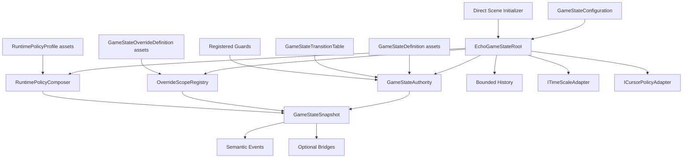

# The Pulse — Runtime State Package Specification

**Working document ID:** SFGSS-PKG-ECHOGAMESTATE-001  
**Specification version:** 1.1.0  
**Status:** Approved  
**Technical package name:** EchoGameState  
**Public title:** The Pulse — Runtime State  
**Package ID:** `com.echodevgames.echo-game-state`  
**Runtime namespace:** `EchoDevGames.EchoGameState`  
**Owner:** Jesse “Echo” Adams / EchoDevGames  
**Project boundary:** Independent solo project; not an Isekai Studios product  
**Planned repository:** `EchoDevGames/EchoGameState`  
**Current Notes:** `Plan Documentation/Current Notes.md` until the package repository is created, then `Documentation~/Developer/Current Notes.md`  
**Unity baseline:** Unity 6000.3.8f1  
**Minimum supported Unity version:** Unity 6000.0  
**Parent authority:** SFGSS-000 and SFGSS-001  
**Last updated:** August 3, 2026

> “Keep the game’s rhythm readable, deliberate, and under one authority.”

> **Approval rule:** This specification is approved as the authoritative package design. Runtime implementation remains intentionally deferred until all ten Foundation Wave specifications and the cross-package consistency review are approved.

---

## Revision History

| Version | Date | Status | Summary | Approved by |
|---|---|---|---|---|
| 0.1.0 | 2026-08-03 | Proposed | Initial complete specification derived from SFGSS-000 v0.6.0, SFGSS-001 v1.1.0, and the four approved Foundation specifications | Pending |
| 1.0.0 | 2026-08-03 | Approved | Approved the primary-state and leased-override model, nested pause authority, deterministic policy composition, Unity time/cursor adapters, diagnostics, tooling, and Test Lab | Jesse “Echo” Adams |
| 1.1.0 | 2026-08-03 | Approved | Renamed the package diagnostic and package-local identifier namespace from `EGS-*` to `EGSTATE-*` to eliminate the Foundation collision with EchoGameStarter; no authority, lifecycle, API intent, or MVP behavior changed | Jesse “Echo” Adams |

---

## 1. Package Identity and One-Sentence Contract

**Public title:** The Pulse — Runtime State  
**Technical identifier:** EchoGameState  
**Flavor line:** Keep the game’s rhythm readable, deliberate, and under one authority.  
**Plain-language subtitle:** High-level runtime modes, validated transitions, temporary override scopes, nested pause authority, and global time/cursor coordination.

**One-sentence ownership contract:**

> EchoGameState owns the application’s authoritative high-level runtime state, validated primary-state transitions, temporary override scopes, nested pause reasons, and the resulting global time/cursor coordination policy; it does not own menu presentation, input bindings, audio playback, scene-transition execution, character or enemy state machines, save-file transport, or project-specific victory and defeat rules.

### 1.1 Elevator summary

The Pulse gives a Unity project one readable answer to questions such as: Is the application booting, at the Main Menu, loading, playing, paused, in dialogue, showing a blocking modal, in a cutscene, victorious, defeated, or shutting down? It separates one durable **primary state** from temporary **override scopes** so a pause menu, dialogue window, cutscene, modal warning, or loading lock can change the effective runtime policy without destroying the underlying state.

The package is deliberately not a universal finite-state-machine framework. It does not replace player locomotion states, enemy AI states, animation graphs, quest states, scene loading, or UI navigation. It provides one application-level authority, clear transition rules, lease-based temporary scopes, nested pause handling, built-in Unity time and cursor adapters, structured results, history, and optional bridge seams for input, audio, UI, diagnostics, scene flow, saves, and later feedback systems.

### 1.2 Why this belongs in The Sperk’s Forge

Existing projects repeatedly scatter pause booleans, `Time.timeScale` assignments, cursor changes, gameplay-input locks, menu visibility, loading flags, win/loss conditions, and scene-transition guards across unrelated scripts. The result can be a runtime that is “paused” in one system, “playing” in another, and “loading” somewhere else. Nested reasons are especially fragile: closing one menu may resume the game even though another modal, cutscene, or transition still requires it to remain blocked.

The Pulse preserves the useful idea of a central application mode while rejecting the god-manager pattern. It owns the truth and its global Unity policies, then publishes semantic state for other systems to consume through explicit bridges. It gives future packages a stable coordination target without making those packages depend on it to function.

### 1.3 Verse identity boundary

| Surface | Flavor allowed? | Rule |
|---|---:|---|
| Public title | Yes | “The Pulse” must be paired with “Runtime State” in formal surfaces. |
| Setup guidance/tooltips | Yes | Flavor may describe rhythm or interruption, but the action must remain technically clear. |
| Samples | Optional | Verse wording and presentation must be replaceable and removable. |
| Runtime API/type names | No lore-only names | Types describe states, transitions, overrides, pause leases, policies, and results directly. |
| Project data | No required Hackulos content | Projects author their own state labels, conditions, screens, and outcomes. |

---

## 2. Problem Statement

### 2.1 Current problem

Application-level state is commonly represented by unrelated booleans and side effects:

- `isPaused`, `isLoading`, `isInMenu`, `canMove`, `isGameOver`, and `isCutscenePlaying` can contradict one another.
- Multiple scripts assign `Time.timeScale`, `Cursor.lockState`, and `Cursor.visible` without one owner.
- Pause is often a single boolean, so one caller can resume the game while another pause reason remains active.
- Closing a modal or dialogue box can restore the wrong input/cursor policy because the previous condition was not retained safely.
- Scene transitions may set loading flags and input locks directly, creating circular dependencies with UI and state code.
- Direct-scene testing starts with an undefined runtime mode or creates a second bootstrap path.
- Invalid transitions are discovered through visual symptoms instead of structured results.
- State changes may complete only because a UI, audio, or scene listener happened to exist.

### 2.2 Evidence from existing work

| Source | Existing pattern or problem | Preserve | Improve |
|---|---|---|---|
| Rescuers2D | Main, Pause, Win, direct-scene, input, cursor, and character-control concerns converge in scene scripts | Clear player-facing phases and control handoff | Replace scattered booleans and direct global assignments with one authority and reasoned scopes |
| Echo Systems Lab | Bootstrap, mission flow, hub/trial modes, and event-driven HUD updates | Focused state ownership and semantic events | Separate application mode from mission, player, and scene state |
| Don’t Get Vince’d | Dialogue, boss phases, defeat, and menu flow create overlapping temporary conditions | Explicit gameplay events | Prevent project controllers from becoming global pause/time/cursor authority |
| First Light v1.0.0 | Booting and handoff need a readable runtime mode | Ordered launch lifecycle | Use a bridge rather than making launch own ongoing state |
| Observatory v1.0.0 | Diagnostics need normalized authority status and bounded history | Structured snapshots | Keep observation separate from ownership |
| Accord v1.0.0 | Settings separates committed, effective, and editable state | Explicit authority and result objects | Keep preferences separate from runtime modes |
| Passage v1.0.0 | Normal travel needs loading coordination without owning pause/input | Serialized transition lifecycle | SceneFlow requests coordination instead of becoming state authority |
| Hackulos | Main Menu, Playing, Paused, Dialogue, Death, and loading overlap | Data-driven project-owned definitions | Avoid RPG-specific concepts in the general package |

### 2.3 Consequences of doing nothing

- Projects keep rebuilding fragile pause managers.
- One menu or modal can resume gameplay incorrectly.
- `Time.timeScale` and cursor state drift because several scripts compete for them.
- Input and audio packages lack a neutral source for high-level coordination.
- SceneFlow and UI integrations become circular.
- Direct-scene tests do not match production lifecycle.
- Support reports cannot reconstruct how the runtime reached an invalid condition.

---

## 3. Goals, Non-Goals, and Success Measures

### 3.1 Goals

- Maintain exactly one authoritative primary application state.
- Validate primary-state transitions against project-authored definitions and transition rules.
- Preserve the underlying primary state while temporary override scopes are active.
- Support simultaneous overrides without requiring last-in-first-out release.
- Support nested pause reasons through disposable, idempotent lease handles.
- Compute one deterministic effective policy from the primary state and all active overrides.
- Own application-level `Time.timeScale` policy and built-in cursor policy through replaceable adapters.
- Publish neutral coordination intents for input and audio without depending on EchoInput or Jukebot.
- Expose synchronous request/result APIs with actionable rejection reasons.
- Keep bounded transition and override history.
- Support safe direct-scene development initialization.
- Remain useful without any peer Sperk’s Forge package.
- Provide repeatable setup, validation, repair, simulation, and an isolated Test Lab.

### 3.2 Non-goals

- The Pulse does not render pause menus, loading screens, dialogue, victory, defeat, or HUD elements.
- It does not own input action assets, bindings, devices, rebinding, or glyphs.
- It does not play, pause, route, or mix audio directly.
- It does not load, unload, or activate scenes.
- It does not decide when the player wins, loses, dies, completes a quest, or enters combat.
- It does not replace player, enemy, animation, ability, objective, dialogue, or mission state machines.
- It does not serialize general save files or preferences.
- It does not become a service locator for arbitrary gameplay systems.
- It does not promise one universal pause behavior for every multiplayer, simulation, or platform architecture.

### 3.3 User outcomes

| User | Starting condition | Desired outcome |
|---|---|---|
| Novice installer | No shared runtime-state authority | Generate a configuration/root and see valid state and pause behavior alone |
| Programmer | Systems need high-level modes | Use typed requests/results, guards, leases, snapshots, and events |
| Designer | Game needs named modes and allowed transitions | Author validated definitions, policies, and transition rules |
| UI developer | Pause/menu/dialogue screens need state truth | Observe snapshots and request/release scopes without owning state |
| Integrator | Input, audio, scene flow, launch, and diagnostics must coordinate | Add removable bridges without breaking core assemblies |
| Tester | Pause or state defect is hard to reproduce | Inspect scopes, reasons, policies, history, and diagnostic codes |

### 3.4 Measurable success criteria

- Installs into a clean supported Unity project with zero compile errors.
- Runs with no other Sperk’s Forge package installed.
- Duplicate roots are rejected before time/cursor side effects or event subscriptions.
- Valid transitions produce one committed state change and one ordered event sequence.
- Invalid transitions leave state and policy unchanged and return a structured rejection.
- Two pause leases remain paused until both are released.
- Override handles release out of order without corrupting state.
- Double-disposal is safe and cannot underflow or resume incorrectly.
- Policy restoration is recomputed from remaining truth, not a stale previous-value stack.
- Controlled shutdown restores owned Unity time/cursor baselines.
- The Standalone Test Lab proves the MVP without unrelated packages.
- Setup and repair are repeatable and non-destructive.
- Samples remove without breaking runtime assemblies.
- Histories and active-scope counts remain bounded under stress.

---

## 4. Users and Primary Use Cases

### 4.1 Intended users

- Solo and small-team Unity developers.
- Gameplay and systems programmers.
- Technical designers authoring application flow.
- UI/input/audio developers integrating high-level modes.
- Testers diagnosing pause, cursor, input-lock, loading, and modal conflicts.
- The Workshop when composing a project foundation.

### 4.2 Primary use cases

| ID | Use case | Actor | Preconditions | Expected result | Phase |
|---|---|---|---|---|---|
| UC-001 | Initialize authority | Root/installer | Valid config; no authority | Root claims authority, applies initial policy, becomes Ready | MVP |
| UC-002 | Reject duplicate root | Scene/root | Existing authority active | Duplicate removes itself before side effects | MVP |
| UC-003 | Main Menu to Playing | Project code | Rule allows | Primary commits; policy/events/history update | MVP |
| UC-004 | Reject invalid transition | Project code | Rule denies | State unchanged; structured reason returned | MVP |
| UC-005 | Pause from menu | UI/project | Runtime Ready | Pause lease activates pause policy | MVP |
| UC-006 | Nest pause reasons | Several callers | One pause active | Runtime resumes only after every pause lease closes | MVP |
| UC-007 | Dialogue without freeze | Dialogue/project | Override exists | Gameplay input intent changes while simulation runs | MVP |
| UC-008 | Modal over dialogue | UI/project | Dialogue active | Modal becomes dominant; dialogue remains retained | MVP |
| UC-009 | Release scopes out of order | Project code | Several scopes active | Remaining policy recomputes correctly | MVP |
| UC-010 | Coordinate loading | SceneFlow bridge | Transition begins | Bridge requests configured Loading state/scope | Integration |
| UC-011 | Coordinate input | EchoInput bridge | Intent changes | Bridge maps neutral intent to contexts/locks | Integration |
| UC-012 | Coordinate audio | Jukebot bridge | Audio intent changes | Bridge maps intent to audio authority | Integration |
| UC-013 | Enter scene directly | Developer | Helper enabled; no root | Minimal root initializes with declared direct state | MVP |
| UC-014 | Register guard | Project code | Root Ready | Guard affects future transitions and removes via handle | MVP |
| UC-015 | Reapply cursor after focus | Runtime adapter | App regains focus | Current cursor policy reapplies without changing state | MVP |
| UC-016 | Shut down cleanly | Runtime | Root active | Handles invalidate, baselines restore, subscriptions clear | MVP |

### 4.3 Explicitly unsupported use cases

- Per-character locomotion, combat, animation, AI, quest, or ability state machines.
- Several independent application-state authorities.
- UI-owned pause truth.
- Arbitrary listeners setting global time/cursor through package internals.
- Reflection discovery of gameplay systems.
- Mutable active state stored in ScriptableObject definitions.
- Persisting active pause or modal leases across sessions.
- Claiming `Time.timeScale = 0` pauses every custom, unscaled, networked, audio, or third-party system.
- Multiplayer pause semantics without an approved adapter and authority model.

---

## 5. Authority and Ownership Boundaries

### 5.1 The package owns

- One primary application state.
- Validated primary-state transition requests/results.
- Active temporary override scopes.
- Nested pause leases and reasons.
- Deterministic policy composition.
- Application-level Unity time-scale application through its adapter.
- Application-level cursor visibility/lock policy through its adapter.
- Neutral input and audio coordination intents.
- Bounded state/scope/policy history.
- Direct-scene development initialization.
- Setup, validation, repair, diagnostics, and Test Lab tooling.

### 5.2 The package does not own

- Startup execution or destination choice, owned by First Light during launch.
- Scene loading, activation, queueing, or recovery, owned by The Passage.
- Global preferences, owned by The Accord.
- Diagnostic dashboards, owned by The Observatory.
- Audio playback and mixer state, owned by Jukebot.
- Input maps, bindings, devices, rebinding, or glyphs, owned by EchoInput.
- UI roots, screens, modals, navigation, or focus, owned by EchoUI/project code.
- Save files, slots, migration, or recovery, owned by EchoSave.
- Project rules for victory, defeat, death, quests, or destinations.
- Per-object/subsystem state machines.
- Multiplayer session authority.
- Hit stop, slow motion recipes, or feedback execution.

### 5.3 Neighboring authorities

| Concern | Owner | Interaction |
|---|---|---|
| Startup | EchoLaunch | Optional bridge requests Booting/Loading/handoff states |
| Diagnostics | EchoDiagnostics | Optional provider reads snapshots/history/health |
| Preferences | EchoSettings | Project/consumer adapters may choose policy details |
| Scene travel | EchoSceneFlow | Bridge requests loading coordination and restores outcome state |
| Audio | Jukebot | Bridge maps neutral audio intent |
| Input | EchoInput | Bridge maps neutral input intent |
| UI | EchoUI | UI requests scopes and presents snapshots |
| Save transport | EchoSave | Project may query state or store validated resume hints |
| Composition | EchoGameStarter | Editor integration generates configuration/root/assets |
| Feedback time effects | EchoFeedback | Later bridge requests bounded modifiers from time authority |
| Outcome rules | Project systems | Project decides when to request Victory/Defeat/custom states |

### 5.4 Boundary tests

A feature belongs here only when it directly changes, validates, composes, applies, or reports high-level application state or its global policy; remains useful alone; does not encode project gameplay rules; does not make presentation authoritative; does not duplicate a peer authority; and can be proven in the isolated Test Lab.

---

## 6. Independence Contract

### 6.1 Standalone guarantees

The package must compile and run with only declared Unity dependencies, initialize without First Light, apply time/cursor policies through built-in replaceable adapters, expose input/audio intents without consumers, avoid project assemblies, keep project data outside package source, fail safely when bridges are absent, support direct-scene setup, expose test seams, and keep samples/Editor code out of runtime assemblies.

### 6.2 Independence proof matrix

| Condition | Expected behavior | Evidence |
|---|---|---|
| Installed alone | State, transitions, scopes, pause, policies, snapshots, and history work | Clean project and Test Lab |
| Test Lab entered directly | One development root initializes | LAB-001 |
| First Light absent | Root uses normal/direct initialization | Clean project |
| SceneFlow absent | No loading bridge; state API still works | Compile/runtime test |
| Input/Jukebot absent | Intents remain observable; no error | PlayMode test |
| EchoUI absent | No production UI; sample readout optional | Sample removal test |
| Observatory absent | Standalone diagnostics remain available | Runtime test |
| Duplicate root | Duplicate rejects before side effects | Lifecycle test |
| Missing config | Root fails safely and reports blocker | Invalid-config test |
| Sample deleted | Runtime/Editor assemblies compile | Package test |
| Bridge removed | Core assets remain valid | Removal test |

### 6.3 Allowed dependencies

| Dependency | Type | Required? | Minimum | Reason |
|---|---|---:|---|---|
| Unity Engine Core Module | Platform | Yes | Unity 6000.0 | Lifecycle, ScriptableObjects, time, cursor, focus |
| Unity Test Framework | Test-only | For release evidence | Baseline-compatible | Automated tests |

The MVP runtime has no uGUI, TextMeshPro, Input System, Addressables, networking, or Echo-package dependency.

### 6.4 Forbidden dependencies

- Project-specific assemblies.
- Another Echo runtime package in core.
- `UnityEditor` references at runtime.
- Sample/Test Lab code in production assemblies.
- Hard-coded scenes, input maps, mixer snapshots, UI paths, save files, tags, or layers.
- Static mutable ScriptableObject state.
- Reflection-based integration discovery.

---

## 7. Capability Scope

### 7.1 Capability matrix

| ID | Capability | Description | Status | MVP? | Surface |
|---|---|---|---|---:|---|
| EGSTATE-CAP-001 | Duplicate-safe authority | Claim one root before side effects | Approved | Yes | Runtime |
| EGSTATE-CAP-002 | Primary state | Hold exactly one configured state | Approved | Yes | Runtime |
| EGSTATE-CAP-003 | Transition validation | Check target, rules, duplicate policy, guards | Approved | Yes | Runtime |
| EGSTATE-CAP-004 | Structured results | Committed, warning, no-change, rejected, unavailable | Approved | Yes | Runtime |
| EGSTATE-CAP-005 | Override scopes | Acquire/release temporary modes via leases | Approved | Yes | Runtime |
| EGSTATE-CAP-006 | Nested pause | Aggregate simultaneous reasons | Approved | Yes | Runtime |
| EGSTATE-CAP-007 | Policy composition | Compose simulation/cursor/input/audio deterministically | Approved | Yes | Runtime |
| EGSTATE-CAP-008 | Time adapter | Apply running/paused time policy | Approved | Yes | Runtime |
| EGSTATE-CAP-009 | Cursor adapter | Apply visibility/lock and reapply after focus | Approved | Yes | Runtime |
| EGSTATE-CAP-010 | Neutral input intent | Gameplay/UI/Disabled/ProjectDefined | Approved | Yes | Runtime |
| EGSTATE-CAP-011 | Neutral audio intent | Running/GameplayPaused/AllPaused/ProjectDefined | Approved | Yes | Runtime |
| EGSTATE-CAP-012 | Guards | Explicit disposable transition guards | Approved | Yes | Runtime |
| EGSTATE-CAP-013 | Bounded history | Record changes/rejections without growth | Approved | Yes | Runtime |
| EGSTATE-CAP-014 | Structured snapshot | Current state, scopes, reasons, policy, health | Approved | Yes | Runtime |
| EGSTATE-CAP-015 | Direct initializer | Development-only initialization when absent | Approved | Yes | Runtime/Sample |
| EGSTATE-CAP-016 | Setup/repair | Generate and safely repair project assets | Approved | Yes | Editor |
| EGSTATE-CAP-017 | Validation | IDs, rules, policies, duplicates, release leakage | Approved | Yes | Editor |
| EGSTATE-CAP-018 | Test simulation | Invalid paths, nested pause, adapter failure | Approved | Yes | Editor/Sample |
| EGSTATE-CAP-019 | Optional bridges | Launch, Diagnostics, SceneFlow, Input, Audio, UI | Approved | No | Bridge |
| EGSTATE-CAP-020 | General time modifiers | Slow motion/hit stop arbitration | Deferred | No | Runtime/Bridge |
| EGSTATE-CAP-021 | Focus-loss auto-pause | Platform/application policy | Deferred | No | Runtime |
| EGSTATE-CAP-022 | Multiplayer authority | Shared/networked state semantics | Deferred | No | Adapter |
| EGSTATE-CAP-023 | Rich graph editor | Visual state graph authoring | Deferred | No | Editor |

### 7.2 MVP capability set

The first release includes one duplicate-safe root, project-owned state/override/policy/transition assets, one primary state, synchronous validated transitions, explicit guards, out-of-order-safe override leases, nested pause leases, deterministic policy composition, replaceable Unity time/cursor adapters, immutable snapshots, bounded history, direct-scene initialization, setup/validation/repair, stable diagnostics, and one standalone Test Lab.

### 7.3 Later capability set

Later work may add general time modifiers, EchoFeedback integration, focus/background policies, ID alias migrations, rich graph tooling, watch conditions, project-approved resume hints, multiplayer adapters, UI Toolkit authoring, and custom platform clocks/cursor providers.

### 7.4 Deferred and rejected ideas

| Idea | Disposition | Reason |
|---|---|---|
| Universal FSM for all objects | Rejected | Violates application-state boundary |
| Strict push/pop override stack | Rejected | Out-of-order cleanup would corrupt state |
| One global pause boolean | Rejected | Cannot represent nested reasons |
| UI-owned pause truth | Rejected | Presentation cannot be authority |
| Direct Jukebot/EchoInput dependencies | Rejected | Breaks independence |
| Automatic serialization of active scopes | Rejected for MVP | Session leases should not survive blindly |
| Reflection discovery | Rejected | Hidden behavior and removal fragility |
| Focus-loss auto-pause | Deferred | Platform, accessibility, online, and project rules differ |
| Slow motion/hit stop in MVP | Deferred | Requires EchoFeedback/time-arbitration design |
| Multiplayer global pause | Deferred | Depends on network authority model |
| State-driven scene loading | Rejected | SceneFlow owns travel |

---

## 8. Architecture Overview

### 8.1 Design model

| Layer | Contains | Must not contain |
|---|---|---|
| Definition/configuration | State definitions, override definitions, transition table, runtime policy profiles, configuration, validation settings | Active state, leases, timestamps, current cursor/time values, scene objects |
| Runtime state/behavior | Root, state authority, transition evaluator, scope registry, pause aggregation, policy composer, adapters, snapshots, history | Editor code, general UI, project outcome rules, peer-package behavior |
| Presentation/feedback | Sample readout, inspectors, optional UI/diagnostic bridges | Authoritative state, required listeners, persistence ownership |

### 8.2 Component topology



The root owns all mutable package state. Child services are ordinary owned objects, not independent persistent singletons.

### 8.3 Authoritative root

| Question | Decision |
|---|---|
| Persistent root? | Yes |
| Root type | `EchoGameStateRoot` |
| Lifetime | Application session by default |
| Duplicate behavior | Existing Initializing/Ready root survives; duplicate rejects before adapters, subscriptions, or state mutation |
| Initialization | Explicit initialize from root lifecycle, First Light bridge, or development initializer |
| Shutdown | Stop requests, invalidate leases/guards, restore baselines, unsubscribe focus events, clear static access |
| Direct-scene behavior | Development helper creates configured root only when absent and chooses an explicit direct-scene state |
| Test seams | Inject configuration, clock, time adapter, cursor adapter, logger, and guards |
| Convenience access | Optional static `TryGet`/`Current`; interface injection remains supported |

### 8.4 Primary state and override-scope model

#### Primary state

Exactly one `GameStateDefinition` is active while Ready. Typical project-authored examples include Booting, Main Menu, Loading, Playing, Victory, Defeat, and Shutting Down. Primary transitions are validated through the transition table and guards.

#### Override scopes

Zero or more `GameStateOverrideDefinition` instances may be active through lease handles. Typical examples include Pause Menu, Blocking Modal, Dialogue, Cutscene, Tutorial Lock, Photo Mode, or platform interruption.

Scopes form an active keyed set rather than a destructive LIFO stack. Every acquisition receives a unique runtime lease ID. Releasing a lease removes only that lease, regardless of the order in which other scopes were acquired or released.

#### Dominant override

One override may be dominant for display and single-value policy channels. Dominance uses:

1. Higher explicit priority.
2. Later acquisition sequence when priorities tie.
3. Stable runtime lease ID only as a deterministic final tie-break.

Lower-priority scopes remain active, visible in snapshots, and able to contribute aggregate policies such as pause.

### 8.5 Effective policy composition

The effective policy is recomputed from authoritative definitions after every committed primary transition, scope acquisition, scope release, configuration reapply, or adapter reconciliation. It is never restored by popping a cached “previous value.”

| Channel | Composition rule |
|---|---|
| Simulation pause | If the primary policy or any active scope requires `Paused`, simulation is paused. A `Running` request cannot cancel another active pause requirement. |
| Running time scale | Configuration supplies the normal scale, default `1.0`. General slow-motion arbitration is deferred. |
| Fixed-step behavior | Project chooses whether `Time.fixedDeltaTime` follows time scale. Default preserves the configured baseline. |
| Cursor | Highest-priority explicit override wins, then primary policy, then configured baseline. Unsupported modes use a documented fallback. |
| Input intent | Highest-priority explicit override wins, then primary policy, then `Unchanged`. EchoInput/project bridge applies it. |
| Audio intent | Highest-priority explicit override wins, then primary policy, then `Unchanged`. Jukebot/project bridge applies it. |
| Dominant semantic mode | Dominant override when present, otherwise primary state. This is presentation metadata, not a second authority. |

### 8.6 Pause model

`TryRequestPause` is a convenience over an approved pause override definition and returns a `PauseLease`. Each active lease records:

- Unique runtime lease ID.
- Stable reason code.
- Optional owner label for diagnostics.
- Development-only requester identity when safe.
- Acquisition sequence and unscaled timestamp.
- Policy profile and priority.
- Active/released state.

Pause is derived from active policies. Releasing one lease cannot resume the game while another active state or scope still requires pause.

### 8.7 Primary transition sequence

1. Receive request and assign/capture correlation ID.
2. Confirm the authority is Ready and not re-entering/shutting down.
3. Resolve and validate the target definition.
4. Apply duplicate/re-entry policy.
5. Resolve the most specific transition rule.
6. Evaluate ordered registered guards.
7. Build a proposed snapshot and policy without mutating authority.
8. Commit the primary state atomically.
9. Recompute and apply policies.
10. Record bounded history using unscaled time.
11. Raise state/policy events after the authoritative change.
12. Return a structured final result.

Transitions are synchronous in the MVP. Asynchronous save, scene, or loading work finishes outside the state authority before a transition is requested.

### 8.8 Scope lifecycle sequence

1. Validate authority, definition, request, and capacity.
2. Create unique lease record.
3. Add lease to the active registry.
4. Recompute dominant override, pause summary, and effective policy.
5. Apply changed adapters and publish intents.
6. Record history.
7. Raise scope and policy events.
8. Return the disposable handle and acquisition result.

Release removes only the identified lease and follows the same recompute/apply/record/event sequence. Disposal is idempotent.

### 8.9 Unity time and cursor basis

The built-in time adapter records configured restoration baselines, sets `Time.timeScale` to the effective scale, and optionally scales `Time.fixedDeltaTime` when the project selects that behavior. Unity documents that zero time scale stops `FixedUpdate` and `WaitForSeconds`, while adjusting fixed delta with time scale is game-specific. Package timers and history therefore use an injected unscaled clock.

The cursor adapter applies visibility and lock requests, reports unsupported confined behavior, and re-evaluates the effective request after focus changes. Locked cursors are inherently invisible and cannot operate ordinary UI, so validation warns about locked-cursor policies paired with interactive UI intent.

### 8.10 Failure model

| Failure | Detection | Result | Fallback | Code |
|---|---|---|---|---|
| Missing configuration | Initialization | Root unavailable; no global side effects | Setup guidance | EGSTATE-001 |
| Duplicate root | Claim | Duplicate removed | Existing authority | EGSTATE-002 |
| Invalid initial state | Validation | Initialization blocked | Explicit safe fallback only if configured | EGSTATE-003 |
| Duplicate stable ID | Validation | Initialization blocked | Resolve IDs | EGSTATE-004 |
| Invalid transition | Request | Rejected; no mutation | Remain current | EGSTATE-101 |
| Guard denial | Guard evaluation | Rejected with guard reason | Remain current | EGSTATE-102 |
| Guard exception | Guard evaluation | Required guard denies; optional guard warns | Policy-defined | EGSTATE-103 |
| Re-entrant request | Request | Rejected | Caller retries later | EGSTATE-104 |
| Invalid scope | Acquisition | Rejected; no mutation | Remain current | EGSTATE-201 |
| Released/unknown lease | Release | Safe no-op | Current truth retained | EGSTATE-202 |
| Scope limit | Acquisition | Rejected | Investigate leak or raise tested limit | EGSTATE-203 |
| Time adapter failure | Policy apply | State committed with degraded policy warning | Preserve last safe value | EGSTATE-301 |
| Cursor unsupported | Policy apply | Warning and fallback | Configured fallback | EGSTATE-302 |
| External drift | Reconciliation | Warning | Reapply at explicit lifecycle point | EGSTATE-303 |
| History full | Record | Oldest overwritten | Ring buffer | EGSTATE-401 |
| Direct helper in release | Build validation | Blocker/disabled | Canonical setup | EGSTATE-501 |
| Shutdown with leases | Shutdown | Handles invalidated; count recorded | Restore baselines | EGSTATE-601 |

---

## 9. Runtime Data and State Model

### 9.1 Definitions and configuration assets

| Type | Purpose | Stable ID? | Runtime mutable? | Project-owned? |
|---|---|---:|---:|---:|
| `GameStateConfiguration` | Root behavior, initial/direct state, catalogs, transition table, history, adapters, baselines | Yes | No | Yes |
| `GameStateDefinition` | One primary application state and base policy | Yes | No | Yes |
| `GameStateOverrideDefinition` | One temporary override type, priority, policy, metadata | Yes | No | Yes |
| `RuntimePolicyProfile` | Reusable simulation/cursor/input/audio policy | Yes | No | Yes |
| `GameStateTransitionTable` | Allowed source/target rules and re-entry policy | Yes | No | Yes |
| `GameStateTransitionRule` | One rule in the table | Optional rule ID | No | Table-owned |
| `GameStateDiagnosticSettings` | History capacity, logging, reconciliation | No external ID required | No | Yes |

### 9.2 Runtime state

| Runtime state | Owner | Lifetime | Reset | Serialization |
|---|---|---|---|---|
| Root status | Root | Root lifetime | Initialize/shutdown | Not persisted |
| Active primary state | Authority | Ready session | Initial state | Not automatically saved |
| Override/pause lease registry | Root | Ready session | Cleared on shutdown | Never saved by core |
| Effective policy | Composer | Derived | Recompute | Not saved |
| Registered guards | Authority | Handle lifetime | Dispose/shutdown | Not saved |
| Current snapshot | Root | Replaced on change | Rebuild | Diagnostic export only |
| Bounded history | Root | Session | Rotate/clear | Optional export only |
| Adapter baselines | Adapters | Root lifetime | Capture/restore | Not saved |

### 9.3 Stable identifiers

- IDs use normalized project-authored strings such as `core.booting`, `core.main-menu`, `core.playing`, `ui.pause`, or `narrative.dialogue`.
- IDs are separate from display names and asset file names.
- IDs must be nonempty, trimmed, case-normalized, serialization-safe, and unique in their category.
- Renaming display labels or assets does not change IDs.
- Released ID changes require alias/migration support.
- Transition rules reference stable definitions/IDs, never scene hierarchy paths.
- Validation detects empty IDs, collisions, unknown rules, conflicting wildcards, and missing initial/direct states.

### 9.4 ScriptableObject safety

Definition/configuration assets must not store the current state, leases, pause counts, timestamps, acquisition order, current time/cursor values, guard registrations, history, scene object references, or bridge state. Mutable data belongs to the active root.

### 9.5 Transition-rule model

The MVP supports explicit source-to-target rules, carefully approved source/target wildcards, per-rule re-entry permission, enable/disable state, and optional metadata. Resolution order is explicit pair, source wildcard, target wildcard, then global wildcard. More-specific rules win; conflicting rules are validation errors.

### 9.6 Scope and pause state

The active registry is keyed by runtime lease ID. Snapshots expose safe records containing definition ID, priority, reason, owner label, acquisition sequence, and unscaled age. Scene object references are excluded from release-safe snapshots.

Pause is not a caller-modified integer. It is derived from active policies, preventing underflow and accidental resume.

### 9.7 Serialization and migration

Core runtime state is session-only. Asset schemas still declare versions. Editor migrations must preview changes, preserve `.meta` GUIDs, back up project-owned assets where practical, and report mutations. Unknown newer schemas fail validation. Diagnostic exports are versioned but are never accepted as runtime restore input. Any save-based resume behavior requires a separate project/bridge contract.

---

## 10. Public Runtime API

### 10.1 Public types

| Type | Kind | Responsibility | Ownership |
|---|---|---|---|
| `IEchoGameState` | Interface | Read state, request transitions/scopes/pause, register guards | Root-owned implementation |
| `EchoGameStateRoot` | MonoBehaviour | Claim authority and own lifecycle/services | Prefab/setup/helper |
| `GameStateConfiguration` | ScriptableObject | Project configuration | Project asset |
| `GameStateDefinition` | ScriptableObject | Primary state definition | Project asset |
| `GameStateOverrideDefinition` | ScriptableObject | Temporary override definition | Project asset |
| `RuntimePolicyProfile` | ScriptableObject | Immutable policy contribution | Project asset |
| `GameStateTransitionTable` | ScriptableObject | Allowed transitions | Project asset |
| `GameStateId` / `GameStateOverrideId` | Value structs | Validated stable IDs | Value-created |
| `GameStateTransitionRequest` | Readonly DTO | Target, reason, requester, correlation, flags | Caller |
| `GameStateTransitionResult` | Readonly DTO | Status, source/target, guards, warnings, diagnostics | Authority |
| `GameStateScopeRequest` | Readonly DTO | Override, reason, owner, priority | Caller |
| `GameStateScopeLease` | Disposable handle | Release one scope | Authority |
| `PauseRequest` / `PauseLease` | DTO/handle | Acquire/release one pause reason | Caller/authority |
| `GameStateSnapshot` | Immutable DTO | State, scopes, pause, policy, health | Authority |
| `EffectiveRuntimePolicy` | Readonly DTO | Composed simulation/cursor/input/audio policy | Composer |
| `GameStateHistoryEntry` | Readonly DTO | One bounded history record | Authority |
| `IGameStateTransitionGuard` | Interface | Synchronously allow/deny/warn | Project/bridge |
| `GameStateGuardHandle` | Disposable handle | Unregister one guard | Authority |
| `ITimeScaleAdapter` | Interface | Validate/apply/read/restore time | Built-in/injected |
| `ICursorPolicyAdapter` | Interface | Validate/apply/read/restore cursor | Built-in/injected |
| `IGameStateClock` | Interface | Monotonic unscaled timestamps | Built-in/fake |
| `EchoGameStateDirectSceneInitializer` | MonoBehaviour | Development-only root creation | Sample/project helper |

### 10.2 Public members

| Member | Purpose | Preconditions | Result | Thread rule |
|---|---|---|---|---|
| `bool IsReady` | Report usable authority | None | False outside Ready | Main thread read |
| `GameStateSnapshot Snapshot` | Current immutable view | Initialized | Latest copy-safe snapshot | Main thread preferred |
| `TryTransition(request)` | Request primary change | Ready | Structured committed/no-op/rejected result | Main thread |
| `TryAcquireScope(request, out lease)` | Acquire override | Ready | Result and valid/invalid lease | Main thread |
| `TryRequestPause(request, out lease)` | Acquire pause | Ready | Result and valid/invalid lease | Main thread |
| `RegisterGuard(guard, options)` | Add transition guard | Valid registration phase | Disposable handle | Main thread |
| `TryGetState(id, out definition)` | Resolve configured primary | Configuration loaded | False when unknown | Main thread |
| `TryGetOverride(id, out definition)` | Resolve override | Configuration loaded | False when unknown | Main thread |
| `GetHistorySnapshot(max)` | Copy bounded history | Initialized | Clamped copy | Main thread |
| `ReapplyEffectivePolicy(reason)` | Explicit adapter reconciliation | Ready | Structured result | Main thread |
| `Shutdown(reason)` | Controlled cleanup | Authority exists | Idempotent | Main thread |

No public member exposes mutable collections or allows callers to set pause count, active state, time scale, cursor, or effective policy directly.

### 10.3 Transition result model

Results contain correlation ID, status (`Committed`, `CommittedWithWarnings`, `NoChange`, `Rejected`, `Unavailable`), source/target/final state IDs, reason/requester, matched rule, guard decisions, policy application summary, stable diagnostic code, and unscaled timing. A rejected transition never raises the changed event or mutates state/scopes.

### 10.4 Lease ergonomics

Lease disposal is idempotent. Handles share internal release state so copied values cannot double-release incorrectly. Finalizers are not relied on. Destroyed Unity requesters do not silently release leases unless an explicit owner-binding helper is used. Development diagnostics expose lease IDs and owner labels.

### 10.5 Events

| Event | Timing | Payload | Rule |
|---|---|---|---|
| `Initialized` | After initial state/policy commit | Snapshot/result | Listener not required |
| `PrimaryStateChanging` | After validation, before commit | Proposed transition | Observation only; cannot cancel |
| `PrimaryStateChanged` | After commit | Previous/current/result | State already changed |
| `ScopeAcquired` / `ScopeReleased` | After registry mutation | Scope record/snapshot | Listener not required |
| `PauseChanged` | When effective pause changes | Previous/current summary | One release may remain paused |
| `EffectivePolicyChanged` | After recompute/apply attempt | Previous/current/adapter result | Bridges respond independently |
| `TransitionRejected` | After history record | Result | Diagnostic use |
| `AuthorityStatusChanged` | After lifecycle change | Previous/current status | Diagnostic use |
| `ShuttingDown` | Before invalidation/restoration | Final snapshot/reason | New requests rejected |

Listeners cannot cancel state changes. Only guards participate in validation.

### 10.6 Guard contract

Guards are explicitly registered, ordered by priority and registration sequence, synchronous, deterministic for the supplied context, and side-effect-free. They return Allow, Deny, or AllowWithWarning plus stable reason data. They must not request nested transitions or mutate scopes. Required guard exceptions deny; optional guard exceptions warn according to configuration. Async save/load work is not a guard.

### 10.7 Adapter contracts

Time/cursor adapters provide validation, baseline capture, apply, current-state readback, and baseline restoration. They return structured results and know nothing about peer packages. Projects/tests may replace them with fake, custom clock, DOTS, platform, or no-op implementations.

### 10.8 Async and cancellation policy

Core transitions and scope changes are synchronous and atomic. No operation remains half-complete across frames, and cancellation does not apply once a request begins. Async work belongs to the caller or an orchestration bridge. Any future async API must use fresh Unity `Awaitable<T>` instances and cannot make presentation listeners required.

### 10.9 API ergonomics

The novice path uses generated definitions/configuration/root plus `TryTransition` and `TryRequestPause`. The advanced path uses custom assets, injected adapters/clocks, explicit guards, project/bridge integrations, immutable snapshots, and interface injection instead of relying only on static convenience access.

---

## 11. Editor Tooling and Authoring Experience

### 11.1 Setup workflow

1. Install through a supported route.
2. Open **Tools → EchoDevGames → The Pulse → Setup**.
3. Choose Create, Adopt Existing, or Validate Only.
4. Select a project-owned target folder.
5. Preview all asset/scene changes.
6. Create configuration, root prefab, starter definitions, policies, and transition table.
7. Add or repair the root in the selected Boot/persistent scene.
8. Optionally create a development direct-scene helper.
9. Open the Standalone Test Lab.
10. Run validation and export the setup report.

### 11.2 Setup operations

| Operation | Creates/modifies | Repeat-safe? | Protection | Report |
|---|---|---:|---|---|
| Create minimal setup | Config, definitions, policies, table, root prefab | Yes | Existing detection/unique paths | Created/skipped/conflicts |
| Add root to scene | Selected scene | Yes | Refuses duplicate; Unity Undo | Scene result |
| Create direct helper | Selected dev scene/prefab | Yes | Build-exclusion warning | Helper status |
| Validate | Nothing | Yes | Non-mutating | Structured report |
| Repair safe references | Explicit selected targets | Yes | Preview plus Undo/backup | Exact changes |
| Regenerate templates | New assets by default | Yes | Replacement requires confirmation/backup | Asset diff |
| Export state map | Markdown/JSON report | Yes | Non-mutating | IDs, rules, policies, warnings |

### 11.3 Inspectors and windows

| Tool | Purpose |
|---|---|
| Pulse Setup Window | Create/adopt/repair configuration and root |
| State Catalog Inspector | Review IDs, labels, policies, reachability |
| Transition Table Inspector | Author and validate rules |
| Runtime State Monitor | View primary, scopes, reasons, adapters, history |
| Policy Simulator | Preview composition without runtime mutation |
| Validation Window | Run checks and explicit safe repairs |
| State Map Exporter | Produce portable design/support report |

### 11.4 Validation and repair

| Check | Condition | Severity | Auto-fix? |
|---|---|---|---:|
| EGSTATE-VAL-001 | Missing configuration | Blocker | Only after target selection |
| EGSTATE-VAL-002 | Multiple production roots | Blocker | No; choose survivor |
| EGSTATE-VAL-003/004 | Empty/duplicate state or override IDs | Blocker | No |
| EGSTATE-VAL-005 | Missing/disabled initial state | Blocker | No |
| EGSTATE-VAL-006 | Missing direct-scene state | Error | No |
| EGSTATE-VAL-007 | Rule references unknown state | Error | No |
| EGSTATE-VAL-008 | Conflicting rules/wildcards | Error | No |
| EGSTATE-VAL-009 | Required state unreachable | Warning/Error | No |
| EGSTATE-VAL-010 | Override contributes no policy/purpose | Warning | No |
| EGSTATE-VAL-011 | Pause definition does not pause | Warning | No |
| EGSTATE-VAL-012 | Locked cursor plus interactive UI intent | Warning | Suggest only |
| EGSTATE-VAL-013 | Confined cursor on unsupported target | Warning | Fallback with approval |
| EGSTATE-VAL-014 | Invalid running time scale | Blocker | Explicit clamp only |
| EGSTATE-VAL-015 | Invalid/unbounded history capacity | Error | Documented default |
| EGSTATE-VAL-016 | Direct helper included in release | Blocker | Disable/remove with confirmation |
| EGSTATE-VAL-017 | Runtime references `UnityEditor` | Blocker | No |
| EGSTATE-VAL-018 | GUID/meta instability | Release blocker | No |
| EGSTATE-VAL-019 | Competing project time/cursor assignments | Advisory | Report only |
| EGSTATE-VAL-020 | Sample/bridge leaks into core | Blocker | No |

Validation itself never mutates production data. Repair is a separate explicit action.

---

## 12. Installation, Scene Setup, and Direct Testing

### 12.1 Installation routes

- Embedded package during development.
- Local UPM path.
- Local/distributed `.tgz`.
- Git URL/tag after repository release.
- Workshop selection when available.

### 12.2 Minimal scene setup

Minimum production setup requires one project-owned configuration, at least one primary state selected as initial, one transition table, one root prefab/scene object, and built-in or replacement time/cursor adapters. No Canvas, EventSystem, Input System asset, AudioMixer, scene catalog, save configuration, or peer package is required.

### 12.3 Boot-scene setup

Place one root in the canonical Boot/persistent scene or create/initialize it through the optional First Light bridge. The root claims authority before applying time/cursor policy and persists across normal scene loads.

### 12.4 Direct-scene setup

`EchoGameStateDirectSceneInitializer` is development-only by default, checks for an existing authority, creates only the state root when absent, uses an explicit configuration and direct state, marks the snapshot as development initialized, follows normal duplicate/validation/policy rules, creates no peer authorities, and is blocked from release builds unless explicitly approved.

### 12.5 Scene isolation rule

The standalone lab contains only package runtime/editor/sample code, declared Unity dependencies, redistributable sample assets, and a sample control/readout. It cannot require any peer Echo package or project code.

---

## 13. Standalone Test Lab and Samples

### 13.1 Standalone Test Lab purpose

The **Pulse Standalone Test Lab** proves initialization, valid/invalid transitions, overlapping scopes, nested pause, out-of-order release, policy restoration, adapter failure, focus reconciliation, history, duplicates, and reset with no unrelated package installed.

### 13.2 Required Test Lab contents

- `EchoGameState_StandaloneLab.unity`.
- Development initializer and lab configuration.
- Primary definitions: Booting, Main Menu, Loading, Playing, Victory, Defeat, Shutting Down.
- Overrides: Pause Menu, Dialogue, Blocking Modal, Cutscene.
- Policy profiles for running, paused, gameplay input, UI input, disabled input, and cursor modes.
- Explicit valid/invalid transition rules.
- Sample-only IMGUI controls/readout to avoid uGUI/TMP/EchoUI runtime dependencies.
- Controls for transitions, scope acquisition/release, duplicate spawn, invalid request, adapter failure, focus reapply, and reset.
- Readouts for root status, primary, dominant/all scopes, pause reasons, effective/actual time and cursor, input/audio intents, last result, and history.
- Fake adapters for deterministic tests and built-in-adapter toggle.
- README instructions and expected results.

### 13.3 Test Lab acceptance checklist

| Test | Action | Expected result | Type |
|---|---|---|---|
| LAB-001 | Enter lab | One development root in Booting | Both |
| LAB-002 | Booting → Main Menu | Commit and policy update | Both |
| LAB-003 | Main Menu → Playing | Commit | Both |
| LAB-004 | Invalid Playing → Booting | Rejected; unchanged | Both |
| LAB-005 | Request current state | NoChange; no duplicate event | Both |
| LAB-006 | Acquire pause | Paused; UI/cursor policy active | Both |
| LAB-007 | Acquire second pause | Two reasons; still paused | Both |
| LAB-008 | Release first | One reason; still paused | Both |
| LAB-009 | Release second | Running policy restores | Both |
| LAB-010 | Dialogue then Modal | Modal dominant; both retained | Both |
| LAB-011 | Release Dialogue first | Modal remains correct | Both |
| LAB-012 | Dispose lease twice | Safe no-op; no underflow | Both |
| LAB-013 | Cutscene without pause | Input changes; time runs | Both |
| LAB-014 | Change primary with override | Override remains; policy recomputes | Both |
| LAB-015 | Guard denial | Rejected with guard reason | Both |
| LAB-016 | Optional guard throws | Isolated warning behavior | Both |
| LAB-017 | Required guard throws | Rejected/error recorded | Both |
| LAB-018 | Spawn duplicate root | Duplicate removed before side effects | Both |
| LAB-019 | Missing configuration | Safe failure/blocker | Both |
| LAB-020 | Reset session | Baselines restore; deterministic reinit | Manual |
| LAB-021 | Time adapter failure | Degraded result; no crash | Both |
| LAB-022 | Unsupported cursor mode | Fallback/warning | Manual/platform |
| LAB-023 | Focus regain | Cursor policy reapplies | Both |
| LAB-024 | Exceed history capacity | Oldest rotates | Both |
| LAB-025 | Remove sample controls | Runtime still compiles | Automated |
| LAB-026 | Exit with active scopes | Handles invalidate; baseline restores | Both |
| LAB-027 | 1,000 rapid requests | Deterministic/bounded | Automated |
| LAB-028 | Random scope order | Final policy matches oracle | Automated |

### 13.4 Optional integration samples

| Sample | Packages | Purpose | Not standalone because |
|---|---|---|---|
| First Light + Pulse | Launch + State bridge | Booting/loading/handoff coordination | Two authorities and bridge |
| Passage + Pulse | SceneFlow + State bridge | Loading coordination and restoration | Depends on SceneFlow |
| Will + Pulse | Input + State bridge | Map intents to contexts/locks | Depends on EchoInput |
| Resonance + Pulse | Audio + State bridge | Map pause/audio intent | Depends on Jukebot |
| Looking Glass + Pulse | UI + State bridge | Pause/modal UI acquires scopes | Depends on EchoUI |
| Foundation Showcase | Multiple | Full application shell | Composition evidence only |

---

## 14. Presentation, UI, and Accessibility

### 14.1 Presentation ownership

EchoGameState is nonvisual at runtime. It exposes snapshots, results, reason codes, display metadata, and events. Project UI or an EchoUI bridge renders pause menus, modal screens, dialogue, loading indicators, victory/defeat screens, or debug panels. The sample IMGUI readout is removable and is not a screen framework.

### 14.2 Required presentation states

Optional presenters should represent:

- Initializing.
- Ready with primary state.
- Override active.
- Paused with one or more reasons.
- Transition rejected.
- Degraded time/cursor or bridge application.
- Configuration unavailable/failure.
- Shutting down.
- Development direct-scene initialization.

### 14.3 Accessibility requirements

- State and pause status cannot rely on color alone.
- Reason text and stable codes must be available to accessible presenters and support reports.
- The package cannot assume paused simulation also pauses UI animation. UI that remains interactive must use unscaled timing.
- Cursor policy must not trap users in a locked state when UI interaction is expected.
- Input intent remains neutral so EchoInput/project code can respect remapping, hold/toggle preferences, devices, and assistive controls.
- Audio intent is separate from simulation pause so user audio preferences and accessibility policy remain authoritative.
- Reduced-motion behavior remains owned by settings/UI/feedback systems, which may observe state semantics.
- Project display labels should be localization-ready when localization is installed.

### 14.4 Visual customization

All production visuals are project-owned or supplied through optional UI integrations. Runtime code contains no required theme, font, layout, animation, or Verse art.

---

## 15. Diagnostics and Observability

### 15.1 Standalone diagnostics

| Diagnostic | Surface | Availability | Cost |
|---|---|---|---|
| Authority status | API/Inspector | Editor, Development, release-safe summary | Constant |
| Current snapshot | API/Inspector | All builds with filtering | Bounded copy |
| Last transition/scope result | API/Inspector | All builds | Constant |
| Pause reasons | API/Inspector | Development; reason codes optionally release-safe | Bounded by active leases |
| Adapter status/readback | API/Inspector | Editor/Development; safe subset in release | Constant |
| Bounded history | Monitor/export | Configurable | Ring buffers |
| Validation report | Editor/export | Editor only | On demand |
| State map | Editor/export | Editor only | On demand |
| Categorized logs | Logger/Console | Configurable | No per-frame spam |

### 15.2 Structured status

`GameStateSnapshot` exposes:

- Root lifecycle and health.
- Runtime authority ID.
- Package/configuration/schema versions.
- Configuration identity where safe.
- Current primary state.
- Dominant override.
- Active override and pause records/counts.
- Effective paused state and running scale.
- Effective cursor request plus adapter-reported state.
- Effective input/audio intents.
- Last transition, scope, and policy results.
- History counts/capacities.
- Direct-scene flag.
- Current warnings/errors and diagnostic codes.

### 15.3 Diagnostic codes

| Code | Severity | Meaning | User action |
|---|---|---|---|
| EGSTATE-001 | Blocker | Configuration missing | Create/assign valid configuration |
| EGSTATE-002 | Info/Warning | Duplicate root rejected | Remove unintended duplicate |
| EGSTATE-003 | Blocker | Initial state invalid/missing | Assign valid configured state |
| EGSTATE-004 | Blocker | Stable ID collision | Resolve IDs and migration implications |
| EGSTATE-005 | Error | Root initialization failed | Inspect nested diagnostics |
| EGSTATE-101 | Info/Warning | Transition not allowed | Review rules/caller |
| EGSTATE-102 | Info/Warning | Guard denied transition | Review guard reason |
| EGSTATE-103 | Error | Guard exception | Fix guard/criticality policy |
| EGSTATE-104 | Warning | Re-entrant request rejected | Defer request until current event completes |
| EGSTATE-105 | Warning | Unknown state target | Correct ID/configuration |
| EGSTATE-201 | Warning | Scope acquisition rejected | Validate override/request |
| EGSTATE-202 | Info/Warning | Lease unknown/already released | Fix owner lifecycle when repeated |
| EGSTATE-203 | Warning | Active-scope limit reached | Investigate leaks or raise tested limit |
| EGSTATE-204 | Warning | Shutdown invalidated active leases | Review owner cleanup |
| EGSTATE-301 | Error | Time adapter apply failed | Inspect adapter and competing authority |
| EGSTATE-302 | Warning | Cursor request unsupported/fallback | Choose supported policy/adapter |
| EGSTATE-303 | Warning | External time/cursor drift | Remove competing assignments or reapply |
| EGSTATE-304 | Warning | Policy composition conflict | Inspect priorities/definitions |
| EGSTATE-401 | Info | History rotated | Expected bounded behavior |
| EGSTATE-501 | Blocker | Development initializer in release path | Remove/disable or explicitly approve |
| EGSTATE-601 | Info | Shutdown completed with active scopes | Review leak count if unexpected |
| EGSTATE-701 | Warning | Optional bridge unavailable | Install bridge or accept standalone behavior |

### 15.4 Observatory bridge

The optional bridge registers a provider such as `echodevgames.echo-game-state` and publishes cached/bounded state, scopes, pause reasons, effective/actual time and cursor values, input/audio intents, last results, guard failures, history summaries, direct-scene status, and duplicate-root health. EchoGameState never references EchoDiagnostics, and diagnostic failure cannot change state truth.

### 15.5 Logging policy

- Category `EchoGameState` with stable codes.
- Expected rejections are configurable as silent/info/warning.
- Missing configuration, duplicates, adapter failure, guard exception, and invalid IDs are actionable.
- No per-frame state logging.
- Requester object names and full paths are development-only.
- Histories are bounded and exports explicit.
- Events are not automatically duplicated as logs.

---

## 16. Persistence and Save Integration

### 16.1 Persistence classification

| State | Scope | Owner | Saved? | Backend |
|---|---|---|---:|---|
| Definitions/configuration | Project design | Project/EchoGameState assets | Yes as assets | Unity/source control |
| Current primary | Session | EchoGameState | No by default | Memory |
| Override/pause leases | Transient session | EchoGameState | Never by core | Memory |
| Effective policy | Derived session | EchoGameState | No | Memory |
| History | Diagnostic session | EchoGameState | Explicit export only | Memory/file export |
| Global preferences | Global | EchoSettings | Not owned here | Accord backend |
| Game progress | Slot/profile | EchoSave/project | Not owned here | Chronicle backend |

### 16.2 Standalone behavior

Without EchoSave or EchoSettings, EchoGameState uses project-owned assets and starts from its declared initial/direct state. It creates no save file, preference file, or `PlayerPrefs` key.

### 16.3 Optional participant/provider contract

No generic save participant ships in the MVP. A later project/bridge may store a project-defined resume hint, but active scopes and pause leases are never restored blindly; the project validates the hint; EchoSave remains file/slot authority; and EchoGameState receives a normal validated transition rather than direct field mutation.

### 16.4 Failure and recovery

Missing/corrupt save data does not affect core initialization. Unknown project resume IDs resolve through project policy to a safe state. Diagnostic exports are never accepted as state input. Shutdown clears transient state regardless of persistence failures elsewhere.

---

## 17. Integration and Bridge Contracts

### 17.1 Integration philosophy

EchoGameState owns runtime state and policy truth. Peers may request changes, map neutral intents, or observe snapshots through explicit bridges. Installing a peer cannot silently alter core state definitions, transition rules, or policy composition.

### 17.2 Planned integrations

| Other authority | Connection | Placement | Direction/data | Required? |
|---|---|---|---|---:|
| EchoLaunch | Startup-state coordinator | Separate bridge | Launch phases/results ↔ Booting/Loading/handoff requests | No |
| EchoDiagnostics | Status provider | Separate bridge | Snapshots/history/health → Observatory | No |
| EchoSettings | Optional preference adapter | Project/consumer bridge | Preferences select details, not state truth | No |
| EchoSceneFlow | Loading coordinator | Separate bridge | Transition lifecycle → state/scope requests | No |
| Jukebot | Audio-intent adapter | Separate bridge | Effective audio intent → audio authority | No |
| EchoInput | Input-intent adapter | Separate bridge | Effective input intent → contexts/locks | No |
| EchoUI | Presenter/scope requester | Separate bridge | Snapshots/results ↔ views/actions | No |
| EchoSave | Save-availability/resume adapter | Separate/project adapter | Snapshot queries and validated hints | No |
| EchoGameStarter | Editor composition | Workshop Editor integration | Generate assets/root/setup/report | No runtime dependency |
| EchoFeedback | Time-modifier adapter | Later separate bridge | Feedback requests bounded time modifiers | Deferred |
| EchoMultiplayer | Session authority adapter | Later provider adapter | Shared state/pause validation | Deferred |
| Project systems | Callers/guards | Project code | Outcome rules request transitions | No |

### 17.3 Bridge placement decisions

Two-package bridges are separate by default. Project-specific win/loss, dialogue, cinematic, save, or mission conditions remain project guards/adapters. Workshop integration is Editor-only. Provider/network behavior is separate. Built-in time/cursor adapters stay in EchoGameState because the suite assigns that global policy to this authority.

### 17.4 Initialization and late registration

EchoGameState initializes independently. Guards and bridges register explicitly. Late bridges receive the current snapshot and future events without replaying history as new authority changes. Unregistering a bridge stops callbacks and releases only leases it explicitly owns. Root shutdown disposes registrations and invalidates handles.

### 17.5 Integration failure behavior

- Missing peer: bridge absent; core Ready.
- Missing EchoGameState: peer reports unavailable and does not invent a competing global manager.
- Version mismatch: bridge refuses registration; cores remain independent.
- Late peer: synchronize from current snapshot.
- Peer shutdown: registration disposes; neutral intent remains.
- Input/audio application fails: bridge warns; state truth remains committed.
- UI destroyed with active lease: explicit owner helper should dispose; leak remains diagnosable rather than guessed away.
- Circular request from event callback: reject with `EGSTATE-104`.
- Bridge removal: core compiles/runs unchanged.

### 17.6 First Light contract

First Light may request Booting and a configured handoff state. Launch remains startup authority, while EchoGameState remains state authority. The bridge converts launch phases/results into normal requests. Each package still works without the other.

### 17.7 SceneFlow contract

SceneFlow owns transition execution. Its bridge may acquire a Loading override or request a Loading primary state at configured lifecycle points. Completion/failure requests the configured destination, previous, or recovery state. EchoGameState never loads scenes because a state changes. When integrated, SceneFlow does not separately assign time/cursor/input locks. Lease ownership is explicit so failed transitions cannot leak loading state.

### 17.8 Input and audio intents

**Input:** `Unchanged`, `Gameplay`, `UI`, `Disabled`, `ProjectDefined(id)`.

**Audio:** `Unchanged`, `Running`, `GameplayPaused`, `AllPaused`, `ProjectDefined(id)`.

These are semantic values, not EchoInput/Jukebot calls. Bridges map them to peer APIs and provide safe fallback for unknown project-defined IDs.

---

## 18. Performance and Resource Policy

### 18.1 Performance targets

| Metric | Target | Evidence |
|---|---|---|
| Idle core | No required per-frame work except explicit reconciliation hooks | Profiler |
| Valid transition | Same-frame, typical under 0.25 ms in lab config | Profiler marker |
| Scope change | Same-frame, typical under 0.25 ms within tested limits | Stress test |
| Idle allocations | 0 bytes/frame from core | Profiler |
| Active scopes | 64 tested default hard limit | Random stress |
| Guards | 64 tested registrations | Stress test |
| History | Fixed capacities with rotation | Memory test |
| Snapshot | Cached current snapshot; explicit history copy may allocate | Allocation test |
| 1,000 requests | Deterministic without leaks/unbounded growth | Automated test |

### 18.2 Allocation policy

No LINQ/reflection in hot paths. Lookup dictionaries are built at initialization. History uses ring buffers. Policy composition reuses buffers/indices. Event invocation avoids internal per-call closures. Diagnostic formatting is lazy/development-only. Explicit exports may allocate.

### 18.3 Scene and domain reload behavior

The root unsubscribes focus/internal events, resets static convenience access, invalidates old handles, and restores baselines during controlled shutdown. Domain reload enabled and disabled must both produce one clean authority. Persistent state survives scene loads; scene-introduced duplicates reject before side effects.

### 18.4 Scalability limits

Initial advertised limits:

- 256 primary definitions.
- 256 override definitions.
- 4,096 transition rules.
- 64 simultaneous active scopes.
- 64 registered guards.
- 512 transition history entries and 512 scope/policy entries by default.

Raised limits require stress evidence. Limits reject or rotate safely and never grow without bound.

---

## 19. Security, Privacy, and Platform Considerations

### 19.1 Data sensitivity

No credentials, analytics, personal data, network data, or user files are required. Development diagnostics may include state IDs, reason IDs, requester labels, scene/object names, and asset paths. Release-safe snapshots omit full paths and object references.

### 19.2 Trust boundaries

Project assets and bridge requests are validated. External requests must resolve to configured definitions and normal transition rules. Diagnostic exports are explicit and never transmitted automatically. Network requests are untrusted until a future multiplayer authority adapter validates them. No arbitrary type activation from serialized strings is used.

### 19.3 Platform behavior

| Platform | Support | Special behavior | Required evidence |
|---|---|---|---|
| Windows | Yes | Basic time/cursor; confined cursor supported in standalone | Clean build/focus/cursor tests |
| macOS | Core planned/yes | Confined cursor may be unavailable; fallback | Build/device tests |
| Linux | Core planned/yes | Confined cursor supported in standalone | Build/device tests |
| WebGL | Planned | Browser/user-gesture cursor constraints | Browser tests |
| Mobile | Planned | Cursor often unavailable; time policy remains | Device tests |
| Console | Unknown/planned | Cursor generally unavailable; certification unknown | Platform access/tests |

Unsupported capabilities report unavailable/fallback rather than success.

---

## 20. Package and Repository Structure

### 20.1 Required package anatomy

```text
Packages/com.echodevgames.echo-game-state/
├── package.json
├── README.md
├── CHANGELOG.md
├── LICENSE.md
├── Third Party Notices.md
├── Documentation~/
│   ├── Index.md
│   ├── User/
│   └── Developer/
│       ├── Architecture.md
│       ├── Public API.md
│       ├── Policy Composition.md
│       ├── Current Notes.md
│       ├── ADR/
│       └── Checkpoints/
├── Runtime/
│   ├── Core/
│   ├── Configuration/
│   ├── Definitions/
│   ├── State/
│   ├── Transitions/
│   ├── Scopes/
│   ├── Policies/
│   ├── Adapters/
│   ├── Diagnostics/
│   ├── DirectScene/
│   ├── Prefabs/
│   └── EchoDevGames.EchoGameState.Runtime.asmdef
├── Editor/
│   ├── Setup/
│   ├── Validation/
│   ├── Inspectors/
│   ├── Simulation/
│   ├── Reporting/
│   └── EchoDevGames.EchoGameState.Editor.asmdef
├── Samples~/
│   └── Standalone Labs/
│       └── Pulse State Lab/
└── Tests/
    ├── Editor/
    └── Runtime/
```

### 20.2 Proposed source tree

```text
Runtime/
├── Core/EchoGameStateRoot.cs
├── Core/IEchoGameState.cs
├── Configuration/GameStateConfiguration.cs
├── Definitions/GameStateDefinition.cs
├── Definitions/GameStateOverrideDefinition.cs
├── Definitions/RuntimePolicyProfile.cs
├── State/GameStateAuthority.cs
├── State/GameStateSnapshot.cs
├── Transitions/GameStateTransitionTable.cs
├── Transitions/GameStateTransitionRequest.cs
├── Transitions/GameStateTransitionResult.cs
├── Transitions/IGameStateTransitionGuard.cs
├── Scopes/GameStateScopeRegistry.cs
├── Scopes/GameStateScopeLease.cs
├── Scopes/PauseLease.cs
├── Policies/RuntimePolicyComposer.cs
├── Policies/EffectiveRuntimePolicy.cs
├── Policies/InputCoordinationIntent.cs
├── Policies/AudioCoordinationIntent.cs
├── Adapters/ITimeScaleAdapter.cs
├── Adapters/UnityTimeScaleAdapter.cs
├── Adapters/ICursorPolicyAdapter.cs
├── Adapters/UnityCursorPolicyAdapter.cs
├── Diagnostics/BoundedGameStateHistory.cs
└── DirectScene/EchoGameStateDirectSceneInitializer.cs

Editor/
├── Setup/EchoGameStateSetupWindow.cs
├── Validation/EchoGameStateValidator.cs
├── Validation/EchoGameStatePrebuildValidator.cs
├── Inspectors/GameStateConfigurationEditor.cs
├── Inspectors/GameStateTransitionTableEditor.cs
├── Simulation/EchoGameStatePolicySimulator.cs
├── Simulation/EchoGameStateRuntimeMonitor.cs
└── Reporting/EchoGameStateMapExporter.cs
```

Exact file boundaries may change only when responsibility remains consistent or the specification/ADR is updated first.

### 20.3 Assembly definitions

| Assembly | Platform | References | Auto-referenced? | Purpose |
|---|---|---|---:|---|
| `EchoDevGames.EchoGameState.Runtime` | Runtime | UnityEngine core | Yes | Public API/behavior |
| `EchoDevGames.EchoGameState.Editor` | Editor | Runtime, UnityEditor | No preferred | Setup/validation/tooling |
| `EchoDevGames.EchoGameState.Tests.Runtime` | PlayMode | Runtime, Test Framework | No | Runtime tests |
| `EchoDevGames.EchoGameState.Tests.Editor` | Editor | Runtime, Editor, Test Framework | No | Tool/asset tests |
| Sample assembly | Imported sample | Runtime | No | Lab controls only |

### 20.4 Repository files

README, package documentation, Current Notes link, changelog, license, third-party notices, development/contribution notes where appropriate, release checklist, stable `.meta` files, specification/ADR links, test reports, and clean-install evidence.

---

## 21. Compatibility, Versioning, and Deprecation

### 21.1 Supported versions

| Dependency | Minimum | Primary tested | Notes |
|---|---|---|---|
| Unity | 6000.0 | 6000.3.8f1 | Foundation public floor |
| Unity Test Framework | Baseline-compatible | Project baseline | Tests only |
| Other Echo packages | None | Bridges tested separately | Core has no hard Echo dependency |

### 21.2 Semantic versioning policy

- **Patch:** Internal fixes, validation improvements, diagnostics, documentation, and corrections that do not break API/assets/serialized behavior.
- **Minor:** Backward-compatible API additions, optional policies/adapters, new tooling, or new fields with safe defaults.
- **Major:** Breaking API signatures, changed stable-ID semantics, incompatible policy composition, serialized asset migrations, changed lease behavior, or removed public types.

Changes to transition resolution, pause aggregation, policy precedence, or time/cursor ownership are behaviorally breaking even when method signatures remain unchanged.

### 21.3 Deprecation policy

Deprecated APIs receive compiler attributes, documentation, replacement guidance, and migration notes. They remain for at least one minor release when practical and are removed only in a major release unless a critical issue requires otherwise. Released stable IDs and transition semantics are never silently reinterpreted.

### 21.4 GUID and asset compatibility

Public scripts, prefabs, templates, definitions, configuration samples, and Test Lab assets preserve committed `.meta` files. Moves and renames retain GUIDs whenever identity should survive. Migration tools report intentional replacements.

---

## 22. Documentation Requirements

### 22.1 Required user documentation

- Package overview and boundaries.
- Installation routes.
- Five-minute quick start.
- Setup window guide.
- State-definition authoring.
- Transition-table authoring.
- Override and nested-pause guide.
- Runtime policy composition reference.
- Direct-scene development guide.
- Standalone Test Lab guide.
- Public API examples.
- Troubleshooting and diagnostic-code reference.
- Upgrade/migration guide.
- Optional integration index.
- Known limitations, especially time scale, unscaled systems, cursor/platform behavior, and multiplayer.
- License, credits, and notices.

### 22.2 Required developer documentation

- Architecture and authority model.
- Primary-state versus override-scope rationale.
- Transition sequence and guard contract.
- Lease lifecycle/owner patterns.
- Policy-composition algorithm.
- Time/cursor adapter behavior and Unity basis.
- Snapshot/event ordering.
- Extension and bridge seams.
- Performance limits.
- Testing and release workflow.
- Architecture decisions.
- Current status and linked `Current Notes.md`.

### 22.3 Documentation truth rule

Examples compile against the release. Menu paths/screenshots match the Unity baseline. Generated IDs/assets/policies match setup tooling. Event ordering and policy precedence are tested and documented together. Known limitations do not overclaim what time scale pauses. A feature is not release-ready with stale documentation.

### 22.4 Living repository and Obsidian workflow

Documentation lives in Git beside implementation and is opened directly in Obsidian. `Current Notes.md` captures active proposals, questions, tests, defects, and handoff context but never overrides SFGSS-000, this specification, or ADRs.

At checkpoints: review notes, promote durable decisions, move defects/tests into permanent records, update guides/changelog/status, condense resolved notes, verify docs match committed behavior, and commit/push documentation with or adjacent to implementation.

### 22.5 Repository scan and handoff order

1. README/index.
2. SFGSS-000.
3. This specification.
4. Applicable ADRs/bridges.
5. Current Notes.
6. Current checkpoint, tests, issue log, changelog.
7. Relevant code/tests.

---

## 23. Testing Strategy

### 23.1 Test layers

| Layer | Scope | Examples | MVP? |
|---|---|---|---:|
| EditMode unit | IDs, transition rules, policy composition, validation | Collisions, wildcard precedence, composition oracle | Yes |
| PlayMode unit/integration | Root lifecycle, adapters, events, leases, direct scene | Duplicates, nested pause, focus reapply | Yes |
| Standalone Test Lab | Isolated user-visible core loop | Transitions, overrides, policies | Yes |
| Bridge Integration Lab | Optional connections | Launch, SceneFlow, Input, Audio, UI | When bridge ships |
| Showcase | Combined shell | Foundation composition | No |
| Clean-project install | Packaging/independence | Local/tarball/Git | Yes |
| Existing-project migration | Adoption without regression | Rescuers2D/Echo Systems Lab | Before adoption claim |

### 23.2 Required test categories

Clean installation, duplicate authorities, missing/invalid configuration, ID collisions, rule resolution/conflicts, guards, re-entry, scope/random release order, nested pause, primary changes under overrides, policy precedence/restoration, time/cursor adapter apply/failure/recovery, neutral intents with no consumer, event ordering/listener exceptions, history bounds, domain reload modes, direct-scene entry, sample removal, optional bridges absent/present, build leakage, performance/allocation, and schema migration when introduced.

### 23.3 Test case registry

| Test ID | Requirement | Action | Expected result | Automated? |
|---|---|---|---|---:|
| EGSTATE-T-001 | Duplicate safety | Start with two roots | One authority; duplicate has no side effects | Yes |
| EGSTATE-T-002 | Missing config | Initialize invalid root | Safe failure, EGSTATE-001 | Yes |
| EGSTATE-T-003 | Initial state | Initialize valid config | One initial state/policy commit | Yes |
| EGSTATE-T-004 | Valid transition | Request allowed target | Commit and ordered events | Yes |
| EGSTATE-T-005 | Invalid transition | Request denied target | Rejected; unchanged | Yes |
| EGSTATE-T-006 | Re-entry no-op | Request current with re-entry off | NoChange, no changed event | Yes |
| EGSTATE-T-007 | Rule specificity | Resolve explicit and wildcard rules | Most-specific wins | Yes |
| EGSTATE-T-008 | Guard denial | Required deny guard | Rejected with guard ID | Yes |
| EGSTATE-T-009 | Optional guard exception | Throw | Warning/isolation; no crash | Yes |
| EGSTATE-T-010 | Required guard exception | Throw | Rejected/error recorded | Yes |
| EGSTATE-T-011 | Re-entrant request | Request during callback | Rejected EGSTATE-104 | Yes |
| EGSTATE-T-012 | Scope acquisition | Acquire valid override | Active and policy recomputed | Yes |
| EGSTATE-T-013 | Out-of-order release | Release middle of three | Remaining policy correct | Yes |
| EGSTATE-T-014 | Lease idempotence | Dispose twice | One release only | Yes |
| EGSTATE-T-015 | Nested pause | Release one of two | Still paused | Yes |
| EGSTATE-T-016 | Pause clear | Release all | Running policy restored | Yes |
| EGSTATE-T-017 | Dominance priority | Acquire two priorities | Higher priority dominant | Yes |
| EGSTATE-T-018 | Dominance tie | Equal priority sequential acquire | Later sequence dominant | Yes |
| EGSTATE-T-019 | Aggregate pause | Higher running scope over pause | Still paused | Yes |
| EGSTATE-T-020 | Input intent | Compose state/scopes | Highest explicit intent | Yes |
| EGSTATE-T-021 | Audio intent | Compose state/scopes | Highest explicit intent | Yes |
| EGSTATE-T-022 | Time apply | Pause/resume | Correct time result | Yes |
| EGSTATE-T-023 | Fixed-step default | Pause/resume | Baseline policy preserved | Yes |
| EGSTATE-T-024 | Fixed-step opt-in | Apply nondefault scale | Documented scaling | Yes |
| EGSTATE-T-025 | Time adapter failure | Fake failure | Degraded result; no crash | Yes |
| EGSTATE-T-026 | Cursor apply | Apply UI policy | Expected visibility/lock | Yes |
| EGSTATE-T-027 | Cursor fallback | Unsupported fake | Warning/fallback | Yes |
| EGSTATE-T-028 | Focus reapply | Simulate drift/focus | Current policy reapplied | Yes |
| EGSTATE-T-029 | Event order | Record callbacks | Matches spec | Yes |
| EGSTATE-T-030 | Listener exception | Throwing listener | Authority remains committed | Yes |
| EGSTATE-T-031 | History bounds | Exceed capacity | Oldest rotates | Yes |
| EGSTATE-T-032 | Snapshot safety | Mutate external copy | Internal state unchanged | Yes |
| EGSTATE-T-033 | Direct scene | Enter without root | One dev root/state | Yes |
| EGSTATE-T-034 | Direct scene with root | Enter with authority | Helper creates nothing | Yes |
| EGSTATE-T-035 | Shutdown | Active leases/guards | Handles invalid; baseline restored | Yes |
| EGSTATE-T-036 | Domain reload off | Repeat Play Mode | No stale state/handles | Yes |
| EGSTATE-T-037 | Scene duplicate | Load scene containing root | Duplicate rejected | Yes |
| EGSTATE-T-038 | Sample removal | Compile core only | No sample dependency | Yes |
| EGSTATE-T-039 | Peer absent | Initialize/use core | No error | Yes |
| EGSTATE-T-040 | Stress transitions | 1,000 requests | Deterministic/bounded | Yes |
| EGSTATE-T-041 | Stress scopes | Random 10,000 operations | Oracle match/no leak | Yes |
| EGSTATE-T-042 | Validation idempotence | Repeat validator | Same report/no mutation | Yes |
| EGSTATE-T-043 | Setup repeatability | Run setup twice | No duplicate/overwrite | Yes |
| EGSTATE-T-044 | Tarball install | Clean external project | Compile/setup/lab pass | Manual |
| EGSTATE-T-045 | Removal | Remove with no dependent bridge | Project compiles after reference cleanup | Manual |

---

## 24. Release Gates and Definition of Done

### 24.1 Specification gate

- [x] Ownership/non-ownership approved.
- [x] Primary-state and override model approved.
- [x] Nested pause approved.
- [x] Policy composition and adapter ownership approved.
- [x] MVP/deferred scope separated.
- [x] API/data/lifecycle/failure model defined.
- [x] Test Lab designed.
- [x] Release-blocking questions resolved.
- [x] Implementation remains locked by Foundation documentation gate.

### 24.2 Implementation gate

- [ ] Runtime compiles with declared dependencies only.
- [ ] Editor code isolated.
- [ ] Duplicate rejection precedes side effects.
- [ ] Definition assets remain immutable.
- [ ] Leases/guards are idempotent/lifecycle-safe.
- [ ] Policy composition matches spec.
- [ ] Unity adapters replaceable/tested.
- [ ] Setup/repair repeatable/non-destructive.
- [ ] API matches spec or docs/ADR change first.

### 24.3 Standalone gate

- [ ] Clean-project install succeeds.
- [ ] Works without unrelated packages.
- [ ] Standalone Test Lab passes.
- [ ] Samples remove safely.
- [ ] Direct-scene behavior matches docs.
- [ ] Duplicate scene-root test passes.

### 24.4 Quality gate

- [ ] Automated/manual tests pass.
- [ ] No blocker/critical defect.
- [ ] Performance/allocation targets pass.
- [ ] Diagnostics actionable/bounded.
- [ ] Time/cursor limits documented honestly.
- [ ] Documentation matches build.
- [ ] Current Notes reconciled and decisions promoted.
- [ ] Licenses/notices complete.

### 24.5 Distribution gate

- [ ] Manifest valid.
- [ ] Version/changelog updated.
- [ ] Stable `.meta` files included.
- [ ] Local/Git/tarball external install tested.
- [ ] Upgrade/removal tested.
- [ ] Tag/release prepared.
- [ ] Repository docs/status committed and pushed.
- [ ] Compatibility catalog updated.

---

## 25. Adoption and Migration Plan

### 25.1 Initial integration targets

| Project | Existing system | Strategy | Parity gate | Rollback |
|---|---|---|---|---|
| Echo Systems Lab | Application/mission/menu state | Add Pulse beside old code; map one mode at a time | Hub-to-trial/result and pause unchanged | Remove adapters/root; restore calls |
| Rescuers2D | Main/Pause/Win, cursor/input locks, direct helpers | Prove standalone, then map pause/menu reasons | Nested locks cannot resume incorrectly; progression intact | Keep old manager available until parity |
| Don’t Get Vince’d | Dialogue, game over, cutscene/boss locks | Integrate one category at a time | Combat/dialogue/boss flow and no input leak | Re-enable original logic |
| Hackulos | Future Main Menu/Loading/Playing/Paused/Dialogue/Death | Adopt before project manager grows | Vertical slice state/pause/input/audio works | Remove project adapter |

### 25.2 Preserve-until-parity rule

Keep old code, pass standalone lab, add one adapter, ensure only one system writes time/cursor, switch one authority channel at a time, test nested pause/scene/direct/quit/failure cases, and remove old code only after parity approval.

### 25.3 Migration tooling

Initial tooling scans for common `Time.timeScale`, cursor, and `isPaused` patterns; reports possible competing authorities without rewriting; generates a mapping worksheet to states/scopes/guards/bridges; previews generated assets; preserves backups/GUIDs; and validates single time/cursor ownership before cutover. Automatic source transformation is not approved for MVP.

---

## 26. Risks and Mitigations

| Risk | Likelihood | Impact | Mitigation |
|---|---|---|---|
| Becomes universal game manager | Medium | High | Enforce ownership contract/boundary tests |
| Override model becomes too complex | Medium | Medium | One primary plus leased set and fixed composition rules |
| Lease leak leaves pause/lock | Medium | High | Owner/reason diagnostics, limits, helpers, shutdown invalidation |
| One caller resumes another’s pause | High in legacy code | High | Derive pause from leases; no count decrement API |
| Competing time assignments | High during migration | High | One adapter authority, scan, drift diagnostics, parity process |
| Time scale assumed to pause everything | Medium | High | Document unscaled/audio/network limits; use intents/bridges |
| Fixed-step scaling harms physics | Medium | Medium | Preserve baseline by default; opt-in tests |
| Cursor lock blocks UI/accessibility | Medium | High | Validation, fallback, focus reapply |
| Intents become shadow authorities | Medium | Medium | Keep semantic; peers own application |
| State graph encodes scene/game rules | Medium | High | Project owns rules; SceneFlow/gameplay remain authorities |
| Guard side effects/re-entry | Medium | High | Synchronous side-effect-free contract and rejection |
| Listener exception breaks flow | Medium | High | Commit before events; isolate/test |
| Mutable assets contaminate sessions | Low/Medium | High | Immutable assets and runtime registries |
| Direct helper ships | Medium | Medium | Prebuild blocker |
| GUID breakage | Low | High | Preserve `.meta`; release checks |
| Sample leaks into runtime | Low | High | Separate assembly/removal tests |
| Multiplayer pause unsafe | Medium | High | Deferred provider adapter |
| Diagnostics allocate/leak | Low/Medium | Medium | Bounded buffers and profiling |
| Unity API/platform drift | Medium | Medium | Version matrix and adapters |
| Existing-project regression | Medium | High | Incremental reversible migration |

---

## 27. Architecture Decisions and Open Questions

### 27.1 Package decisions

| ID | Decision | Status | Reason | Consequence |
|---|---|---|---|---|
| EGSTATE-D-001 | Own high-level runtime state and pause only | Approved | Clear authority | Per-object/gameplay states remain outside |
| EGSTATE-D-002 | Exactly one primary plus leased overrides | Approved | Preserve underlying state | Snapshot exposes both layers |
| EGSTATE-D-003 | Overrides are keyed set, not strict LIFO | Approved | Out-of-order cleanup safety | Priority/sequence determines dominance |
| EGSTATE-D-004 | Pause derives from leases/policies, not bool/count | Approved | Prevent incorrect resume | Every caller owns a lease |
| EGSTATE-D-005 | Primary transitions synchronous/atomic | Approved | No half-complete state | Async prep stays outside |
| EGSTATE-D-006 | Guards explicit, synchronous, side-effect-free | Approved | Deterministic validation | Async work not a guard |
| EGSTATE-D-007 | Policy recomputed from current truth | Approved | Avoid stale restoration | Composer is deterministic/tested |
| EGSTATE-D-008 | Any active pause requirement wins | Approved | Running scope cannot cancel pause | Aggregate pause |
| EGSTATE-D-009 | Cursor/input/audio use highest explicit priority | Approved | Predictable override | Tie uses acquisition sequence |
| EGSTATE-D-010 | Package owns replaceable Unity time/cursor adapters | Approved | Suite assigns policy here | Integrated peers do not compete |
| EGSTATE-D-011 | Fixed-step scaling configurable, off by default | Approved | Game-specific behavior | Project opts in/tests |
| EGSTATE-D-012 | Timers/history use injected unscaled clock | Approved | Must work while paused | Unity adapter uses unscaled time |
| EGSTATE-D-013 | Input/audio are neutral intents | Approved | Independence | Bridges map intents |
| EGSTATE-D-014 | Core is nonvisual | Approved | EchoUI/project owns presentation | Lab readout removable |
| EGSTATE-D-015 | State/scopes/history not auto-saved | Approved | Leases should not survive blindly | Validated hints only later |
| EGSTATE-D-016 | Direct helper development-only | Approved | Testing without second production bootstrap | Build validation |
| EGSTATE-D-017 | Histories/scopes bounded | Approved | Resource safety | Rotate/reject safely |
| EGSTATE-D-018 | Drift reconciled at explicit lifecycle points, not per-frame combat | Approved | Avoid hidden polling/fights | Reapply on state/focus/manual request |
| EGSTATE-D-019 | Slow motion/hit stop deferred to Feedback consistency design | Approved | Avoid scope inflation | Reserve time-authority seam |
| EGSTATE-D-020 | Multiplayer semantics deferred to approved adapter | Approved | Authority varies | Core remains local application authority |
| EGSTATE-D-021 | No SFGSS-000 revision required | Approved | Refines existing authority | Promote to this spec/checkpoint docs |

### 27.2 Release-blocking questions

None. Jesse delegated implementation-shaping choices to the most durable long-term architecture, and the approved decisions resolve the MVP contract.

### 27.3 Non-blocking later questions

- Time-modifier arbitration for slow motion/hit stop/photo mode.
- Whether advanced time authority remains in this package or a companion module.
- Focus-loss/background pause policy.
- State ID alias/migration UX.
- Rich graph visualization.
- UI Toolkit editor support.
- Multiplayer/server authority mapping.
- Optional resume hints.
- DOTS/multiple-world adapters.

---

## 28. Milestones and Checkpoint Path

### 28.1 Proposed milestones

| Milestone | Outcome | Included | Evidence |
|---|---|---|---|
| M0 | Approved specification | This document | v1.1.0 reconciliation approval |
| M1 | Installable skeleton | Manifest, assemblies, docs shell | Clean compile/install |
| M2 | Primary state core | Root, definitions, rules, results, guards, snapshot | Unit/PlayMode tests |
| M3 | Overrides and pause | Leases, composer, adapters | Nested/random tests |
| M4 | Test Lab | Isolated scene/config/controls/readout | Lab checklist |
| M5 | Tooling | Setup, validation, simulator, reporting | Repeatability tests |
| M6 | First integration | Recommended SceneFlow or Input bridge and project adoption | Integration/parity report |
| M7 | Release | Docs, licenses, tarball, clean install | Release gate |

### 28.2 Checkpoint rule

Each milestone is divided into small SFGSS-005 Checkpoint Build Plans with one testable outcome, exact files/Editor steps, validation/recovery, Current Notes reconciliation, documentation, commit, push, and status update.

### 28.3 First recommended checkpoint after documentation gate

**EGSTATE-M1-01: Package Skeleton and Assembly Isolation**

Create manifest, required repository files, Runtime/Editor/Tests/Documentation/Samples boundaries, empty compiling namespaces/asmdefs, and clean embedded/local/tarball installation proof. Add no state behavior. This begins only after all ten specifications and the consistency review. The expected first Foundation implementation remains First Light M1 unless review changes the order.

---

## 29. New-Conversation Handoff

```text
We are continuing development of The Sperk’s Forge — EchoDevGames Game Systems Suite.

Treat SFGSS-000 as the suite-wide authority. Treat The Pulse — Runtime State
Package Specification v1.1.0 as the authority for EchoGameState behavior,
public API, state/override model, pause leases, policy composition, tooling,
Test Lab, and release gates. Follow SFGSS-005 when implementation opens.

Current package: EchoGameState
Specification: v1.1.0 Approved
Current checkpoint: <CHECKPOINT>
Unity: 6000.3.8f1
Repository/project: <PROJECT>
Implementation: Specification approved; runtime deferred
Blockers: <BLOCKERS>

Before code:
1. Summarize the single-primary plus leased-override model.
2. Preserve nested pause and out-of-order release safety.
3. Keep UI, input, audio, scene flow, saves, and gameplay rules outside core.
4. Keep optional integrations behind explicit bridges/adapters.
5. Verify Current Notes and the Foundation documentation gate.
6. Use the Checkpoint Build Plan format.
```

### 29.1 Current status record

| Field | Current value |
|---|---|
| Package version | 1.0.0 specification; runtime not implemented |
| Completed checkpoint | FW-DOC-05: EchoGameState specification |
| Files/assets | Specification and reconciled planning docs only |
| Tests passed | Documentation structure/consistency only |
| Tests failed | None; runtime tests not started |
| Known issues | None blocking documentation pass |
| Decisions | EGSTATE-D-001 through EGSTATE-D-021 |
| Next checkpoint | FW-DOC-06: Resonance (`Jukebot`) specification |

---

## 30. Approval

### 30.1 Approval checklist

- [x] Identity and responsibility clear.
- [x] Ownership aligns with SFGSS-000.
- [x] Independence credible.
- [x] Primary and temporary state distinct.
- [x] Nested pause lease-based and out-of-order safe.
- [x] API/data/lifecycle/failure specified.
- [x] Time/cursor ownership explicit.
- [x] Input/audio neutral and optional.
- [x] Direct-scene workflow defined.
- [x] Standalone Test Lab designed.
- [x] Diagnostics work without Observatory.
- [x] Test/release gates measurable.
- [x] No Isekai identity introduced.
- [x] Implementation remains deferred.

### 30.2 Approval record

**Decision:** Approved  
**Approved by:** Jesse “Echo” Adams / EchoDevGames  
**Date:** August 3, 2026  
**Conditions:** Runtime implementation cannot begin until all ten Foundation specifications and the consistency review are approved. Changes to state layering, pause aggregation, time/cursor ownership, policy composition, or bridge direction require specification and, when suite-wide, SFGSS-000/ADR review first.

---

## Specification Completion Check

A new collaborator can determine that EchoGameState owns high-level runtime state, leased temporary overrides, nested pause, and resulting global time/cursor policy; refuses UI/input/audio/scene/save/gameplay ownership; works alone; separates immutable definitions from mutable runtime state; uses synchronous structured transitions, guards, snapshots, events, and leases; fails safely with stable codes; proves itself in an isolated Test Lab; integrates through explicit bridges; and requires clean installation, bounded performance, migration safety, accurate documentation, tarball verification, and repository checkpoint closeout before release.

The specification is complete and **Approved**, while implementation remains intentionally deferred.


---

## Appendix A — Foundation Reconciliation Addendum

### A.1 Unique diagnostic namespace

FW-DOC-11 found that the original `EGS-*` Pulse diagnostic prefix collided with The Workshop (`EchoGameStarter`). This specification therefore uses `EGSTATE-*` for Pulse diagnostics, package test identifiers, decisions, risks, and related package-local records wherever the prior prefix appeared.

The change occurs before implementation and release, so no shipped log, serialized record, API, or migration alias exists. Cross-package reports qualify other local IDs with `com.echodevgames.echo-game-state::<local-id>`.

### A.2 Workshop setup facade

Automated Workshop setup follows [[../Architecture Decision Records/SFGSS-ADR-001_Foundation_Editor_Setup_Facade_Protocol|SFGSS-ADR-001]]. The future package-owned Editor endpoint is:

```text
EchoDevGames.EchoGameState.Editor.Workshop.EchoGameStateWorkshopSetupFacade
```

The facade is optional for standalone Pulse operation and required only before automated Workshop compatibility is advertised. It remains in the Pulse Editor assembly and introduces no runtime or core dependency on The Workshop.
