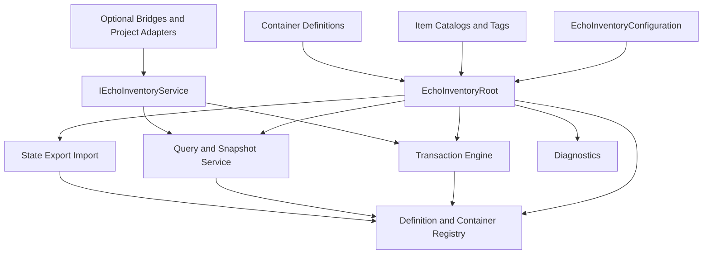

# The Vault - Inventory and Item Containers Package Specification

**Working document ID:** SFGSS-PKG-ECHOINVENTORY-001  
**Specification version:** 1.0.0  
**Status:** Approved  
**Technical package name:** EchoInventory  
**Public title:** The Vault - Inventory and Item Containers  
**Package ID:** `com.echodevgames.echo-inventory`  
**Runtime namespace:** `EchoDevGames.EchoInventory`  
**Owner:** Jesse “Echo” Adams / EchoDevGames  
**Project boundary:** Independent solo project; not an Isekai Studios product  
**Planned repository:** `EchoDevGames/EchoInventory`  
**Current Notes:** `Plan Documentation/Current Notes.md` until the package repository is created, then `Documentation~/Developer/Current Notes.md`  
**Unity baseline:** Unity 6000.3.8f1  
**Minimum supported Unity version:** Unity 6000.0  
**Parent authority:** SFGSS-000 v0.12.0, SFGSS-001 v1.1.0, SFGSS-002 v1.0.0, SFGSS-003 v1.0.0, SFGSS-004 v1.0.0, and SFGSS-005 v1.1.0  
**Last updated:** August 4, 2026

> “Keep every object accounted for, every transfer honest, and every locked door able to explain why it stayed shut.”

> **Approval rule:** This specification is approved as the Level 2 authority for EchoInventory. Package implementation remains locked until SUITE-DOC-33 passes.

---

## Revision History

| Version | Date | Status | Summary | Approved by |
|---|---|---|---|---|
| 0.1.0 | 2026-08-04 | Proposed | Initial complete specification derived from SFGSS-000 through SFGSS-005 and approved package authorities through The Path | Pending |
| 1.0.0 | 2026-08-04 | Approved | Approved item, instance, stack, container, transaction, equipment-storage, persistence, diagnostics, authoring, Laboratory, bridge, and release contracts | Jesse “Echo” Adams |

---

## 1. Package Identity and One-Sentence Contract

**Public title:** The Vault - Inventory and Item Containers  
**Technical identifier:** EchoInventory  
**Flavor line:** Keep every object accounted for, every transfer honest, and every locked door able to explain why it stayed shut.  
**Plain-language subtitle:** A standalone Unity package for immutable item definitions, fungible stacks, unique mutable item instances, containers, slots, capacity, filters, atomic transactions, generic equipment storage, snapshots, diagnostics, authoring, validation, and optional bridges.

**One-sentence ownership contract:**

> EchoInventory owns project-authored item and container definitions, stable item/container/entry/instance identity, one authoritative runtime registry of inventory containers, fungible stacks, unique item instances, slot and capacity policies, read-only queries, atomic add/remove/move/split/merge/swap/transfer/equip/unequip transactions, generic equipment occupancy, versioned state export/import, diagnostics, authoring, validation, and optional bridge seams; it does not own crafting transformations, vendor economics, combat effects, RPG statistics, item-use gameplay, world spawning, production UI, save-file transport, quest truth, dialogue flow, character progression, or multiplayer authority.

### 1.1 Elevator summary

The Vault provides a generic item-and-container authority without forcing every game to adopt an RPG inventory. A puzzle game may use a five-slot tool belt, a rescue game may store carried equipment and mission objects, a jam game may count keys and pickups, and a future RPG may build bags, equipment slots, vendors, crafting, and loot on the same neutral contracts. The package answers: what item definitions exist, what each runtime container currently owns, whether a requested mutation is valid, and what changed after an atomic commit.

The data model deliberately distinguishes **fungible stack entries** from **unique item instances**. A fungible stack represents interchangeable units of one definition and one canonical stack signature. A unique item instance has a durable `ItemInstanceId`, quantity one, and optional versioned state-component records owned by project or bridge providers. Mutable per-item state never lives on the shared `ItemDefinition` asset. Definitions that use unique mutable state default to non-stackable unless a later approved extension proves a safe homogeneous-instance stack model.

Every mutation is validated against current container revisions, slot filters, definition rules, stack limits, quantity bounds, weight limits, equipment occupancy, and provider availability before one commit changes authoritative state. Transactions may touch several containers and either commit completely or make no change. Events publish only after commit. Queries return immutable snapshots rather than live collection references. EchoSave may persist inventory through a participant bridge, EchoCrafting may consume and grant items through a transaction bridge, and EchoUI may present snapshots and submit commands, but the inventory core remains independently usable.

### 1.2 Why this belongs in The Sperk's Forge

Inventory systems repeatedly fail in familiar ways: item definitions are confused with live items; stack quantities are changed directly from UI; transfers remove from one container before discovering the destination is full; unique item IDs disappear during split/merge operations; equipment scripts calculate combat stats while also moving items; save code serializes scene objects; and optional crafting or quest packages become hard dependencies. A reusable package is justified because the repeated engineering problem is stable identity, transactional ownership, capacity, filtering, persistence seams, diagnostics, and clean boundaries.

The suite already establishes neighboring authorities. The Chronicle transports durable payloads. The Path owns objective truth and reward ledgers. The Crucible will own transformations. Clash and Arcana will own combat and abilities. The Looking Glass owns presentation. The Fellowship owns character identity and control ownership. The Vault must therefore remain a focused item/container authority that composes through explicit bridges instead of becoming a universal RPG database.

### 1.3 Verse identity boundary

| Surface | Flavor allowed? | Rule |
|---|---:|---|
| Public title | Yes | Always paired with “Inventory and Item Containers.” |
| Setup guidance/tooltips | Yes | Must remain immediately understandable. |
| Samples | Optional | Vault imagery may decorate the Laboratory but is removable. |
| Runtime API/type names | No lore-only names | Types use `ItemDefinition`, `InventoryContainer`, `InventoryTransaction`, and similar technical names. |
| Project data | No required Verse content | Games own item names, icons, categories, rarity, lore, and presentation. |

## 2. Problem Statement

### 2.1 Current problem

Projects repeatedly need reusable item ownership and transfer rules, but implementation often begins as a list of ScriptableObjects and evolves into coupled UI, crafting, equipment, save, vendor, quest, and combat code. Common failures include partial transfers, duplicated rewards, stale references, mutable shared assets, floating-point capacity drift, index-based saves, hidden scene assumptions, and package removal that destroys unknown data.

A general package must solve the infrastructure without forcing grids, rarity, durability, randomized affixes, equipment stats, or MMO professions into every project. It must support a tiny jam inventory as comfortably as a later RPG integration.

### 2.2 Evidence from existing work

| Source project | Existing pattern or problem | Preserve | Improve |
|---|---|---|---|
| Hackulos planning | Large item taxonomy, bags, equipment, quests, vendors, and eventual crafting | Data-driven item definitions and authored starter content | Separate neutral item/container authority from RPG rules and Editor generation |
| DeverQuest | Rich ScriptableObject authoring and generated catalogs | Repeatable authoring and stable generated assets | Do not import Editor-only guild, timer, authentication, or productivity state |
| Rescuers2D | Role equipment, carried tools, pickups, and password-style progression | Clear role-specific interaction intent | Avoid hard-coded character scripts directly owning inventory mutation |
| Echo Systems Lab | Definition/runtime separation and stable mission IDs | Immutable definitions, explicit runtime services, semantic events | Add atomic multi-container transactions and durable item identities |
| The Path | Reward grants need idempotent item delivery | Stable reward grant IDs and executor boundary | Inventory reward bridge must commit once without becoming objective authority |
| The Chronicle | Save participants and unknown-payload preservation | Versioned provider-neutral state transport | Inventory owns its schema and definitions; save transport remains external |

### 2.3 Consequences of doing nothing

- Every project rebuilds add/remove/transfer logic and repeats edge-case bugs.
- UI, crafting, vendors, and quests mutate shared lists directly.
- Partial operations lose or duplicate items.
- Unique item state becomes inseparable from ScriptableObject definitions.
- Save compatibility depends on asset names, array indexes, or scene hierarchy paths.
- Equipment storage quietly absorbs combat statistics and class rules.
- Removing an optional package can orphan or delete inventory data.
- Debugging becomes a hunt through unrelated gameplay scripts.

## 3. Goals, Non-Goals, and Success Measures

### 3.1 Goals

- Provide stable, neutral item and container identities.
- Separate immutable item definitions from fungible stacks and unique mutable instances.
- Support fixed-slot and bounded list-style containers.
- Support quantity, stack, slot-count, and deterministic weight constraints.
- Provide atomic add, remove, move, split, merge, swap, transfer, equip, and unequip operations.
- Provide read-only queries and immutable snapshots for UI and gameplay.
- Support generic equipment storage without combat/RPG effects.
- Preserve unresolved definitions and unknown item-state records during import and optional-package removal.
- Provide standalone export/import and an optional Chronicle participant bridge.
- Provide actionable diagnostics, safe authoring, validation, and an isolated Laboratory.

### 3.2 Non-goals

- Crafting recipes, ingredient transformations, repair, salvage, or upgrade outcomes.
- Vendor prices, currency, purchasing, selling, bargaining, or economic simulation.
- Damage, armor, attributes, resistances, class restrictions, set bonuses, or encumbrance effects.
- Item-use effects, spells, attacks, consumable execution, or cooldowns.
- World pickup spawning, loot tables, drop physics, or object persistence.
- Production inventory UI, drag visuals, tooltips, or menu navigation.
- A mandatory grid/Tetris layout, nested bags, hotbar system, or equipment paper doll.
- Save files, cloud storage, multiplayer authority, anti-cheat, or network replication.
- One universal item database for all genres.

### 3.3 User outcomes

| User | Starting condition | Desired outcome |
|---|---|---|
| Novice installer | Clean Unity project | Create a catalog, two containers, add a stack, and transfer it in the Laboratory without another Echo package. |
| Programmer | Needs item ownership | Use `IEchoInventoryService` requests/results and immutable snapshots without touching internal lists. |
| Designer/content author | Needs items and containers | Author definitions, tags, filters, capacities, and equipment slots through validated assets. |
| UI developer | Needs stable presentation data | Render container snapshots and submit commands without owning inventory truth. |
| Systems integrator | Needs crafting/objective/save connections | Install explicit bridges that can be removed without breaking core compilation. |
| Tester | Needs reproducible edge cases | Simulate full destinations, stale revisions, missing definitions, invalid stacks, failed imports, and duplicate roots. |

### 3.4 Measurable success criteria

- The package installs in a clean supported Unity project with zero compile errors.
- The core runs with no other Sperk's Forge runtime package installed.
- The Standalone Laboratory proves ordinary stacks, unique instances, capacity, filters, atomic transfers, equipment, import/export, and failures.
- A failed multi-container transaction leaves every involved container unchanged.
- Shared definition assets remain byte-equivalent after Play Mode tests.
- Every durable item/container/entry/instance ID is stable and collision-validated.
- Unknown definitions and state-component records survive an export/import round trip.
- Removing samples, bridges, or optional providers does not break the core.
- Setup and repair are repeatable and non-destructive by default.
- All empirical evidence remains `Not run` until executed under SFGSS-004.

## 4. Users and Primary Use Cases

### 4.1 Intended users

- Solo and small-team Unity developers.
- Gameplay and systems programmers.
- Designers authoring project item catalogs and container policies.
- UI programmers consuming read-only snapshots.
- Maintainers integrating save, objectives, crafting, characters, dialogue, interaction, combat, abilities, vendors, world systems, or multiplayer adapters.

### 4.2 Primary use cases

| ID | Use case | Actor | Preconditions | Expected result | Release phase |
|---|---|---|---|---|---|
| EINV-UC-001 | Create a runtime container | Programmer | Valid container definition and unique container ID | Registered empty container and handle | MVP |
| EINV-UC-002 | Add stackable items | Gameplay adapter | Definition resolved and capacity available | Quantity added/merged atomically | MVP |
| EINV-UC-003 | Add a unique item | Gameplay adapter | Unique instance record valid | Quantity-one entry created | MVP |
| EINV-UC-004 | Remove quantity | Gameplay adapter | Matching entry and sufficient quantity | Quantity removed or entry deleted | MVP |
| EINV-UC-005 | Move within container | UI/project | Source and destination valid | Entry moved, merged, or rejected atomically | MVP |
| EINV-UC-006 | Split a stack | UI/project | Stack quantity greater than split amount | New entry created with exact quantities | MVP |
| EINV-UC-007 | Merge compatible stacks | UI/project | Same definition/signature and stack room | Quantities merged within limit | MVP |
| EINV-UC-008 | Transfer between containers | Gameplay/UI | Both handles valid | Source and destination commit together | MVP |
| EINV-UC-009 | Swap entries | UI/project | Both slots accept opposite entries | Atomic swap | MVP |
| EINV-UC-010 | Query item count | Objective/dialogue/project | Definition/tag exists | Immutable count result | MVP |
| EINV-UC-011 | Test fit before pickup | Interaction/project | Candidate item and destination snapshot | Structured fit result with reason | MVP |
| EINV-UC-012 | Equip an item | Project/UI | Equipment slots accept placement | Item moved and occupancy committed | MVP |
| EINV-UC-013 | Unequip an item | Project/UI | Destination has capacity | Equipment entry moved out atomically | MVP |
| EINV-UC-014 | Export inventory state | Project/save bridge | Service ready | Versioned detached state document | MVP |
| EINV-UC-015 | Import inventory state | Project/save bridge | Document validated/migrated | Staged state replaces/merges by policy | MVP |
| EINV-UC-016 | Preserve unresolved item | Maintainer | Definition temporarily absent | Orphan entry retained and diagnosable | MVP |
| EINV-UC-017 | Deliver objective reward | The Path bridge | Stable reward grant ID | Idempotent atomic grant result | Bridge |
| EINV-UC-018 | Consume/grant crafting items | Crucible bridge | Recipe transaction validated | One atomic ingredient/output batch | Bridge |
| EINV-UC-019 | Present inventory | Looking Glass bridge | Snapshot available | UI receives data and command results | Bridge |
| EINV-UC-020 | Author a simple jam inventory | Designer | Setup tool available | Catalog, backpack, chest, and sample data created safely | MVP |

### 4.3 Explicitly unsupported use cases

- Treating a ScriptableObject definition as the player's live item.
- Directly editing runtime collections from UI or project code.
- One atomic transaction spanning two independent inventory services or remote servers.
- Secure ownership, purchases, or entitlements based solely on local inventory state.
- Automatically executing item effects because an item moved into equipment.
- Saving scene GameObjects or component references inside inventory state.
- Arbitrary nested containers in the MVP.
- Using raw display names or list indexes as durable identity.

## 5. Authority and Ownership Boundaries

### 5.1 The package owns

- Item definitions, catalogs, tags, stack policies, and neutral presentation references.
- Fungible stack entries and unique item-instance records.
- Runtime containers, slots, entries, quantities, occupancy, revisions, and lifecycle.
- Capacity, deterministic weight, filter, and stack-compatibility evaluation.
- Atomic inventory mutation planning, validation, commit, rollback-before-publication, results, and change sets.
- Generic equipment slot occupancy and equip/unequip transactions.
- Inventory queries, snapshots, events, diagnostics, validation, state export/import, and migrations.
- Standalone setup and Laboratory assets.

### 5.2 The package does not own

- Crafting recipes or transformations.
- Combat, abilities, stats, classes, durability effects, affixes, or set bonuses.
- Vendor prices, currencies, purchases, or selling rules.
- Quest/objective truth or reward scheduling.
- Dialogue sequence or narrative conditions beyond a read-only bridge.
- Character roster/identity, world spawning, scene travel, production UI, localization, or audio.
- Save slots/files or cloud/network authority.

### 5.3 Neighboring authorities

| Concern | Authoritative owner | How EchoInventory interacts |
|---|---|---|
| Save files and slots | The Chronicle (`EchoSave`) | Optional participant bridge transports inventory state document. |
| Crafting transformations | The Crucible (`EchoCrafting`) | Separate bridge implements ingredient/output provider through atomic batches. |
| Objective truth and rewards | The Path (`EchoObjectives`) | Separate reward executor and item-query/progress provider bridge. |
| Dialogue flow | Voices (`EchoDialogue`) | Optional read-only condition and explicit command-handler bridge. |
| Character identity/ownership | The Fellowship (`EchoCharacters`) | Bridge maps characters/players to container IDs; Inventory does not own roster. |
| Production UI | The Looking Glass (`EchoUI`) | Presenter/command bridge consumes snapshots and results. |
| Localization | Many Tongues (`EchoLocalization`) | Definitions carry provider-neutral text references; bridge resolves them. |
| World interactions | The Hand (`EchoInteraction`) | Pickup/drop adapter submits explicit inventory/world requests. |
| World identity/spawns | The Atlas (`EchoWorld`) or project | World container and drop references through project/provider adapters. |
| Combat/equipment effects | Clash, Arcana, `EchoRPG.Foundation`, or project | Bridge observes equipment commit and applies/removes external effects. |
| Audio/feedback | Resonance and Impact | Presentation/project adapters react to transaction outcomes. |
| Diagnostics dashboard | The Observatory | Optional provider bridge publishes bounded health/status. |
| Multiplayer authority | The Convergence/provider | Provider validates authoritative requests and replicates approved state. |
| Vendor economics | Project/future package | Uses inventory transactions but owns prices/currency/offer rules. |

### 5.4 Boundary tests

A proposed feature belongs in EchoInventory only when it answers item/container ownership, validity, storage, movement, or durable neutral state. If it determines the value of an item, what the item does, why a reward was earned, what a recipe produces, whether a class may use equipment, what damage changes, how a screen looks, or how a network server validates a player, it belongs elsewhere or behind a bridge.

## 6. Independence Contract

### 6.1 Standalone guarantees

EchoInventory must:

- Compile with only declared Unity dependencies.
- Initialize without First Light or The Workshop.
- Function without EchoSave, EchoUI, EchoCrafting, EchoObjectives, EchoCharacters, or any peer.
- Avoid references to project assemblies, samples, Editor assemblies, or optional peers in core Runtime.
- Support direct setup through a configuration asset/prefab and direct-scene initializer.
- Expose `IEchoInventoryService` for injection and tests.
- Preserve unknown optional state records without requiring their provider.
- Fail visibly and safely when optional collaborators are absent.

### 6.2 Independence proof matrix

| Condition | Expected behavior | Test evidence |
|---|---|---|
| Installed alone | Catalog, containers, transactions, queries, equipment, export/import, and diagnostics work | Clean-project tests |
| Enter Laboratory directly | Development initializer creates only missing authority | Laboratory lifecycle tests |
| Chronicle absent | Explicit export/import remains available; no automatic persistence | Standalone tests |
| UI absent | Public API and snapshots remain usable | Runtime API tests |
| Crafting absent | No compile or runtime impact | Missing-bridge test |
| Duplicate root present | Later root rejects before registry/state side effects | Lifecycle test |
| Required configuration missing | Root reports blocker and does not become Ready | Failure tests |
| Sample content deleted | Runtime and Editor assemblies still compile | Sample-removal test |
| Unknown item definition | Entry remains orphaned and preserved, not silently dropped | Import/round-trip test |
| Unknown item-state provider | Opaque component record remains preserved | Provider-removal test |

### 6.3 Allowed dependencies

| Dependency | Type | Required? | Minimum version | Reason | Removal behavior |
|---|---|---:|---|---|---|
| Unity core modules | Platform | Yes | Unity 6000.0 | MonoBehaviour, ScriptableObject, serialization, scene lifecycle | Package cannot compile without Unity |
| Unity Test Framework | Test only | Yes for tests | Verified during implementation | EditMode/PlayMode evidence | Runtime package unaffected when tests excluded |
| Optional uGUI/TextMeshPro | Sample/presentation only | No | Verified later | Laboratory controls/readout | Removing sample does not affect core |

### 6.4 Forbidden dependencies

- Project-specific item databases, character classes, combat stats, currencies, vendors, or recipes.
- Another Echo runtime package in core Runtime.
- `UnityEditor` from runtime assemblies.
- Samples or Laboratory assets from production runtime.
- Raw scene names, build indexes, tags, layers, Resources paths, Input Actions, or hard-coded folder locations.
- Reflection-based discovery of arbitrary project filters, effects, or serializers.
- Unlicensed content or hidden provider SDKs.

## 7. Capability Scope

### 7.1 Capability matrix

| ID | Capability | Description | Status | MVP? | Surface | Notes |
|---|---|---|---|---:|---|---|
| EINV-CAP-001 | Protected authority | Duplicate-safe root and injectable service | Approved | Yes | Runtime | Claims before side effects |
| EINV-CAP-002 | Item definitions | Stable-ID immutable definitions/catalogs | Approved | Yes | Runtime/Editor | Project-owned assets |
| EINV-CAP-003 | Inventory tags | Stable tags for filters/queries | Approved | Yes | Runtime/Editor | Not Unity tags |
| EINV-CAP-004 | Fungible stacks | Interchangeable units with quantity/signature | Approved | Yes | Runtime | No per-unit identity |
| EINV-CAP-005 | Unique instances | Quantity-one mutable instance records | Approved | Yes | Runtime | Opaque versioned state components |
| EINV-CAP-006 | Fixed slots | Named/indexed stable slots and filters | Approved | Yes | Runtime | Includes equipment basis |
| EINV-CAP-007 | Bounded list containers | Entry-list containers with max entries | Approved | Yes | Runtime | No grid layout |
| EINV-CAP-008 | Capacity | Slot/entry and deterministic weight limits | Approved | Yes | Runtime | No encumbrance effects |
| EINV-CAP-009 | Filters | Definition/tag/state/provider-aware acceptance | Approved | Yes | Runtime | Read-only providers |
| EINV-CAP-010 | Atomic mutations | Add/remove/move/split/merge/swap/transfer | Approved | Yes | Runtime | Multi-container transaction |
| EINV-CAP-011 | Batch transactions | Multiple mutations commit together | Approved | Yes | Runtime | Crafting/vendor foundation |
| EINV-CAP-012 | Revision conflicts | Expected revisions prevent stale commands | Approved | Yes | Runtime | Structured conflict result |
| EINV-CAP-013 | Queries/snapshots | Counts, fit checks, entries, immutable views | Approved | Yes | Runtime | No live lists |
| EINV-CAP-014 | Generic equipment | Slot occupancy and equip/unequip | Approved | Yes | Runtime | No effects/stats |
| EINV-CAP-015 | Export/import | Versioned provider-neutral state | Approved | Yes | Runtime | Chronicle optional |
| EINV-CAP-016 | Unknown preservation | Orphan definitions/state records round-trip | Approved | Yes | Runtime | Explicit prune only |
| EINV-CAP-017 | Diagnostics | Health, counts, conflicts, bounds, redaction | Approved | Yes | Runtime/Editor | `EINV-*` |
| EINV-CAP-018 | Setup/repair | Repeat-safe authoring and validation | Approved | Yes | Editor | Preview/report changes |
| EINV-CAP-019 | Standalone Laboratory | Isolated transaction and failure proof | Approved | Yes | Sample/tests | No peer packages |
| EINV-CAP-020 | Nested containers | Bags containing containers | Deferred | No | Runtime | Cycle/weight/ownership design needed |
| EINV-CAP-021 | Grid inventory | Width/height/rotation placement | Deferred | No | Module | Not required for jam MVP |
| EINV-CAP-022 | Reservations | Long-lived quantity/slot reservations | Deferred | No | Runtime | Async distributed workflows |
| EINV-CAP-023 | Sorting/autostack | Configurable reorganization policies | Deferred | No | Runtime | Must preserve IDs/intent |
| EINV-CAP-024 | Durability/affixes | Built-in mutable RPG item features | Rejected core | No | RPG/project | State providers may add project data |
| EINV-CAP-025 | Currency/vendor | Economic transactions | Rejected core | No | Project/future | Inventory only moves owned items |

### 7.2 MVP capability set

The smallest complete release contains one protected root; catalogs and tags; fungible stacks; unique instances; fixed and bounded-list containers; slot, quantity, stack, filter, entry-count, and weight validation; atomic operations and batches; generic equipment occupancy; immutable snapshots and semantic events; versioned export/import with aliases and unknown-record preservation; Editor setup/validation; diagnostics; and one isolated Laboratory.

### 7.3 Later capability set

- Nested container module with cycle-safe aggregate weight.
- Grid/Tetris placement module.
- Reservation/escrow extension for long-running external workflows.
- Sorting, compaction, and user-defined ordering policies.
- Addressables/provider-backed definition loading.
- Specialized equipment layout/presentation modules.
- Network-provider adapters.
- High-volume/ECS investigation.

### 7.4 Deferred and rejected ideas

| Idea | Disposition | Reason | Revisit trigger |
|---|---|---|---|
| Unlimited containers/stacks | Rejected | Hides memory and validation failures | Never as stable default |
| Direct UI list mutation | Rejected | Violates authority | Never |
| Definition asset as live item | Rejected | Shared-state contamination | Never |
| Floating-point weight authority | Rejected | Accumulation drift | Only as display conversion |
| Nested bags | Deferred | Cycles, aggregate capacity, and save semantics | Dedicated module design |
| Random affixes/durability | Deferred to RPG/project | Genre-specific mutable state | `EchoRPG.Foundation` design |
| Built-in vendor/shop | Rejected core | Economics is separate authority | Future package evidence |
| Remote/network atomicity | Deferred | Provider/server semantics required | EchoMultiplayer research |

## 8. Architecture Overview

### 8.1 Design model

| Layer | Contains | Must not contain |
|---|---|---|
| Definition/configuration | Item definitions, catalogs, tags, container/slot/equipment definitions, stack/capacity/filter policies, aliases | Live quantities, runtime instances, scene objects, current revisions |
| Runtime state/behavior | Root, registry, containers, entries, unique instances, revisions, transaction engine, queries, snapshots, import/export | Editor logic, production UI, combat/crafting/vendor rules |
| Presentation/feedback | Optional Laboratory and bridges consuming snapshots/results | Authoritative inventory mutation outside service requests |

### 8.2 Component topology



### 8.3 Authoritative root

| Question | Decision |
|---|---|
| Persistent root required? | Yes for default application-session service; injection may supply project-owned lifetime. |
| Root type | `EchoInventoryRoot` |
| Duplicate behavior | First valid authority wins; later roots reject before catalog registration, subscriptions, containers, or state mutation. |
| Initialization trigger | `Awake` claims only; explicit initialization validates configuration and builds registries. |
| Shutdown behavior | Reject new mutations, complete/cancel safe operations, dispose providers, clear session handles, publish final status. |
| Direct-scene behavior | Development initializer creates configured root only when absent. |
| Test injection seam | `IEchoInventoryService`, clock/ID/serializer/filter providers, and in-memory configuration fixtures. |

### 8.4 Lifecycle sequence

1. Claim authority with no side effects.
2. Validate configuration, catalogs, IDs, aliases, limits, and provider descriptors.
3. Build immutable definition/tag/container registries.
4. Initialize transaction engine, query service, diagnostics, and state codec.
5. Create configured startup containers or wait for explicit creation requests.
6. Enter Ready and accept queries/mutations.
7. Reconcile scene-owned containers and provider registrations as scenes change.
8. Stage imports/resets through exclusive mutation mode.
9. On shutdown, reject new work, dispose registrations, invalidate session handles, and clear runtime state.

### 8.5 Failure model

| Failure | Detection point | User-visible result | Runtime fallback | Diagnostic code |
|---|---|---|---|---|
| Duplicate root | Claim | Later root disabled/destroyed | Existing authority continues | EINV-ROOT-001 |
| Missing configuration | Initialization | Blocker report | Root remains Failed | EINV-CFG-001 |
| Duplicate stable ID | Registry build | Blocker | Registry not published | EINV-ID-002 |
| Unknown definition during import | Import validation | Warning/orphan snapshot | Opaque entry preserved | EINV-DATA-004 |
| Invalid quantity/stack | Request validation | Rejected result | No mutation | EINV-TX-003 |
| Destination capacity exceeded | Planning | Rejected with reasons | No mutation | EINV-CAP-002 |
| Revision mismatch | Commit precondition | Conflict result | Caller refreshes snapshot | EINV-TX-006 |
| Filter provider missing | Planning/import | Unavailable result | No implicit acceptance | EINV-FLT-003 |
| State component provider missing | Query/import | Orphan component warning | Opaque record preserved | EINV-DATA-006 |
| Event listener throws | Post-commit publication | Diagnostic | Commit remains authoritative | EINV-EVT-002 |
| Import migration gap | Import preparation | Blocked | Current state unchanged | EINV-MIG-003 |

## 9. Runtime Data and State Model

### 9.1 Definitions and configuration assets

| Type | Purpose | Stable ID? | Mutable at runtime? | Project-owned instance? |
|---|---|---:|---:|---:|
| `EchoInventoryConfiguration` | Catalogs, limits, policies, serializer/version settings | Yes | No | Yes |
| `ItemDefinition` | Shared item identity, stack policy, unit weight, tags, neutral references | Yes | No | Yes |
| `ItemCatalog` | Explicit collection of item definitions and aliases | Yes | No | Yes |
| `InventoryTagDefinition` | Stable semantic tag | Yes | No | Yes |
| `InventoryTagCatalog` | Tag registry and aliases | Yes | No | Yes |
| `InventoryContainerDefinition` | Container layout, capacity, slots, filters, persistence policy | Yes | No | Yes |
| `InventorySlotDefinition` | Stable slot identity, filter, stack/quantity override, display metadata | Yes | No | Yes |
| `EquipmentContainerDefinition` | Named equipment slots and occupancy policy | Yes | No | Yes |
| `InventoryFilterDefinition` | Built-in allow/deny/tag/rule composition | Yes | No | Yes |
| `ItemStateSchemaDefinition` | Optional provider ID/version expectations for unique instances | Yes | No | Yes |

### 9.2 Runtime state

| State object | Owner | Lifetime | Reset rule | Serialization rule |
|---|---|---|---|---|
| `InventoryRuntimeRegistry` | Root | Application session | Rebuilt on initialization/import | Not serialized directly |
| `InventoryContainerState` | Service | Container lifetime | Explicit remove/reset/import | Exported by stable container ID |
| `FungibleStackEntry` | Container | Until depleted/moved/imported | Transactional | Definition ID, signature, quantity, entry ID |
| `UniqueItemEntry` | Container | Until removed/moved/imported | Transactional | Item instance record, quantity one |
| `ItemInstanceRecord` | Service/container | Durable logical item lifetime | Explicit project/provider mutation transaction | Instance ID, definition ID, component records |
| `InventoryTransactionState` | Transaction engine | One request | Discard after result | Not durable |
| `InventoryContainerHandle` | Service | Session/generation | Invalidated on removal/reset/shutdown | Never durable |
| `InventorySnapshot` | Query service | Immutable value snapshot | Replaced by newer snapshot | Optional DTO/export source |
| `InventoryStateDocument` | Export/import service | Detached | Versioned/migrated | Durable provider-neutral DTO |

### 9.3 Identity taxonomy

| Identity | Meaning | Durable? | Notes |
|---|---|---:|---|
| `ItemDefinitionId` | Shared item type | Yes | Independent from asset name/GUID |
| `ItemCatalogId` | Catalog identity | Yes | Supports merge/validation |
| `InventoryTagId` | Semantic tag | Yes | Not Unity Tag |
| `ContainerDefinitionId` | Container template | Yes | Immutable definition identity |
| `InventoryContainerId` | Logical container instance | Usually | Project/generated; may be save referenced |
| `InventorySlotId` | Stable slot within container definition | Yes | Never array index alone |
| `InventoryEntryId` | Stored stack/unique entry | Yes when exported | Survives movement; new split receives new ID |
| `ItemInstanceId` | Unique mutable item | Yes | Never reused |
| `InventoryTransactionId` | Request/idempotency identity | Bounded history only | Not an item/container identity |
| `InventoryContainerHandle` | Root + container + generation | No | Rejects stale session access |

IDs follow SFGSS-003: normalized package/domain IDs, collision validation, aliases for released changes, explicit tombstones, and no silent regeneration after publication.

### 9.4 Fungible stacks and unique instances

A `FungibleStackEntry` contains one `ItemDefinitionId`, one canonical stack signature, one positive quantity, and one `InventoryEntryId`. Units are interchangeable and have no individual IDs. The definition's max stack and any container/slot override bound quantity.

A `UniqueItemEntry` contains one `ItemInstanceRecord`, quantity one, and one entry ID. The instance record carries a durable `ItemInstanceId` and zero or more versioned opaque `ItemStateComponentRecord` values. The provider owning a component may validate, migrate, describe, and intentionally mutate it through an approved item-instance transaction seam. Missing providers do not cause deletion.

MVP rules:

- Definitions with unique mutable state default to max stack one.
- Fungible stacks never pretend to contain individual instance IDs.
- A split creates a new entry ID; a merge retires the emptied entry ID.
- An item instance keeps its instance ID when moved or equipped.
- Stack signatures are canonical, deterministic, bounded, and never based on display text.

### 9.5 Quantity, weight, and capacity

- Quantity uses positive bounded integers.
- Unit weight uses nonnegative signed 64-bit **weight units** defined by project convention.
- Runtime totals use checked arithmetic and fail on overflow.
- UI may format weight units as kilograms, pounds, burden, slots, or another project label.
- Weight authority never applies movement penalties or encumbrance effects.
- Capacity may combine maximum entries, fixed slots, per-slot quantity, total weight, and filters.
- Zero/negative quantities, negative weight, overflow, and impossible limits are validation errors.

### 9.6 Container model

Two MVP container shapes are supported:

1. **Fixed-slot container:** stable authored slots, each with its own ID, filter, quantity/stack override, and occupancy state.
2. **Bounded-list container:** ordered entries with a maximum retained entry count, container-wide filters, stack limits, and optional weight maximum.

Shared, personal, world, chest, vendor, and temporary are project-defined usage patterns expressed through definitions/tags/ownership adapters, not hard-coded genre enums.

Container removal rejects non-empty containers by default. A destructive discard or transactional evacuation requires an explicit request and result; no implicit item deletion occurs.

### 9.7 Filters and provider state

Built-in filters may allow/deny by item definition, inventory tag, entry kind, and bounded weight/quantity rules. Custom filters implement an explicit synchronous read-only provider contract. Providers must be registered by stable ID, expose availability, avoid side effects, and return structured reasons. Missing or failed providers produce `Unavailable` or `Rejected`, never implicit acceptance.

### 9.8 ScriptableObject safety

Definitions and configuration assets remain immutable in Play Mode. Runtime quantities, unique state, revisions, ownership, current slots, provider registrations, and diagnostics live in authority-owned runtime objects. Tests compare serialized definition assets before and after runtime operations.

### 9.9 Serialization and migration

`InventoryStateDocument` includes document version, configuration/schema identity, container records, entries, item instances, component records, aliases applied, and integrity metadata where provided by the transport. Migrations are contiguous, deterministic, side-effect-free on the source, and fixture-tested. Newer unsupported documents are rejected without mutating current state. Unknown definitions and component records remain opaque and bounded until their owners return or an explicit backed-up prune occurs.

## 10. Public Runtime API

### 10.1 Public types

| Type | Kind | Responsibility | Construction/ownership |
|---|---|---|---|
| `EchoInventoryRoot` | sealed MonoBehaviour | Default runtime authority/lifecycle | Prefab/setup or direct initializer |
| `IEchoInventoryService` | interface | Queries, containers, transactions, export/import | Implemented by root/service |
| `EchoInventoryConfiguration` | ScriptableObject | Project catalogs, policies, bounds, schema | Project-owned |
| `ItemDefinition` | ScriptableObject | Immutable shared item description | Project-owned |
| `ItemCatalog` | ScriptableObject | Item registry/aliases | Project-owned |
| `InventoryTagDefinition` | ScriptableObject | Stable semantic tag | Project-owned |
| `InventoryContainerDefinition` | ScriptableObject | Container template | Project-owned |
| `EquipmentContainerDefinition` | ScriptableObject | Generic equipment slots/occupancy | Project-owned |
| `InventoryContainerHandle` | readonly struct | Session-safe container access | Service-issued |
| `InventoryContainerSnapshot` | immutable DTO | Read-only container state | Query result |
| `InventoryEntrySnapshot` | immutable DTO | Read-only entry state | Query result |
| `ItemInstanceSnapshot` | immutable DTO | Read-only unique item state metadata | Query result |
| `InventoryTransactionRequest` | immutable DTO | One or multi-operation mutation request | Caller-created/builder |
| `InventoryTransactionResult` | immutable result | Commit/rejection/conflict/change set | Service-created |
| `InventoryFitResult` | immutable result | Capacity/filter/stack fit explanation | Service-created |
| `InventoryChangeSet` | immutable DTO | Post-commit changes | Service-created |
| `InventoryStateDocument` | serializable DTO | Versioned detached state | Service export/import |
| `IInventoryFilterProvider` | interface | Custom read-only acceptance policy | Project/bridge registration |
| `IItemStateProvider` | interface | Unique component validate/migrate/describe/mutate seam | Project/bridge registration |
| `InventoryProviderRegistration` | disposable handle | Owns provider lifetime | Service-issued |

### 10.2 Public methods and properties

| Member | Purpose | Preconditions | Result/failure behavior | Thread/main-loop rule |
|---|---|---|---|---|
| `InventoryStatus Status` | Current lifecycle/health | None | Immutable status | Main-thread read; snapshot may be cached |
| `TryGetContainer(id, out handle)` | Resolve logical container | Service Ready | False if absent; no creation | Main thread |
| `CreateContainer(request)` | Create logical container | Valid definition/ID | Structured result/handle | Main thread |
| `RemoveContainer(request)` | Remove empty/explicitly handled container | Valid handle/revision | Atomic result | Main thread |
| `GetContainerSnapshot(handle)` | Immutable current view | Valid handle | Snapshot or stale/absent result | Main thread |
| `Query(InventoryQuery)` | Counts/find/filter/fit | Service Ready | Immutable result | Main thread in MVP |
| `Evaluate(request)` | Dry-run mutation explanation | Valid references | Non-authoritative plan/result | Main thread, no mutation |
| `Execute(request)` | Validate and atomically commit | Service Ready | Committed/rejected/conflict/unavailable | Main thread |
| `ExportState()` | Detached versioned document | Ready or suspended by policy | Document/result | Capture main thread; serialization provider may detach |
| `PrepareImport(document, policy)` | Validate/migrate without commit | Valid detached document | Prepared import/result | Detached work allowed; Unity/provider access main thread |
| `CommitImport(prepared)` | Replace/merge state atomically | Prepared token current | Commit or no change | Main thread |
| `RegisterFilter(provider)` | Add explicit provider | Unique valid ID | Disposable registration | Main thread |
| `RegisterItemStateProvider(provider)` | Add state component provider | Unique valid ID | Disposable registration | Main thread |

No public method returns a mutable internal container, entry list, stack object, or definition registry collection.

### 10.3 Transaction operations

| Operation | Meaning | Core rules |
|---|---|---|
| Add | Grant fungible quantity or unique instance | Capacity/filter/stack validation; caller supplies source reason/grant ID optionally |
| Remove | Remove quantity or exact unique instance | Exact sufficiency; no implicit world drop |
| Move | Relocate entry within container | Slot/list order/merge rules |
| Split | Divide fungible stack | Positive amount less than source; new entry ID |
| Merge | Combine compatible fungible stacks | Same definition/signature; target room |
| Swap | Exchange two entries/slots | Both destinations accept opposite entries |
| Transfer | Move between containers | Source and destination commit together |
| Equip | Move into equipment slots | All occupied slots accept item/placement |
| Unequip | Move from equipment to destination | Destination capacity required |
| Batch | Execute several operations | All validate against one working state; one commit/change set |

### 10.4 Events and callbacks

| Event | Raised by | Timing | Payload | Listener assumptions |
|---|---|---|---|---|
| `StatusChanged` | Root | After lifecycle state changes | Old/new status | Listener not required |
| `ContainerCreated` | Service | After commit | Container snapshot | Semantic notification |
| `ContainerRemoved` | Service | After commit | Container ID/reason | No live handle guaranteed |
| `TransactionCommitted` | Service | After authoritative mutation | Result/change set | Listener failure cannot rollback commit |
| `EquipmentChanged` | Service | After equipment commit | Slot occupancy changes | Effects belong to bridge/project |
| `StateImported` | Service | After import publication | Import summary | UI may refresh |
| `StateReset` | Service | After reset | Reset summary | No hidden save |
| `DiagnosticRaised` | Diagnostics | Bounded/reportable | Code/context | No per-frame spam |

### 10.5 Concurrency, revisions, and idempotency

- Container state carries a monotonically increasing runtime revision.
- Requests may provide expected revisions for every touched container.
- A mismatch returns `Conflict` with no mutation.
- Commits are serialized by one main-thread mutation coordinator.
- A bounded transaction-ID history may return the previous result for exact duplicate idempotent requests.
- Unknown/expired transaction IDs are treated as new only according to documented caller policy.
- Public preview results are advisory; execution always revalidates current state.

### 10.6 Async and cancellation policy

Core local transactions are synchronous main-thread operations because they mutate bounded in-memory state. Export/import serialization and provider-backed storage may use async wrappers. Cancellation is honored before import publication or before external provider commit; once the local transaction publication point is crossed, cancellation cannot roll back committed truth. No operation awaits UI, audio, feedback, save, or network listeners inside the core commit.

### 10.7 API ergonomics

The novice path provides one configuration, sample catalog, backpack, chest, and Laboratory controls. The programmer path exposes service interfaces, immutable requests/results, stable IDs, providers, prepared import, and dependency-injected testing. Convenience static access may exist as a documented optional accessor but cannot be the only API.

## 11. Editor Tooling and Authoring Experience

### 11.1 Setup workflow

1. Install the package.
2. Open **Sperk's Forge > The Vault > Setup**.
3. Choose create-only-safe locations for configuration, item catalog, tag catalog, container definitions, and root prefab.
4. Preview exact assets/folders/references that will be created or repaired.
5. Apply the plan.
6. Open the Standalone Laboratory sample.
7. Run validation and review the readiness report.

### 11.2 Setup operations

| Operation | Creates | Modifies | Repeats safely? | Undo/backup | Report output |
|---|---|---|---:|---|---|
| Create configuration | Project-owned configuration | None unless explicit repair | Yes | Undo where supported | Setup receipt |
| Create starter catalogs | Empty item/tag catalogs | Configuration references | Yes | Undo | IDs/assets report |
| Create sample containers | Backpack/chest/equipment definitions | Configuration catalog | Yes | Undo | Definition report |
| Create root prefab | Root with configuration reference | None outside target | Yes | Undo | Prefab report |
| Repair IDs/references | Selected invalid assets | Selected fields only | Idempotent | Backup/Undo | Before/after report |
| Generate aliases | Alias records after approved ID change | Selected catalog | Yes | Backup | Migration note |
| Validate project | Nothing | Nothing | Yes | N/A | Validation report |

### 11.3 Inspectors and windows

| Tool | User | Purpose | Runtime dependency? |
|---|---|---|---:|
| Vault Setup | Installer | Create/repair core assets and prefab | No |
| Item Definition Inspector | Designer | IDs, tags, stack policy, weight, neutral references | No |
| Catalog Browser | Designer/maintainer | Search definitions, duplicates, aliases, unresolved refs | No |
| Container Designer | Designer | Slots, filters, capacity, equipment occupancy | No |
| Transaction Simulator | Programmer/tester | Dry-run add/remove/transfer/equip cases | No |
| State Document Inspector | Maintainer | Redacted structure/version/orphan inspection | No |
| Validation Window | Maintainer | Project/package checks and readiness | No |

### 11.4 Validation and repair

| Check ID | Condition | Severity | Fix available? | Safe auto-fix? |
|---|---|---|---:|---:|
| EINV-VAL-001 | Missing configuration | Blocker | Yes | Yes, create new |
| EINV-VAL-002 | Duplicate definition/container/tag ID | Blocker | Yes | Only unreleased/unreferenced IDs |
| EINV-VAL-003 | Empty/invalid stable ID | Error | Yes | Yes before release |
| EINV-VAL-004 | Alias cycle/collision | Error | Manual | No |
| EINV-VAL-005 | Negative/overflowing weight or quantity limit | Error | Manual | No |
| EINV-VAL-006 | Stackable definition declares unique mutable state | Error | Guided | No |
| EINV-VAL-007 | Slot filter references missing tag/definition/provider | Error | Guided | No |
| EINV-VAL-008 | Equipment slot IDs duplicate | Blocker | Guided | No after release |
| EINV-VAL-009 | Container max below authored initial contents | Error | Guided | No |
| EINV-VAL-010 | Runtime assembly references `UnityEditor` | Blocker | Manual | No |
| EINV-VAL-011 | Sample dependency leaks into runtime | Blocker | Manual | No |
| EINV-VAL-012 | Unknown provider policy lacks preservation | Error | Manual | No |

Setup and repair never overwrite project-owned item names, icons, catalogs, state schemas, capacities, or container contents silently.

## 12. Installation, Scene Setup, and Direct Testing

### 12.1 Installation routes

Planned routes:

- Git URL.
- Local path during development.
- Embedded package development.
- Tarball.
- Registry when a registry strategy is approved.
- The Workshop after its EchoInventory setup adapter is implemented.

Every advertised route requires independent evidence under SFGSS-004.

### 12.2 Minimal scene setup

- One `EchoInventoryConfiguration` referencing at least one item catalog and container definition catalog/list.
- One `EchoInventoryRoot` prefab/component assigned to the configuration.
- Optional project bootstrap code that creates logical containers.
- No EventSystem, UI, Input System, save, audio, or other Echo package required.

### 12.3 Boot-scene setup

Normal production setup places the protected root in the Boot/preload scene or initializes an injected service through project composition. First Light may invoke a setup/startup adapter through a separate integration, but EchoInventory does not require First Light.

### 12.4 Direct-scene setup

`EchoInventoryDirectSceneInitializer` is development-only. It checks for an existing service, creates the configured root only when absent, labels diagnostics as direct-scene initialization, and follows identical duplicate-safety rules. Release inclusion is disabled by default.

### 12.5 Scene isolation rule

The Laboratory contains only EchoInventory, declared Unity dependencies, and redistributable sample assets. Scene-owned containers register through owned handles and reconcile on unload; application-owned containers remain. No unrelated package may be present merely to make the sample function.

## 13. Standalone Test Lab and Samples

### 13.1 Standalone Test Lab purpose

The **Vault Inventory Laboratory** proves item definitions, stacks, unique instances, list/fixed/equipment containers, capacities, filters, queries, atomic mutations, revision conflicts, export/import, unknown preservation, diagnostics, reset, duplicate safety, and removal behavior without another Echo package.

### 13.2 Required Laboratory contents

- Minimal item and tag catalogs with stackable tokens, weighted supplies, unique tools, and equipment-compatible items.
- Backpack list container, fixed chest, and named equipment container.
- Plain controls for every core transaction and reset.
- Snapshot, revision, capacity, weight, entry, instance, and diagnostic readouts.
- Simulated filter and item-state providers that can be disabled.
- Import fixtures for current, old, newer, corrupt, unknown-definition, and unknown-provider documents.
- No project-owned or restricted content.

### 13.3 Laboratory acceptance checklist

| Test | Action | Expected result | Evidence type | Status |
|---|---|---|---|---|

| EINV-LAB-001 | Initialize valid root | Root becomes Ready and registries publish once | Manual/automated | Not run |

| EINV-LAB-002 | Start with duplicate roots | Later root rejects before state creation | Manual/automated | Not run |

| EINV-LAB-003 | Open Laboratory scene directly | Development initializer creates one authority | Manual/automated | Not run |

| EINV-LAB-004 | Remove configuration | Blocker status; no mutations accepted | Manual/automated | Not run |

| EINV-LAB-005 | Create empty list container | Valid handle and snapshot | Manual/automated | Not run |

| EINV-LAB-006 | Create fixed-slot container | Stable empty slots visible | Manual/automated | Not run |

| EINV-LAB-007 | Create duplicate container ID | Second creation rejected | Manual/automated | Not run |

| EINV-LAB-008 | Remove empty container | Handle invalidated and event published | Manual/automated | Not run |

| EINV-LAB-009 | Remove non-empty container | Rejected by default with contents unchanged | Manual/automated | Not run |

| EINV-LAB-010 | Add fungible stack | Entry created with exact quantity | Manual/automated | Not run |

| EINV-LAB-011 | Add into compatible stack | Quantity merges within max stack | Manual/automated | Not run |

| EINV-LAB-012 | Add beyond stack maximum | Remainder creates entries or rejects by request policy | Manual/automated | Not run |

| EINV-LAB-013 | Add unique item | Quantity-one instance keeps durable ID | Manual/automated | Not run |

| EINV-LAB-014 | Attempt stack of unique items | Rejected under MVP policy | Manual/automated | Not run |

| EINV-LAB-015 | Remove partial quantity | Source quantity decreases exactly | Manual/automated | Not run |

| EINV-LAB-016 | Remove full quantity | Entry retires without affecting other entries | Manual/automated | Not run |

| EINV-LAB-017 | Remove insufficient quantity | Whole request rejected | Manual/automated | Not run |

| EINV-LAB-018 | Move entry to empty slot | Entry identity preserved | Manual/automated | Not run |

| EINV-LAB-019 | Split stack | New entry ID and exact quantities | Manual/automated | Not run |

| EINV-LAB-020 | Merge compatible stacks | Target updated; emptied source retired | Manual/automated | Not run |

| EINV-LAB-021 | Merge incompatible signatures | Rejected without mutation | Manual/automated | Not run |

| EINV-LAB-022 | Swap two fixed slots | Both filters validate and swap commits | Manual/automated | Not run |

| EINV-LAB-023 | Swap into rejecting slot | No partial movement | Manual/automated | Not run |

| EINV-LAB-024 | Transfer between containers | Source/destination commit atomically | Manual/automated | Not run |

| EINV-LAB-025 | Transfer into full destination | Both containers unchanged | Manual/automated | Not run |

| EINV-LAB-026 | Batch remove and grant | All operations commit in one change set | Manual/automated | Not run |

| EINV-LAB-027 | Batch with one invalid operation | Entire batch rejects | Manual/automated | Not run |

| EINV-LAB-028 | Execute stale revision request | Conflict and refresh reason | Manual/automated | Not run |

| EINV-LAB-029 | Replay idempotent transaction ID | Previous committed result returned once | Manual/automated | Not run |

| EINV-LAB-030 | Exceed entry capacity | Structured capacity rejection | Manual/automated | Not run |

| EINV-LAB-031 | Exceed weight capacity | Checked deterministic rejection | Manual/automated | Not run |

| EINV-LAB-032 | Overflow weight arithmetic | Validation failure, no wraparound | Manual/automated | Not run |

| EINV-LAB-033 | Allow tag filter | Accepted item commits | Manual/automated | Not run |

| EINV-LAB-034 | Deny tag filter | Rejected with filter reason | Manual/automated | Not run |

| EINV-LAB-035 | Missing custom filter provider | Unavailable, never implicit allow | Manual/automated | Not run |

| EINV-LAB-036 | Query by definition | Exact total returned | Manual/automated | Not run |

| EINV-LAB-037 | Query by tag | Matching total and entries returned | Manual/automated | Not run |

| EINV-LAB-038 | Fit-check candidate | No mutation and detailed constraints | Manual/automated | Not run |

| EINV-LAB-039 | Equip one-slot item | Inventory-to-equipment move and event | Manual/automated | Not run |

| EINV-LAB-040 | Equip multi-slot placement | All occupied slots commit together | Manual/automated | Not run |

| EINV-LAB-041 | Equip into occupied slot | Rejected unless explicit valid swap policy | Manual/automated | Not run |

| EINV-LAB-042 | Unequip to full backpack | Equipment remains unchanged | Manual/automated | Not run |

| EINV-LAB-043 | Observe equipment change | Bridge-ready semantic change only | Manual/automated | Not run |

| EINV-LAB-044 | Export and reset | Detached document produced; reset explicit | Manual/automated | Not run |

| EINV-LAB-045 | Import current document | All containers/IDs restored | Manual/automated | Not run |

| EINV-LAB-046 | Import old document | Migration chain prepares current state | Manual/automated | Not run |

| EINV-LAB-047 | Import newer document | Rejected without mutation | Manual/automated | Not run |

| EINV-LAB-048 | Import missing item definition | Orphan entry preserved | Manual/automated | Not run |

| EINV-LAB-049 | Remove item-state provider | Opaque component record preserved | Manual/automated | Not run |

| EINV-LAB-050 | Reinstall item-state provider | Record resolves without ID change | Manual/automated | Not run |

| EINV-LAB-051 | Listener throws after commit | Commit remains; diagnostic raised | Manual/automated | Not run |

| EINV-LAB-052 | Delete samples | Runtime package still compiles and functions | Manual/automated | Not run |

### 13.4 Optional showcase and integration samples

| Sample | Packages involved | Purpose | Why it is not standalone proof |
|---|---|---|---|
| Inventory UI | EchoInventory + EchoUI | Drag/drop, tooltips, focus, command results | Requires UI authority |
| Objective reward | EchoInventory + EchoObjectives | Idempotent item reward executor | Requires both peers |
| Quest combine | EchoInventory + EchoCrafting | Ingredient/output transaction | Requires crafting bridge |
| Character equipment | EchoInventory + EchoCharacters | Character-owned containers/loadout | Requires roster ownership |
| Save round trip | EchoInventory + EchoSave | Participant payload persistence | Requires save transport |

Samples are separately importable and removable.

## 14. Presentation, UI, and Accessibility

### 14.1 Presentation ownership

The core is nonvisual. It exposes immutable snapshots, stable IDs, structured constraints, transaction results, and semantic events. The Looking Glass bridge or project UI owns screens, drag visuals, focus, selection, tooltips, icons, sounds, and navigation. Laboratory UI is sample-only.

### 14.2 Required presentable states

- Service ready, initializing, unavailable, or failed.
- Container available, missing, stale, locked, or removed.
- Empty and partially filled containers.
- Stackable and unique entries.
- Full by entries, slots, weight, filter, stack, or occupancy.
- Transaction committed, rejected, conflict, unavailable, or invalid.
- Unresolved definition/provider state.
- Equipment slot empty, occupied, blocked, or incompatible.

### 14.3 Accessibility requirements

- All status reasons must be available as text, not color alone.
- Snapshot ordering must be stable enough for keyboard/controller focus restoration.
- UI bridges must expose semantic labels and quantities.
- Weight and quantity formatting must support locale-aware presentation through Many Tongues/project code.
- Drag/drop cannot be the only interaction; command alternatives are required in production templates.
- Reduced motion and audio preferences belong to UI/feedback/audio authorities.

### 14.4 Visual customization

Item icons, rarity frames, colors, names, descriptions, slot art, equipment layouts, and inventory themes are project-owned. Runtime code never requires a specific icon size, canvas hierarchy, or visual taxonomy.

## 15. Diagnostics and Observability

### 15.1 Standalone diagnostics

| Diagnostic | Surface | Release availability | Cost |
|---|---|---|---|
| Lifecycle/configuration status | API/Inspector/report | Editor/dev/release-safe summary | Low |
| Registry counts/duplicates | API/validation | Editor/dev | Low |
| Container counts/revisions/capacity | API/overlay provider | Dev; bounded release-safe summary | Low |
| Transaction results/history | Bounded API/report | Dev by default | Configurable |
| Orphan definition/provider records | Validation/API | Editor/dev | Low |
| Import/export/migration status | Report/API | Dev/release-safe result | Per operation |
| Performance counters | API | Dev | Sampled |

### 15.2 Structured status

Diagnostics expose:

- Package/version and initialization mode.
- Authority/root identity.
- Configuration/catalog identities.
- Definition/tag/container/provider counts.
- Container IDs, revisions, entry counts, weight totals, and capacity states by ID only.
- Current mutation/import state.
- Bounded recent transaction IDs, operation types, outcomes, and reason codes.
- Orphan definition/component counts and bytes.
- Current warnings/errors.

No raw custom item-state payload, player-authored item name, full save path, resolved localized text, or arbitrary project metadata appears by default.

### 15.3 Diagnostic codes

| Code | Severity | Meaning | User action |
|---|---|---|---|
| EINV-ROOT-001 | Warning | Duplicate root rejected | Remove duplicate scene/prefab root |
| EINV-ROOT-003 | Error | Root failed initialization | Inspect configuration report |
| EINV-CFG-001 | Blocker | Configuration missing | Assign/create configuration |
| EINV-ID-002 | Blocker | Stable ID collision | Repair before implementation/release |
| EINV-DEF-003 | Error | Invalid item definition | Fix stack/weight/tag/state rules |
| EINV-CONT-002 | Error | Invalid container definition | Fix slots/capacity/filter references |
| EINV-TX-003 | Warning | Invalid transaction request | Correct quantity/identity/operation |
| EINV-TX-004 | Info/Warning | Transaction rejected | Inspect structured reason |
| EINV-TX-006 | Info | Revision conflict | Refresh snapshot and retry intentionally |
| EINV-CAP-002 | Info | Capacity exceeded | Choose another destination or free space |
| EINV-FLT-003 | Warning | Filter provider unavailable | Register provider or change definition |
| EINV-EQP-004 | Info | Equipment occupancy conflict | Free/choose valid slots |
| EINV-DATA-004 | Warning | Unresolved item definition preserved | Restore definition/alias or explicitly prune |
| EINV-DATA-006 | Warning | Unknown item-state component preserved | Restore provider or explicitly prune |
| EINV-MIG-003 | Error | Migration gap | Add migration or retain older package |
| EINV-EVT-002 | Warning | Listener threw after commit | Fix listener; inventory truth remains committed |
| EINV-SEC-002 | Error | Document/count/payload exceeds bound | Reject/quarantine input |

### 15.4 Observatory bridge

A separate bridge publishes bounded health, counts, capacity, transaction outcomes, orphan counts, and timing metrics. EchoInventory never references The Observatory. The bridge honors redaction and cannot expose custom item-state payload contents.

### 15.5 Logging policy

- Stable searchable `EINV-*` codes.
- No per-frame or per-query normal-operation spam.
- Rejections are results first, logs only at configured severity.
- IDs and counts may appear; user text and opaque payloads are redacted.
- Development verbosity is separable from release-safe reporting.

## 16. Persistence and Save Integration

### 16.1 Persistence classification

| State | Scope | Owner | Saved? | Backend |
|---|---|---|---:|---|
| Item/container definitions | Project asset | Project/EchoInventory schema | Assets | Unity asset database/project |
| Runtime container contents | Session/durable game state | EchoInventory | Exportable | Project or Chronicle bridge |
| Entry and item-instance IDs | Durable logical state | EchoInventory | Yes when state persisted | Inventory state document |
| Container revisions/handles | Session concurrency | EchoInventory | No | Runtime only |
| Transaction dedupe history | Bounded session | EchoInventory | No by default | Runtime only |
| Unknown definition/component records | Durable preservation | EchoInventory transport | Yes | Inventory state document |
| User sort/view preferences | Global/profile | Accord/project UI | Not Inventory core | Settings backend |

### 16.2 Standalone behavior

Without EchoSave, callers may export an `InventoryStateDocument` and later prepare/commit an import. The package does not select a filename, slot, path, autosave policy, or cloud backend. Projects may remain session-only.

### 16.3 Chronicle participant contract

A separate bridge registers one versioned inventory participant or project-selected participant partition. Capture occurs from a detached inventory document. Apply uses prepare/commit import after required definitions and containers are available. Unknown definitions and component records remain preserved. EchoSave does not inspect item/container internals.

### 16.4 Import policies

- `ReplaceAll`: staged document replaces registered durable containers after full validation.
- `MergeByContainer`: explicit advanced/project policy with collision rules; not default.
- `SelectedContainers`: import selected stable container IDs with explicit conflict policy.
- Missing required definitions/providers produce prepared warnings/errors according to configuration.
- Current authoritative state remains unchanged until import publication.

### 16.5 Failure and recovery

| Condition | Behavior |
|---|---|
| Missing document | Structured missing result; no state change |
| Corrupt/invalid document | Reject/quarantine via transport; no state change |
| Older supported version | Migrate detached copy then validate |
| Newer version | Reject as unsupported; preserve source |
| Missing item definition | Preserve orphan entry and surface unresolved snapshot |
| Missing state provider | Preserve opaque component record |
| Capacity mismatch after definition change | Import blocked or explicit overflow/orphan policy; never silent deletion |
| Duplicate container/entry/instance ID | Import blocked with collision report |
| Apply listener failure | State remains committed; listener diagnostic |

## 17. Integration and Bridge Contracts

### 17.1 Integration philosophy

Optional connections are explicit, removable, versioned, and separately tested. Core package behavior does not change merely because a peer is installed. Bridges depend on both peers; peers do not depend on bridges.

### 17.2 Planned integrations

| Other authority | Connection type | Owner of bridge | Direction | Data/events exchanged | Required? |
|---|---|---|---|---|---:|
| The Chronicle | Separate bridge | Inventory/Save integration package | Both | Inventory state participant payload | No |
| The Looking Glass | Separate bridge/presentation package | UI integration package | UI -> commands; Inventory -> snapshots/results | No |
| The Path | Separate bridge | Objectives/Inventory integration package | Both | Item queries, progress facts, idempotent reward grants | No |
| The Crucible | Separate bridge | Crafting/Inventory integration package | Both | Ingredient queries, atomic consume/grant batches | No |
| Voices | Separate bridge | Dialogue/Inventory integration package | Both | Read-only conditions and explicit item commands | No |
| The Fellowship | Separate bridge/project adapter | Characters/Inventory | Both | Character-to-container ownership mapping | No |
| The Hand | Project/separate bridge | Interaction/Inventory | Both | Pickup/drop feasibility and commands | No |
| Many Tongues | Tiny presentation bridge | Localization/inventory UI | Inventory refs -> localized display | No |
| Clash/Arcana/RPG Foundation | Separate bridges | Owning gameplay packages | Inventory -> equipment/item events; gameplay -> effects | No |
| The Atlas | Project/provider adapter | World/Inventory | Both | World container/drop stable references | No |
| The Convergence | Provider adapter | Multiplayer family | Both | Authority-validated transactions/snapshots | No |
| The Observatory | Separate bridge | Diagnostics integration | Inventory -> bounded status | No |
| The Workshop | Editor setup adapter | Workshop/inventory Editor | Workshop -> plan/apply setup facade | No |

### 17.3 Bridge placement decisions

- Any artifact directly referencing EchoInventory and another Echo runtime package is a separate bridge by default.
- Generic item-state/filter providers that reference no peer may be project code or owner-contained extension assemblies.
- Provider SDKs, networking, cloud, Addressables, and platform entitlements use separate provider packages.
- Game-specific vendor, loot, pickup, or equipment-effect logic remains project adapter code until repeated neutral evidence justifies a package.

### 17.4 Integration failure behavior

- Missing peer: bridge package is not installed or reports unavailable; core remains usable.
- Version mismatch: bridge blocks registration with its own diagnostic prefix.
- Peer teardown: bridge disposes before peers and repeated teardown is safe.
- Reward/crafting request failure: structured result returns to caller; no partial inventory mutation.
- Character/world mapping missing: query/command returns unavailable rather than creating hidden ownership.
- Multiplayer disconnect/authority rejection: provider controls remote semantics; local core does not claim success.

## 18. Performance and Resource Policy

### 18.1 Performance targets

| Metric | Planned target | Measurement scene/tool | Release threshold |
|---|---|---|---|
| Ordinary single-container transaction | Bounded by touched entries/slots; no full-catalog scan | Laboratory profiler fixture | Measured before beta |
| Two-container transfer | Validate/commit only touched containers | Stress fixture | Measured before beta |
| Query by definition/tag | Indexed or bounded documented behavior | 10k-entry synthetic fixture | Measured before beta |
| Snapshot generation | Allocation and time proportional to requested scope | Snapshot stress fixture | Measured before beta |
| State export/import | Bounded sizes and detached serialization | Large synthetic document | Measured before beta |
| Idle overhead | No per-frame polling required | Empty scene profiler | Near zero after setup |

Exact budgets remain `Not run` until implementation profiling on approved reference hardware.

### 18.2 Allocation policy

- No LINQ in mutation hot paths unless profiling proves harmless and documented.
- Reuse internal working buffers where ownership is unambiguous.
- Public snapshots/results are immutable and may allocate; APIs offer scoped snapshots where useful.
- Do not expose pooled mutable collections to consumers.
- Opaque component records and documents enforce per-record/total byte caps.
- Catalog registries index by stable IDs/tags during initialization.

### 18.3 Scene and domain reload behavior

- Provider and listener registrations dispose cleanly.
- Static access resets under supported Enter Play Mode configurations.
- Direct-scene helpers never create a second authority.
- Scene-owned containers unregister/reconcile deterministically.
- Application containers do not retain destroyed scene object references.
- Definition assets remain unchanged across domain/scene reload.

### 18.4 Scalability limits

Configuration declares maximum definitions, catalogs, containers, entries per container, unique instances, component records, transaction operations, batch-touched containers, history, and document bytes. Exceeding a bound returns structured failure. “Unlimited” is not an advertised stable configuration.

## 19. Security, Privacy, and Platform Considerations

### 19.1 Data sensitivity

Inventory data is usually gameplay state, not inherently personal. Projects may attach player-authored labels or custom component records, so diagnostics and exports treat arbitrary custom data as potentially sensitive. The core does not handle credentials, purchases, platform entitlements, or remote ownership proof.

### 19.2 Trust boundaries

- Validate all imported IDs, versions, counts, quantities, weights, lengths, aliases, and bounds before commit.
- Never instantiate arbitrary types named by a state document.
- Item-state providers are explicitly registered and selected by stable provider ID.
- Unknown component records remain opaque data, never executable content.
- Local inventory state is not secure multiplayer authority or purchase proof.
- Network/provider adapters must validate requests on the selected authority.
- Destructive prune/discard operations require explicit target lists and reports.

### 19.3 Platform behavior

| Platform | Planned status | Special behavior | Validation required |
|---|---|---|---|
| Windows | Planned | Standard managed runtime | Clean project, PlayMode, export/import |
| macOS | Planned | Same core; file transport external | Compile/PlayMode |
| Linux | Planned | Same core; file transport external | Compile/PlayMode |
| WebGL | Planned/conditional | Memory/document limits and async transport constraints | Player test |
| Mobile | Planned/conditional | Memory/GC limits | Device profiling |
| Console | Unknown until access | Platform rules/provider packaging | Platform certification evidence |

No platform is marked Supported until SFGSS-004 evidence exists.

## 20. Package and Repository Structure

### 20.1 Required package anatomy

```text
Packages/com.echodevgames.echo-inventory/
├── package.json
├── README.md
├── CHANGELOG.md
├── LICENSE.md
├── Third Party Notices.md
├── Documentation~/
│   ├── Index.md
│   ├── User/
│   └── Developer/
│       ├── Architecture.md
│       ├── Current Notes.md
│       ├── ADR/
│       └── Checkpoints/
├── Runtime/
│   ├── Core/
│   ├── Definitions/
│   ├── Identity/
│   ├── Containers/
│   ├── Items/
│   ├── Transactions/
│   ├── Queries/
│   ├── Equipment/
│   ├── Persistence/
│   ├── Diagnostics/
│   ├── DirectScene/
│   └── EchoDevGames.EchoInventory.Runtime.asmdef
├── Editor/
│   ├── Setup/
│   ├── Authoring/
│   ├── Validation/
│   ├── Inspectors/
│   └── EchoDevGames.EchoInventory.Editor.asmdef
├── Samples~/
│   └── Vault Inventory Laboratory/
└── Tests/
    ├── Editor/
    └── Runtime/
```

### 20.2 Proposed source tree

```text
Runtime/
├── Core/
│   ├── EchoInventoryRoot.cs
│   ├── IEchoInventoryService.cs
│   ├── InventoryStatus.cs
│   └── EchoInventoryConfiguration.cs
├── Definitions/
│   ├── ItemDefinition.cs
│   ├── ItemCatalog.cs
│   ├── InventoryTagDefinition.cs
│   ├── InventoryTagCatalog.cs
│   ├── InventoryContainerDefinition.cs
│   ├── InventorySlotDefinition.cs
│   ├── EquipmentContainerDefinition.cs
│   └── InventoryFilterDefinition.cs
├── Identity/
│   ├── ItemDefinitionId.cs
│   ├── ItemInstanceId.cs
│   ├── InventoryContainerId.cs
│   ├── InventoryEntryId.cs
│   ├── InventorySlotId.cs
│   └── InventoryTransactionId.cs
├── Containers/
│   ├── InventoryContainerState.cs
│   ├── InventoryContainerHandle.cs
│   └── InventoryRuntimeRegistry.cs
├── Items/
│   ├── FungibleStackEntry.cs
│   ├── UniqueItemEntry.cs
│   ├── ItemInstanceRecord.cs
│   └── ItemStateComponentRecord.cs
├── Transactions/
│   ├── InventoryTransactionRequest.cs
│   ├── InventoryTransactionEngine.cs
│   ├── InventoryTransactionResult.cs
│   ├── InventoryChangeSet.cs
│   └── InventoryOperation.cs
├── Queries/
│   ├── InventoryQuery.cs
│   ├── InventoryContainerSnapshot.cs
│   ├── InventoryEntrySnapshot.cs
│   └── InventoryFitResult.cs
├── Equipment/
│   ├── EquipmentPlacement.cs
│   └── EquipmentChangeSet.cs
├── Persistence/
│   ├── InventoryStateDocument.cs
│   ├── InventoryStateCodec.cs
│   ├── InventoryPreparedImport.cs
│   └── InventoryMigration.cs
├── Diagnostics/
│   ├── InventoryDiagnosticCode.cs
│   └── InventoryDiagnosticSnapshot.cs
└── DirectScene/
    └── EchoInventoryDirectSceneInitializer.cs
```

### 20.3 Assembly definitions

| Assembly | Platform | References | Auto referenced? | Purpose |
|---|---|---|---:|---|
| `EchoDevGames.EchoInventory.Runtime` | Runtime | Unity core only | Yes | Neutral inventory authority |
| `EchoDevGames.EchoInventory.Editor` | Editor | Runtime, UnityEditor | No | Setup/authoring/validation |
| `EchoDevGames.EchoInventory.Tests.Editor` | Editor tests | Runtime, Editor, test framework | No | EditMode/tooling tests |
| `EchoDevGames.EchoInventory.Tests.Runtime` | Runtime tests | Runtime, test framework | No | PlayMode/lifecycle tests |
| Laboratory sample assembly | Sample | Runtime and declared sample UI deps | No | Standalone proof only |

All references follow SFGSS-002. Public asmdef references use GUIDs where the standard requires.

### 20.4 Repository files

README, package documentation, Current Notes link, architecture guide, API guide, item/container authoring guide, transaction guide, equipment boundary guide, persistence/migration guide, Laboratory guide, troubleshooting/diagnostic reference, known limitations, changelog, license, notices, release checklist, stable `.meta` files, and compatibility record.

## 21. Compatibility, Versioning, and Deprecation

### 21.1 Supported versions

| Dependency | Minimum | Tested | Notes |
|---|---|---|---|
| Unity | Planned 6000.0 | Not run; primary baseline 6000.3.8f1 | Final claim requires evidence |
| Unity Test Framework | Implementation-selected concrete version | Not run | Tests only |
| Optional sample UI packages | Implementation-selected concrete versions | Not run | Must not leak into core |

### 21.2 Semantic versioning policy

- Patch: fixes with no public contract or serialized schema break.
- Minor: additive APIs, definitions, diagnostics, migrations, optional modules, or backward-compatible fields.
- Major: breaking public API, ID, transaction semantics, document schema, default capacity/filter behavior, or package/assembly identity changes.
- Public serialized enums are append-only where retained; unknown values fail safely.

### 21.3 Deprecation policy

Deprecated APIs/fields receive documentation, warnings, migration path, and at least one supported minor-release window unless a security/data-loss defect requires faster action. Stable IDs are migrated through aliases rather than renamed silently.

### 21.4 GUID and asset compatibility

Public scripts, definitions, templates, prefabs, samples, and migration assets preserve `.meta` GUIDs. Domain IDs remain separate from Unity asset GUIDs. Moves retain intended asset identity.

## 22. Documentation Requirements

### 22.1 Required user documentation

- Overview, contract, and non-goals.
- Installation and five-minute quick start.
- Item, tag, catalog, and container authoring.
- Stack and unique-item model.
- Capacity, filters, and deterministic weight.
- Transaction operations and result reasons.
- Equipment-storage boundary.
- Standalone Laboratory guide.
- Export/import and Chronicle bridge index.
- Troubleshooting and `EINV-*` reference.
- Migration, removal, known limitations, license, and notices.

### 22.2 Required developer documentation

- Root/lifecycle/registry architecture.
- Identity taxonomy and definition/runtime separation.
- Transaction validation/publication model.
- Provider interfaces and unknown-record preservation.
- Equipment occupancy and integration seams.
- Performance/allocation strategy.
- Testing/release workflow.
- ADRs, checkpoints, status, and Current Notes.

### 22.3 Documentation truth rule

Examples must compile against the documented release once implementation exists. Screenshots, measurements, platform support, compatibility, migration, and release claims remain absent or `Not run` until evidenced.

### 22.4 Living repository and Obsidian workflow

The repository documentation folder is the Obsidian vault surface. Current Notes captures discoveries. Durable changes move into this specification, ADRs, bridge records, tests, migration guides, or changelog at checkpoints. Git is the archive.

### 22.5 Repository scan and handoff order

1. README.
2. SFGSS-000.
3. SFGSS-002 through SFGSS-005.
4. This specification.
5. Applicable ADRs/bridges.
6. Current Notes.
7. Current checkpoint, tests, issues, changelog.
8. Relevant implementation/tests when authorized.

## 23. Testing Strategy

### 23.1 Test layers

| Layer | Scope | Examples | Required for MVP? |
|---|---|---|---:|
| EditMode unit | IDs, definitions, stack/capacity/filter policies, migrations | Pure validation and plan tests | Yes |
| PlayMode unit/integration | Root, containers, transactions, scene lifecycle, events | Duplicate/direct-scene/transfer tests | Yes |
| Standalone Laboratory | User-visible isolated core loop | Stacks, unique items, equipment, import | Yes |
| Bridge Integration Lab | One optional connection | Save, UI, objectives, crafting | When bridge ships |
| Showcase | Combined presentation | RPG inventory demo | No |
| Clean-project install | Packaging/independence | Git/local/tarball/removal | Yes |
| Existing-project migration | Adoption without regressions | One project category at a time | Before adoption claim |

### 23.2 Required categories

Happy path; missing/invalid configuration; duplicate roots/IDs; direct-scene entry; definitions/catalogs/tags; fixed/list containers; handles/revisions; stacks; unique instances; state providers; quantity/weight overflow; filters; all mutation operations; batches; conflicts/idempotency; equipment; queries/snapshots/events; export/import/migrations/unknown records; diagnostics/privacy; Editor tooling; sample removal; bridge absence/presence; performance; platform; removal/reinstall; and release packaging.

### 23.3 Test case registry

| Test ID | Category | Action | Expected result | Automation | Status |
|---|---|---|---|---|---|

| EINV-T-INSTALL-001 | INSTALL | Install by local path | Package route/assembly behavior matches the specification with no hidden dependency | Planned manual/automated | Not run |

| EINV-T-INSTALL-002 | INSTALL | Install by Git URL | Package route/assembly behavior matches the specification with no hidden dependency | Planned manual/automated | Not run |

| EINV-T-INSTALL-003 | INSTALL | Install by tarball | Package route/assembly behavior matches the specification with no hidden dependency | Planned manual/automated | Not run |

| EINV-T-INSTALL-004 | INSTALL | Embed package | Package route/assembly behavior matches the specification with no hidden dependency | Planned manual/automated | Not run |

| EINV-T-INSTALL-005 | INSTALL | Open clean project after install | Package route/assembly behavior matches the specification with no hidden dependency | Planned manual/automated | Not run |

| EINV-T-INSTALL-006 | INSTALL | Remove package with no bridges | Package route/assembly behavior matches the specification with no hidden dependency | Planned manual/automated | Not run |

| EINV-T-INSTALL-007 | INSTALL | Reinstall package | Package route/assembly behavior matches the specification with no hidden dependency | Planned manual/automated | Not run |

| EINV-T-INSTALL-008 | INSTALL | Delete Samples folder | Package route/assembly behavior matches the specification with no hidden dependency | Planned manual/automated | Not run |

| EINV-T-INSTALL-009 | INSTALL | Delete Tests folder | Package route/assembly behavior matches the specification with no hidden dependency | Planned manual/automated | Not run |

| EINV-T-INSTALL-010 | INSTALL | Runtime asmdef has no UnityEditor reference | Package route/assembly behavior matches the specification with no hidden dependency | Planned manual/automated | Not run |

| EINV-T-INSTALL-011 | INSTALL | Editor asmdef excluded from Player | Package route/assembly behavior matches the specification with no hidden dependency | Planned manual/automated | Not run |

| EINV-T-INSTALL-012 | INSTALL | Sample UI dependency does not leak | Package route/assembly behavior matches the specification with no hidden dependency | Planned manual/automated | Not run |

| EINV-T-INSTALL-013 | INSTALL | Package manifest uses concrete dependencies | Package route/assembly behavior matches the specification with no hidden dependency | Planned manual/automated | Not run |

| EINV-T-INSTALL-014 | INSTALL | Package compiles with peer packages absent | Package route/assembly behavior matches the specification with no hidden dependency | Planned manual/automated | Not run |

| EINV-T-INSTALL-015 | INSTALL | Documentation links resolve | Package route/assembly behavior matches the specification with no hidden dependency | Planned manual/automated | Not run |

| EINV-T-INSTALL-016 | INSTALL | Meta GUIDs preserved across move | Package route/assembly behavior matches the specification with no hidden dependency | Planned manual/automated | Not run |

| EINV-T-INSTALL-017 | INSTALL | Unsupported Unity version reports clearly | Package route/assembly behavior matches the specification with no hidden dependency | Planned manual/automated | Not run |

| EINV-T-INSTALL-018 | INSTALL | Package inventory lists correct version | Package route/assembly behavior matches the specification with no hidden dependency | Planned manual/automated | Not run |

| EINV-T-ROOT-001 | ROOT | Initialize valid root | Lifecycle/authority behavior matches the protected-root contract | Planned automated | Not run |

| EINV-T-ROOT-002 | ROOT | Reject duplicate root | Lifecycle/authority behavior matches the protected-root contract | Planned automated | Not run |

| EINV-T-ROOT-003 | ROOT | Duplicate rejection before catalog registration | Lifecycle/authority behavior matches the protected-root contract | Planned automated | Not run |

| EINV-T-ROOT-004 | ROOT | Direct-scene initializer creates missing root | Lifecycle/authority behavior matches the protected-root contract | Planned automated | Not run |

| EINV-T-ROOT-005 | ROOT | Direct-scene initializer adopts existing root | Lifecycle/authority behavior matches the protected-root contract | Planned automated | Not run |

| EINV-T-ROOT-006 | ROOT | Missing configuration fails safely | Lifecycle/authority behavior matches the protected-root contract | Planned automated | Not run |

| EINV-T-ROOT-007 | ROOT | Invalid configuration fails safely | Lifecycle/authority behavior matches the protected-root contract | Planned automated | Not run |

| EINV-T-ROOT-008 | ROOT | Shutdown rejects new mutation | Lifecycle/authority behavior matches the protected-root contract | Planned automated | Not run |

| EINV-T-ROOT-009 | ROOT | Shutdown invalidates handles | Lifecycle/authority behavior matches the protected-root contract | Planned automated | Not run |

| EINV-T-ROOT-010 | ROOT | Repeated shutdown is safe | Lifecycle/authority behavior matches the protected-root contract | Planned automated | Not run |

| EINV-T-ROOT-011 | ROOT | Domain reload resets static accessor | Lifecycle/authority behavior matches the protected-root contract | Planned automated | Not run |

| EINV-T-ROOT-012 | ROOT | Enter Play Mode without domain reload | Lifecycle/authority behavior matches the protected-root contract | Planned automated | Not run |

| EINV-T-ROOT-013 | ROOT | Scene transition preserves application root | Lifecycle/authority behavior matches the protected-root contract | Planned automated | Not run |

| EINV-T-ROOT-014 | ROOT | Scene-owned container unload reconciliation | Lifecycle/authority behavior matches the protected-root contract | Planned automated | Not run |

| EINV-T-ROOT-015 | ROOT | Listener registration disposes | Lifecycle/authority behavior matches the protected-root contract | Planned automated | Not run |

| EINV-T-ROOT-016 | ROOT | Provider registration disposes | Lifecycle/authority behavior matches the protected-root contract | Planned automated | Not run |

| EINV-T-ROOT-017 | ROOT | Injected service works without MonoBehaviour root | Lifecycle/authority behavior matches the protected-root contract | Planned automated | Not run |

| EINV-T-ROOT-018 | ROOT | Status events publish after state change | Lifecycle/authority behavior matches the protected-root contract | Planned automated | Not run |

| EINV-T-DEF-001 | DEF | Register unique item definition | Definition/identity validation returns the specified result without mutating released identity | Planned automated | Not run |

| EINV-T-DEF-002 | DEF | Reject duplicate item definition ID | Definition/identity validation returns the specified result without mutating released identity | Planned automated | Not run |

| EINV-T-DEF-003 | DEF | Reject empty item definition ID | Definition/identity validation returns the specified result without mutating released identity | Planned automated | Not run |

| EINV-T-DEF-004 | DEF | Resolve item alias | Definition/identity validation returns the specified result without mutating released identity | Planned automated | Not run |

| EINV-T-DEF-005 | DEF | Reject alias cycle | Definition/identity validation returns the specified result without mutating released identity | Planned automated | Not run |

| EINV-T-DEF-006 | DEF | Reject alias collision | Definition/identity validation returns the specified result without mutating released identity | Planned automated | Not run |

| EINV-T-DEF-007 | DEF | Register unique inventory tag | Definition/identity validation returns the specified result without mutating released identity | Planned automated | Not run |

| EINV-T-DEF-008 | DEF | Reject duplicate tag ID | Definition/identity validation returns the specified result without mutating released identity | Planned automated | Not run |

| EINV-T-DEF-009 | DEF | Register container definition | Definition/identity validation returns the specified result without mutating released identity | Planned automated | Not run |

| EINV-T-DEF-010 | DEF | Reject duplicate container definition ID | Definition/identity validation returns the specified result without mutating released identity | Planned automated | Not run |

| EINV-T-DEF-011 | DEF | Reject duplicate fixed slot ID | Definition/identity validation returns the specified result without mutating released identity | Planned automated | Not run |

| EINV-T-DEF-012 | DEF | Reject negative max stack | Definition/identity validation returns the specified result without mutating released identity | Planned automated | Not run |

| EINV-T-DEF-013 | DEF | Reject zero stack limit | Definition/identity validation returns the specified result without mutating released identity | Planned automated | Not run |

| EINV-T-DEF-014 | DEF | Reject negative unit weight | Definition/identity validation returns the specified result without mutating released identity | Planned automated | Not run |

| EINV-T-DEF-015 | DEF | Reject overflowing unit weight configuration | Definition/identity validation returns the specified result without mutating released identity | Planned automated | Not run |

| EINV-T-DEF-016 | DEF | Reject mutable state on stackable definition | Definition/identity validation returns the specified result without mutating released identity | Planned automated | Not run |

| EINV-T-DEF-017 | DEF | Validate neutral presentation references | Definition/identity validation returns the specified result without mutating released identity | Planned automated | Not run |

| EINV-T-DEF-018 | DEF | Catalog merge deterministic | Definition/identity validation returns the specified result without mutating released identity | Planned automated | Not run |

| EINV-T-DEF-019 | DEF | Catalog order does not change identity | Definition/identity validation returns the specified result without mutating released identity | Planned automated | Not run |

| EINV-T-DEF-020 | DEF | Definition asset unchanged after Play Mode | Definition/identity validation returns the specified result without mutating released identity | Planned automated | Not run |

| EINV-T-DEF-021 | DEF | Unknown definition snapshot is orphaned | Definition/identity validation returns the specified result without mutating released identity | Planned automated | Not run |

| EINV-T-DEF-022 | DEF | Explicit prune plan targets only selected definition records | Definition/identity validation returns the specified result without mutating released identity | Planned automated | Not run |

| EINV-T-CONT-001 | CONT | Create bounded-list container | Container lifecycle, handle, revision, and scope behavior is deterministic | Planned automated | Not run |

| EINV-T-CONT-002 | CONT | Create fixed-slot container | Container lifecycle, handle, revision, and scope behavior is deterministic | Planned automated | Not run |

| EINV-T-CONT-003 | CONT | Create equipment container | Container lifecycle, handle, revision, and scope behavior is deterministic | Planned automated | Not run |

| EINV-T-CONT-004 | CONT | Reject duplicate runtime container ID | Container lifecycle, handle, revision, and scope behavior is deterministic | Planned automated | Not run |

| EINV-T-CONT-005 | CONT | Resolve valid container handle | Container lifecycle, handle, revision, and scope behavior is deterministic | Planned automated | Not run |

| EINV-T-CONT-006 | CONT | Reject stale container handle | Container lifecycle, handle, revision, and scope behavior is deterministic | Planned automated | Not run |

| EINV-T-CONT-007 | CONT | Reject foreign-root handle | Container lifecycle, handle, revision, and scope behavior is deterministic | Planned automated | Not run |

| EINV-T-CONT-008 | CONT | Remove empty container | Container lifecycle, handle, revision, and scope behavior is deterministic | Planned automated | Not run |

| EINV-T-CONT-009 | CONT | Reject non-empty container removal by default | Container lifecycle, handle, revision, and scope behavior is deterministic | Planned automated | Not run |

| EINV-T-CONT-010 | CONT | Explicit discard reports removed entries | Container lifecycle, handle, revision, and scope behavior is deterministic | Planned automated | Not run |

| EINV-T-CONT-011 | CONT | Evacuate container through atomic batch | Container lifecycle, handle, revision, and scope behavior is deterministic | Planned automated | Not run |

| EINV-T-CONT-012 | CONT | Container revision starts deterministic | Container lifecycle, handle, revision, and scope behavior is deterministic | Planned automated | Not run |

| EINV-T-CONT-013 | CONT | Revision increments once per commit | Container lifecycle, handle, revision, and scope behavior is deterministic | Planned automated | Not run |

| EINV-T-CONT-014 | CONT | Rejected request does not increment revision | Container lifecycle, handle, revision, and scope behavior is deterministic | Planned automated | Not run |

| EINV-T-CONT-015 | CONT | Container snapshot is immutable | Container lifecycle, handle, revision, and scope behavior is deterministic | Planned automated | Not run |

| EINV-T-CONT-016 | CONT | List ordering remains stable | Container lifecycle, handle, revision, and scope behavior is deterministic | Planned automated | Not run |

| EINV-T-CONT-017 | CONT | Fixed slots preserve stable IDs | Container lifecycle, handle, revision, and scope behavior is deterministic | Planned automated | Not run |

| EINV-T-CONT-018 | CONT | Scene-owned container removed on unload | Container lifecycle, handle, revision, and scope behavior is deterministic | Planned automated | Not run |

| EINV-T-CONT-019 | CONT | Application container survives scene unload | Container lifecycle, handle, revision, and scope behavior is deterministic | Planned automated | Not run |

| EINV-T-CONT-020 | CONT | Container creation event after registration | Container lifecycle, handle, revision, and scope behavior is deterministic | Planned automated | Not run |

| EINV-T-CONT-021 | CONT | Container removal event after commit | Container lifecycle, handle, revision, and scope behavior is deterministic | Planned automated | Not run |

| EINV-T-CONT-022 | CONT | Configured container limit enforced | Container lifecycle, handle, revision, and scope behavior is deterministic | Planned automated | Not run |

| EINV-T-STACK-001 | STACK | Create fungible stack | Stack quantities, signatures, and entry identities remain exact | Planned automated | Not run |

| EINV-T-STACK-002 | STACK | Merge add into compatible stack | Stack quantities, signatures, and entry identities remain exact | Planned automated | Not run |

| EINV-T-STACK-003 | STACK | Respect definition max stack | Stack quantities, signatures, and entry identities remain exact | Planned automated | Not run |

| EINV-T-STACK-004 | STACK | Respect slot stack override | Stack quantities, signatures, and entry identities remain exact | Planned automated | Not run |

| EINV-T-STACK-005 | STACK | Create remainder entries by policy | Stack quantities, signatures, and entry identities remain exact | Planned automated | Not run |

| EINV-T-STACK-006 | STACK | Reject remainder when policy requires all fit | Stack quantities, signatures, and entry identities remain exact | Planned automated | Not run |

| EINV-T-STACK-007 | STACK | Split stack valid amount | Stack quantities, signatures, and entry identities remain exact | Planned automated | Not run |

| EINV-T-STACK-008 | STACK | Reject zero split | Stack quantities, signatures, and entry identities remain exact | Planned automated | Not run |

| EINV-T-STACK-009 | STACK | Reject negative split | Stack quantities, signatures, and entry identities remain exact | Planned automated | Not run |

| EINV-T-STACK-010 | STACK | Reject split equal to quantity | Stack quantities, signatures, and entry identities remain exact | Planned automated | Not run |

| EINV-T-STACK-011 | STACK | New split receives new entry ID | Stack quantities, signatures, and entry identities remain exact | Planned automated | Not run |

| EINV-T-STACK-012 | STACK | Merge compatible stacks | Stack quantities, signatures, and entry identities remain exact | Planned automated | Not run |

| EINV-T-STACK-013 | STACK | Reject different definition merge | Stack quantities, signatures, and entry identities remain exact | Planned automated | Not run |

| EINV-T-STACK-014 | STACK | Reject different signature merge | Stack quantities, signatures, and entry identities remain exact | Planned automated | Not run |

| EINV-T-STACK-015 | STACK | Retire emptied source entry after merge | Stack quantities, signatures, and entry identities remain exact | Planned automated | Not run |

| EINV-T-STACK-016 | STACK | Remove partial stack quantity | Stack quantities, signatures, and entry identities remain exact | Planned automated | Not run |

| EINV-T-STACK-017 | STACK | Remove full stack quantity | Stack quantities, signatures, and entry identities remain exact | Planned automated | Not run |

| EINV-T-STACK-018 | STACK | Reject insufficient stack removal | Stack quantities, signatures, and entry identities remain exact | Planned automated | Not run |

| EINV-T-STACK-019 | STACK | Checked quantity addition overflow | Stack quantities, signatures, and entry identities remain exact | Planned automated | Not run |

| EINV-T-STACK-020 | STACK | Stack signature canonical order | Stack quantities, signatures, and entry identities remain exact | Planned automated | Not run |

| EINV-T-STACK-021 | STACK | Display text does not affect stack signature | Stack quantities, signatures, and entry identities remain exact | Planned automated | Not run |

| EINV-T-STACK-022 | STACK | Fungible stack has no item instance IDs | Stack quantities, signatures, and entry identities remain exact | Planned automated | Not run |

| EINV-T-STACK-023 | STACK | Entry ID survives move | Stack quantities, signatures, and entry identities remain exact | Planned automated | Not run |

| EINV-T-STACK-024 | STACK | Entry ID changes only on explicit split/new entry | Stack quantities, signatures, and entry identities remain exact | Planned automated | Not run |

| EINV-T-TX-001 | TX | Add fungible item | Transaction fully commits once or makes no change and returns a structured result | Planned automated | Not run |

| EINV-T-TX-002 | TX | Add unique item | Transaction fully commits once or makes no change and returns a structured result | Planned automated | Not run |

| EINV-T-TX-003 | TX | Reject unique quantity greater than one | Transaction fully commits once or makes no change and returns a structured result | Planned automated | Not run |

| EINV-T-TX-004 | TX | Remove exact unique item | Transaction fully commits once or makes no change and returns a structured result | Planned automated | Not run |

| EINV-T-TX-005 | TX | Move to empty fixed slot | Transaction fully commits once or makes no change and returns a structured result | Planned automated | Not run |

| EINV-T-TX-006 | TX | Move within list container | Transaction fully commits once or makes no change and returns a structured result | Planned automated | Not run |

| EINV-T-TX-007 | TX | Swap compatible fixed slots | Transaction fully commits once or makes no change and returns a structured result | Planned automated | Not run |

| EINV-T-TX-008 | TX | Reject incompatible swap atomically | Transaction fully commits once or makes no change and returns a structured result | Planned automated | Not run |

| EINV-T-TX-009 | TX | Transfer between list containers | Transaction fully commits once or makes no change and returns a structured result | Planned automated | Not run |

| EINV-T-TX-010 | TX | Transfer list to fixed slot | Transaction fully commits once or makes no change and returns a structured result | Planned automated | Not run |

| EINV-T-TX-011 | TX | Transfer fixed slot to list | Transaction fully commits once or makes no change and returns a structured result | Planned automated | Not run |

| EINV-T-TX-012 | TX | Reject full destination atomically | Transaction fully commits once or makes no change and returns a structured result | Planned automated | Not run |

| EINV-T-TX-013 | TX | Reject source missing atomically | Transaction fully commits once or makes no change and returns a structured result | Planned automated | Not run |

| EINV-T-TX-014 | TX | Batch add and remove | Transaction fully commits once or makes no change and returns a structured result | Planned automated | Not run |

| EINV-T-TX-015 | TX | Batch across three containers | Transaction fully commits once or makes no change and returns a structured result | Planned automated | Not run |

| EINV-T-TX-016 | TX | Reject batch when one operation invalid | Transaction fully commits once or makes no change and returns a structured result | Planned automated | Not run |

| EINV-T-TX-017 | TX | Publish one change set per batch | Transaction fully commits once or makes no change and returns a structured result | Planned automated | Not run |

| EINV-T-TX-018 | TX | Expected revision success | Transaction fully commits once or makes no change and returns a structured result | Planned automated | Not run |

| EINV-T-TX-019 | TX | Expected revision conflict | Transaction fully commits once or makes no change and returns a structured result | Planned automated | Not run |

| EINV-T-TX-020 | TX | Conflict includes current revision | Transaction fully commits once or makes no change and returns a structured result | Planned automated | Not run |

| EINV-T-TX-021 | TX | Duplicate transaction ID returns prior result | Transaction fully commits once or makes no change and returns a structured result | Planned automated | Not run |

| EINV-T-TX-022 | TX | Expired transaction ID follows documented policy | Transaction fully commits once or makes no change and returns a structured result | Planned automated | Not run |

| EINV-T-TX-023 | TX | Invalid transaction ID rejected | Transaction fully commits once or makes no change and returns a structured result | Planned automated | Not run |

| EINV-T-TX-024 | TX | Transaction event after commit | Transaction fully commits once or makes no change and returns a structured result | Planned automated | Not run |

| EINV-T-TX-025 | TX | Listener failure does not rollback | Transaction fully commits once or makes no change and returns a structured result | Planned automated | Not run |

| EINV-T-TX-026 | TX | Evaluate request performs no mutation | Transaction fully commits once or makes no change and returns a structured result | Planned automated | Not run |

| EINV-T-TX-027 | TX | Execution revalidates after preview | Transaction fully commits once or makes no change and returns a structured result | Planned automated | Not run |

| EINV-T-TX-028 | TX | Checked arithmetic failure leaves state unchanged | Transaction fully commits once or makes no change and returns a structured result | Planned automated | Not run |

| EINV-T-CAP-001 | CAP | Entry count capacity accepted | Capacity/filter evaluation is deterministic, bounded, and side-effect free | Planned automated | Not run |

| EINV-T-CAP-002 | CAP | Entry count capacity rejected | Capacity/filter evaluation is deterministic, bounded, and side-effect free | Planned automated | Not run |

| EINV-T-CAP-003 | CAP | Fixed slot capacity accepted | Capacity/filter evaluation is deterministic, bounded, and side-effect free | Planned automated | Not run |

| EINV-T-CAP-004 | CAP | Fixed slot capacity rejected | Capacity/filter evaluation is deterministic, bounded, and side-effect free | Planned automated | Not run |

| EINV-T-CAP-005 | CAP | Weight capacity accepted | Capacity/filter evaluation is deterministic, bounded, and side-effect free | Planned automated | Not run |

| EINV-T-CAP-006 | CAP | Weight capacity rejected | Capacity/filter evaluation is deterministic, bounded, and side-effect free | Planned automated | Not run |

| EINV-T-CAP-007 | CAP | Weight sum checked overflow | Capacity/filter evaluation is deterministic, bounded, and side-effect free | Planned automated | Not run |

| EINV-T-CAP-008 | CAP | Zero-weight item allowed | Capacity/filter evaluation is deterministic, bounded, and side-effect free | Planned automated | Not run |

| EINV-T-CAP-009 | CAP | Container-wide allow tag | Capacity/filter evaluation is deterministic, bounded, and side-effect free | Planned automated | Not run |

| EINV-T-CAP-010 | CAP | Container-wide deny tag | Capacity/filter evaluation is deterministic, bounded, and side-effect free | Planned automated | Not run |

| EINV-T-CAP-011 | CAP | Slot-specific allow definition | Capacity/filter evaluation is deterministic, bounded, and side-effect free | Planned automated | Not run |

| EINV-T-CAP-012 | CAP | Slot-specific deny definition | Capacity/filter evaluation is deterministic, bounded, and side-effect free | Planned automated | Not run |

| EINV-T-CAP-013 | CAP | Combined allow and deny deterministic | Capacity/filter evaluation is deterministic, bounded, and side-effect free | Planned automated | Not run |

| EINV-T-CAP-014 | CAP | Missing custom filter provider unavailable | Capacity/filter evaluation is deterministic, bounded, and side-effect free | Planned automated | Not run |

| EINV-T-CAP-015 | CAP | Failing custom filter provider unavailable | Capacity/filter evaluation is deterministic, bounded, and side-effect free | Planned automated | Not run |

| EINV-T-CAP-016 | CAP | Custom filter has no side effects | Capacity/filter evaluation is deterministic, bounded, and side-effect free | Planned automated | Not run |

| EINV-T-CAP-017 | CAP | Filter reason included in result | Capacity/filter evaluation is deterministic, bounded, and side-effect free | Planned automated | Not run |

| EINV-T-CAP-018 | CAP | Fit query does not mutate | Capacity/filter evaluation is deterministic, bounded, and side-effect free | Planned automated | Not run |

| EINV-T-CAP-019 | CAP | Fit query includes stack room | Capacity/filter evaluation is deterministic, bounded, and side-effect free | Planned automated | Not run |

| EINV-T-CAP-020 | CAP | Fit query includes entry room | Capacity/filter evaluation is deterministic, bounded, and side-effect free | Planned automated | Not run |

| EINV-T-CAP-021 | CAP | Fit query includes weight room | Capacity/filter evaluation is deterministic, bounded, and side-effect free | Planned automated | Not run |

| EINV-T-CAP-022 | CAP | Candidate unique item fit | Capacity/filter evaluation is deterministic, bounded, and side-effect free | Planned automated | Not run |

| EINV-T-CAP-023 | CAP | Capacity change on definition update detected during import | Capacity/filter evaluation is deterministic, bounded, and side-effect free | Planned automated | Not run |

| EINV-T-CAP-024 | CAP | Unlimited capacity configuration rejected or explicitly bounded | Capacity/filter evaluation is deterministic, bounded, and side-effect free | Planned automated | Not run |

| EINV-T-INSTANCE-001 | INSTANCE | Create unique item instance | Unique instance identity and opaque component preservation remain correct | Planned automated | Not run |

| EINV-T-INSTANCE-002 | INSTANCE | Generate unique item instance ID | Unique instance identity and opaque component preservation remain correct | Planned automated | Not run |

| EINV-T-INSTANCE-003 | INSTANCE | Reject duplicate instance ID | Unique instance identity and opaque component preservation remain correct | Planned automated | Not run |

| EINV-T-INSTANCE-004 | INSTANCE | Move instance preserves ID | Unique instance identity and opaque component preservation remain correct | Planned automated | Not run |

| EINV-T-INSTANCE-005 | INSTANCE | Equip instance preserves ID | Unique instance identity and opaque component preservation remain correct | Planned automated | Not run |

| EINV-T-INSTANCE-006 | INSTANCE | Unequip instance preserves ID | Unique instance identity and opaque component preservation remain correct | Planned automated | Not run |

| EINV-T-INSTANCE-007 | INSTANCE | Export instance component records | Unique instance identity and opaque component preservation remain correct | Planned automated | Not run |

| EINV-T-INSTANCE-008 | INSTANCE | Import instance component records | Unique instance identity and opaque component preservation remain correct | Planned automated | Not run |

| EINV-T-INSTANCE-009 | INSTANCE | Unknown component provider preserved | Unique instance identity and opaque component preservation remain correct | Planned automated | Not run |

| EINV-T-INSTANCE-010 | INSTANCE | Reinstalled provider resolves record | Unique instance identity and opaque component preservation remain correct | Planned automated | Not run |

| EINV-T-INSTANCE-011 | INSTANCE | Duplicate component provider ID rejected | Unique instance identity and opaque component preservation remain correct | Planned automated | Not run |

| EINV-T-INSTANCE-012 | INSTANCE | Component version migration succeeds | Unique instance identity and opaque component preservation remain correct | Planned automated | Not run |

| EINV-T-INSTANCE-013 | INSTANCE | Component migration gap blocks import | Unique instance identity and opaque component preservation remain correct | Planned automated | Not run |

| EINV-T-INSTANCE-014 | INSTANCE | Oversized component record rejected | Unique instance identity and opaque component preservation remain correct | Planned automated | Not run |

| EINV-T-INSTANCE-015 | INSTANCE | Component provider validation failure rejects mutation | Unique instance identity and opaque component preservation remain correct | Planned automated | Not run |

| EINV-T-INSTANCE-016 | INSTANCE | Component mutation uses explicit transaction seam | Unique instance identity and opaque component preservation remain correct | Planned automated | Not run |

| EINV-T-INSTANCE-017 | INSTANCE | Shared definition remains immutable | Unique instance identity and opaque component preservation remain correct | Planned automated | Not run |

| EINV-T-INSTANCE-018 | INSTANCE | Unique instance cannot merge | Unique instance identity and opaque component preservation remain correct | Planned automated | Not run |

| EINV-T-INSTANCE-019 | INSTANCE | Unique instance cannot split | Unique instance identity and opaque component preservation remain correct | Planned automated | Not run |

| EINV-T-INSTANCE-020 | INSTANCE | Instance snapshot redacts opaque payload | Unique instance identity and opaque component preservation remain correct | Planned automated | Not run |

| EINV-T-INSTANCE-021 | INSTANCE | Explicit component prune plan backed up | Unique instance identity and opaque component preservation remain correct | Planned automated | Not run |

| EINV-T-INSTANCE-022 | INSTANCE | Removing optional provider does not delete record | Unique instance identity and opaque component preservation remain correct | Planned automated | Not run |

| EINV-T-EQUIP-001 | EQUIP | Equip item into empty slot | Generic equipment occupancy commits atomically without applying gameplay effects | Planned automated | Not run |

| EINV-T-EQUIP-002 | EQUIP | Reject item by equipment slot filter | Generic equipment occupancy commits atomically without applying gameplay effects | Planned automated | Not run |

| EINV-T-EQUIP-003 | EQUIP | Equip multi-slot placement | Generic equipment occupancy commits atomically without applying gameplay effects | Planned automated | Not run |

| EINV-T-EQUIP-004 | EQUIP | Reject partially available multi-slot placement | Generic equipment occupancy commits atomically without applying gameplay effects | Planned automated | Not run |

| EINV-T-EQUIP-005 | EQUIP | Equipment commit occupies all slots once | Generic equipment occupancy commits atomically without applying gameplay effects | Planned automated | Not run |

| EINV-T-EQUIP-006 | EQUIP | Unequip to destination container | Generic equipment occupancy commits atomically without applying gameplay effects | Planned automated | Not run |

| EINV-T-EQUIP-007 | EQUIP | Reject unequip when destination full | Generic equipment occupancy commits atomically without applying gameplay effects | Planned automated | Not run |

| EINV-T-EQUIP-008 | EQUIP | Swap equipment item with inventory item atomically | Generic equipment occupancy commits atomically without applying gameplay effects | Planned automated | Not run |

| EINV-T-EQUIP-009 | EQUIP | Equipment event after commit | Generic equipment occupancy commits atomically without applying gameplay effects | Planned automated | Not run |

| EINV-T-EQUIP-010 | EQUIP | Equipment event includes occupied slot IDs | Generic equipment occupancy commits atomically without applying gameplay effects | Planned automated | Not run |

| EINV-T-EQUIP-011 | EQUIP | Equipment event contains no combat effect | Generic equipment occupancy commits atomically without applying gameplay effects | Planned automated | Not run |

| EINV-T-EQUIP-012 | EQUIP | Equipment storage supports cosmetic item | Generic equipment occupancy commits atomically without applying gameplay effects | Planned automated | Not run |

| EINV-T-EQUIP-013 | EQUIP | Equipment storage supports puzzle tool | Generic equipment occupancy commits atomically without applying gameplay effects | Planned automated | Not run |

| EINV-T-EQUIP-014 | EQUIP | Equipment storage does not calculate armor | Generic equipment occupancy commits atomically without applying gameplay effects | Planned automated | Not run |

| EINV-T-EQUIP-015 | EQUIP | Equipment storage does not evaluate class restriction | Generic equipment occupancy commits atomically without applying gameplay effects | Planned automated | Not run |

| EINV-T-EQUIP-016 | EQUIP | Equipment storage does not apply set bonus | Generic equipment occupancy commits atomically without applying gameplay effects | Planned automated | Not run |

| EINV-T-EQUIP-017 | EQUIP | Equipment slot ID stable across reorder | Generic equipment occupancy commits atomically without applying gameplay effects | Planned automated | Not run |

| EINV-T-EQUIP-018 | EQUIP | Occupied slots restored by import | Generic equipment occupancy commits atomically without applying gameplay effects | Planned automated | Not run |

| EINV-T-EQUIP-019 | EQUIP | Unknown equipped definition preserved | Generic equipment occupancy commits atomically without applying gameplay effects | Planned automated | Not run |

| EINV-T-EQUIP-020 | EQUIP | Removing equipment container rejects non-empty | Generic equipment occupancy commits atomically without applying gameplay effects | Planned automated | Not run |

| EINV-T-EQUIP-021 | EQUIP | Explicit equipment evacuation succeeds | Generic equipment occupancy commits atomically without applying gameplay effects | Planned automated | Not run |

| EINV-T-EQUIP-022 | EQUIP | Stale equipment request conflicts | Generic equipment occupancy commits atomically without applying gameplay effects | Planned automated | Not run |

| EINV-T-EQUIP-023 | EQUIP | Equipment snapshot is immutable | Generic equipment occupancy commits atomically without applying gameplay effects | Planned automated | Not run |

| EINV-T-EQUIP-024 | EQUIP | Bridge listener failure does not alter occupancy | Generic equipment occupancy commits atomically without applying gameplay effects | Planned automated | Not run |

| EINV-T-QUERY-001 | QUERY | Count by definition | Immutable query/snapshot result is accurate and cannot mutate authority | Planned automated | Not run |

| EINV-T-QUERY-002 | QUERY | Count by tag | Immutable query/snapshot result is accurate and cannot mutate authority | Planned automated | Not run |

| EINV-T-QUERY-003 | QUERY | Find entries by definition | Immutable query/snapshot result is accurate and cannot mutate authority | Planned automated | Not run |

| EINV-T-QUERY-004 | QUERY | Find unique instance by ID | Immutable query/snapshot result is accurate and cannot mutate authority | Planned automated | Not run |

| EINV-T-QUERY-005 | QUERY | Query missing definition returns zero/unresolved as specified | Immutable query/snapshot result is accurate and cannot mutate authority | Planned automated | Not run |

| EINV-T-QUERY-006 | QUERY | Query missing container returns absent | Immutable query/snapshot result is accurate and cannot mutate authority | Planned automated | Not run |

| EINV-T-QUERY-007 | QUERY | Query stale handle returns stale | Immutable query/snapshot result is accurate and cannot mutate authority | Planned automated | Not run |

| EINV-T-QUERY-008 | QUERY | Query fixed slot snapshot | Immutable query/snapshot result is accurate and cannot mutate authority | Planned automated | Not run |

| EINV-T-QUERY-009 | QUERY | Query list snapshot | Immutable query/snapshot result is accurate and cannot mutate authority | Planned automated | Not run |

| EINV-T-QUERY-010 | QUERY | Query equipment occupancy | Immutable query/snapshot result is accurate and cannot mutate authority | Planned automated | Not run |

| EINV-T-QUERY-011 | QUERY | Snapshot includes revision | Immutable query/snapshot result is accurate and cannot mutate authority | Planned automated | Not run |

| EINV-T-QUERY-012 | QUERY | Snapshot includes deterministic weight total | Immutable query/snapshot result is accurate and cannot mutate authority | Planned automated | Not run |

| EINV-T-QUERY-013 | QUERY | Snapshot ordering deterministic | Immutable query/snapshot result is accurate and cannot mutate authority | Planned automated | Not run |

| EINV-T-QUERY-014 | QUERY | Snapshot cannot mutate service | Immutable query/snapshot result is accurate and cannot mutate authority | Planned automated | Not run |

| EINV-T-QUERY-015 | QUERY | Scoped snapshot excludes unrequested containers | Immutable query/snapshot result is accurate and cannot mutate authority | Planned automated | Not run |

| EINV-T-QUERY-016 | QUERY | Change set lists touched containers | Immutable query/snapshot result is accurate and cannot mutate authority | Planned automated | Not run |

| EINV-T-QUERY-017 | QUERY | Change set lists retired entry IDs | Immutable query/snapshot result is accurate and cannot mutate authority | Planned automated | Not run |

| EINV-T-QUERY-018 | QUERY | Change set lists new entry IDs | Immutable query/snapshot result is accurate and cannot mutate authority | Planned automated | Not run |

| EINV-T-QUERY-019 | QUERY | Query during mutation observes before or after, never partial | Immutable query/snapshot result is accurate and cannot mutate authority | Planned automated | Not run |

| EINV-T-QUERY-020 | QUERY | Diagnostic snapshot bounded | Immutable query/snapshot result is accurate and cannot mutate authority | Planned automated | Not run |

| EINV-T-PERSIST-001 | PERSIST | Export current state document | State preparation/import/migration preserves data and changes authority only at publication | Planned automated | Not run |

| EINV-T-PERSIST-002 | PERSIST | Export contains document version | State preparation/import/migration preserves data and changes authority only at publication | Planned automated | Not run |

| EINV-T-PERSIST-003 | PERSIST | Export contains stable container IDs | State preparation/import/migration preserves data and changes authority only at publication | Planned automated | Not run |

| EINV-T-PERSIST-004 | PERSIST | Export contains entry and instance IDs | State preparation/import/migration preserves data and changes authority only at publication | Planned automated | Not run |

| EINV-T-PERSIST-005 | PERSIST | Prepare current-version import | State preparation/import/migration preserves data and changes authority only at publication | Planned automated | Not run |

| EINV-T-PERSIST-006 | PERSIST | Commit prepared import | State preparation/import/migration preserves data and changes authority only at publication | Planned automated | Not run |

| EINV-T-PERSIST-007 | PERSIST | Prepared import token single-use | State preparation/import/migration preserves data and changes authority only at publication | Planned automated | Not run |

| EINV-T-PERSIST-008 | PERSIST | Prepared import invalidated by reset policy | State preparation/import/migration preserves data and changes authority only at publication | Planned automated | Not run |

| EINV-T-PERSIST-009 | PERSIST | Replace-all import atomic | State preparation/import/migration preserves data and changes authority only at publication | Planned automated | Not run |

| EINV-T-PERSIST-010 | PERSIST | Selected-container import atomic | State preparation/import/migration preserves data and changes authority only at publication | Planned automated | Not run |

| EINV-T-PERSIST-011 | PERSIST | Old document migration chain | State preparation/import/migration preserves data and changes authority only at publication | Planned automated | Not run |

| EINV-T-PERSIST-012 | PERSIST | Migration source remains unchanged | State preparation/import/migration preserves data and changes authority only at publication | Planned automated | Not run |

| EINV-T-PERSIST-013 | PERSIST | Missing migration blocks import | State preparation/import/migration preserves data and changes authority only at publication | Planned automated | Not run |

| EINV-T-PERSIST-014 | PERSIST | Newer document rejected | State preparation/import/migration preserves data and changes authority only at publication | Planned automated | Not run |

| EINV-T-PERSIST-015 | PERSIST | Duplicate container ID blocks import | State preparation/import/migration preserves data and changes authority only at publication | Planned automated | Not run |

| EINV-T-PERSIST-016 | PERSIST | Duplicate entry ID blocks import | State preparation/import/migration preserves data and changes authority only at publication | Planned automated | Not run |

| EINV-T-PERSIST-017 | PERSIST | Duplicate instance ID blocks import | State preparation/import/migration preserves data and changes authority only at publication | Planned automated | Not run |

| EINV-T-PERSIST-018 | PERSIST | Invalid quantity blocks import | State preparation/import/migration preserves data and changes authority only at publication | Planned automated | Not run |

| EINV-T-PERSIST-019 | PERSIST | Weight overflow blocks import | State preparation/import/migration preserves data and changes authority only at publication | Planned automated | Not run |

| EINV-T-PERSIST-020 | PERSIST | Missing item definition preserved as orphan | State preparation/import/migration preserves data and changes authority only at publication | Planned automated | Not run |

| EINV-T-PERSIST-021 | PERSIST | Unknown component record preserved | State preparation/import/migration preserves data and changes authority only at publication | Planned automated | Not run |

| EINV-T-PERSIST-022 | PERSIST | Orphan round trip retains bytes | State preparation/import/migration preserves data and changes authority only at publication | Planned automated | Not run |

| EINV-T-PERSIST-023 | PERSIST | Alias resolves old definition ID | State preparation/import/migration preserves data and changes authority only at publication | Planned automated | Not run |

| EINV-T-PERSIST-024 | PERSIST | Capacity mismatch blocks or follows explicit policy | State preparation/import/migration preserves data and changes authority only at publication | Planned automated | Not run |

| EINV-T-PERSIST-025 | PERSIST | Current state unchanged on failed import | State preparation/import/migration preserves data and changes authority only at publication | Planned automated | Not run |

| EINV-T-PERSIST-026 | PERSIST | Import event after publication | State preparation/import/migration preserves data and changes authority only at publication | Planned automated | Not run |

| EINV-T-PERSIST-027 | PERSIST | Reset requires explicit request | State preparation/import/migration preserves data and changes authority only at publication | Planned automated | Not run |

| EINV-T-PERSIST-028 | PERSIST | Chronicle bridge absent standalone export works | State preparation/import/migration preserves data and changes authority only at publication | Planned automated | Not run |

| EINV-T-PERSIST-029 | PERSIST | Remove optional package and resave preserves opaque records | State preparation/import/migration preserves data and changes authority only at publication | Planned automated | Not run |

| EINV-T-PERSIST-030 | PERSIST | Explicit prune removes only targeted orphan records | State preparation/import/migration preserves data and changes authority only at publication | Planned automated | Not run |

| EINV-T-DIAG-001 | DIAG | Diagnostic namespace EINV unique | Diagnostic is bounded, actionable, and privacy-safe | Planned automated | Not run |

| EINV-T-DIAG-002 | DIAG | Duplicate root diagnostic | Diagnostic is bounded, actionable, and privacy-safe | Planned automated | Not run |

| EINV-T-DIAG-003 | DIAG | Configuration blocker diagnostic | Diagnostic is bounded, actionable, and privacy-safe | Planned automated | Not run |

| EINV-T-DIAG-004 | DIAG | ID collision diagnostic | Diagnostic is bounded, actionable, and privacy-safe | Planned automated | Not run |

| EINV-T-DIAG-005 | DIAG | Capacity rejection primarily result | Diagnostic is bounded, actionable, and privacy-safe | Planned automated | Not run |

| EINV-T-DIAG-006 | DIAG | Revision conflict diagnostic bounded | Diagnostic is bounded, actionable, and privacy-safe | Planned automated | Not run |

| EINV-T-DIAG-007 | DIAG | Orphan counts exclude payload contents | Diagnostic is bounded, actionable, and privacy-safe | Planned automated | Not run |

| EINV-T-DIAG-008 | DIAG | Redacted snapshot excludes player text | Diagnostic is bounded, actionable, and privacy-safe | Planned automated | Not run |

| EINV-T-DIAG-009 | DIAG | Redacted snapshot excludes opaque bytes | Diagnostic is bounded, actionable, and privacy-safe | Planned automated | Not run |

| EINV-T-DIAG-010 | DIAG | Transaction history bound enforced | Diagnostic is bounded, actionable, and privacy-safe | Planned automated | Not run |

| EINV-T-DIAG-011 | DIAG | No per-frame log spam | Diagnostic is bounded, actionable, and privacy-safe | Planned automated | Not run |

| EINV-T-DIAG-012 | DIAG | Listener exception diagnostic | Diagnostic is bounded, actionable, and privacy-safe | Planned automated | Not run |

| EINV-T-DIAG-013 | DIAG | Performance counters sampled | Diagnostic is bounded, actionable, and privacy-safe | Planned automated | Not run |

| EINV-T-DIAG-014 | DIAG | Observatory bridge absent no compile issue | Diagnostic is bounded, actionable, and privacy-safe | Planned automated | Not run |

| EINV-T-DIAG-015 | DIAG | Observatory bridge publishes bounded status | Diagnostic is bounded, actionable, and privacy-safe | Planned automated | Not run |

| EINV-T-DIAG-016 | DIAG | Support export uses IDs and counts only | Diagnostic is bounded, actionable, and privacy-safe | Planned automated | Not run |

| EINV-T-EDITOR-001 | EDITOR | Setup creates configuration safely | Editor operation is repeat-safe, non-destructive, and accurately reported | Planned manual/automated | Not run |

| EINV-T-EDITOR-002 | EDITOR | Setup repeat run creates no duplicates | Editor operation is repeat-safe, non-destructive, and accurately reported | Planned manual/automated | Not run |

| EINV-T-EDITOR-003 | EDITOR | Setup preview lists exact changes | Editor operation is repeat-safe, non-destructive, and accurately reported | Planned manual/automated | Not run |

| EINV-T-EDITOR-004 | EDITOR | Repair does not overwrite project data | Editor operation is repeat-safe, non-destructive, and accurately reported | Planned manual/automated | Not run |

| EINV-T-EDITOR-005 | EDITOR | ID validator finds duplicates | Editor operation is repeat-safe, non-destructive, and accurately reported | Planned manual/automated | Not run |

| EINV-T-EDITOR-006 | EDITOR | Alias validator finds cycles | Editor operation is repeat-safe, non-destructive, and accurately reported | Planned manual/automated | Not run |

| EINV-T-EDITOR-007 | EDITOR | Container designer validates slots | Editor operation is repeat-safe, non-destructive, and accurately reported | Planned manual/automated | Not run |

| EINV-T-EDITOR-008 | EDITOR | Transaction simulator dry-run no mutation | Editor operation is repeat-safe, non-destructive, and accurately reported | Planned manual/automated | Not run |

| EINV-T-EDITOR-009 | EDITOR | State inspector redacts payload | Editor operation is repeat-safe, non-destructive, and accurately reported | Planned manual/automated | Not run |

| EINV-T-EDITOR-010 | EDITOR | Laboratory imports independently | Editor operation is repeat-safe, non-destructive, and accurately reported | Planned manual/automated | Not run |

| EINV-T-EDITOR-011 | EDITOR | Laboratory reset repeatable | Editor operation is repeat-safe, non-destructive, and accurately reported | Planned manual/automated | Not run |

| EINV-T-EDITOR-012 | EDITOR | Laboratory duplicate-root scenario | Editor operation is repeat-safe, non-destructive, and accurately reported | Planned manual/automated | Not run |

| EINV-T-EDITOR-013 | EDITOR | Laboratory unknown-provider scenario | Editor operation is repeat-safe, non-destructive, and accurately reported | Planned manual/automated | Not run |

| EINV-T-EDITOR-014 | EDITOR | Delete sample no runtime break | Editor operation is repeat-safe, non-destructive, and accurately reported | Planned manual/automated | Not run |

| EINV-T-EDITOR-015 | EDITOR | Workshop setup facade plan stable | Editor operation is repeat-safe, non-destructive, and accurately reported | Planned manual/automated | Not run |

| EINV-T-EDITOR-016 | EDITOR | Workshop setup receipt exact | Editor operation is repeat-safe, non-destructive, and accurately reported | Planned manual/automated | Not run |

| EINV-T-PERF-001 | PERF | Idle root performs no required Update polling | Evidence is measured honestly against documented bounds and release gate | Planned manual/automated | Not run |

| EINV-T-PERF-002 | PERF | Single add profile | Evidence is measured honestly against documented bounds and release gate | Planned manual/automated | Not run |

| EINV-T-PERF-003 | PERF | Two-container transfer profile | Evidence is measured honestly against documented bounds and release gate | Planned manual/automated | Not run |

| EINV-T-PERF-004 | PERF | Batch transaction profile | Evidence is measured honestly against documented bounds and release gate | Planned manual/automated | Not run |

| EINV-T-PERF-005 | PERF | 10k entry query profile | Evidence is measured honestly against documented bounds and release gate | Planned manual/automated | Not run |

| EINV-T-PERF-006 | PERF | Snapshot allocation profile | Evidence is measured honestly against documented bounds and release gate | Planned manual/automated | Not run |

| EINV-T-PERF-007 | PERF | Large export profile | Evidence is measured honestly against documented bounds and release gate | Planned manual/automated | Not run |

| EINV-T-PERF-008 | PERF | Large import profile | Evidence is measured honestly against documented bounds and release gate | Planned manual/automated | Not run |

| EINV-T-PERF-009 | PERF | Definition registry startup profile | Evidence is measured honestly against documented bounds and release gate | Planned manual/automated | Not run |

| EINV-T-PERF-010 | PERF | Bounds reject oversized document before excessive allocation | Evidence is measured honestly against documented bounds and release gate | Planned manual/automated | Not run |

| EINV-T-PERF-011 | PERF | WebGL conditional player test | Evidence is measured honestly against documented bounds and release gate | Planned manual/automated | Not run |

| EINV-T-PERF-012 | PERF | Mobile memory profile | Evidence is measured honestly against documented bounds and release gate | Planned manual/automated | Not run |

| EINV-T-PERF-013 | PERF | Removal with bridge-first order | Evidence is measured honestly against documented bounds and release gate | Planned manual/automated | Not run |

| EINV-T-PERF-014 | PERF | Reinstall resolves preserved state IDs | Evidence is measured honestly against documented bounds and release gate | Planned manual/automated | Not run |

| EINV-T-PERF-015 | PERF | Beta gate evidence complete | Evidence is measured honestly against documented bounds and release gate | Planned manual/automated | Not run |

| EINV-T-PERF-016 | PERF | Release candidate gate evidence complete | Evidence is measured honestly against documented bounds and release gate | Planned manual/automated | Not run |

| EINV-T-PERF-017 | PERF | Stable gate evidence complete | Evidence is measured honestly against documented bounds and release gate | Planned manual/automated | Not run |

| EINV-T-PERF-018 | PERF | All empirical claims remain Not run before execution | Evidence is measured honestly against documented bounds and release gate | Planned manual/automated | Not run |

### 23.4 Evidence requirements

Each execution record includes package version, Unity version, platform, installation route, test runner/operator, timestamp, commit/tag, result, evidence location, and linked issue. Retry history remains visible. A planned test or imported Laboratory is not a pass.

## 24. Release Gates and Definition of Done

### 24.1 Specification gate

- [x] Ownership and non-ownership approved.
- [x] MVP and deferred scope separated.
- [x] Definitions, stacks, unique instances, containers, IDs, and transactions specified.
- [x] Generic equipment boundary approved.
- [x] Persistence, unknown-data, and migration policy approved.
- [x] Dependencies and bridges explicit.
- [x] Standalone Laboratory designed.
- [x] Release-blocking design questions resolved.

### 24.2 Implementation gate

- [ ] Runtime compiles with declared dependencies only.
- [ ] Editor code isolated.
- [ ] Root claims before side effects.
- [ ] Public API matches specification or authority revised first.
- [ ] Definitions remain immutable.
- [ ] Transactions pass atomicity/conflict tests.
- [ ] Setup/repair repeat-safe and non-destructive.
- [ ] Unknown definitions/component records preserve correctly.

### 24.3 Standalone gate

- [ ] Clean-project installation succeeds.
- [ ] Core works without unrelated packages.
- [ ] Vault Laboratory passes.
- [ ] Samples remove safely.
- [ ] Direct-scene behavior matches docs.
- [ ] Optional providers/bridges absent safely.

### 24.4 Quality gate

- [ ] Automated tests pass with evidence.
- [ ] Manual Laboratory passes.
- [ ] No blocker/critical defect remains.
- [ ] Performance/allocation limits measured.
- [ ] Diagnostics/redaction pass.
- [ ] Documentation matches implementation.
- [ ] Current Notes reconciled.
- [ ] Licenses/notices complete.

### 24.5 Distribution gate

- [ ] Manifest valid with concrete dependencies.
- [ ] Version/changelog updated.
- [ ] Stable `.meta` files included.
- [ ] Advertised install routes tested.
- [ ] Removal/reinstall tested.
- [ ] Repository tag/release prepared.
- [ ] Compatibility catalog updated.
- [ ] Beta, release-candidate, and stable gates satisfy SFGSS-004 separately.

## 25. Adoption and Migration Plan

### 25.1 Initial integration targets

| Project | Existing system | Replacement strategy | Parity gate | Rollback |
|---|---|---|---|---|
| Hackulos | Planned DeverQuest-generated item data and future bags/equipment | Map neutral definitions into EchoInventory catalogs; begin with one backpack and quest-combine bag | Add/transfer/equip/save parity for vertical slice | Restore project-local prototype models |
| Rescuers2D | Role tools, pickups, carried equipment | Introduce one small role container and one world pickup adapter | Current interactions behave identically; no lost items | Keep original role state path |
| Echo Systems Lab | Weapon/ammo/progression definitions and runtime state | Adopt one bounded inventory use case through adapter | Existing mission/weapon tests unchanged | Restore local store |
| Future objective bridge | Item rewards/turn-ins | Add bridge after both standalone packages pass | Idempotent grant and count/consume tests | Disable bridge; preserve state |

### 25.2 Preserve-until-parity rule

Existing systems remain intact. Install and validate EchoInventory alone. Map one item category and one container. Parallel-test old and new ownership. Migrate UI/save/crafting only through separate checkpoints. Remove old paths only after parity, rollback, and state migration evidence.

### 25.3 Migration tooling

Planned tools may:

- import explicitly selected project ScriptableObject item definitions into project-owned EchoInventory definitions;
- preview ID mapping and aliases;
- create catalogs/container definitions without deleting source assets;
- convert detached project DTOs through project-specific migration adapters;
- report unresolved fields and preserve source backups;
- never scan/rewrite arbitrary gameplay/UI code automatically in the MVP.

## 26. Risks and Mitigations

| Risk ID | Risk | Likelihood | Impact | Mitigation | Trigger/owner |
|---|---|---|---|---|---|
| EINV-R-001 | Package grows into universal RPG framework | High | High | Enforce authority/non-goals and bridges | Every scope review |
| EINV-R-002 | Partial transfer loses/duplicates items | Medium | Critical | One transaction engine and atomic batches | Core tests |
| EINV-R-003 | Mutable state stored on definitions | High | High | Separate unique instances and immutability tests | Runtime review |
| EINV-R-004 | Stack/instance model conflated | Medium | High | Two explicit entry species | Data review |
| EINV-R-005 | Floating weight drift | Medium | Medium | Checked integer weight units | Definition/runtime tests |
| EINV-R-006 | Stale UI command overwrites newer state | High | High | Expected revisions and conflict results | UI integration tests |
| EINV-R-007 | Unknown definitions deleted on load | Medium | High | Orphan preservation and explicit prune | Migration tests |
| EINV-R-008 | Optional state provider removal loses data | Medium | High | Opaque component records | Removal tests |
| EINV-R-009 | Equipment absorbs combat/class rules | High | High | Storage/occupancy only; external effects bridge | Boundary review |
| EINV-R-010 | Nested containers create cycles/weight bugs | High | High | Defer from MVP | Future design workshop |
| EINV-R-011 | Arbitrary custom filters hide side effects | Medium | High | Read-only synchronous provider contract | Provider tests |
| EINV-R-012 | Container/entry IDs change after release | Low | Critical | SFGSS-003 aliases/migrations/GUID discipline | Release review |
| EINV-R-013 | Huge snapshots/documents cause memory spikes | Medium | High | Bounds, scoped snapshots, profiling | Performance gate |
| EINV-R-014 | Listener exception corrupts transaction | Medium | High | Publish only after commit; isolate listeners | Event tests |
| EINV-R-015 | Multiplayer treats local state as authority | Medium | Critical | Provider/server adapter and security docs | Advanced review |
| EINV-R-016 | UI sample becomes runtime dependency | Low | Medium | Sample assembly and removal tests | Packaging gate |
| EINV-R-017 | Generic vendor requests force economic rules into core | Medium | High | Inventory only executes item mutation | Integration review |
| EINV-R-018 | Import definition changes exceed capacity | Medium | High | Prepared import policy and no silent deletion | Migration tests |

## 27. Architecture Decisions and Open Questions

### 27.1 Package decisions

| Decision ID | Decision | Status | Reason | Consequences | ADR required? |
|---|---|---|---|---|---:|
| EINV-D-001 | EchoInventory owns item/container truth, not item effects or economics | Approved | Preserves suite authorities | Bridges/project code perform effects/trades | No |
| EINV-D-002 | Runtime uses one protected application-session authority by default | Approved | Consistent transactions and identities | Injection remains supported | No |
| EINV-D-003 | Fungible stacks and unique instances are separate entry species | Approved | Prevents fake per-unit identity | Unique mutable items default non-stackable | No |
| EINV-D-004 | Transactions touching local containers are atomic | Approved | Prevents loss/duplication | One serialized commit coordinator | No |
| EINV-D-005 | Requests may carry expected container revisions | Approved | Rejects stale commands | Callers refresh on conflict | No |
| EINV-D-006 | Weight uses checked integer project units | Approved | Deterministic capacity | UI formats units externally | No |
| EINV-D-007 | Unknown definitions and component records preserve opaque by default | Approved | Optional-package removal safety | Bounds and explicit prune tooling required | No |
| EINV-D-008 | Generic equipment owns slots/occupancy only | Approved | Keeps non-RPG uses possible | Effects and restrictions external | No |
| EINV-D-009 | Fixed-slot and bounded-list containers are MVP | Approved | Covers jam and simple equipment uses | Grid/nesting deferred | No |
| EINV-D-010 | Core exposes export/import but not file storage | Approved | Preserves Chronicle authority | Projects may remain session-only | No |
| EINV-D-011 | Custom filters are explicit read-only providers | Approved | Avoids reflection and side effects | Missing provider is unavailable | No |
| EINV-D-012 | Unique state components are versioned opaque records | Approved | Project extensibility and removal safety | Providers own semantics/migration | No |
| EINV-D-013 | Preview plans are advisory; execute always revalidates | Approved | Avoids stale plan commits | UI handles conflicts honestly | No |
| EINV-D-014 | Nested containers are deferred | Approved | Cycle/aggregate rules require focused design | No bag-in-bag MVP | No |
| EINV-D-015 | Local inventory is not multiplayer or purchase authority | Approved | Security honesty | Provider adapters validate remote truth | No |

### 27.2 Release-blocking questions

None remain for specification approval. Exact internal collection choices, concrete package versions, default bounds, snapshot allocation strategy, and measured performance are implementation evidence questions governed by this contract and SFGSS-004.

### 27.3 Non-blocking later questions

- Whether homogeneous unique-instance stacking is ever worth its complexity.
- Whether reservation/escrow belongs in core, crafting bridge, or vendor-specific adapter.
- Which sorting/compaction policies are neutral enough for a stable module.
- Whether nested containers should cache aggregate weight or evaluate transactionally.
- Whether an Addressables definition provider is needed after real projects are measured.
- Whether high-volume inventories justify a separate data-oriented backend.

## 28. Milestones and Checkpoint Path

### 28.1 Proposed milestones

| Milestone | Outcome | Included capabilities | Required evidence |
|---|---|---|---|
| M0 - Specification | Approved contract | Design only | Approved document |
| M1 - Skeleton | Installable package/docs/assemblies | Manifest, asmdefs, docs shell | Clean compile |
| M2 - Definitions and registry | Items, tags, containers, IDs | Validation and immutable assets | EditMode tests |
| M3 - Runtime containers and transactions | Stacks, instances, operations, capacity | Atomicity/conflict tests | PlayMode tests |
| M4 - Equipment and persistence | Occupancy, export/import, migrations | Round-trip/orphan tests | Automated tests |
| M5 - Laboratory and tooling | Standalone proof, setup, repair, diagnostics | Laboratory checklist | Manual/automated evidence |
| M6 - Integrations/adoption | First bridge and real project | Integration Lab/parity report | Bridge evidence |
| M7 - Release | Distribution-ready package | Docs/licenses/tarball | External install evidence |

### 28.2 Checkpoint rule

Every implementation milestone uses SFGSS-005. Complete code appears in conversation with exact paths and teaching explanations. Jesse enters the code by default. Stop at compile/test boundaries. No implementation begins before SUITE-DOC-33.

### 28.3 First recommended implementation checkpoint

After the final suite documentation gate, the first EchoInventory checkpoint is **EINV-M1-01 - Package Skeleton**: manifest, runtime/editor/test asmdefs, documentation shell, no `.cs` behavior beyond what that future approved plan explicitly authorizes.

## 29. New-Conversation Handoff

```text
We are continuing documentation-first development of The Sperk's Forge.
Treat SFGSS-000 as suite authority, SFGSS-002 as dependency/assembly authority,
SFGSS-003 as data/ID/migration authority, SFGSS-004 as test/evidence authority,
and this approved EchoInventory specification as the Level 2 authority for The Vault.

Current package: EchoInventory - The Vault
Specification version: 1.0.0
Implementation status: Not started; locked until SUITE-DOC-33
Unity baseline: 6000.3.8f1

Before writing code:
1. Summarize item/container ownership and non-goals.
2. Preserve the fungible-stack versus unique-instance distinction.
3. Keep transactions atomic and optional integrations behind bridges.
4. Keep equipment limited to storage/occupancy.
5. Show complete code and explain every step when implementation is authorized.
```

### 29.1 Current status record

| Field | Current value |
|---|---|
| Package version | Not implemented |
| Completed checkpoint | SUITE-DOC-12 specification |
| Files/assets created | Documentation only |
| Tests passed | None; all planned evidence Not run |
| Tests failed | None executed |
| Known issues | No release-blocking architecture question |
| Decisions added | EINV-D-001 through EINV-D-015 |
| Next documentation checkpoint | SUITE-DOC-13 - The Hand (`EchoInteraction`) |

## 30. Approval

### 30.1 Approval checklist

- [x] Package identity and responsibility clear.
- [x] Ownership/non-ownership align with SFGSS-000.
- [x] Independence proof credible.
- [x] MVP useful without RPG/crafting/vendor/UI/save dependencies.
- [x] Definitions, stacks, unique instances, containers, lifecycle, and failure behavior specified.
- [x] Atomic transactions and revision conflicts specified.
- [x] Generic equipment boundary explicit.
- [x] Setup, direct-scene, and Laboratory workflows designed.
- [x] Diagnostics work without Observatory.
- [x] Optional integrations explicitly separated.
- [x] Test/release gates measurable and evidence honest.
- [x] No Isekai Studios ownership introduced.
- [x] Jesse approved continuation of the package-first documentation program.

### 30.2 Approval record

**Decision:** Approved  
**Approved by:** Jesse “Echo” Adams  
**Date:** August 4, 2026  
**Conditions:** Implementation remains locked until SUITE-DOC-33. All empirical evidence remains `Not run` until executed.

---

## Template Completion Rule

A new collaborator can determine that EchoInventory owns neutral item/container truth, refuses crafting/combat/vendor/UI/save authority, uses immutable definitions plus fungible stacks and unique instances, commits local mutations atomically, preserves unknown data, supports generic equipment storage, works standalone, integrates through bridges, and requires measured evidence before release. The specification is therefore complete and approved as a pre-code Level 2 authority.


---

## Graph Navigation

#sfgss/package #sfgss/wave/expansion #sfgss/status/approved

- [[Suite_Graph_Roadmap|Suite Graph Roadmap]]
- [[Full_Suite_Documentation_Program_Roadmap|Documentation Program Roadmap]]
- [[Echo_Game_Systems_Suite_Bible|SFGSS-000 Suite Bible]]
- [[SFGSS-001_Package_Specification_Template|SFGSS-001 Package Template]]
- [[Package_Learning_Review_Catalog|Package Learning Review Catalog]]
