---
tags:
  - sfgss/roadmap
  - sfgss/suite
status: active
updated: 2026-08-18
---

# The Sperk’s Systems Foundry — Suite Graph Roadmap

**Document role:** Current suite dependency/frontier map
**Authority:** Navigation/planning only; package specifications and accepted decisions own normative behavior
**Current work item:** None for The Looking Glass — EUI-M4-03 COMPLETE / CLOSED; no successor Looking Glass checkpoint is active

> This roadmap is intentionally current-state biased. Historical checkpoint detail remains in Git history and package/checkpoint records.

## Current frontier — August 18, 2026

### The Looking Glass (`EchoUI`)

- Package authority: **SFGSS-PKG-ECHOUI-001 v1.9.0**.
- EUI-M1-01 through **EUI-M4-03 are complete**.
- EUI-M4-03 final automated evidence: full Foundry EditMode **1445 / 1445**, EchoUI Editor **339 / 339**, Motif fixtures **62 / 62**, root fixture **12 / 12**, failed/skipped/inconclusive **0 / 0 / 0**.
- EUI-M4-03 manual evidence: Motif Laboratory **6 / 6 PASS**, 180-frame idle quiescence PASS, retained M4-02 through M1 representative smoke user-confirmed green, package/imported Motif proof parity verified.
- Runtime remains `0.1.0` on the recorded Unity 6000.3.8f1/uGUI 2.0.0 boundary with no hard peer Echo dependency introduced by Motifs.
- **No successor checkpoint is active.**
- **Primitive Warehouse** is the named next Looking Glass program direction only. It requires a separate bounded Learn → Declare → Authorize activation.

### First Light (`EchoLaunch`)

- First Light remains frozen for the current pass after its retained package-sample and in-repository Reference Showcase work.
- UMBRA remains project-owned First Light showcase content, separate from the package-owned First Light Boot Splash Laboratory.
- Distribution Kit/release-qualification obligations remain separate from in-repository proof.

### The Chronicle (`EchoSave`)

- Chronicle M5 Tooling and Laboratory is complete through ESV-M5-06 with retained focused Chronicle Editor **761 / 761**.
- M6 First Integration is not automatically active.
- Chronicle remains the durable game-save transport/orchestration authority and does not absorb unrelated runtime truth or project lifetime composition.

### Other packages

- The Accord (`EchoSettings`), Resonance (`Jukebot`), The Will (`EchoInput`), The Pulse (`EchoGameState`), The Passage (`EchoSceneFlow`), and other packages remain independently gated by their own just-in-time learning/activation records.
- A named future cross-package composition direction never creates a hard dependency before an explicit bridge/integration checkpoint.

## Suite dependency law

Hard peer-package dependencies are not implied by the dotted bridge directions. Durable persistence, live runtime state, and Unity object lifetime remain separate authority domains.

## Looking Glass retained checkpoint chain

| Checkpoint | Result |
|---|---|
| EUI-M1-01 | Complete — root/surface foundation; full 1113 / 1113; Lab 5 / 5 |
| EUI-M1-02 | Complete — external contexts/selection; full 1130 / 1130; Lab 10 / 10 |
| EUI-M2-01 | Complete — layers/Screen lifecycle; full 1153 / 1153; Lab 10 / 10 |
| EUI-M2-02 | Complete — blocking Modal lifecycle; full 1181 / 1181; Lab 12 / 12 |
| EUI-M3-01 | Complete — EventSystem/focus; full 1205 / 1205; Lab 12 / 12 |
| EUI-M3-02 | Complete — transition lifecycle; full 1246 / 1246; Lab 14 / 14 |
| EUI-M4-01 | Complete — named HUD regions; manual Lab 5 / 5; retained smoke green |
| EUI-M4-02 | Complete — bounded notifications; full 1383 / 1383; EchoUI 277 / 277; Lab 6 / 6 |
| EUI-M4-03 | **Complete — Runtime Motifs; full 1445 / 1445; EchoUI 339 / 339; Motifs 62 / 62; root 12 / 12; Lab 6 / 6** |

## EUI-M4-03 closeout graph node — August 18, 2026

```mermaid
flowchart LR
    A[2f59251 M4-02 closeout] --> B[435fc66 M4-03 activation]
    B --> C[d67550d contracts]
    C --> D[172d230 catalog/fallback]
    D --> E[43da17a session service]
    E --> F[efbc503 registered targets]
    F --> G[e17d816 reusable bindings]
    G --> H[ab5906c root integration]
    H --> I[d291885 test-only teardown correction]
    I --> J[b48eae68 Motif Laboratory]
    J --> K[7f9272bd Check 3 proof correction]
    K --> L[8188b91c Check 4 proof correction]
    L --> M[Final 1445/1445 + Lab 6/6 + retained smoke]
    M --> N[EUI-M4-03 COMPLETE / CLOSED]
```

The two Laboratory corrections were proof-owned only. Check 3 reconciled successful `Partial` application with `Registered` registration truth. Check 4 reset to default before requesting an unknown ID so the proof exercised an actual fallback transition rather than legitimate same-effective `Unchanged` truth. Runtime behavior and authority remained unchanged.

Check 5 intentionally exercises one broken target at registration and again during switching, so two caught target exception logs are accepted isolation evidence.

## Named next direction

The **Primitive Warehouse** remains the next named Looking Glass program direction because the package now has a real Runtime Motif foundation and a durable Assembly Library promise. This roadmap does **not** activate it, assign a successor checkpoint ID, or authorize Primitive prefabs, final Motif authoring schema, Template Catalog, Assembly Utilities, or Builder/Composer work.

A future activation should begin with a bounded JIT revisit against live `main`, the completed EUI-M4-03 contract, and the smallest useful real primitive authoring need.

## Stop point

No new Looking Glass implementation begins from this roadmap alone. EUI-M4-03 closes the current Looking Glass chain and the suite waits for an explicit successor activation.
