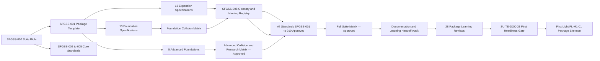
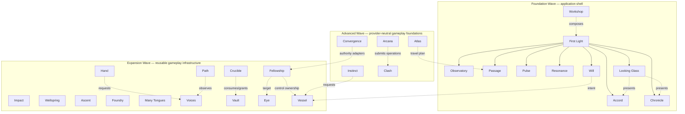
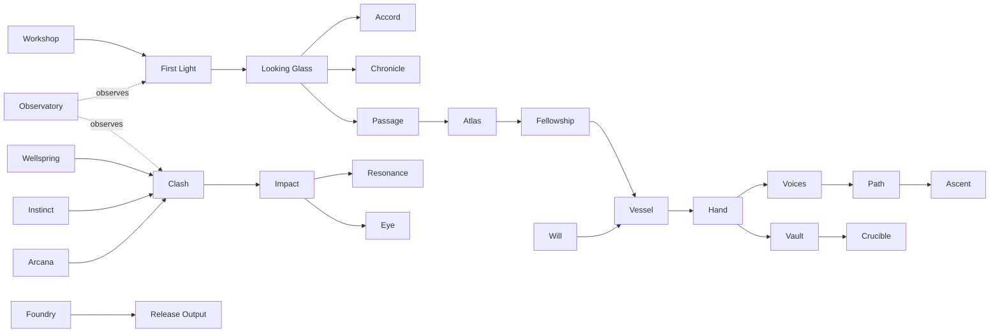
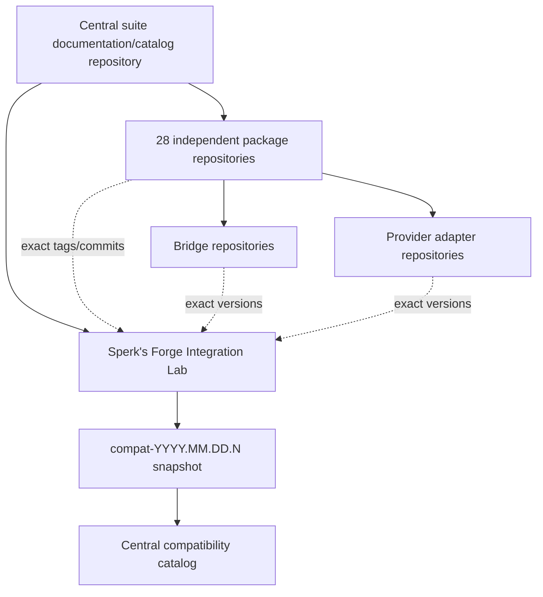
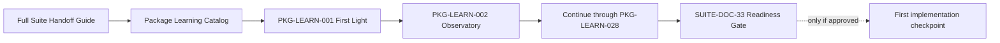

---
tags:
  - sfgss/navigation
  - sfgss/roadmap
  - sfgss/graph
status: active
updated: 2026-08-04
---

# The Sperk’s Forge — Suite Graph Roadmap

**Document role:** Obsidian navigation hub and visual roadmap  
**Authority:** Navigation only; it does not override SFGSS-000, package specifications, ADRs, standards, or integration specifications  
**Owner:** Jesse “Echo” Adams / EchoDevGames  
**Current checkpoint:** SUITE-DOC-32 - Full Suite Documentation and Learning Handoff Audit  
**Completed collision reviews:** Foundation, Expansion, and Advanced

> This note is the map room. The linked documents remain the territory.

## How to use this in Obsidian

- Open this note and choose **Open local graph** to see the immediate suite structure.
- Use the global Graph View and filter with tags such as `#sfgss/wave/foundation`, `#sfgss/wave/expansion`, `#sfgss/wave/advanced`, `#sfgss/standard`, or `#sfgss/integration`.
- Each package specification contains a **Graph Navigation** block linking back here.
- Mermaid diagrams provide a readable roadmap, while the `[[wikilinks]]` below create the actual Obsidian graph edges.
- This file must be updated at every meaningful documentation checkpoint.

## Documentation journey

## Package waves

## Practical game loop view

## Primary authorities and standards

- [[Echo_Game_Systems_Suite_Bible|SFGSS-000 — Suite Bible]]
- [[SFGSS-001_Package_Specification_Template|SFGSS-001 — Package Specification Template]]
- [[SFGSS-002_Dependency_Bridge_and_Assembly_Standard|SFGSS-002 — Dependencies, Bridges, and Assemblies]]
- [[SFGSS-003_Data_IDs_Serialization_and_Migration_Standard|SFGSS-003 — Data, IDs, Serialization, and Migration]]
- [[SFGSS-004_Testing_Validation_Test_Labs_and_Release_Standard|SFGSS-004 — Testing and Release Evidence]]
- [[SFGSS-005_Checkpoint_Build_Workflow_and_ChatGPT_Collaboration_Rules|SFGSS-005 — Checkpoint and Learning Workflow]]
- [[SFGSS-006_New-Project_Guided_Pathways|SFGSS-006 — New-Project Guided Pathways]]
- [[SFGSS-007_Architecture_Decision_Record_Standard|SFGSS-007 – Architecture Decision Records]]
- [[SFGSS-008_Suite_Glossary_and_Naming_Registry|SFGSS-008 – Glossary and Naming Registry]]
- [[SFGSS-009_Repository_Versioning_and_Integration_Workspace_Standard|SFGSS-009 – Repository, Versioning, and Integration Workspace]]
- [[SFGSS-010_Living_Documentation_Current_Notes_and_Obsidian_Workflow_Standard|SFGSS-010 – Living Documentation, Current Notes, and Obsidian Workflow]]
- [[Full_Suite_Documentation_Program_Roadmap|Full Suite Documentation Program Roadmap]]
- [[Current Notes|Current Notes]]

- [[Full_Suite_Documentation_and_Learning_Handoff_Guide|Full Suite Documentation and Learning Handoff Guide]]
- [[Learning Reviews/README|Learning Reviews Index]]
- [[Learning Reviews/PKG-LEARN-TEMPLATE|Package Learning Review Template]]

## Integration and decision hubs

- [[Integration Specifications/Foundation_Cross-Package_Contract_Matrix|Foundation Cross-Package Contract Matrix]]
- [[Integration Specifications/SFGSS-INT-EXPANSION-001_Expansion_Cross-Package_Contract_Matrix|Expansion Cross-Package Contract Matrix]]
- [[Integration Specifications/SFGSS-INT-ADVANCED-001_Advanced_Cross-Package_and_Research_Contract_Matrix|Advanced Cross-Package and Research Matrix]]
- [[Integration Specifications/SFGSS-INT-SUITE-001_Full_Suite_Authority_Dependency_Bridge_and_Persistence_Matrix|Full Suite Authority, Dependency, Bridge, and Persistence Matrix]]
- [[Architecture Decision Records/SFGSS-ADR-001_Foundation_Editor_Setup_Facade_Protocol|ADR-001 — Setup Facade Protocol]]
- [[Architecture Decision Records/SFGSS-ADR-002_Full_Suite_Documentation_Gate_and_Learning_Implementation|ADR-002 — Documentation Gate and Learning Implementation]]
- [[Architecture Decision Records/SFGSS-ADR-003_Graph_Roadmap_and_Pre-Implementation_Learning_Review|ADR-003 — Graph Roadmap and Package Learning Review]]
- [[Architecture Decision Records/SFGSS-ADR-LOG_Suite_Decision_Log|Suite ADR Decision Log]]
- [[Architecture Decision Records/SFGSS-ADR-TEMPLATE|Reusable ADR Template]]

## Package specification nodes

### Foundation Wave

- [[Package Specifications/SFGSS-First-Light-EchoLaunch-Package-Specification|First Light (`EchoLaunch`)]]
- [[Package Specifications/SFGSS-The-Observatory-EchoDiagnostics-Package-Specification|The Observatory (`EchoDiagnostics`)]]
- [[Package Specifications/SFGSS-The-Accord-EchoSettings-Package-Specification|The Accord (`EchoSettings`)]]
- [[Package Specifications/SFGSS-The-Passage-EchoSceneFlow-Package-Specification|The Passage (`EchoSceneFlow`)]]
- [[Package Specifications/SFGSS-The-Pulse-EchoGameState-Package-Specification|The Pulse (`EchoGameState`)]]
- [[Package Specifications/SFGSS-Resonance-Jukebot-Package-Specification|Resonance (`Jukebot`)]]
- [[Package Specifications/SFGSS-The-Will-EchoInput-Package-Specification|The Will (`EchoInput`)]]
- [[Package Specifications/SFGSS-The-Looking-Glass-EchoUI-Package-Specification|The Looking Glass (`EchoUI`)]]
- [[Package Specifications/SFGSS-The-Chronicle-EchoSave-Package-Specification|The Chronicle (`EchoSave`)]]
- [[Package Specifications/SFGSS-The-Workshop-EchoGameStarter-Package-Specification|The Workshop (`EchoGameStarter`)]]
### Expansion Wave

- [[Package Specifications/SFGSS-Impact-EchoFeedback-Package-Specification|Impact (`EchoFeedback`)]]
- [[Package Specifications/SFGSS-The-Wellspring-EchoPool-Package-Specification|The Wellspring (`EchoPool`)]]
- [[Package Specifications/SFGSS-The-Ascent-EchoProgression-Package-Specification|The Ascent (`EchoProgression`)]]
- [[Package Specifications/SFGSS-The-Foundry-EchoBuildTools-Package-Specification|The Foundry (`EchoBuildTools`)]]
- [[Package Specifications/SFGSS-Many-Tongues-EchoLocalization-Package-Specification|Many Tongues (`EchoLocalization`)]]
- [[Package Specifications/SFGSS-Voices-EchoDialogue-Package-Specification|Voices (`EchoDialogue`)]]
- [[Package Specifications/SFGSS-The-Path-EchoObjectives-Package-Specification|The Path (`EchoObjectives`)]]
- [[Package Specifications/SFGSS-The-Vault-EchoInventory-Package-Specification|The Vault (`EchoInventory`)]]
- [[Package Specifications/SFGSS-The-Hand-EchoInteraction-Package-Specification|The Hand (`EchoInteraction`)]]
- [[Package Specifications/SFGSS-The-Eye-EchoCamera-Package-Specification|The Eye (`EchoCamera`)]]
- [[Package Specifications/SFGSS-The-Fellowship-EchoCharacters-Package-Specification|The Fellowship (`EchoCharacters`)]]
- [[Package Specifications/SFGSS-The-Vessel-EchoControllers-Package-Specification|The Vessel (`EchoControllers`)]]
- [[Package Specifications/SFGSS-The-Crucible-EchoCrafting-Package-Specification|The Crucible (`EchoCrafting`)]]
### Advanced Wave

- [[Package Specifications/SFGSS-The-Convergence-EchoMultiplayer-Package-Foundation|The Convergence (`EchoMultiplayer`)]]
- [[Package Specifications/SFGSS-Instinct-EchoAI-Package-Foundation|Instinct (`EchoAI`)]]
- [[Package Specifications/SFGSS-Clash-EchoCombat-Package-Foundation|Clash (`EchoCombat`)]]
- [[Package Specifications/SFGSS-Arcana-EchoAbilities-Package-Foundation|Arcana (`EchoAbilities`)]]
- [[Package Specifications/SFGSS-The-Atlas-EchoWorld-Package-Foundation|The Atlas (`EchoWorld`)]]

## Learning and status nodes

- [[Full_Suite_Documentation_and_Learning_Handoff_Guide|Full Suite Handoff Guide]]
- [[Package_Learning_Review_Catalog|Package Learning Review Catalog]]
- [[Learning Reviews/README|Learning Reviews Index]]
- [[Learning Reviews/PKG-LEARN-TEMPLATE|Learning Review Template]]
- [[Suite_Health_Check_and_Remaining_Documentation|Suite Health Check and Remaining Documentation]]

## Maintenance rule

At each checkpoint closeout:

1. Add newly approved or superseded documents.
2. Update the active-checkpoint node and status summary.
3. Confirm every current package specification links back to this note.
4. Remove or redirect superseded duplicate nodes from the active vault.
5. Keep empirical work marked `Not run` until evidence exists.

## Guided pathway nodes

- [[SFGSS-006_New-Project_Guided_Pathways#17. PATH-000 - Blank Modular Starter|PATH-000 Blank Modular Starter]]
- [[SFGSS-006_New-Project_Guided_Pathways#18. PATH-001 - Package Laboratory and Portfolio System|PATH-001 Package Laboratory]]
- [[SFGSS-006_New-Project_Guided_Pathways#19. PATH-010 - Minimal Audiovisual Prototype|PATH-010 Minimal Audiovisual Prototype]]
- [[SFGSS-006_New-Project_Guided_Pathways#20. PATH-020 - Game Jam Quickstart|PATH-020 Game Jam Quickstart]]
- [[SFGSS-006_New-Project_Guided_Pathways#21. PATH-030 - Puzzle and Tabletop Game|PATH-030 Puzzle and Tabletop]]
- [[SFGSS-006_New-Project_Guided_Pathways#22. PATH-040 - Password-Based Puzzle Platformer|PATH-040 Password Platformer]]
- [[SFGSS-006_New-Project_Guided_Pathways#23. PATH-050 - Save-Based Adventure|PATH-050 Save-Based Adventure]]
- [[SFGSS-006_New-Project_Guided_Pathways#24. PATH-060 - Narrative Game|PATH-060 Narrative Game]]
- [[SFGSS-006_New-Project_Guided_Pathways#25. PATH-070 - Action Combat Prototype|PATH-070 Action Combat Prototype]]
- [[SFGSS-006_New-Project_Guided_Pathways#26. PATH-080 - RPG Foundation|PATH-080 RPG Foundation]]
- [[SFGSS-006_New-Project_Guided_Pathways#27. PATH-090 - Local Multiplayer Prototype|PATH-090 Local Multiplayer]]
- [[SFGSS-006_New-Project_Guided_Pathways#28. PATH-100 - Online Multiplayer Research Prototype|PATH-100 Online Multiplayer Research]]
- [[SFGSS-006_New-Project_Guided_Pathways#29. PATH-110 - Existing-Project Incremental Adoption|PATH-110 Existing-Project Adoption]]

## Repository and release topology

- [[SFGSS-009_Repository_Versioning_and_Integration_Workspace_Standard|Repository and versioning authority]]
- [[SFGSS-009_Repository_Registry|Machine-readable repository registry]]

- [[SFGSS-INT-CONSISTENCY-001_Standards_and_Package_Consistency_Matrix|Standards and Package Consistency Matrix]]

## Learning review flow

- Active review: **PKG-LEARN-001 – First Light (`EchoLaunch`)**
- Tracker: `Learning Reviews/PKG-LEARN-TRACKER.json`
- Implementation remains locked.
