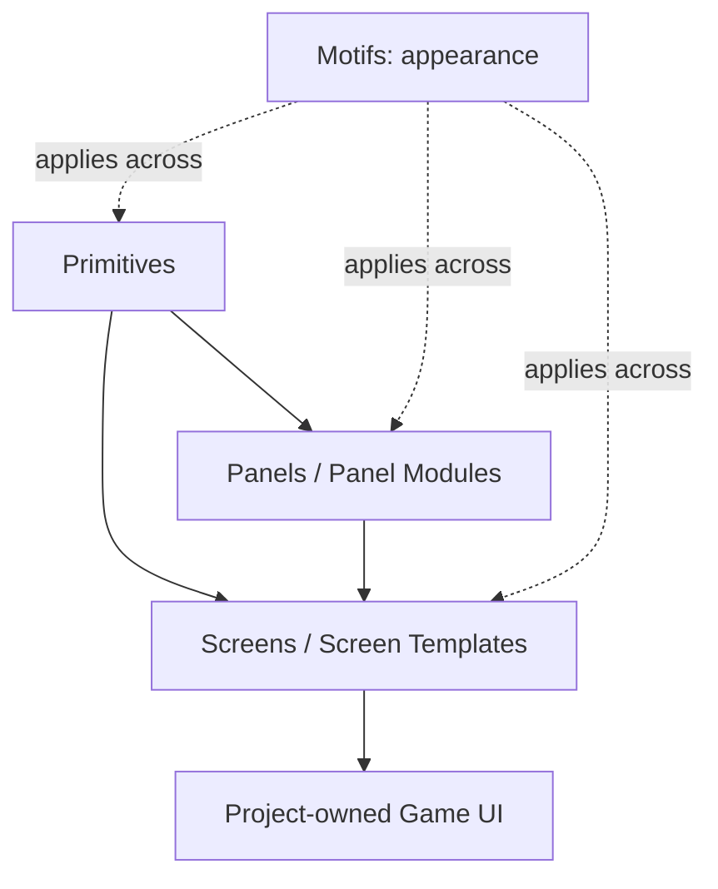
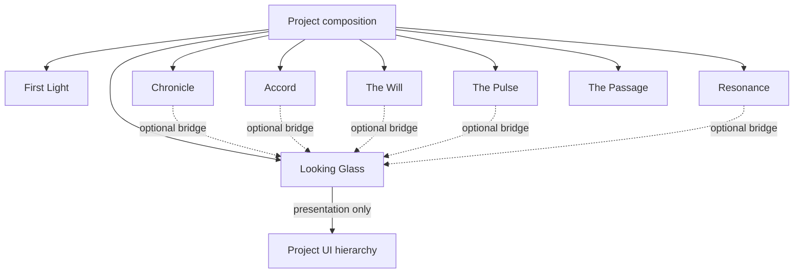

---
tags:
  - sfgss/roadmap
  - sfgss/suite
status: active
updated: 2026-08-18
---

# The Sperk’s Systems Foundry — Suite Graph Roadmap

**Document role:** Current suite dependency/frontier map
**Authority:** Navigation/planning only; package specifications and accepted decisions own normative behavior
**Current work item:** The Looking Glass EUI-M5-01 Primitive Warehouse Foundation — ACTIVE / AUTHORIZED; implementation not started

> This roadmap is current-state biased. Historical checkpoint detail remains in Git history and package/checkpoint records.

## Current frontier — August 18, 2026

### The Looking Glass (`EchoUI`)

- Package authority remains **SFGSS-PKG-ECHOUI-001 v1.9.0**.
- EUI-M1-01 through **EUI-M4-03 are complete**.
- EUI-M4-03 final/post-closeout floor: Foundry **1445 / 1445**, EchoUI **339 / 339**, Motifs **62 / 62**, root **12 / 12**, failed/skipped/inconclusive **0 / 0 / 0**, manual Motif Laboratory **6 / 6**, 180-frame idle PASS, retained smoke green.
- **EUI-M5-01 is ACTIVE / AUTHORIZED from `a8f70f855715bcf48be1e96fb694c41867282125`.**
- EUI-M5-01 changes no Level-2 package authority. It realizes the existing Assembly Library promise through a first direct-use prefab slice.
- Runtime package remains `0.1.0` on Unity 6000.3.8f1/uGUI 2.0.0.

### EUI-M5-01 construction graph

The construction tiers are deliberately simple:

- **Primitives** are focused reusable UI pieces with one obvious job.
- **Panels** are reusable functional compositions built from Primitives and optionally other Panels.
- **Screen Templates** are whole editable starting compositions built from Panels/Primitives.
- **Motifs are orthogonal**, not a fourth construction tier.

The primary workflow remains normal Unity package browsing and prefab drag-and-drop. Future Catalog/Assembly Utility/Builder tooling must accelerate the same ordinary assets rather than becoming a required proprietary format.

### First authorized Warehouse shelf

EUI-M5-01 is bounded to five starter roles only:

1. default square Button Primitive;
2. square Close Button visual Primitive;
3. default panel-surface Image Primitive;
4. Button Group Panel;
5. Basic Menu Screen Template.

The Warehouse is intentionally allowed to grow very large over time through later separately authorized slices. Organic project-to-package promotion is a future workflow; automatic promotion and community Creator Lab work are not active.

### Other suite frontiers

- First Light remains frozen for the current pass after its retained package sample/showcase work.
- Chronicle M5 is complete through ESV-M5-06; M6 First Integration is not automatically active.
- Accord, Passage, Pulse, Resonance, Will, and all other packages remain independently gated.
- A future whole-game Looking Glass UI may present Chronicle/Passage/Accord/etc. truth through project-owned composition or optional bridges; Warehouse prefabs do not acquire those authorities or hard dependencies.

## Suite dependency law

Hard peer-package dependencies are not implied by the dotted bridge directions. Durable persistence, live runtime state, and Unity object lifetime remain separate authority domains.

## Looking Glass retained checkpoint chain

| Checkpoint | Result |
|---|---|
| EUI-M1-01 | Complete — root/surface foundation; full 1113 / 1113; Lab 5 / 5 |
| EUI-M1-02 | Complete — external contexts/selection; full 1130 / 1130; Lab 10 / 10 |
| EUI-M2-01 | Complete — layers/Screen lifecycle; full 1153 / 1153; Lab 10 / 10 |
| EUI-M2-02 | Complete — blocking Modal lifecycle; full 1181 / 1181; Lab 12 / 12 |
| EUI-M3-01 | Complete — EventSystem/focus; full 1205 / 1205; Lab 12 / 12 |
| EUI-M3-02 | Complete — transition lifecycle; full 1246 / 1246; Lab 14 / 14 |
| EUI-M4-01 | Complete — named HUD regions; manual Lab 5 / 5; retained smoke green |
| EUI-M4-02 | Complete — bounded notifications; full 1383 / 1383; EchoUI 277 / 277; Lab 6 / 6 |
| EUI-M4-03 | Complete — Runtime Motifs; full 1445 / 1445; EchoUI 339 / 339; Motifs 62 / 62; root 12 / 12; Lab 6 / 6 |
| EUI-M5-01 | **ACTIVE — Primitive Warehouse foundation; implementation not started** |

## Explicitly inactive adjacent authoring work

Motif Palette; Motif capture/apply/preview tooling; Stable-ID Template Catalog; Assembly Utilities; Builder/Composer; automatic project-to-package promotion; Creator Lab/community ingestion; broad prefab-family population; production 9-slice/art library; final typography/provider schema; bridges/integration/release.

## Exact next gate

EUI-M5-01 activation is documentation-only. Present the five-role implementation slice and exclusions, then wait for explicit `go` before creating prefab/test assets.
